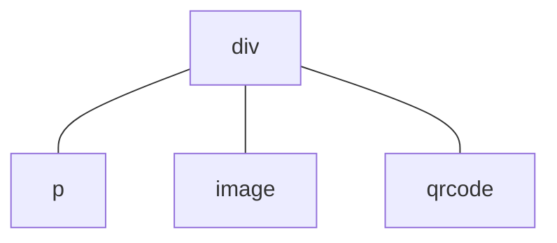

# Context File: 01_glyphix_framework_core_EN.md
Ограничения среды: MCU (No DOM), RTOS Zephyr, аппаратная платформа ATS3085S.

============================================================
FILE_PATH: src/transl/EN/framework/README.md

# frame


Glyphix is ​​an efficient, lightweight application development framework for MCU (microcontroller) devices, aiming to provide developers with an application development solution that is close to the web development experience. With a declarative UI framework using HTML templates, CSS, and JavaScript, developers can easily build components and pages and publish apps to a variety of smart devices, such as smartwatches. Glyphix solves the complexity and stability issues of UI and application development for traditional MCU systems and provides critical cross-device application development and publishing capabilities, giving developers unprecedented flexibility and ease of use.


In addition to an efficient development framework, Glyphix pays special attention to the safety and stability of applications. We have implemented powerful memory management and security mechanisms in the underlying architecture to avoid common memory errors and resource waste, and provide developers with a more reliable runtime environment. This kind of security ensures the stability of application operation and will also significantly shorten the debugging cycle during the development process.


At the same time, Glyphix excels in performance, running applications with near-native fluency and resource usage even in resource-constrained MCU environments. The framework has deeply optimized the runtime, automatically manages resources and utilizes them efficiently. Therefore, developers can focus on implementing features and optimizing user experience without worrying about performance issues.


## Core features


### Web development experience


- **Declarative UI paradigm**: Similar to [Vue Options API](https://vuejs.org/guide/introduction#options-api), using HTML templates, CSS and JavaScript, allowing developers to write applications in a way close to web development, reducing learning costs.
- **Component-based development**: Supports modular and component-based development methods to facilitate code reuse and maintenance, making application development efficiency and readability higher.
- **Standardized interface**: Supports Quick App standard system APIs, such as [HTTP network](/api/system-fetch.md) and [audio streaming](/api/system-media.md) bodies, which can easily develop device-independent Internet applications.


### Cross-device support


- **Multi-device compatibility**: Glyphix supports applications running on a variety of smart devices (such as smart watches, bracelets, etc.), achieving true cross-device development and deployment, and reducing the difficulty of adapting to different hardware platforms.
- **Unified runtime** environment: With the help of Glyphix framework capabilities, applications can be automatically managed and executed on different devices and ensure a consistent application interaction experience.
- **Quick App Standard** support: Developers can publish their applications to other ecosystems that support Quick Apps to further expand the coverage of their applications.


### Efficient performance


- **Native-level performance**: Deeply optimized for the MCU environment, it can achieve near-native fluency and low resource usage even when resources are limited.
- **Native responsive framework**: A responsive framework and GUI system implemented entirely in C++, avoiding the performance overhead issues of JavaScript implementation.


### stability


- **Memory Management**: The underlying automatic memory management mechanism prevents common memory errors and the waste and inefficiency of manual allocation of memory.
- **Life cycle model**: The application framework provides a complete resource life cycle model to ensure that there is no resource leakage after the application exits, reducing stability risks.


### Debugging support


- **Full-featured simulator**: Provides a simulator environment that is consistent with real devices, including simulation of multiple device screen sizes. Applications can be developed without a real device.
- **Hot update application**: Developers can update and test applications without restarting the device, and there is no need to flash the firmware at all, which greatly improves development efficiency.


### Release process


- **Cross-device publishing**: Supports developing applications once and publishing them to different device platforms multiple times. Glyphix publishing tools support automatic packaging and optimization for target devices to ensure that applications run stably on each device.
- **App Store Distribution**: Supports app distribution through post-installation channels such as app stores. Users can browse, download and install apps without the need for OTA firmware upgrades.
- **Independent application management**: Supports independent application installation and uninstallation without unified firmware integration and version control.


## Comparison with other options


### Embedded C/C++ GUI library


Glyphix is ​​not a GUI library that provides a C++ API, but a standard application runtime framework. It not only provides UI rendering capabilities, but also manages the application life cycle, event processing, and data binding, giving it more complete application running and management capabilities.


Using C/C++ to develop application logic usually requires recompiling and deploying the entire program. However, Glyphix supports hot updates of applications. Developers can quickly release and test updates without restarting the device, which greatly improves development and maintenance efficiency.


On the other hand, traditional C/C++ development methods usually require customization for different hardware and operating systems, while Glyphix provides a unified runtime environment that can achieve a consistent application development experience on a variety of MCU devices and reduce adaptation work.


### system level solution


A complete firmware system solution usually covers all functions such as the entire device operating system, drivers, and communications, while Glyphix focuses on providing an efficient application runtime framework. It does not need to replace or reconstruct the device's firmware system, but serves as a component on the device to manage and run applications, ensuring the independence and flexibility of applications and firmware systems.


In a complete firmware system, applications are usually deeply coupled with the system, and the costs of development, updates, and maintenance are high. Glyphix runs as an independent application, allowing developers to quickly add, update and manage applications in a standard environment, reducing complexity and maintenance costs.


In addition, firmware systems are often deeply bound to specific hardware, while Glyphix can run in different systems, providing a unified development and operating environment to achieve true cross-device support.


### Other application frameworks


Unlike application runtime frameworks such as Web, React Native or Flutter, although Glyphix provides a development experience similar to Vue, it is designed for resource-constrained MCU environments to ensure that it can still run efficiently even with limited memory and computing power. It provides near-native performance with lower resource usage and adapts to the needs of small embedded devices.


Other application runtime frameworks usually need to run in more powerful hardware environments (such as mobile phones or computers), requiring more system resources to start and run. The Glyphix runtime is extremely lightweight and can run on small devices such as smart watches with extremely low power consumption and memory usage.


## Developer revenue


Glyphix is ​​a friendly framework for web developers. Developers can use familiar HTML, CSS and JavaScript to develop without having to learn C/C++ language and complex MCU hardware development knowledge in depth. This lowers the threshold for MCU application development, allowing more web developers to get started quickly, saving learning costs and time.


### Improve development efficiency


- **Web development experience**: Through a web-like technology stack and hot update support, developers can write MCU applications just like developing web applications, making full use of existing skills and greatly improving efficiency.
- **Develop once, run across devices**: Glyphix provides strong cross-device compatibility. You only need to write code once, and the system will automatically adapt and optimize resources according to the characteristics of different devices. There is no need to develop independently for each device. This effectively reduces maintenance costs and complexity caused by equipment fragmentation.
- **Deeply optimized system**: Developers do not need to invest a lot of energy in optimizing interaction smoothness and lag issues, nor do they need to constantly pay attention to device crashes, so they can focus on function implementation and user experience.


### Continuous iteration


- **Long-term application availability**: Glyphix’s cross-device nature and long-term support for MCU devices ensure that applications can continue to run on multiple generations of devices. Even if a certain device is withdrawn from the market, developers do not need to worry about losing the running environment of the application and can easily migrate it to other devices to extend the life cycle of the application.
- **Compatibility of future devices**: The framework will continue to be iteratively updated to maintain compatibility with new hardware. Developers' applications can automatically adapt to future devices to avoid additional maintenance costs caused by hardware updates.
- **Tools and documentation support**: In addition to development tools, documentation will also be continuously maintained as the framework is updated to ensure accuracy and timeliness, so that developers can always access the latest framework features and best practices, helping with continuous iteration and optimization of applications.


============================================================
FILE_PATH: src/transl/EN/framework/component/life-cycle.md

# life cycle


Components, pages, and applications all have life cycles. Specified functions can be called at specific life cycle stages of the object through **lifecycle functions**.


## Component and page lifecycle


Defining lifecycle functions in component and page objects can trigger calls. For example:
``` html
<script>
export default {
  onInit() {
    console.log("onInit() called!")
  }
}
</script>
```
The `onInit()` lifecycle function will be called after the component is instantiated. Lifecycle functions have no parameters and do not use return values.


### Component life cycle functions


These lifecycle functions are common to components and pages.


#### `onInit` <decl type="(): Promise<any> | void" method />


At this point, the component has been instantiated and the data in the view-model is ready. The data can be accessed through the `this` keyword. Developer-defined initialization logic is usually executed in this life cycle function.


#### `onReady` <decl type="(): Promise<any> | void" method />


At this point the component has been rendered. The component tree at this time has a corresponding control tree (similar to the DOM tree).


#### `onDestroy` <decl type="(): Promise<any> | void" method />


The component is ready for destruction. The data in the view-model can still be accessed at this point. Custom resource release operations are usually performed in `onDestroy()`.


### Page life cycle functions


These lifecycle functions only exist within the page.


#### `onShow` <decl type="(): Promise<any> | void" method />


Called when the page is about to be displayed. When returning using `router.back()`, `onShow()` will be called when the underlying page is about to be displayed; `onShow()` will also be called before the new page just created is displayed for the first time.


#### `onHide` <decl type="(): Promise<any> | void" method />


Called when the page is about to be hidden. `onHide()` is called when using `router.push()` causes the underlying page to be hidden. However, the page will not be hidden until it is destroyed, so `onHide()` will not be called.


When the device screen is closed, `onHide()` of the foreground page will also be called, see [Screen status changes](#屏幕状态变化) for details.


#### `onBackPress` <decl type="(): boolean" method />


This lifecycle function is called when the user swipes back. Developers can handle return logic in this function. If `true` is returned, it means that the developer has processed the return operation, and the system will not perform the default return behavior; if `false` is returned, it means that the developer has not processed the return operation, and the system will perform the default return behavior (that is, close the current page and return to the previous page).


::: warning

This lifecycle function causes interactive slide returns (i.e. follow-up slides) to be disabled. It is generally not recommended to use this lifecycle function, nor to define a normal method named `onBackPress`. If you want to prevent the default return interaction, please refer to [The default event handling of the page](/framework/generic/properties.md#页面的默认事件处理), so that the interaction effect can be preserved.
:::


#### `onRefresh` <decl type="(): Promise<any> | void" version="0.8" method />


This life cycle function is called when the page is opened in `singleTask` mode and returned to an existing page. See [`launchMode`](../application/manifest.md#launchmode) for details. Page data can be refreshed in this function.


## Application life cycle


### Application life cycle functions


#### `onCreate` <decl type="(): Promise<any> | void" method />


This lifecycle function is called when the app loads.


#### `onDestroy` <decl type="(): Promise<any> | void" method />


This lifecycle function is called when the app is about to be destroyed.


#### `onShow` <decl type="(): Promise<any> | void" method />


This lifecycle function is called when the app switches from the background to the foreground. The application's `onShow()` lifecycle function is always called after the page's `onShow()`. When the device screen is reopened, the `onShow()` of the foreground application will also be called, see [Screen status changes](#屏幕状态变化) for details.


#### `onHide` <decl type="(): Promise<any> | void" method />


This lifecycle function is called before the app is hidden from the foreground to the background.


If you don't want your app to remain active in the background, you can call [`launch.exit()`](/api/system-launch.md#exit) in `onHide()` to exit the app itself. For example:
```js
// in src/app.js
import launch from '@system.launch'

export default {
  onHide() {
    launch.exit()
  },
}
```


The application's `onHide()` lifecycle function is always called after the page's `onHide()`. When the device screen is turned off, `onHide()` of the foreground application will also be called, see [Screen status changes](#屏幕状态变化) for details.


#### `onRoute` <decl type="(page: string, query: {[key: string]: string}): Promise<any> | void" method />


The `onRoute` lifecycle function is called when the application is launched via a deeplink URI. Parameters `page` and `query` are decoded URI fields. For example:
``` js
// file: app.ux
export default {
  // Assume that through app:// example.app /page/to/deeplink?key=value&query=result
  onRoute(page, query) {
    console.log(page)  // Print the string '/page/to/deeplink'
    console.log(query) // Print object {deeplink: 'key', query: 'result'}
  }
}
```


`onRoute()` will be called after `onCreate()` and before `onShow()`. Developers can initialize in `onRoute()` based on the parameters specified by deeplink (such as jumping to a specific page).


#### `onLocaleChanged` <decl type="(locale: {language: string}): void" method />


This lifecycle function is called when the app's locale changes. Parameter `locale` is an object containing the `language` field, which represents the current language environment (Language Tag), such as `'en-US'`, `zh-CN`, etc.


## Asynchronous life cycle function <experimental/>


Component, page or application lifecycle functions can be asynchronous, i.e. `async` functions or return `Promise` objects. For example
``` js
import fs from "@system.file"

export default {
  async onInit() {
    // Wait for the asynchronous file reading to complete before continuing execution.
    let text = await fs.readText({ uri: "internal://files/test.txt" })
    console.log(text)
  }
}
```
Assuming this is the `onInit()` life cycle function of a component, it will continue to perform component rendering only after the asynchronous file reading is completed. The following limitations exist during asynchronous lifecycle function execution:
- Component rendering will not be performed repeatedly, and any operation on responsive properties during this period will not cause the interface to be updated;
- Temporarily blocking user input, touch and key presses will not respond (otherwise if the user clicks repeatedly, it will cause repeated responses).


The main function of the asynchronous life cycle function is to wait for asynchronous IO and resource operations to avoid prematurely displaying an unloaded interface. Especially when opening a new page, it will wait until the page's `onInit()`, `onReady()` and `onShow()` life cycle functions are all executed before starting to display the page or play the transition animation.


::: warning

Asynchronous lifecycle functions are currently experimental and they can cause various issues including crashes. Closing the rendering page during an asynchronous lifecycle function call will cause a crash.


The firmware of most devices does not enable support for asynchronous lifecycle functions, and their behavior may not be as expected. Use asynchronous lifecycle functions with caution.
:::


## Screen status changes


Changes in the device's screen status will affect the life cycle function calls of applications and pages. When the device screen is turned off, the `onHide()` life cycle function of the foreground application and page will be called; when the screen is reopened, the `onShow()` life cycle function of the foreground application and page will be called. Developers can use these lifecycle functions to pause or resume network requests to reduce power consumption.


::: tip

Some devices will switch apps to the background after turning off the screen and kill the app after a while. For applications that need to continue running in the background, you need to pay attention to the [Backstage](../application/README.md#后台管理) method of keeping alive.
:::


============================================================
FILE_PATH: src/transl/EN/framework/component/component-apis.md

# Component built-in interface


The Glyphix framework has some built-in properties for components, which are accessed using the `this.$xxx` format. These built-in properties provide components with some functionality outside of the reactive framework.


All built-in properties are read-only.


## property


### `$app` <decl type="Applet" get />


Application objects exported in `app.js` can be accessed through the `$app` attribute.


### `$page` <decl type="Component" get />


The component object of the page to which the component belongs can be accessed through the `$page` attribute. For page components, the value of `this.$page` is `this`.


### `$valid` <decl type="boolean" get />


Determine whether the component object is valid. A value of `false` indicates that the component has been destroyed.


::: tip

For a component that has been destroyed, all operations other than accessing the `$valid` attribute are illegal.
:::


#### Component destroyed


The life cycle of components is controlled by the rendering framework. Reasonably written code usually does not access destroyed components, but if you forget to cancel the timer or listener when destroying the component, for example:


``` js
setInterval(() => {
  this.secondCounter += 1
}, 1000)
```


If the component object is destroyed, you may encounter this error:


```
the component object has been destroyed
  stack backtrace:
    at <anonymous> (pkg://com.example.app/main/index.js:50)
TypeError: proxy: cannot set property
  stack backtrace:
    at <anonymous> (pkg://com.example.app/main/index.js:52)
```


If it is really difficult to delete the timer or cancel the listener when the component is destroyed, you can safely determine whether the component is destroyed through the `$valid` attribute. The following example can suppress the above runtime error:


``` js
let timer = setInterval(() => {
  if (this.$valid) {
    this.secondCounter += 1
  } else {
    clearTimeout(timer) // Delete timer after component is destroyed
  }
})
```
Such scenarios (such as multiple timers and event listening functions) generally have a fixed code structure:
1. Use `this.$valid` before accessing component properties to determine whether the component is valid;
2. Perform normal component property access operations in the effective branch;
3. Clean the timer or cancel the listener in the invalid branch, and return immediately to ensure that the component properties are no longer accessed.


::: warning

When using the `$valid` attribute to determine whether a component has been destroyed, special attention needs to be paid to the fact that the closure of the listening function may cause memory leaks. Failure to properly cancel the event listener or timer may cause the closure to still be referenced by the system after the component is destroyed, and thus cannot be garbage collected.
:::


#### Memory leak risk


In JavaScript, a closure refers to the association between a function and variables in its outer scope. When a function is created, it captures the variables in the outer scope and keeps references to those variables even if the outer scope is no longer executing. This means that variables referenced inside the closure still exist in memory until the closure itself is garbage collected.


In the component framework, when you register an event listener or start a timer, you usually pass in a callback function and may capture some properties or context of the component (such as `this` ).


Although the component object itself is properly destroyed by the framework and the memory is released, these closure functions are not cleared. If the event listener or timer callback is not actively removed, these closures may still exist and accumulate over time, causing memory leaks, especially in long-running applications. This leakage may be difficult to detect.


The following example demonstrates a possible memory leak:
``` js
let timer = setInterval(() => {
  if (this.$valid) {
    this.secondCounter += 1;
  }
}, 1000)
```
Although `if (this.$valid)` is used in the callback function to determine whether the component is still valid, thus avoiding errors being thrown after the component is destroyed, this approach does not avoid the problem of memory leaks. The reason is that `$valid` only determines the validity, and judging this attribute can avoid accessing the destroyed component object. But the problem is that because the timer is not closed, the closure of the callback function itself is still referenced, and the closure cannot be garbage collected.


::: tip

In order to avoid this hidden memory leak, you should actively cancel the timer or remove the event listener when the component [destroy](./life-cycle.md#ondestroy), instead of simply relying on `$valid 判断`. Even though `$valid` can prevent inappropriate actions after the component is destroyed, it cannot clean up the closure of the callback function itself.


All JavaScript memory is released when the app exits, so this memory leak does not accumulate over time.
:::


## method


### `$component` <decl type="(name: string, url: string): void" method />


Import a component dynamically (the `<import>` tag can only import components statically), for example:
``` js
this.$component("Name", "url")
```
The string `"Name"` is the name of the imported component, which must be named in camel case; the string `"url"` is the URI of the imported component.


### `$element` <decl type="(id: string): Element | undefined" method />


Returns the [Native child component](native-component.md#原生组件对象) object with the specified ID in the component, or `undefined` if no such subcomponent exists. The `$element()` method will traverse all child nodes of the component, so component instances from other UX files can also be found.


The `$element()` method will match IDs on the entire child component tree after rendering, and is not limited to the child components in the current [component template](template.md). Sometimes you need to be especially careful with this feature, for example with the following template:
``` html
<scroll>
  <MyComponent />
  <div id="panel">...</div>
</scroll>
```
When elements of `id="panel"` also exist in the custom component `MyComponent`, using `this.$element('panel')` will find the child elements in `MyComponent` instead of the `div` elements in the example.


::: tip

The `$element()` method does not work with custom components, even if the `id` attribute is set for the custom component. Since `$element()` accesses the rendered component tree, it must be used in the [`onReady()`](life-cycle.md#onready) life cycle function and after, but cannot be used in [`onInit()`](life-cycle.md#oninit).
:::


Please refer to [this document](README.md#组件对象和方法) to learn how to access the component object returned by the `$element()` method.


### `$emit` <decl type="(event: string, value: any): void" method />


See [Communication between components](communicate) for details.

============================================================
FILE_PATH: src/transl/EN/framework/component/javascript.md

# JavaScript script


JavaScript is the scripting language used for Glyphix application development. Developers can place JavaScript code in the `<script>` tag of the UX file, or directly reference the `*.js` script file.


## Grammar support


Supports ES6 syntax.


## Import module


Reference other js files in your code by importing modules. Usually, there are two ways to import developer-defined modules through paths:
``` js
import utils from '../Common/utils.js' // Use the import keyword
const utils = require('../Common/utils.js') // Use require function
```
Please refer to [Paths and URIs](../application/resource) for module path rules. In addition, the `.js` appearing as the file suffix name can be omitted in the module path, so the above import statement can be written as
``` js
import utils from '../Common/utils' // Use the import keyword
const utils = require('../Common/utils') // Use require function
```


Use the module name to import the system's built-in modules. All system modules begin with the `@` character:
``` js
import router from '@system.router' // Use the import keyword
const router = require('@system.router') // Use require function
```


::: warning

Developers should not start module names with the `@` character; these names are reserved for system modules.
:::


# export module


Use the ES6 `export` syntax to export modules, for example:
``` js
// Export default value
export default {
  method() {
    // ...
  }
  props: {
    // ...
  }
}

// Export named values
export function process(args) {
  // ...
}
```

============================================================
FILE_PATH: src/transl/EN/framework/component/prop-modifier.md

# attribute modifier


Ordinary attribute operations can realize attribute setting and monitoring functions. However, in some situations, there are some common requirements for attribute operations. For example, it is required that a certain attribute value setting operation of a component is not changed to a new value immediately, but uses animation to transition. The immediate solution is to code logic to implement the transition effect, but in reality this logic is universal for any property.


In order to simplify or reuse the code of some common attribute operations, Glyphix has several built-in attribute modifiers. Modifiers are attribute suffixes represented using `.`, e.g.


``` html
<progress :value="progress" value.transition="{curve: 'ease'}"/>
```


The attribute modifier key-value pair `value.transition="{curve: 'ease'}"` and the attribute key-value pair `value="{{progress}}"` filled in the component's XML attributes are independent of each other, and they may require completely different parameters.


This document will introduce the functions of each attribute modifier.


## `transition` modifier


This modifier will proxy the assignment operation of the attribute, transforming the process of assigning the attribute directly into a gradual assignment according to the animation transition method specified by the `transition` modifier. For example


``` html
<!-- The transition modifier defines the transition effect of the value attribute -->
<progress :max="1000" :value="progress" value.transition="{curve: 'ease'}"/>
<!-- No transition effect -->
<progress :max="1000" :value="progress" />
```


<glyphix id="prop-modifier-transition" height="68" width="480" inline>


``` html
<div>
  <progress :max="1000" :value="progress" value.transition="{curve: 'ease'}"/>
  <progress :max="1000" :value="progress" />
</div>
```


``` css
div > * {
  margin: 8px;
  height: 0.75rem;
}
```


``` js
export default {
  data: {
    progress: 500
  },
  onInit() {
    setInterval(() => this.progress = parseInt(Math.random() * 1000), 3000)
  }
}
```


</glyphix>


Since the `value.transition` modifier of the [`progress`](/components/progress.md) component is defined, each time `this.progress` is modified, the displayed value of the `progress` component will not directly jump to the new value, but will gradually change through an animation. This effect can be achieved without writing any animation logic.


::: tip

The `value` attribute of the `progress` component in the example is an integer. Since the default $[0, 100]$ range tends to create a sense of segmentation in transition animations, the example uses `:max="1000"` to increase the value range of `value` to make the animation smoother.
:::


### Interpolation calculation


Currently, only some properties of native components support the `transition` modifier. Supported properties must have "interpolable" value types, specifically: for all property value types $a$ and $b$ and progress $p \in [0,1]$, the operation $(1-p)*a+p*b$ is valid.


JavaScript's `number` type is interpolable, in addition to transform and color values.


#### transform


Transformations are usually defined using strings, such as `scale(2) rotate(30deg)`. Strings themselves are not interpolable, but they are when used with transform properties (because these strings are parsed as sequences of transform operations, which are interpolable). Normally interpolation is done one transform at a time. For example, the transformation of each frame of `scale(2) rotate(30deg)` and `scale(1) rotate(90deg)` during the interpolation process includes two steps of scaling and rotation, where the scaling factor transitions from $2$ to $1$, and the rotation angle transitions from $30\deg$ to $90\deg$.


#### color


Colors are usually represented using string codes, such as `#ff0000`. Color interpolation is calculated individually for the red, green, blue, and transparency channels.


### `Transition` object


The value type of the `transition` modifier is a `Transition` object:
``` ts
interface Transition {
  curve?: string,
  duration?: number
}
```


#### `curve` <decl type="?: string"/>


Specify the [Easing function](../render/animation.md#缓动曲线) of the transition animation, the default is `'ease'`.


#### `duration` <decl type="?: number"/>


The duration of the animation, in seconds, defaults to `1`.

============================================================
FILE_PATH: src/transl/EN/framework/component/reuse.md

# Component reuse


Component reuse at the application level is mainly implemented by custom components.


## subcomponent


Suppose the structure in the `<template>` tag of a certain [UX files](/framework/component/README.md#ux-文件) describes the organization of the interface, e.g.
``` html
<template>
  <div>
    <p>text</p>
    <image src="path/to/image.png" />
    <qrcode value="hello world!" />
  </div>
</template>
```
Corresponds to the following component tree structure at runtime:

This component tree has a parent node `div` and $3$ child nodes `p`, `image` and `qrcode`. The `div` component is the outermost component in the `<template>` tag. We call this component the **root component**. Sometimes components are not unique, for example:
``` html
<template>
  <p>text</p>
  <image src="path/to/image.png" />
  <qrcode value="hello world!" />
</template>
```
There are 3 root components in. In addition, using [`for` directive](/framework/commands/for.md) may also cause multiple root component instances, such as
``` html
<template>
  <p for="x in ['one', 'two', 'three']">
    label: {{x}}
  </p>
</template>
```
Will be rendered as $3$ `p` component instances.

============================================================
FILE_PATH: src/transl/EN/framework/component/native-component.md

# Native components


Native components are components implemented in C++. The main design goal of these components is to implement certain interface elements, such as buttons or list effects, but do not carry business logic. Different from web technology, native components themselves do not provide DOM interfaces, only responsive component interfaces.


The native components in Glyphix provide a large number of configuration interfaces to achieve rich display effects. In addition, the built-in components are optimized for embedded platform designs.


In this document, **native components** are used to refer to components implemented in C++; the term **built-in components** refers to the component packages provided by WearOS, but these components are not necessarily implemented in C++.


::: tip

This document will distinguish between native components and built-in components in the description, but readers generally do not need to ignore the difference between the two.
:::


## Interface function mechanism


Most of the interface-related mechanisms are only available in native components. These mechanisms include:
- CSS style sheets, layout and other mechanisms
- Gestures and touch events
- Rendering and drawing mechanisms


The interfaces of some native component mechanisms can be simulated in custom components through parameter/event passing between components, but these capabilities are essentially implemented by native components.


## Interface rendering


## Component Snapshot


Snapshot is a frame rate optimization technology. Turning on snapshots for complex components can speed up drawing and thus increase frame rate. Snapshots essentially take "screenshots" of components and speed things up by drawing those screenshots directly. Therefore, snapshots are an effective technique for components that are complex in content but updated infrequently. For other scenarios where updates are frequent but can tolerate no refresh, there are corresponding APIs to disable snapshot updates.


## native component object


The native component object can be obtained through the component's [`$element()`](component-apis#element) method, which can access the properties of the native component or call its methods, for example:


``` js
let el = this.$element('scroll-id')
console.log(`width: ${el.width}`) // Get the width of the component through the native component object
el.scrollTo({ top: 100 }) // Scroll list via API
```

============================================================
FILE_PATH: src/transl/EN/framework/component/component-object.md

# component object


The `<script>` tag located within the UX file defines and exports a component object. A typical component object is defined as follows:
``` js
export default {
  data: {
    text: "Hello world"
  },
  onInit() {
    console.log("component onInit()")
  },
  clicked(event) {
    console.log(`clicked: ${event}`)
  }
}
```
The component framework allows developers to fill in some properties for component objects to implement functions. This document will introduce these properties.


## Reactive programming


**Reactive Programming** is a programming paradigm for dynamically updating interface and data state. Through **responsive properties**, developers can automatically track data changes and update the interface without having to manually trigger and manage these updates. This keeps the data and interface always synchronized, enabling a simple and efficient UI programming experience.


### Responsive properties


The properties defined in the [`data` attribute](#data-属性) and [`computed` attribute](#computed-属性) objects of the component object are all **responsive properties** of the component, also called view-model properties:
- ** `data` attribute**: directly reflects the status of the component. For example, temperature value, display text or button status can be defined in `data`. When the values ​​of these properties change, the frame automatically synchronizes them to the view.
- ** `computed` attribute **: used to define derived attributes calculated based on `data` or other `computed` attributes. Computed properties are automatically updated as dependent data changes, making complex logical expressions more intuitive and concise.


All in all, when the responsive property values ​​of a component change, the content that relies on these properties will be automatically updated and rendered, ensuring that the displayed content is consistent with the data.


### Automatic data binding


**Automatic data binding** is the core concept of reactive programming, which allows data changes to be directly reflected on the interface without the need for developers to manually handle it.


Because each responsive attribute is automatically bound to the relevant part of the interface, when the attribute value changes, the interface is automatically updated without the need to call the attribute update function of a specific element.


For example, define a reactive attribute named `counter`:
``` js
export default {
  data: { // Define the counter reactive property in the data object
    counter: 0 // Initial value is 0
  }
}
```


Whenever the value of `counter` changes, the interface that references this attribute will be automatically updated. The following [template](template) code demonstrates this mechanism:
``` html
<p on:click="counter += 1">
  counter: {{ counter }}
</p>
```
This example demonstrates a counter that increases the value displayed by `counter` by one when clicking the `<p>` label. You can click on the online demo below to test it:


<glyphix id="component-object-reactive" height="50" width="200" inline>


``` html
<p on:click="counter += 1">
  counter: {{ counter }}
</p>
```


``` js
export default {
  data: {
    counter: 0
  }
}
```


``` css
p {
  border: 2px solid gray;
  border-radius: 16px;
  padding: 2px 8px;
  text-align: center;
  height: 100%;
}
```


</glyphix>


`{{ counter }}` in the `<p>` tag is a template [interpolation expression](template.md#插值表达式), and its dependency on `counter` is automatically bound. And [`on:click` listening](/framework/commands/on.md) in the `<p>` tag modifies the `counter` attribute value when clicked. It can be seen that through automatic data binding, the manual **data**-**interface** update operation in traditional GUI development is eliminated, making the interface logic more concise and clear.


## `data` attribute


The `data` attribute is used to declare the reactive data attributes of the component. The property is an object, for example:
``` js
export default {
  data: {
    text: "Hello world"
  }
}
```
The value of the `data` attribute must be serializable through `JSON.stringify()`. To be precise, the following conditions must be met:
- Simple type values: `number`, `string`, `boolean`, `null` or `undefined`
- In `Object` and `Array` with recursive structures, the value of the deepest element must be one of the above


This means that attributes of `data` objects in source code cannot have functions or other special types of values, and this also includes objects like `Date`.


::: note

It is a known limitation that `data` objects do not support non-JSON compatible data types, such as `Date`, `Proxy` objects, and so on. If you need to use these types of data, you can define them as [Custom properties](#自定义属性), otherwise unpredictable behavior will result.
:::


The `data` attributes are all view-model attributes of the component, so the data therein can be used for reactive programming. Using `this.prop` in the component object can directly access the properties in the `data` object. So, in the following component object
``` js
export default {
  data: {
    onInit: true
  },
  onInit() {}
}
```
Code `this.onInit` will access the `onInit` attribute in the `data` object, not the lifecycle function `onInit`.


::: tip

To optimize performance, only data used for UI rendering and state management is defined in the `data` object. For data that does not require reactivity, they can be defined as [Custom properties](#自定义属性). For example: timer ID (return value of `setTimeout()`), [audio player](/api/system-media.md#createaudioplayer) handle, WebSocket connection object, etc. Such objects are generally unnecessary as reactive properties and will not work properly.
:::


## `computed` attribute


The `computed` property of the component object declares the computed properties in the component. Compared to the reactive properties in `data`, computed properties can implement properties that require some calculations to get the result. For example
``` html
<text> reversed message: {{ reversedMessage }}
```


``` js
export default {
  data: {
    message: "hello"
  },
  computed: {
    reversedMessage() { // This is the getter method of the reversedMessage computed property
      return this.message.split('').reverse().join('')
    }
  }
}
```
A `reversedMessage` computed attribute is declared here, which implements a getter function to obtain the attribute value. Use `this.reversedMessage` directly (`this.` can be omitted in the template) to get the value of the calculated attribute.


Computed properties are also view-model properties of components. The value of the calculated property is cached, so the value of the calculated property is not recalculated multiple times. Computed properties, on the other hand, are automatically updated when the view-model properties they depend on change. In this example, the value of the computed attribute is calculated from the `message` attribute, so when the `message` attribute changes, the value of the `reversedMessage` attribute is automatically updated.


### Setter methods for computed properties


The default computed properties only have getter methods, but you can also provide setter methods for computed properties:
``` js
export default {
  data: {
    message: "hello"
  },
  computed: {
    reversedMessage: {
      get() { // This is the getter method of the reversedMessage computed property
        return this.message.split('').reverse().join('')
      },
      set(value) {
        this.message = value.split('').reverse().join('')
      }
    }
  }
}
```
At this time, the value of the calculated attribute `reversedMessage` is no longer a function, but an object, which has two methods: getter method `get` and setter method `set`. The parameter of the `set` method is the new value that the calculated property needs to be set to.


## `watch` attribute


The `watch` object method is used to monitor changes in view-model properties, for example:
``` js
export default {
  data: {
    value: 0
  },
  watch: {
    value(newValue, oldValue) {
      console.log(`value change: ${oldValue} -> ${newValue}`)
    }
  }
}
```
The method of the `watch` object will listen for changes in the view-model attribute with the same name, so `watch.value()` listens for changes in the `value` attribute. Changes to computed properties can also be monitored by `watch`.


## life cycle function


See the [life cycle](life-cycle.md) documentation for details.


## Custom properties


Users can also define custom properties in component objects that are not in the view-model (i.e. not in the `data` or `computed` objects) and therefore are not reactive. Developers can define methods as custom attributes, and can also use custom attributes to store some data that does not require responsiveness. For example:
``` html
<p on:click="onClick()">{{ text }}</p>
```


``` js
export default {
  data: {
    text: "some text"
  },
  // Custom properties are not in the data or computed objects, but are defined directly in the component object.
  timer: null, // Stores the timer handle and does not need to be defined in advance. This attribute will be automatically created when this.timer is assigned a value.
  onInit() {
    // The new property assigned to this is a custom property
    this.timer = setInterval(() => this.text += "?", 1000)
  },
  onDestroy() {
    clearInterval(this.timer)
  },
  onClick() {
    this.text += "." // Manipulate view-model properties in custom methods
  }
}
```


The `text` attribute in the example is reactive, while `timer` is a non-responsive custom attribute. The `timer` attribute is used to store the timer handle. This value has nothing to do with the interface view, so it does not need to be used as a view-model attribute. Considering the standardization of the code, custom properties can also be defined in advance in the component object:
``` js
export default {
  data: {
    text: "some text"
  },
  timer: null, // Custom properties are direct properties of the component object
  // ...
}
```
As shown in the example, custom properties can be defined directly in the component object. Custom properties for each component are distinct instances and are not shared.


::: warning

Custom attributes, `data` objects, `computed` objects, life cycle functions and other attributes cannot have duplicate names, otherwise some attributes will be overwritten and become inaccessible.
:::


### method


Custom properties and methods are both direct properties of the component object, and they are essentially equivalent. When you assign a function to a property of a component object, the property becomes a method. This section demonstrates this equivalence through two examples.


Method 1: Directly define the method. This is the most common and recommended way of writing.
``` js
export default {
  data: {
    count: 0
  },
  increment() {
    this.count++
  }
}
```


Method 2: Define attributes and assign values ​​to functions.
``` js
export default {
  data: {
    count: 0
  },
  increment: function() {
    this.count++
  }
}
```
The two writing methods are completely identical in function and can be called through `this.increment()`. It's the same when used in a template:
``` html
<button on:click="increment()">Count: {{ count }}</button>
```


::: tip

It is recommended to use method 1, which is the object method syntax supported by the ES6+ standard and is more concise and clear.
:::


### Dynamic assignment method


In addition to defining methods directly in the component object, you can also dynamically assign methods after the component is instantiated (such as in the `onInit` life cycle). The key feature of this approach is that the dynamic methods of each component instance are independent and can capture and maintain different states through closures.


Consider a timer component where each instance has its own counter and can be stopped independently. This is a typical application scenario of the dynamic assignment method:
``` html
<div>
  <text>timeout: {{ counter }}</text>
  <button on:click="stopTimer">Stop</button>
</div>
```


``` js
export default {
  data: {
    counter: 0,
  },
  stopTimer: null, // Optional: Predefined stopTimer method
  onInit() {
    const timer = setInterval(() => {
      this.counter++
    }, 1000)
    // Dynamically create a stopTimer method and capture the timer variable through a closure
    this.stopTimer = () => {
      clearInterval(timer)
      this.stopTimer = null // Leave the method empty after stopping
    }
  },
}
```


The following example instantiates 4 timer components at the same time. You can try to stop any of them independently:


<glyphix id="component-object-dynamic-method" height="200" width="300" inline>

</glyphix>


The implementation of this dynamic assignment method relies on the following key points:
- **Closure Capture**: The `timer` constant created in `onInit` is a local variable, and the `stopTimer` method captures this variable through closure
- **Instance Independence**: Each component instance creates its own `timer` and `stopTimer` when calling `onInit`, and they do not interfere with each other.
- **State Isolation**: Clicking the "Stop" button of an instance will only stop the timer of that instance and will not affect other instances.


Of course, for this example, it is more common to define the `stopTimer` method directly in the component object:
``` js
export default {
  data: {
    counter: 0,
  },
  timer: null,
  onInit() {
    // In this case, timer needs to be stored as a custom attribute
    this.timer = setInterval(() => {
      this.counter++
    }, 1000)
  },
  stopTimer() {
    // The stopTimer method accesses this.timer to stop the timer
    clearInterval(this.timer)
    this.timer = null // Clear timer reference
  }
}
```
This is usually more intuitive for timers, but when some have complex contexts and require dynamic distribution strategies, dynamic assignment methods can be used to implement more flexible logic. The following table shows the difference between dynamic methods vs directly defined methods:


| Features | Direct definition method | Dynamic assignment method |
|------|------------|------------|

| Sharability | All instances share the same function object | Each instance has an independent copy of the function |
| Closure capture | Does not capture local variables in the scope | Can capture local variables in the scope |
| Memory usage | Less (shared) | Slightly more (one copy per instance) |
| Applicable scenarios | General, stateless operations | Operations that need to capture local states |


============================================================
FILE_PATH: src/transl/EN/framework/component/template-macro.md

# template macro


Template macros are a way to simplify repetitive code and are top-level elements in UX files with a `macro:` attribute:
``` html
<template macro:scroll>
  <scroll #props media-query="(shape: rect)">
    <slot />
  </scroll>
  <scroll #props deformation="fisheye"
          scroll-snap="center" media-query="(shape: circle)">
    <slot />
  </scroll>
</template>
```
For example, a macro named `scroll` is defined here. The macro will replace the component of the same name in the `<template>` template of the current UX file, and
- All attributes of components with the same name will replace the `#props` placeholder in the template macro;
- Child elements of components with the same name replace the `<slot />` node in the template macro.


For example
``` html
<template>
  <scroll :index="3" on:index="onIndexChange">
    <p for="i in 10">item {{i + 1}}</p>
  </scroll>
</template>
```
will be replaced by the `scroll` template macro
``` html
<template>
  <scroll :index="3" on:index="onIndexChange" media-query="(shape: rect)">
    <p for="i in 10">item {{i + 1}}</p>
  </scroll>
  <scroll :index="3" on:index="onIndexChange" deformation="fisheye"
          scroll-snap="center" media-query="(shape: circle)">
    <p for="i in 10">item {{i + 1}}</p>
  </scroll>
</template>
```


::: tip

The macro name in this example is `scroll`, and the content of the macro also contains the `scroll` tag, but the macro replacement will only be performed once and will not be repeated.
:::


## use


As can be seen from the above example, template macros can statically replace ordinary components into another form. The replaced code is usually inconvenient to handwrite and understand. like:
``` html
<scroll :index="3" on:index="onIndexChange">
  <p for="i in 10">item {{i + 1}}</p>
</scroll>
```
is replaced with:
``` html
<scroll :index="3" on:index="onIndexChange" media-query="(shape: rect)">
  <p for="i in 10">item {{i + 1}}</p>
</scroll>
<scroll :index="3" on:index="onIndexChange" deformation="fisheye"
        scroll-snap="center" media-query="(shape: circle)">
  <p for="i in 10">item {{i + 1}}</p>
</scroll>
```
The replaced code actually statically selects different `scroll` component properties based on the [media inquiries](/framework/render/media-query.md) of the screen shape. Specifically, it adds two properties to the [`scroll`](/components/scroll.md) component on circular screens:
- [`deformation="fisheye"`](/components/scroll.md#deformation): Enable fisheye effect for circular screens;
- [`scroll-snap="center"`](/components/scroll.md#scrollsnap): Center-align the `scroll` child elements on a circular screen.


This template macro adds special-shaped screen shape adaptation to the original handwritten code. This modification does not require modification of the template source code and is therefore non-intrusive.


## How to use


There is currently no way to export template macros for use in other UX files. Therefore, the template macro needs to be written repeatedly in each required UX file, that is, something like
``` html
<template macro:scroll>
  ...
</template>
```
top level element. Template macro nodes and `<template>` nodes can be in any order, but do not define template macros with the same name in a UX file.

============================================================
FILE_PATH: src/transl/EN/framework/component/README.md

# component framework


Components are a technology in Glyphix that enables reuse of App interface development functions. Multiple components can be combined and form the overall appearance and functionality of the interface in a manner similar to nested HTML elements. On the other hand, each component encapsulates certain content and logic, which can reduce code complexity and maintenance costs through reasonable use.


Components are divided into built-in [**Native components**](../render/native-component.md) and **custom components** implemented by developers. Native components are generally encapsulations of UI elements and can be used to display specific UI content or for layout and interaction, such as text, image, div, list, etc. Custom components focus on logic implementation and functional encapsulation, because the interface implemented in custom components is actually hosted by native components.


## Define components


Each custom component is defined in a separate `.ux` file:


``` html
<template>
  <p>{{text}}</p>
</template>

<style>
  * {
    font-size: 48;
    text-align: center;
  }
</style>

<script>
  export default {
    data: {
      text: "Hello, World!"
    }
  }
</script>
```


It can be seen that a component consists of styles, JavaScript scripts and "templates" that describe the interface.


## UX files


A UX (UI XML) file is a component description using XML format. Each UX file defines a component, and pages are also a component.


The following root nodes can exist in the UX file:


- ** `<import>` ** Label: used to introduce other components, this label can be defined repeatedly;
- ** `<template>` ** Label: Defines the content and structure of the component interface. There is only one node for this node;
- ** `<template>` ** Macro tag: defines a template structure that can be reused. There can be multiple nodes, see [template macro](./template-macro.md);
- ** `<style>` ** Tag: Define CSS style sheet, this node has only one;
- ** `<script>` ** Tag: JavaScript script that implements the component's logical function. There is only one node for this node.


The order of the above nodes is arbitrary. Among them, the `<import>` node always does not contain child nodes. Note that the `<style>` node and `<script>` node do not follow XML syntax internally. All symbols such as `>` and `&` do not need to use XML escaping rules, but follow the syntax of CSS and JavaScript (similar to HTML).


The UX file requires that all tags must be closed. For example, `<div>...</div>` or `<div/>` are legal, but a separate `<div>` or `</div>` will cause an error.


## Page components


Components declared in the `router.pages` field of `manifest.json` can be used directly as pages.


Compared with general components, page components have more [life cycle function](life-cycle#组件和页面的生命周期) and other functions are basically the same. Component code that has been used for page components can also be used directly as ordinary components.


## Introduce components


### Custom component


Defined components can be referenced in other components. Fill in the `<import>` tag in the UX file to reference the specified component:
``` xml
<import name="Panel" src="path/to/Panel">
```


The `src` attribute is the path URL of the component, where `Panel` is the file name of the component (excluding the `.ux` suffix); the `name` attribute is an optional component name. If this attribute is not defined, the file name of the component will be used as the component name.


`src` supports relative paths, absolute paths, and external paths


- The relative path is relative to the path of this UX file
- The absolute path is relative to the src path of the APP
- The external path can import resource components outside the APP. The specific path is the package value in appdb.json of the resource component APP plus the absolute path.


### global components


Global components are non-native components defined in the framework. You can use the `<import>` tag and specify only the `name` attribute and omit the `src` attribute to introduce global components in the application:
``` html
<import name="TopBar" />
```


In applications that can only introduce global components but cannot register new global components, system developers can use the [`globalComponent()`](/api/system-internal.md#globalcomponent) API to register global components.


## Property document specification


The component property document title format is as follows:


<div class="example-block">

  <h3 style="margin-bottom: 0.5rem">

    <span>

      <code>value</code>

      <decl type="number" get set listen />

    </span>

  </h3>

</div>


in
- `value` is the name of the attribute;
- `number` is the attribute value type;
- The <span style="color:#666"> on the right reads • sets • listens </span> indicates the access modes supported by the property.


### access mode


A property can support the following access modes:
- **Read**: The value of the attribute is readable;
- **Settings**: The value of the attribute is writable;
- **Listening**: Attributes are [monitor](../commands/on.md) able. Listenable attributes usually trigger listening events when their values ​​change.


Take the [`index`](/components/scroll.md#index) attribute of the [scroll](/components/scroll.md) component as an example. This attribute supports reading, setting, and monitoring at the same time. The `index` attribute can be manipulated in template syntax:
``` html
<scroll id="scroll1" :index="5" on:index="console.log($event)">
  ...
</scroll>
```
Among them, `:index="5"` assigns `5` to the `index` attribute, and `on:index="console.log($event)"` listens for changes in the `index` attribute. Please refer to [Communication between components](/framework/component/communicate.md) and [`on` directive](../commands/on.md) for more descriptions.


### Component objects and methods


Properties can also be accessed by getting the component object through the [`$element()`](component-apis.md#element) method:
``` js
const el = this.$element('scroll1') // Get component object
console.log(el.index) // Read the index property of the scroll component
el.index = 4 // Set the index property of the scroll component
```
If supported, the object returned by the `$element()` method can be read or set. The `$element()` method does not support binding event listeners to properties.


The attribute of the component can also be a **function** or **method**. In this case, the document title is in the following format:


<div class="example-block">

  <h3 style="margin-bottom: 0.5rem">

    <span>

      <code>method</code>

      <decl type="(x: number, y: number): void" method />

    </span>

  </h3>

</div>


in
- `(x: number, y: number): void` is the signature of the function or method
- The <span style="color:#666"> method </span> on the right side indicates that the attribute is a method.


Component methods can only be accessed through the component object. For example, the [`setIndex`](/components/scroll.md#setindex) attribute of the scroll component is as follows:
``` js
const el = this.$element('scroll1') // Get component object
el.setIndex(4) // Call the setIndex() method
```
Methods do not support read, set, and listen access modes, so such properties only have the <span style="color:#666"> method </span> tag.


### Two-way binding


A property is [Two-way binding](../commands/model.md) enabled when it also supports the <span style="color:#666"> setting • Listening for the </span> access mode.

============================================================
FILE_PATH: src/transl/EN/framework/component/template.md

# Template syntax


The template is the content within the `<template>` tag of the UX file. Generally speaking, templates are standard HTML syntax, but template syntax also introduces syntax restrictions and new syntax that are different from HTML. This document will introduce these contents.


## Label


Templates support tag nesting, but all tags must be closed. Therefore the following writing is legal:
``` html
<div> <p>message</p> </div>
```
But the following way of writing is illegal:
``` html
<div> <p>message</p> <!-- <div> tag is not closed -->
```


## text value


Text elements and attribute values ​​in templates are text values, for example
``` html
<com name="value">A message</com>
```
`A message` and `value` in are both text. The `A message` text value is passed to the `text` attribute of the `com` component, so the text node (the `A message` part) is actually syntactic sugar for the `text` attribute:
``` html
<p>text</p>
```
Equivalent to
``` html
<p text="text"></p>
```
Text values ​​are represented internally using JavaScript strings.


### text child node


Text subnodes can be used not only for native components, but also for custom components with `text` attributes, such as:
```html
<p>The text element of P.</p>
<MyCom>The text element of MyCom.</MyCom>
```
Simply provide the `MyCom` component with a `text` [Responsive properties](component-object.md#响应式属性) to receive the contents of the text node without going through a `<slot>` slot or other mechanism.


::: warning

Some components don't have a `text` attribute (like `div` ), and having text nodes as their children won't show anything! Make sure to make the text node a child of a native component such as `p`, `text`, or `span`.
:::


You can also use multiple text child nodes in the component, such as:
```html
<div>
  The switch <switch /> and <checkbox /> checkbox.
</div>
```
A mix of text and [`switch`](/components/switch.md) components will be displayed in `div`:


<glyphix id="component-template-text-1" height="32" inline>


``` html
<div>
  The switch <switch /> and <checkbox /> checkbox.
</div>
```


</glyphix>


When text nodes are mixed with other nodes, the text node is translated into a [`span`](/components/span.md) node instead of being passed to a component's `text` attribute. So the above example is equivalent to this code:
```html
<div>
  <span>The switch&nbsp;</span>
  <switch />
  <span>&nbsp;and&nbsp;</span>
  <checkbox />
  <span>&nbsp;checkbox.</span>
</div>
```
Such implicit `span` elements can also specify CSS styles, but cannot use class selectors (because there is no `class` attribute).


### White space characters


All whitespace characters such as newlines and tabs in the source code of text subnodes are treated as spaces, and the processing rules for spaces are:
- The leading spaces of the first text child node will be removed.
- Trailing spaces in the last text child node will be removed.
- Multiple consecutive spaces in other positions are treated as one space.


::: tip

When there is only one text node, it is both the first text child node and the last child node, so the spaces before and after it will be deleted. If the text node has no content (including the case where there is no content after removing the spaces), it will be deleted.
:::


Therefore, writing `<p> spances </p>` will not display any spaces, but
```html
<div>
  The switch <switch /> and <checkbox /> checkbox.
</div>
```
Spaces (and newlines) between `<div>` and `The siwtch`, and between `checkbox.` and `</div>` are removed. But a space between `The switch` and `<switch />` etc. will be retained.


When you find that you cannot use the above rules to control whitespace characters, you need to consider using [HTML character reference](https://developer.mozilla.org/en-US/docs/Glossary/Character_reference).


::: tip

When mixing [interpolation expression](#插值表达式) in text nodes, be aware that the latter is a JavaScript expression, and the strings within it use JavaScript [escape character](https://developer.mozilla.org/en-US/docs/Glossary/Escape_character) rules.
:::


## Properties and interpolation


### interpolation expression


You can enclose an expression, an **interpolation** expression, in text using double brackets:
``` html
<p>Message: {{ msg }}!</p>
```
When rendering, the expression within the double curly braces will be evaluated and spliced ​​with the preceding and following text. If there is no text before and after the expression, it constitutes an **unspliced** interpolation expression, and the value of the expression is used directly without converting it to text.


Interpolation expressions can also be used in attribute values, for example:
``` html
<div visible="{{true}}"></div>
```
Among them, `{{true}}` will be directly calculated as a boolean value of `true` instead of a string.


::: tip

Attributes like `visible` require the incoming value type to be boolean, so you need to use unspliced ​​writing like `visibe="{{ expr }}"` to avoid the text before and after the curly braces causing the interpolation expression to become text. Due to JavaScript's value conversion rules, `visible="false"` causes the property to evaluate to `true` (non-empty strings are converted to boolean `true`). Of course, [implicit attribute value](#隐式属性值) can also be used in this scenario.
:::


If you need to pass a numeric constant, the following two writing methods will take effect:
``` html
<scroll damping="{{1.5}}"></scroll>
<scroll damping="1.5"></scroll>
```
Because the string `"1.5"` can be automatically converted to the numeric value `1.5`. We recommend using the first way of writing, because it does not require redundant type conversion and has clearer semantics.


The type of the unspliced ​​interpolation expression attribute value is the value of the interpolation expression. For example, the type of `{{1 + 2}}` is number. While other interpolation expressions are text values.


### property binding expression


If the component's properties are not of text type, you can use unspliced ​​interpolation expressions:
``` html
<com items="{{ [1, 2, 3] }}" />
```
You can also use property binding expression syntax:
``` html
<com :items="[1, 2, 3]" />
```
Compared with ordinary attributes, attribute binding expressions need to add a `:` character in front of the attribute. At this time, the attribute value will be compiled as an expression instead of a string. This method eliminates the need to write `{{ }}` and is more readable.


### implicit attribute value


If the element's attribute only writes the attribute name, but not the attribute value, then it is equivalent to boolean's `true`:
``` html
<com focus></com>
```
Equivalent to
``` html
<com :focus="true"></com>
```
Implicit attribute values ​​are applicable to various option attributes: filling in the attribute name means turning on the option, and not filling in the attribute name means turning off the option. If you need to pass an empty string through an attribute, you should write out the empty attribute value explicitly:
``` html
<com empty-property=""></com>
```
The rules for implicit attribute values ​​apply to ordinary attributes, not to [Command attributes](#指令属性值), directive attributes should always write out the attribute value.


### directive attribute value


For `if`, `for` and `on` like [instruction](/framework/commands/README.md), the value of the attribute will not be a text, so interpolation expressions concatenated with text cannot be used, e.g.
``` html
<div on:click="console.dir({{$event}})"></div>
```
is illegal. In this case, unspliced ​​interpolation expressions can be used:
``` html
<div on:click="{{console.dir($event)}}"></div>
```
All directive attributes support omitting double curly braces, so the above code can be shortened to:
``` html
<div on:click="console.dir($event)"></div>
```
But be aware that ordinary properties must pass non-text values ​​through unspliced ​​interpolation expressions or property binding expressions.


### `this` binding


In interpolation expressions (including property binding expressions), the name (identifier) ​​is generally automatically bound to the property of the component object, that is
``` html
<div on:visible="callback"></div>
```
The equivalent JavaScript code for the expression in `callback` is `this.callback`.


Names appearing in template syntax scope are not bound to `this`, which is mainly reflected in the `for` directive. For example
``` html
<p for="v in ['one', 'two']">{{ v }}</p>
```
The name `v` in the interpolation expression `{{ v }}` is bound to the iteration variable `v` defined in the `for` directive, rather than to the `this` property of the component object.


Some names used by global objects and reserved names are also not bound to the `this` attribute of the component object. These names are:


- `this`、`true`、`false`、`undefined`、`null`
- `console`
- `Math`、`Date`、`Number`、`Array`、`Object`、`Boolean`、`String`、`RegExp`、`JSON`
- `NaN`、`Infinity`
- `isNaN`、`isFinite`
- `parseFloat`、`parseInt`


## Interpolation expression syntax


Interpolation expressions support most JavaScript expression syntax, but do not support syntax such as statements. This section lists all supported expressions.


`}}` cannot appear inside the interpolation expression, so writing like `{key: {a: 1.0}}` cannot be compiled. In this case, it can be solved by adding spaces: `{ key: { a: 1.0 } }`.


### basic expression


- Numerical values: `1`, `1.0`, `1e10` and other numerical literals
- Identifier: variable name, and enumeration values ​​of basic types such as `true` and `null`
- String: Use a string literal enclosed in single or double quotes (double quotes are not easy to use in an XML/HTML environment)
- Parentheses: `( expr )`, use parentheses to increase the evaluation priority of inner expressions


### unary expression


- Negative number: `- expr`
- Positive number: `+ expr`
- Logical negation: `! expr`


### binary expression


A binary expression composed of `+`, `-`, `*`, `/`, `%`, `==`, `!=`, `>`, `>=`, `<`, `<=`, `&&`, `||` operators and operands. The precedence and associativity of these operators are the same as in JavaScript/


Supports `=`, `+=`, `-=`, `*=`, `/=`, `%=` assignment operators.


### ternary expression


Trinocular selection expression: `cond ? expr : expr`.


### Other expressions


- Function call: same syntax as JavaScript
- Member expression: `objct.prop`
- Subscript expression: `array[index]`
- Array literal: `[1, expr,...]`, the same syntax as JavaScript
- Object literal: `{ a: 1, b: expr }`, the same syntax as JavaScript


### template string


Interpolation expressions partially support the [template string](https://developer.mozilla.org/docs/Web/JavaScript/Reference/Template_literals) syntax. For example in the following template string
``` js
`head ${ expr } tail`
```
The `}` character cannot appear in the expression `expr`, which means you cannot use JavaScript object literals and template strings containing expressions. The other expressions mentioned in this section can be used in template strings.


Template strings in interpolation expressions do not support newlines.


::: tip

Syntax errors in expressions can be viewed and located using the glyphix.js tool.
:::


## Other tips

============================================================
FILE_PATH: src/transl/EN/framework/component/communicate.md

# Communication between components


Communication between components is achieved by component parameters and event bindings. For example:
``` html
<scroll scroll-snap="center" on:scroll="scrolled($event)" />
```
The `scroll-snap` attribute parameter is passed to the `scroll` component instance to center-align the element, and changes to the `scroll` attribute will be monitored.


## Property parameters


Parameters can be passed to subcomponents through the attribute field of the component node, for example:
``` html
<p text="A message"></p>
```
A `p` component instance is passed a property named `text` with a value of `"A message"`. Multiple attributes can be passed following XML/HTML syntax. You can pass a calculated value to a component's properties via [interpolation expression](template#插值表达式).


## incident response


[Native components](native-component) encapsulates many UI input events, such as touch gesture responses and UI change events. These events can be monitored through [`on` directive](../commands/on.md).


## trigger event


For custom components, you can use the [`$emit(name, value)`](/framework/component/component-apis.md#emit) method of the component object to trigger an event:
``` html
<panel on:some-event="console.log(`the event ${$event} was emited!`)">
```


``` js
// in panel.ux
export default {
  emitEvent() {
    this.$emit('someEvent', 'hello')
  }
}
```


The `$emit` method has two parameters:
- `name`: The attribute name that needs to send the event must use camel case naming (the corresponding template attribute is snake naming or camel case naming)
- `value`: Optional parameter, the value of the event attribute, will be used as the value of the `$event` variable of the `on` instruction


If there is a property named `name` in the component object's view-model, the `$emit` method will not modify the property value to `value`.

============================================================
FILE_PATH: src/transl/EN/framework/generic/properties.md

---

icon: xml

---

# Properties and events


This section introduces the common property interfaces and events provided by all native components.


## Property list


### Common properties


#### `top` <decl type="number" get set listen />


The position of the top of the component relative to the parent native component, in pixels. This attribute is actually the abbreviation of the `top` attribute in inline styles. For more details on how to use it, see [Component location operations](#组件位置操作).


When reading or listening to the `top` attribute, the calculated position of the component will be obtained, as well as the actual measured value after layout.


#### `left` <decl type="number" get set listen />


The position of the left side of the component relative to the parent native component, in pixels. This attribute is actually the abbreviation of the `left` attribute in inline styles. For more details on how to use it, see [Component location operations](#组件位置操作).


When reading or listening to the `left` attribute, the calculated position of the component will be obtained, as well as the actual measured value after layout.


#### `width` <decl type="number" get set listen />


The width of the component. When the `width` attribute is set, the [`width`](styles.md#width) attribute in the inline style is updated. Since the width of CSS adopts border-box mode, the actual stored style value will be automatically appended to the current `padding` and `border` dimensions of the element, thereby ensuring that the content width after layout is consistent with the set value.


When reading or listening to the `width` attribute, you will get the content width after layout calculation, excluding `padding` and `border`.


#### `height` <decl type="number" get set listen />


The height of the component. When the `height` attribute is set, the [`height`](styles.md#height) attribute in the inline style is updated. Since the height of CSS adopts the border-box mode, the actual stored style value will be automatically appended to the current `padding` and `border` dimensions of the element, thereby ensuring that the content height after layout is consistent with the set value.


When reading or listening to the `height` attribute, you will get the content height after layout calculation, excluding `padding` and `border`.


#### `show` <decl type="boolean" get set/>


Set whether the component is visible. Hidden components are not displayed and do not occupy layout space.


#### `quiescent` <decl type="boolean" get set/>


Set whether component snapshots are automatically updated (quiescent snapshots). If the component is displayed through a snapshot, when the value of this property is `false` (the default value) the snapshot is refreshed immediately to update the view when the component content is updated, otherwise the snapshot is not updated immediately. Setting this property to `true` can improve UI performance, but will cause display content to lag.


The following example shows the role of the `quiescent` attribute. There are two `p` elements in the interface that are placed in the `scroll` container, and the `scroll` container has [snapshot mode](../../components/scroll.md#snapshot) turned on. When the user scrolls the `scroll` component, a snapshot of the elements in it will be taken. Since the first `p` element is in normal snapshot mode and the second `p` element is in static snapshot mode, only the contents of the first `p` element are updated when scrolling.


<glyphix id="generic-properties-quiescent" height="200" title="懒快照">


``` html
<scroll snapshot scroll-snap="center">
  <p>normal snapshot {{ count }}</p>
  <p quiescent>quiescent snapshot {{ count }}</p>
</scroll>
```


``` css
scroll {
  display: flex;
  flex-direction: column;
  background-color: lightgray;
}

p {
  background-color: lightgreen;
  text-align: center;
  padding: 10px;
  margin: 10px;
}
```


``` js
export default {
  data: {
    count: 0
  },
  onReady(event) {
    setInterval(() => this.count++, 500)
  }
}
```


</glyphix>


#### `style` <decl type="string" set />


Set the component's inline style. Currently only [CSS properties](./styles.md) with the <badge type="info" text="内联" /> tag is supported.


#### `z-index` <decl type="number" get set />


The `z-index` attribute sets the Z-order of the elements, `z-index` larger overlapping elements overwrite smaller elements. This attribute value will be overridden by the [`z-index`](styles.md/#z-index) attribute in CSS.


#### `opacity` <decl type="number" get set />


Specifies the transparency of the component. The value range is $[0, 1]$, where $0$ means complete transparency. and the CSS property [`opacity`](styles.md#opacity). The effect is the same.


::: warning

The `opacity` value will affect the drawing performance of the element. For details, please refer to the description of the [`opacity`](styles.md#opacity) CSS attribute.
:::


#### `transform` <decl type="string" set />


Set the component's transformation, equivalent to the CSS [`transform`](styles.md#transform) property.


#### `disabled` <decl type="boolean" get set />


Used to set or get the disabled state of a component. When the attribute value is `true`, the element is disabled, the user cannot interact with it, and the element will not respond to any gestures (such as clicks, drags, etc.). When the attribute value is the **default** `false`, the component is available and users can interact with it normally.


The following example demonstrates the use of the `disabled` attribute while also controlling styling with the [`:disabled`](styles.md#disabled) CSS pseudo-class. This example shows that the `div` element can respond to click gestures in the normal state, but does not respond to any gestures in the `disabled` state.


<glyphix id="generic-properties-disabled" height="200" title="disabled 属性">


``` html
<div :disabled="disabled" on:click="onClick">
  {{disabled ? 'disabled' : 'normal'}} <switch />
</div>
```


``` css
div {
  background-color: lightgray;
  text-align: center;
  display: flex;
  justify-content: center;
}

/* :disabled pseudo-class can control the style of elements in disabled state */
div:disabled {
  opacity: 0.5;
}
```


``` js
import prompt from '@system.prompt'

export default {
  data: {
    disabled: false
  },
  onInit() {
    setInterval(() => {
      this.disabled = !this.disabled
    }, 2000)
  },
  onClick() {
    prompt.showToast({ message: 'clicked!', duration: 250 })
  }
}
```


</glyphix>


### Generic events


Most native components support common events, which can be listened to using [`on` directive](../commands/on.md). The value types for these events are described in Section [event type](#事件类型).


#### `touchstart` <decl type="TouchEvent" listen />


The `touchstart` event is fired when the user starts touching the component. Event values ​​are of type [`TouchEvent`](#touchevent).


#### `touchmove` <decl type="TouchEvent" listen />


The `touchmove` event is triggered when the user touch point moves on the component. During the movement, this event will always be triggered even if the touch point leaves the scope of the current native component. Event values ​​are of type [`TouchEvent`](#touchevent).


There is a certain "moving dead zone" when the touch state transitions from `touchstart` to `touchmove`. If the sliding distance of the user's touch is less than the dead zone range, `touchmove` will not be triggered. The range of the motion dead zone varies from device to device, the following example shows the motion dead zone.


<glyphix id="generic-properties-touchmove" height="200" title="移动死区">


``` html
<p on:touchstart="state = 'start'"
   on:touchmove="onTouchMove($event)"
   on:touchend="onTouchEnd">
  {{ `state: ${state} \ndead area: (${dx}, ${dy})` }}
</p>
```


``` css
p {
  background-color: lightgreen;
  text-align: center;
}
```


``` js
export default {
  data: {
    state: null,
    dx: null,
    dy: null
  },
  onTouchMove(event) {
    if (!this.dx && !this.dy) {
      this.state = 'move'
      this.dx = event.touches[0].offsetX
      this.dy = event.touches[0].offsetY
    }
  },
  onTouchEnd() {
    this.state = 'end'
    this.dx = this.dy = null
  }
}
```


</glyphix>


#### `touchend` <decl type="TouchEvent" listen />


When the user leaves the screen, the `touchend` event will be sent to the previously touched native component. Event values ​​are of type [`TouchEvent`](#touchevent).


#### `touchcancel` <decl type="TouchEvent" listen />


`touchcancel` is fired when a native component's touch is interrupted. Event values ​​are of type [`TouchEvent`](#touchevent). There are many reasons why a touch may be interrupted, such as the component being hidden or the touch event being forced to respond by other elements.


#### `click` <decl type="ClickEvent" listen />


The `click` event is triggered when the native component is clicked and released. Event values ​​are of type [`ClickEvent`](#clickevent).


<glyphix id="generic-properties-click" height="100">


``` html
<p on:click="click = JSON.stringify($event)">
  {{ click }}
</p>
```


``` css
p {
  background-color: lightgreen;
  text-align: center;
}
```


``` js
export default {
  data: {
    click: null
  }
}
```


</glyphix>


#### `longpress` <decl type="LongPressEvent" listen />


The `longpress` event is triggered when the native component is pressed for a long time. Event values ​​are of type [`LongPressEvent`](#longpressevent). The following interactive example shows when `longpress` and other events are triggered:


<glyphix id="generic-properties-longpress" height="100">


``` html
<p on:touchstart="state = 'touching...'"
   on:longpress="state = `longpress: ${JSON.stringify($event)}`"
   on:click="state = 'clicked.'">
  {{ state }}
</p>
```


``` css
p {
  background-color: lightgreen;
  text-align: center;
}
```


``` js
export default {
  data: {
    state: null
  }
}
```


</glyphix>


The triggering timing and duration of the `longpress` event varies by device, but is typically triggered after pressing $500 \rm ms$. Unlike the [`click`](#click) event, `longpress` fires during the press, not when the hand is released. For the example above, you'll find:
- When the pressing time is less than the long pressing trigger time, the `click` event will be triggered after letting go;
- When pressed long enough, the `longpress` event will be triggered, and when released, the `click` event will be triggered (displayed as "clicked." state);
- Movement during pressing will not trigger the `longpress` or `click` events.


#### `swipe` <decl type="SwipeEvent" listen />


The `swipe` event is triggered when the component is swiped quickly. Event values ​​are of type [`SwipeEvent`](#swipeevent).


<glyphix id="generic-properties-swipe" height="250" >


``` html
<p on:swipe="onSwipe($event)">
  {{ swipe }}
</p>
```


``` css
p {
  background-color: lightgreen;
  text-align: center;
}
```


``` js
export default {
  data: {
    swipe: null
  },
  onSwipe(event) {
    this.swipe = event.direction
    event.strongResponse()
  }
}
```


</glyphix>


#### `keydown` <decl type="KeyEvent" listen />


This event is fired when a key is pressed. The `keydown` and `keyup` events are used to capture entity key press operations. To capture events, the native component must be in focus. The root element of the page always gets focus automatically, so the following code can capture `keydown` and `keyup` events:
``` html
<!-- Assuming this is the root element of the page -->
<div on:keydown="console.log($event)" on:keyup="console.log($event)">
  ...
</div>
```
Please refer to [`KeyEvent`](#keyevent) for the event value type.


Watch devices typically register [Default key handler](/api/system-internal.md#setdefaultkeyhandler) so that application code can interact without responding to such events (for example, some watches return to the previous page when the Power key is pressed). To prevent the default key response, use the `stopPropagation()` method of the `KeyEvent` object to prevent bubbling.


#### `keyup` <decl type="KeyEvent" listen />


This event is fired when the button is lifted. Please refer to the [`keydown`](#keydown) event for more information.


#### `wheel` <decl type="WheelEvent" listen />


The `wheel` event is triggered when the user rotates the wheel. Scroll wheel devices include the rotating crown of a watch or the mouse wheel. To capture this time, the native component must be in focus. The root element of the page always gets focus automatically, so the following code can capture the `wheel` event:
``` html
<!-- Assuming this is the root element of the page -->
<div on:wheel="console.log($event)">
  ...
</div>
```
Please refer to [`WheelEvent`](#wheelevent) for the event value type.


## event type


### `BaseEvent`


The `BaseEvent` event object provides some methods to control event delivery, and its prototype is:
``` ts
interface BaseEvent {
  strongResponse(): void, // Force response to events
  stopPropagation(): void // Stop event bubbling
}
```


### `TouchEvent`


The prototype of `TouchEvent` event object is:
``` ts
interface TouchEvent extends BaseEvent {
  isTarget: boolean, // Whether the event target is the current component
  touches: { // All touch point data of this event
    clientX: number, // The x-coordinate of the touch point relative to the target component's content area
    clientY: number, // The y-coordinate of the touch point relative to the target component's content area
    offsetX: number, // The displacement of the touch point in the x direction during the touch process
    offsetY: number  // The displacement of the touch point in the y direction during the touch process
  }[];
}
```


### `ClickEvent`


The prototype of the `SwipeEvent` event object is:
``` ts
interface SwiperEvent extends BaseEvent  {
  isTarget: boolean, // Whether the event target is the current component
  clientX: number, // The x-coordinate of the click touch point relative to the content area of ​​the target component
  clientY: number // The y-coordinate of the click touch point relative to the content area of ​​the target component
}
```


### `LongPressEvent`


The prototype of the `LongPressEvent` event object is:
``` ts
interface SwiperEvent extends BaseEvent  {
  isTarget: boolean, // Whether the event target is the current component
  clientX: number, // The x-coordinate of the long-press touch point relative to the content area of ​​the target component
  clientY: number // The y-coordinate of the long-press touch point relative to the content area of ​​the target component
}
```


### `SwipeEvent`


The prototype of the `SwipeEvent` event object is:
``` ts
interface SwiperEvent extends BaseEvent  {
  isTarget: boolean, // Whether the event target is the current component
  direction: 'left' | 'right' | 'up' | 'down' // Sweep direction
}
```


### `KeyEvent`


The `KeyEvent` object describes the user's interaction event with the entity key. This type is used for the event attributes of elements [`keydown`](#keydown) and [`keyup`](#keyup). The prototype of the `KeyEvent` event object is:
``` ts
interface KeyEvent  {
  type: 'keydown' | 'keyup', // Type of key event
  key: string, // Button name
  timestamp: number, // Timestamp of key event reporting, unit is milliseconds
  stopPropagation(): void // Call this method to prevent the event from bubbling
}
```


Currently the following key names are supported:
- `'Power'`: The power button of the watch;
- `'Fn'`: function keys of the watch;
- Other printable character keys use a single character to form the key name, such as the letter `'A'`, the minus sign `'-'`, etc.


### `WheelEvent`


The `WheelEvent` object describes the user interaction event for rotating the scroll wheel. This type is used for the event attribute of the element [`wheel`](#wheel). The signature of the `WheelEvent` event object is:
``` ts
interface WheelEvent {
  deltaY: number, // The scroll increment of the wheel in the y direction
  stopPropagation(): void // Call this method to prevent the event from bubbling
}
```


Unlike the Web's [wheel event](https://developer.mozilla.org/en-US/docs/Web/API/Element/wheel_event), `WheelEvent` in Glyphix currently only contains the `deltaY` attribute.


## incident response mechanism


### Event bubbling


Touch and gesture events support bubbling. Bubbling means that when an event occurs on an element, it first executes the handler on that element, then the handler on its parent element, and then all the way up to the handlers on other ancestors. In the example below, the green `p` component and the gray `div` component both listen to touch events. When the `p` component is clicked, it will be observed that both the `p` component and the `div` component can receive the event.


<glyphix id="generic-event-bubbling" height="250" title="触摸事件冒泡">


``` html
<div on:touchstart="onTouch('div', $event)"
     on:touchmove="onTouch('div', $event)"
     on:touchend="onRelease('div', $event)">
  <p on:touchstart="onTouch('p', $event)"
     on:touchmove="onTouch('p', $event)"
     on:touchend="onRelease('p', $event)">
    {{ `touchs: ${touchs.div ? 'div' : '-'} ${touchs.p ? 'p' : '-'}, target: ${target}` }}
  </p>
</div>
```


``` css
div {
  display: flex;
  flex-direction: column;
  background-color: lightgray;
  justify-content: space-around;
}

p {
  background-color: lightgreen;
  text-align: center;
  height: 150px;
}
```


``` js
export default {
  data: {
    touchs: { div: false, p: false },
    target: null
  },
  onTouch(name, event) {
    this.touchs[name] = true
    // The isTarget attribute can distinguish whether the target of the event is the component currently listening to the event.
    if (event.isTarget)
      this.target = name
  },
  onRelease(name, event) {
    this.touchs[name] = false
    if (event.isTarget)
      this.target = null
  }
}
```


</glyphix>


In Glyphix, only touch and gesture events in this document bubble up. Event capturing is currently not possible in JavaScript code.


### Prevent events from bubbling up


Use the `BaseEvent` method of `stopPropagation()` to prevent events from bubbling up to the parent.


### strong response event


There are two response priorities for touch or gesture events in Glyphix: strong response and weak response. When an event has multiple targets to respond to at the same time, strong responses have higher priority than weak responses. Assume that there are 3 levels of parent-child elements on the interface: `A -> B -> C`, where `C` is weakly responsive to events, and `B` is strongly responsive, then the event will be dispatched to `B` and will not be dispatched to `C` again. An element that originally responded strongly to an event will re-dispatch the event after changing to a weak response.


Touch and gesture events in [Generic events](#通用事件) are weakly responsive by default. In the example below, a green `p` component is placed inside a gray `scroll` and listens for all touch events from the `p` component. Since `scroll` by default responds strongly to up and down sliding gestures, weakly responds to left and right sliding gestures, and does not respond to other gestures, you can observe during operation:
- When you click on the `p` component, the `touchstart` event will be triggered, and when you let go, the `touchend` event will be triggered;
- When dragging the `p` component horizontally, the `touchmove` event will be triggered;
- When dragging the `p` component up and down, since the parent `scroll` component has a strong response to up and down sliding, while the `p` component in the template code only responds weakly to `touchmove`, the up and down sliding will be responded to by the `scroll` component, and the `p` component will receive the `touchcancel` event.


<glyphix id="generic-event-strong-response-1" height="250" title="强响应事件">


``` html
<scroll>
  <p on:touchstart="state = 'touchstart'"
     on:touchmove="state = 'touchmove'"
     on:touchend="state = 'touchend'"
     on:touchcancel="state = 'touchcancel'">
    {{ `p.state: ${state}` }}
  </p>
</scroll>
```


``` css
scroll {
  background-color: lightgray;
}

p {
  background-color: lightgreen;
  text-align: center;
  height: 150px;
  margin: 50px;
}
```


``` js
export default {
  data: {
    state: null
  }
}
```


</glyphix>


The default gesture event handling mechanism of many native components is highly responsive. Use the `BaseEvent` object's `strongResponse()` method to specify that an event is in strong response mode in JavaScript code. In the example below, the outer gray `div` component will strongly respond to gestures, so even if the inner `p` element is touched, the event will only be dispatched to the `div` element after the gesture starts.


<glyphix id="generic-event-strong-response-2" height="250" title="强响应事件">


``` html
<div on:touchstart="onTouch('div', 'start', $event)"
     on:touchmove="onTouch('div', 'move', $event)"
     on:touchend="onTouch('div', 'end', $event)"
     on:touchcancel="onTouch('div', 'cancel', $event)">
  <p on:touchstart="onTouch('p', 'start', $event)"
     on:touchmove="onTouch('p', 'move', $event)"
     on:touchend="onTouch('p', 'end', $event)"
     on:touchcancel="onTouch('p', 'cancel', $event)">
    {{ `div state: ${touchs.div}, p state: ${touchs.p}, target: ${target}` }}
  </p>
</div>
```


``` css
div {
  display: flex;
  flex-direction: column;
  background-color: lightgray;
  justify-content: space-around;
}

p {
  background-color: lightgreen;
  text-align: center;
  height: 150px;
}
```


``` js
export default {
  data: {
    touchs: { div: null, p: null },
    target: null
  },
  onTouch(name, state, event) {
    console.log(name, state, event.isTarget)
    this.touchs[name] = state
    // The isTarget attribute can distinguish whether the target of the event is the component currently listening to the event.
    // If it is a cancel event, the target will not be recorded.
    if (event.isTarget && state != 'cancel')
      this.target = name
    if (name == 'div')
      event.strongResponse()
  }
}
```


</glyphix>


### The default event handling of the page


By default, the page will respond weakly to gesture events and prevent events from bubbling up, so gesture events cannot be dispatched and delivered through the page. In addition, the page will exit when receiving a right touchmove gesture. Developers can also intercept the gesture to disable this feature.


The specific method is to listen to the `touchmove` gesture of the page component and prevent bubbling:
``` html
<!-- This div is the root component of the page -->
<div on:touchmove="$event.stopPropagation()">
  ...
</div>
```
In this way, this page cannot be returned by swiping right, but can be returned by pressing the physical Power key. To prevent the user from keying back first, you can use the following:
``` html
<!-- This div is the root component of the page -->
<div on:keydown="onKeyup">
  ...
</div>
```


``` js
export default {
  onKeyup(event) {
    // Disable event bubbling when the key value is 'Power' to prevent the page from exiting
    if (event.key == 'Power')
      event.stopPropagation()
  }
}
```


::: warning

Carefully replace the default event handling mechanism of the page to avoid the situation where the user cannot return to the page.
:::


::: tip

In previous versions, the `swipe` gesture event was used to prevent the default return behavior of the page, but this method has been abandoned in the 0.6.4 version. Please use the `touchmove` event handler above instead. This adjustment is caused by the fact that the interactive return animation of the page (ie, follow-up exit) is completely incompatible with the semantics of `swipe` that prevents the page from returning.
:::


## Tips


### Component location operations


Component position can be easily modified using the native component's `top` and `left` properties:
``` html
<div :top="40" :left="20"> ... </div>
```
`top` and `left` are actually shorthand for CSS properties of the same name, so they will only take effect in absolute layouts, which can be achieved with the following CSS:
``` css
div {
  position: absolute;
}
```


You can then use responsive properties to modify the component's position. The following example shows an animated random component position movement implemented in combination with [`transition` modifier](/framework/component/prop-modifier.md#transition-修饰符).


<glyphix id="generic-widget-position" height="250" title="随机组件位置">


``` html
<div id="pane">
  <p id="tile" :top="top" :left="left"
     top.transition left.transition>
    Tile
  </p>
</div>
```


``` css
div {
  background-color: lightgray;
}

p {
  /* To use the top / left properties of a component, it must be absolutely positioned */
  position: absolute;
  background-color: lightgreen;
  text-align: center;
  width: 3rem;
  height: 3rem;
  border: 4px solid red;
  border-radius: 10%;
}
```


``` js
export default {
  data: {
    top: 0,
    left: 0
  },
  timer: null,
  onReady() {
    // Get the component object, the position range should not exceed the #pane container
    const pane = this.$element("pane")
    const tile = this.$element("tile")
    const width = pane.width - tile.width
    const height = pane.height - tile.height
    this.timer = setInterval(() => {
      this.top = Math.random() * height
      this.left = Math.random() * width
    }, 2000)
  },
  onDestroy() {
    clearInterval(this.timer)
  }
}
```


</glyphix>


This example randomly sets the position of the `#tile` component every two seconds, within the bounds of the container `#pane`. The default `transition` modifier plays the transition animation for $1$ seconds.

============================================================
FILE_PATH: src/transl/EN/framework/generic/styles.md

---

icon: layers-outline

---

# CSS properties


This section introduces all CSS properties supported by the Glyphix framework. For an introduction to the style and layout mechanism, please refer to [This document](/framework/render/style-and-layout.md).


## layout control


### Basic properties


#### `display`


The `display` attribute sets the layout scheme of the element. Currently can be set to the following values:


- `inline`: Default value. This element generates one or more inline element boxes without newlines before or after them. In a normal flow, if there is space, the next element will be on the same line.
- `block`: This element generates a block-level element box. In normal flow, line breaks are generated before and after this element.
- `flex`: This element behaves like a block-level element and lays out its content according to `Flex`.
- `inline-flex` and `inline flex`: The element behaves like an inline element and its content is laid out according to `Flex`.
- `none`: Elements will not be displayed in this mode (not recommended).


#### `width`


The `width` attribute specifies the width of the element, including `padding` and `border` (border-box). If the element is in a layout container or otherwise restricted, the final element size may not be consistent with the value of the `width` attribute.


::: tip

Glyphix now only supports [border-box](https://developer.mozilla.org/en-US/docs/Web/CSS/Reference/Properties/box-sizing) mode, the value of `width` always contains `padding` and `border`.
:::


The value of the `width` attribute is a CSS [length](/framework/render/style-and-layout.md#长度). The specific values ​​are as follows:


- `auto`: Default value, this mode automatically calculates the width of the element based on content size and layout constraints. For example, a text element will determine its width based on the size of the text content, while a container element will determine its width based on the layout size of the inner element.
- `value [unit]`: Use some length unit to specify the element width. Layout or other constraints may adjust the actual size of the element.


Using the `width` attribute of an element in flex layout will be used as the initial width of the element, which will be further adjusted to the best actual width during the layout process.


#### `height`


The `height` attribute specifies the height of the element, including `padding` and `border` (border-box). This attribute behaves like [`width`](#width).


### Flex layout


#### `flex-direction`


Set the main axis direction (horizontal or vertical) of the flex layout container. The values ​​are as follows:


- `row`: Default value, the main axis is in the horizontal direction.
- `column`: The main axis is in the vertical direction.


The `flex-direcion` attribute is only valid when the element is laid out using flex, for example:


```css
display: flex;
flex-direction: column;
```


#### `flex-flow`


`flex-flow` is short for `flex-direction` and `flex-wrap`. The syntax is


```css
flex-flow: <flex-direcion> <flex-wrap>;
```


Currently the `flex-wrap` attribute is not implemented yet, so this part will not work.


#### `justify-content`


Specifies the alignment of child elements along the main axis of the container when using flex layout.


Property value:


- `flex-start`: Default value, the first element is close to the starting position of the main axis of the container, and subsequent elements are arranged in order. There is no additional padding between elements.
- `flex-end`: The last element is located close to the tail of the main axis of the container, and the previous elements are arranged in order. There is no additional padding between elements.
- `center`: All elements are arranged in the middle of the main axis of the container, and the remaining space at both ends of the main axis will be vacated. There is no additional padding between elements.
- `space-between`: Arrange each element evenly, with the first element placed at the starting point, the last element placed at the end point, and the remaining space is evenly filled between elements.
- `space-around`: Arrange each element evenly, allocate the same space around each element, and leave remaining space before and after the first and last elements.


#### `align-items` <badge type="info" text="内联" />


Specifies the alignment of child elements along the cross axis of the container when using flex layout. The following values ​​are supported:


- `stretch`: Default value, the element stretches to fill all the space of the cross axis of the container.
- `flex-start`: The element is close to the starting point of the cross axis of the container and does not stretch.
- `flex-end`: The element is close to the end position of the cross axis of the container and does not stretch.
- `center`: The element is centered on the cross axis of the container and does not stretch.
- `baseline` : The cross axis of the element is aligned to the font baseline.


**Baseline Alignment** allows text, pictures, or elements such as [`switch`](/components/switch.md) and [`checkbox`](/components/checkbox.md) to be aligned according to the baseline position of the text, thereby ensuring a neater visual effect. Note that `align-items: baseline` is only valid when the spindle direction is [`row`](#flex-direction).


#### `align-self` <badge type="info" text="内联" />


Specifies the alignment of the flex element itself on the cross axis. This attribute has a higher priority than `align-items`. The following values ​​are supported:


- `auto`: Default value, uses the cross-axis alignment of the flex container.
- `stretch`: The element stretches to fill all the space across the container's cross axis.
- `flex-start`: The element is close to the starting point of the cross axis of the container and does not stretch.
- `flex-end`: The element is close to the end position of the cross axis of the container and does not stretch.
- `center`: The element is centered on the cross axis of the container and does not stretch.
- `baseline`: `align-self` does not support the `baseline` value and has the same effect as `flex-start`.


::: tip

Unlike `align-items`, you cannot use `baseline` values ​​in `align-self`. Therefore, currently the baseline alignment of the cross axis can only be set through the `align-items` attribute of the flex container.
:::


#### `flex-grow`


Specifies the flex growth factor of the flex element in the main axis direction. Is an integer between $[0, 100]$, the default value is $0$. If there is remaining space in the main axis direction, each element will grow by the remaining space allocated in proportion to the growth coefficient. Therefore, if the elements' `flex-grow` are both $1$ then they will equally divide the remaining space of the main axis, and the element with a growth factor of $0$ will not grow.


#### `flex-shrink`


Specifies the shrinkage rate of the flex element in the main axis direction. Is an integer between $[0, 100]$, the default value is $1$. If there is insufficient remaining space on the main axis, the element will be shrunk. The actual reduced size is determined by the initial size of the element, the ratio of the element's own shrinkage to the sum of the search rates of all elements, and the remaining space. The greater the element's shrinkage or initial size, the more shrinkage the element will produce. Elements with `flex-shrink` of $0$ will not shrink.


#### `flex`


`flex` is short for `flex-grow` and `flex-shrink`. The syntax is


```css
flex: <flex-grow> <flex-shrink>;
```


Currently Glyphix does not introduce the `flex-basis` attribute, so there is no need to fill in additional values.


#### `max-height` (not supported yet)


Sets the maximum height of the element (the max-height property does not include padding, borders, or margins). The `max-height` attribute is specified as a single [length](/framework/render/style-and-layout.md#长度) value.


**Default**: The maximum height of the parent control


#### `max-width` (not supported yet)


Sets the maximum width of the element (the max-width attribute does not include padding, borders, or margins). The `max-width` attribute is specified as a single [length](/framework/render/style-and-layout.md#长度) value.


**Default**: The maximum width of the parent control


#### `min-height` (not supported yet)


Sets the minimum height of the element (the min-height property does not include padding, borders, or margins). The `min-height` attribute is specified as a single [length](/framework/render/style-and-layout.md#长度) value.


**Default**: `0`


#### `min-width` (not supported yet)


Sets the minimum width of an element (the min-width property does not include padding, borders, or margins). The `min-width` attribute is specified as a single [length](/framework/render/style-and-layout.md#长度) value.


**Default**: `0`


### Positioning method


#### `position`


Specifies how an element is positioned in the document. Can be set to the following values:


- `static`: Default value, specifies that the element uses normal layout behavior, that is, the element's current layout position in the general flow of the document. At this time, the `top`, `right`, `bottom`, `left` attributes are invalid.
- `absolute`: The element will be moved out of the normal document flow and no space will be reserved for the element. Determine the position of an element by specifying its offset relative to its parent element. Absolutely positioned elements can have margins set.


#### `left`


Specifies the offset of the element relative to the left edge of its containing element.


The value of the `left` attribute is a CSS [length](/framework/render/style-and-layout.md#长度), and the default value is `auto`.


#### `right`


Specifies the offset of the element relative to the right edge of its containing element.


The value of the `right` attribute is a CSS [length](/framework/render/style-and-layout.md#长度), and the default value is `auto`.


#### `top`


Specifies the offset of the element relative to the top edge of its containing element.


The value of the `top` attribute is a CSS [length](/framework/render/style-and-layout.md#长度), and the default value is `auto`.


#### `bottom`


Specifies the offset of the element relative to the bottom edge of its containing element.


The value of the `bottom` attribute is a CSS [length](/framework/render/style-and-layout.md#长度), and the default value is `auto`.


## Text and fonts


### Basic properties


#### `font-family` <badge type="info" text="继承" />


Specify an ordered, named font family list for the element. Use commas to separate multiple fonts. If there are spaces in the font name, you need to include the font name in quotes:


```css
font-family: serif;
font-family: "Times New Roma", serif;
```


Font names are defined by the [`@font-face`](#font-face-规则) rule. If `font-family` is not defined, the element will inherit the font family of the parent element. If neither parent defines a font family, [System default font](/framework/application/font-config.md#默认字体) will be used.


#### `font-size` <badge type="info" text="继承" />


Specifies the font size of the element, which is a [length](/framework/render/style-and-layout.md#长度) value. Similar to `font-family`, `font-size` will also inherit from parent elements, and will use the font size of [System default font](/framework/application/font-config.md#默认字体) when no font size is defined in any parent element.


#### `font-weight` <badge type="info" text="继承" />


Specifies the font weight of the element, that is, the thickness of the font. The value range is an integer in the range $[100, 900]$ and the default value is `400`. If the parent element does not define a weight, the default `400` weight is used. If the specified weight is not found, the closest available weight is used.


::: tip

The `font-weight` attribute only supports integer multiples of `100`, such as `100`, `200`, `300`, etc. Values ​​with remainders (such as `450` ) are rounded to the nearest integral multiple. Currently shipping devices only support `400` font weight.
:::


#### `line-height` <badge type="info" text="继承" />


This property is used to set the amount of space for multiline elements, such as the spacing between multiple lines of text. The `line-height` attribute is specified as a single [length](/framework/render/style-and-layout.md#长度) value or as a **numeric** value. **Default** is `auto`.


In addition to length values, `line-height` can also use numeric values, representing multiples relative to the font size. For example, `line-height: 1.5` means that the line height is 1.5 times the font size. Older versions used `line-height: 150%` for the same effect. <version-badge since="0.9" />


::: important value range
The calculated valid value range of `line-height` is $[0, 1000\rm px]$. Where $0$ row height falls back to the default row height (rather than no row height at all). Regardless of whether length or numeric value (scale) is used, the calculated row height cannot exceed $1000\rm px$. For example, `line-height: 2.0; font-size: 32px` evaluates to $64\rm px$ and is therefore a valid row height value.
:::


##### Automatic row height <experimental /> <version-badge since="0.9" />


The `line-height` value of `auto` means that the line height will be automatically calculated based on the font size, and the behavior is as follows:
- Typically, the default line height is approximately 1.2 times the font size.
- For special fonts such as Arabic and Tibetan, the default line height will be automatically increased to avoid overlap between lines; this makes different lines in a text may have different line heights.
- Using any `line-height` value other than `auto` overrides the behavior of the default row height, causing all rows to have the same row height.
- `auto` has similar semantics to CSS's `normal` line height. Direct use of the `normal` keyword is not supported yet.


Please refer to [i18n documentation](/framework/application/i18n.md#自动行高) for row height behavior in international scenarios.


::: note Rendering Consistency <version-badge since="0.9" />
The text rendering behavior used by different devices is not completely consistent, and the default line height value of `line-height: auto` may be different. Some devices do not automatically adjust the line height for special fonts, but simply use a fixed line height, so there may be overlap between lines when using automatic line height.
:::


##### row height inheritance


When the element is not set to `line-height`, it will inherit the row height value of the parent element. The inherited row height is the original value, not the calculated row height value. For example, if the parent element's `line-height` is `1.5`, the child element inherits `1.5` instead of the calculated line height value of the parent element (i.e. $ 1.5 $ times the parent element's font size). If the `line-height` of the parent element is `auto`, the child element inherits `auto` instead of the calculated default row height value of the parent element.


::: tip `auto` Row height and inheritance
`line-height: auto` does not inherit the row height of the parent element, but the default row height. To use inherited row height, the `line-height` attribute must not be set. The `inherit` keyword is not currently supported for explicit inheritance.
:::


#### `text-align` <badge type="info" text="继承" />


Defines how text is aligned relative to its block parent element. `text-align` does not control the alignment of the block element itself, only the alignment of its inline text.


The following values ​​are supported:


- `left` : left aligned
- `right` : right aligned
- `hcenter` : Horizontally centered alignment
- `justify` : Custom adjustment
- `top` : top aligned
- `bottom` : Bottom aligned
- `vcenter` : vertical center alignment
- `baseline` : baseline alignment
- `center` : horizontal and vertical alignment


::: tip

`text-align: center` is centered in the horizontal and vertical directions at the same time, which is different from `text-align: center` in CSS, which is only centered in the horizontal direction. You should pay attention to the distinction. If you only need horizontal center alignment, use `text-align: hcenter`.
:::


**Default**: `left`


#### `max-lines`


Specify the maximum number of lines of text to be displayed, and overflow content will be handled in the manner specified by [`text-overflow`](#text-overflow). The value type is number, and the default value is `0`, which means there is no limit to the maximum number of rows.


Syntax and examples:


```css
max-lines: 0; /* No limit on the maximum number of rows */
max-lines: 1; /* Fixed to single line display */
max-lines: 2; /* Display up to 2 lines of text */
max-lines: <number>; /* Specifies the maximum number of lines of text that can be displayed */
```


This attribute is compatible with the standard `lines` attribute of Quick Apps.


#### `text-overflow`


Specifies how to prompt the user for hidden overflow text content. You can crop directly or display an ellipsis (`...`). This attribute is used in conjunction with [`max-lines`](#max-lines), that is, the overflow behavior is only triggered when the number of text lines reaches the `max-lines` limit, and other clipping caused by layout height restrictions will not be considered.


Property value:


- `clip`: Overflowed text is directly hidden;
- `ellipsis`: An ellipsis will be added after the displayed text when the text overflows.


**Default**: `clip`


<glyphix id="css-prop-text-overflow" height="100" width="600" title="clip 和 ellipses 对比">


```html
<div>
  <p>Lorem ipsum dolor sit amet, consectetur adipisicing elit.</p>
  <p class="ellipsis">
    Lorem ipsum dolor sit amet, consectetur adipisicing elit.
  </p>
</div>
```


```css
div {
  display: flex;
}

p {
  background-color: #ddd;
  margin: 8px;
  padding: 8px;
  max-lines: 2;
}

.ellipsis {
  text-overflow: ellipsis;
}
```


</glyphix>


### `@font-face` Rules


`@font-face` CSS at-rule specifies a custom font for displaying text. The font is available as the font name in the [`font-family`](#font-family) attribute.


```css
@font-face {
  font-family: sans-serif;
  src: url("fonts/Roboto-Regular.ttf");
  font-weight: 400;
  font-style: normal;
}
```


It is recommended to define `@font-face` rules in [Application level font mapping file](/framework/application/font-config.md#应用级字体). This section describes the attribute definitions in the `@font-face` rule block.


#### `font-family`


The specified font name will be used in the [`font-family`](#基本属性-1) attribute. Note that there can only be one font name here, not a list of font names. For example: `font-family: <family-name>`.


#### `src`


Specifies the URI of the font file. The value of this attribute is a list, allowing developers to specify multiple font files for the font. For example


```css
src: url("fonts/Roboto-Regular.ttf"), url("font/Other-Font.ttf");
```


Currently, the `src` attribute only supports the `url()` function or string list, and the `local()`, `format()` and other functions available in the Web are not supported.


## animation


For more information about animation, please refer to chapter [animation](../render/animation.md).


### Basic attributes


#### `animation`


Define elements to perform animation effects. Currently supported formats are as follows:


```css
animation: <name>;
animation: <duration> <timing> <name>;
```


Each placeholder is described as follows:


- `<name>`: a keyframe sequence name defined by [`@keyframes` rules](#keyframes-规则);
- `<duration>`: animation duration, unit is seconds or milliseconds, such as `1000ms`, `0.2s`, default is `1s`;
- `<timing>` : [Easing function](../render/animation.md#缓动函数), default is `ease`.


### `@keyframes` Rules


Please refer to MDN's [`@keyframes`](https://developer.mozilla.org/zh-CN/docs/Web/CSS/@keyframes) documentation.


## Transform and display effects


#### `transform`


The `transform` attribute allows developers to rotate, scale, tilt, or translate the element. This attribute applies a visual transformation effect to the element and does not change the layout properties of the element. The value of the `transform` attribute can be a concatenation of the various transformation functions in the following table:


| value | description |
| :--------------------: | ------------------------------------------------------------------- |

| `scale(x, y)` | Scaling transformation, $x$ and $y$ specify the horizontal and vertical scaling ratio of the element respectively. |
| `rotate(angle)` | Rotation transformation, $\it angle$ specifies the angle of rotation, the unit can be `deg` or `rad`. |
| `shear(h, v)` | Miscut transformation, $h$ is the miscut distance in the horizontal direction, $v$ is the miscut distance in the vertical direction. |
| `skew(angleX, angleY)` | Inclined elements along the $x$ and $y$ axes. |
| `translate(x, y)` | Translation shift, moves elements along the $x$ and $y$ axes. |


For example, the following code will first scale the element $(2, 0.5 )$ times, and then rotate $100^{\circ}$:


```css
transform: scale(2, 0.5) rotate(100deg);
```


**Default**: `none`


The transformed element may be clipped by the parent element or obscured by elements behind it. You can use the [`z-index`](#z-index) attribute to promote the Z-axis order of elements to avoid being obscured by elements of the same level. Currently, the `transform` attribute may need to be combined with the [`transparent`](#transparent) attribute to work properly, otherwise an incorrect black background may be produced.


#### `z-index`


The `z-index` attribute sets the Z-order of the elements, `z-index` larger overlapping elements overwrite smaller elements.


#### `opacity`


This property specifies the opacity of an element. is a numerical value in the range $[0, 1.0 ]$.


**Default**: $1.0$ (fully opaque)


::: warning

`opacity` values ​​other than `0` or `1` can affect the drawing performance of the element, and it is recommended to use this attribute only when necessary. If you just need to make the text or background translucent, you should do so using the RGBA format of color values, such as `rgba(255, 0, 0, 0.5)` or `#ff000080` for translucent red.
:::


#### `object-fit`


A strategy used to specify how an image should fit into its box determined using height and width.


Property value:


- `none`: Default value, the image will maintain its original dimensions.
- `contain` : The image will be scaled to maintain its aspect ratio when filling the element's content box. The entire object fills the box while retaining its aspect ratio.
- `cover` : The image fills the element's entire content box while maintaining its aspect ratio. If the object's aspect ratio does not match the content box, the object will be clipped to fit the content box.
- `fill` : The image exactly fills the element's content box. The entire object will completely fill this box. If the object's aspect ratio does not match the content box, the object will be stretched to fit the content box.
- `scale-down`: The image can be scaled down to fit the size of the content box while maintaining aspect ratio, but will not scale when the image is smaller than the size of the content box. The actual scaling factor of `scale-down` is equivalent to the smaller of `none` and `contain`.


::: note

Unlike [web standards](https://developer.mozilla.org/docs/Web/CSS/Reference/Properties/object-fit), the default value of the `object-fit` attribute is `none` instead of `fill`. Please refer to the description of the [`image`](/components/image.md#object-fit) component for details.
:::


#### `transparent`


Sets whether the element is transparent. This property usually does not affect the display effect of the element, but for elements with snapshots, this property may need to be configured according to the actual transparency situation.


Property value:


- `false`: Mark this element as opaque;
- `true`: The marked element is transparent.


**Default**: `false`


#### `stroke-width`


Specify the brush width when drawing certain components, such as [`progress-arc`](/components/progress-arc.md). The type of the value is a [length](/framework/render/style-and-layout.md#长度).


#### `visibility` <badge type="info" text="继承" />


Sets whether the element is displayed. This property does not affect layout.


Property value:


- `hidden`: hidden element;
- `visible`: Display element.


**Default**: `visible`


#### `filter` <experimental />


Apply effects like blur to elements. Currently these values ​​are supported:


- `blur(<length>)` : Applies a blur effect to an element, such as `blur(5px)`.


::: warning experimental feature
On existing devices, using filter effects such as `blur()` may cause serious performance issues. It should be noted that the `blur()` function is not a strict Gaussian blur, and its blur radius $r$ supports a range of $r \in [8, 300]\,\rm px$. Specifically:
- When $r \lt 8\rm px$, there will be no blurring effect;
- The degree of blurriness does not vary continuously with $r$.


In order to improve performance, if the visual effect allows, you should try to choose a larger blur radius ($r \ge 50\rm px$ is recommended), because Glyphix optimizes this situation.
:::


Since the blur effect is expensive, it is recommended to use the [`quiescent`](/framework/generic/properties.md#quiescent) attribute of the native component to avoid frequent drawing updates.


#### `overflow` <experimental /> <version-badge since="0.9" />


The `overflow` attribute is used to specify what to do when the content of an element exceeds the size of the element. The value of this attribute can be one of the following:
```css
overflow: auto | clip | visible;
```
- `auto`: Default value, the content will be cropped when it overflows, equivalent to `clip`.
- `clip`: The content will be cropped when it overflows, and the part beyond the element's content-box size will not be visible.
- `visible`: When the content overflows, it will not be clipped by the element's own content-box, but will continue to be displayed.


When `overflow` is set to `visible`, content can be drawn within the content-box range of the nearest `clip` ancestor, and will not be affected by clipping of itself and the intermediate visible container.


:::tip Differences from Web CSS standards
The default value of the `overflow` attribute is not `visible` but default clipping. And Glyphix does not support values ​​such as `scroll` and `hidden`; nor does it support sub-attributes such as `overflow-x` and `overflow-y`.
:::


##### `overflow` behavior for multi-level containers


`overflow: visible` is not an inherited property. If you want the overflow content of the innermost element not to be clipped, you need to set `overflow: visible` for each level of container on the path from the root to the target element. For example:
```html
<!-- The overflow content of the inner item can be fully displayed -->
<div style="width:100px; height:100px; overflow:visible">     <!-- intermediate container -->
  <p style="width:200px; line-height:100%; overflow:visible"> <!-- overflow element itself -->
    藏文、泰文等长文本不出界
  </p>
</div>
```


##### i18n text overflow problem


In international scenarios, the text height in many languages ​​is large and easily exceeds the reserved line height range, resulting in vertical cropping. In this case, it is recommended to set the `overflow` of the text element to `visible` and use appropriate `line-height` to ensure that the text content can be displayed completely.


The following example shows the effect of a row height that is too small in both cases `overflow: visible` and `overflow: clip`:


<glyphix id="css-overflow-visible" height="80" width="640" title="文本 overflow">


```html
<div>
  <p>Some i18n text with large line height.</p>
  <p style="overflow: visible">Some i18n text with large line height.</p>
</div>
```


```css
div {
  font-size: 1.2rem;
  display: flex;
  flex-direction: column;
}

p {
  line-height: 22px;
  margin: 6px;
  border: 1px solid gray;
}
```


</glyphix>


The above text is cropped in the case of `line-height: 22px` (for example, the lower part of the letter 'g' is cut off), but the text can be displayed completely after setting `overflow: visible`.


Please refer to [i18n documentation](/framework/application/i18n.md#文本溢出) for more instructions.


##### Component specific behavior


Each component also has different processing details for `overflow`. Please refer to the documentation of [`scroll`](/components/scroll.md#padding-和-overflow), [`p`](/components/p.md), [`marquee`](/components/marquee.md) and other components.


## color and background


#### `color` <badge type="info" text="继承" /> <badge type="info" text="内联" />


Set the text color (foreground color) of the element. Please refer to [color value](/framework/render/style-and-layout.md#颜色值) for the syntax of color values.


**Default**: `#ff0000`


#### `background-color` <badge type="info" text="内联" />


Specifies the background color, and is mutually exclusive with the [`background-image`](#background-image) attribute. Please refer to [color value](/framework/render/style-and-layout.md#颜色值) for the syntax of color values.


**Default**: `#ff0000` (black background)


#### `background-image`


Set the background image, mutually exclusive with [`background-color`](#background-color). The following writing methods are supported:


- `background-image: url("path/to/image")` : `url()` function gives [URI](../application/resource.md#uri-和路径) of the background image.


The background image is fixedly aligned to the upper right corner of the element and does not support using attributes like [`object-fit`](#object-fit) to stretch or scale the background image. For such complex scenarios, it is recommended to use a combination of [`stack`](/components/stack.md) and [`image`](/components/image.md) elements.


## Margins and borders


#### `margin`


Sets the element's margins in four directions. The `margin` attribute accepts $1\sim4$ values, which is written as follows


- `margin: x`: Set the top, bottom, left and right margins to `x`
- `margin: v h`: Set the top and bottom margins to `v`, and set the left and right margins to `h`
- `margin: t h b`: Set the top margin to `t`, the bottom margin to `b`, and the left and right margins to `h`
- `margin: t r b l`: Set the top, right, bottom, and left margin widths to `t`, `r`, `b`, `l`


Each value is of type [length](/framework/render/style-and-layout.md#长度).


**Default**: `0`. In a fluid layout, setting the left and right margins of block-level elements to `auto` can make the margins fill the width of the container, for example:


```css
.center-box {
  margin: 0 auto;
}
```


Will center block-level elements of class `center-box` in the container. Similarly, if only the left or right margin is set to `auto`, then the margin of the element will be filled, resulting in a right or left-centered effect.


<glyphix id="css-margin-auto" height="120" width="360" title="auto 边距">


```html
<div>
  <p class="auto">margin: 0 auto</p>
  <p class="left-auto">margin: 0 0 0 auto</p>
  <p class="right-auto">margin: 0 auto 0 0</p>
</div>
```


```css
div {
  background-color: lightgreen;
}

.auto {
  margin: 0 auto;
}

.left-auto {
  margin: 0 0 0 auto;
}

.right-auto {
  margin: 0 auto 0 0;
}

div > p {
  border: 1px solid gray;
  margin-top: 4px;
  margin-bottom: 4px;
}
```


</glyphix>


#### `margin-left`


Sets the left margin of the element.


#### `margin-top`


Sets the top margin of the element.


#### `margin-right`


Sets the right margin of the element.


#### `margin-bottom`


Sets the bottom margin of the element.


#### `padding`


Sets the element's padding in all four directions. The `padding` attribute accepts $1\sim4$ values, which is written as follows


- `padding: x`: Set the top, bottom, left and right margins to `x`
- `padding: v h`: Set the top and bottom margins to `v`, and set the left and right margins to `h`
- `padding: t h b`: Set the top margin to `t`, the bottom margin to `b`, and the left and right margins to `h`
- `padding: t r b l`: Set the top, right, bottom, and left margin widths to `t`, `r`, `b`, `l`


Each value is of type [length](/framework/render/style-and-layout.md#长度).


**Default**: `auto`. By default, the element's `padding` is $0$.


#### `padding-left`


Sets the left padding of the element.


#### `padding-top`


Sets the top padding of an element.


#### `padding-right`


Sets the right padding of the element.


#### `padding-bottom`


Sets the bottom padding of the element.


#### `border`


Sets the element's border style. The following writing methods are supported:


- `border: <length>`: Indicates a border with an outline width of `<length>` and a black color;
- `border: solid`: Indicates a border with an outline width of `1 px` and a black color;
- `border: <length> solid <color>`: Indicates a border with an outline width of `<length>` and a color of `<color>`.


where `<length>` is a [length](/framework/render/style-and-layout.md#长度) and `<color>` is a [color value](/framework/render/style-and-layout.md#颜色值).


Glyphix only supports elements with all borders or one of top, bottom, left or right borders. For example, `border: solid` will give the element a full border, while `border-top: solid` will give the element a top border. When both of these border properties exist in CSS, only the last property will take effect.


#### `border-top`


Specifies the top border style of the element. The format of the value is consistent with the [`border`](#border) attribute.


#### `border-right`


Specifies the right border style of the element. The format of the value is consistent with the [`border`](#border) attribute.


#### `border-bottom`


Specifies the bottom border style of the element. The format of the value is consistent with the [`border`](#border) attribute.


#### `border-left`


Specifies the left border style of the element. The format of the value is consistent with the [`border`](#border) attribute.


#### `border-radius`


**Default**: `0 px`


Sets the border's corner radius. Currently a [length](/framework/render/style-and-layout.md#长度) value is supported. The `border-radius` attribute only takes effect if the element has all borders (see the [`border`](#border) attribute).


## Pseudo class


### `active`


Elements such as buttons will have this pseudo-class when pressed.


### `disabled`


The element has this pseudo-class when it is in the [`disabled`](properties.md#disabled) state, where it does not respond to gesture events. This state can often be communicated to the user by making the element less transparent, for example:


```css
<some-selector>:disabled {
  opacity: 0.5;
}
```


For a more complete example, see the [`disabled`](properties.md#disabled) attribute.

============================================================
FILE_PATH: src/transl/EN/framework/commands/for.md

---

icon: format-list-bulleted

---

# for directive


The `for` directive is used for list rendering.


## grammar


``` html
<div for="expr"></div> <!-- Subscript and iteration variables are not defined -->
<div for="value in expr"></div> <!-- Do not define subscript variables -->
<div for="index, value in expr"></div>
<div for="(index, value) in expr"></div>
```
The value expressed by `expr` is a [`Array` object](https://developer.mozilla.org/en-US/docs/Web/JavaScript/Reference/Global_Objects/Array) or numerical value. The `for` instruction will traverse the entire list and pass the subscript value and the value of the iterated item during the iteration process. If you do not define a subscript variable or an iteration variable, the default name is `$idx` for the subscript variable and `$item` for the iteration variable.


When the `for` instruction and the `if` instruction exist at the same time, the `if` instruction has a higher priority. This means that if the `if` directive evaluates to false, the entire list will not be rendered.


Attribute values ​​of the `for` directive support the [directive attribute value](/framework/component/template.md#指令属性值) syntax, so double curly braces can also be used to surround expressions.


::: warning

It is not recommended to use the `if` and `for` instructions together to improve code readability.
:::


## List rendering


Render a [JavaScript array](https://developer.mozilla.org/en-US/docs/Learn/JavaScript/First_steps/Arrays) as a list via the `for` directive. It is usually used on subcomponents of [`scroll`](/components/scroll.md), for example:
``` html
<scroll :damping="damping">
  <p for="item in items" class="item">
    {{ item.message }}
  </p>
</scroll>
```
The `for` directive on the `p` component iterates through the `items` array and generates a `p` component node for each iterated item. `item` is the variable name of the iteration item, and its `message` attribute is accessed in `{{ item.message }}` [interpolation expression](/framework/component/template.md#插值表达式).


`items` is an array of type [Component object properties](/framework/component/component-object.md), for example:
``` js
export default {
  data: {
    items: [
      { message: 'Foo' },
      { message: 'Bar' },
      { message: 'Baz' },
    ]
  }
}
```


This code will render the following interface:


<glyphix id="commands-for-1" height="200" width="360" inline>


``` html
<scroll :damping="damping">
  <p for="item in items" class="item">
    {{ item.message }}
  </p>
</scroll>
```


``` js
export default {
  data: {
    items: [
      { message: 'Foo' },
      { message: 'Bar' },
      { message: 'Baz' },
    ]
  }
}
```


``` css
scroll {
  display: flex;
  flex-direction: column;
  background-color: #f0f0f0;
}

.item {
  color: #fafafa;
  background-color: #bdbdbd;
  text-align: center;
  padding: 40px 10px;
  margin: 10px;
  border-radius: 16px;
}
```


</glyphix>


The rendered result is a scrollable list containing three entries, the contents of which are "Foo", "Bar" and "Baz". You can use the `for` directive on native [components](/framework/component/README.md) or custom components to implement list rendering.


You can also use the default `$item` iteration variable name:
``` html
<scroll :damping="damping">
  <p for="items" class="item">
    {{ $item.message }}
  </p>
</scroll>
```
The rendering result is the same as above.


## Nesting and scoping


In the same label, subscripts and iteration variables must be accessed after the `for` directive, so you need to pay attention to the order of related attributes:
``` html
<panel for="value in expr" title="value.title"></panel> <!-- correct -->
<panel title="value.title" for="value in expr"></panel> <!-- mistake -->
```
The wrong order will not cause a compile error, but instead try to find the `value` attribute in the `this` scope. In other words, variables defined in the `for` directive will hide the names of the outer scope, including:
- The component’s view-model (i.e. accessed via the `this` attribute)
- global object


Taking into account issues with variable scope and directive precedence, the `if` directive should precede the `for` directive, otherwise confusing behavior may occur.


For the current component node, variables defined in the `for` directive are only visible in the attributes after it. Also visible in static subcomponents, e.g.
``` html
<panel for="value in expr" title="value.title">
  <p>message: {{value.message}}</p>
</panel>
<p>{{value.message}}</p> <!-- At this time access this.value.message -->
```
Except for the last `{{value.message}}` expression, several other `value` are within the scope of the `for` directive.


The `for` directive can be nested and the scope rules are the same as above. Note that the scope of subscripts and iteration variables with the same name will be hidden by the inner `for` directive, so these variables need to be defined explicitly.


## Array change detection


The `for` instruction can detect changes in the [Responsive](/framework/component/component-object.md#响应式编程) array and update the interface. The following operations will trigger `for` rendering updates:
- Replace with a new array;
- Call array update methods such as [`push()`](https://developer.mozilla.org/docs/Web/JavaScript/Reference/Global_Objects/Array/push), [`pop()`](https://developer.mozilla.org/docs/Web/JavaScript/Reference/Global_Objects/Array/pop), [`shift()`](https://developer.mozilla.org/docs/Web/JavaScript/Reference/Global_Objects/Array/shift), [`unshift()`](https://developer.mozilla.org/docs/Web/JavaScript/Reference/Global_Objects/Array/unshift), [`splice()`](https://developer.mozilla.org/docs/Web/JavaScript/Reference/Global_Objects/Array/splice), [`sort()`](https://developer.mozilla.org/docs/Web/JavaScript/Reference/Global_Objects/Array/sort) and [`reverse()`](https://developer.mozilla.org/docs/Web/JavaScript/Reference/Global_Objects/Array/reverse).


### replace an array


The reactive property used for list rendering can be replaced with a new array to trigger UI updates. For example:
``` js
this.items = this.items.filter((item) => item.message.match(/Foo/))
```
In this way, `this.items` is assigned a new array, and the `for` directive will re-render the new list after this operation.


::: tip

Arrays have some immutable methods, such as `filter()`, `concat()` and `slice()`, which do not change the original array but always return a new array. When encountering immutable methods, you need to use the above method to replace the old array with the new one.
:::


### Array update method


View updates can also be triggered using the update method of an array, for example:
``` js
// Insert a new element with the content Grault at the bottom of the original list
this.items.push({ message: 'Grault' })
```


You can also directly modify the array length to truncate the array, such as:
``` js
// Remove elements after the third item in the list
this.items.length = 2
```


You can also change elements of the list:
``` js
// Change the second element content to Gault
this.items[1] = { message: 'Grault' }
```


::: warning

The `for` directive currently cannot track attribute changes of list elements, see [List element update](#列表元素更新) for details.
:::


## Defects and Limitations


### List element update


The `for` directive cannot listen for deep property updates of array items, which means
``` js
this.items[1].message = 'Grault'
```
Interface updates will not be triggered correctly. To solve this problem, the array item must be replaced with a new object:
``` js
this.items[1] = { message: 'Grault' }
```


When the project object has many attributes, but only wants to update a few of them, it is recommended to use [Expand syntax (`...`)](https://developer.mozilla.org/docs/Web/JavaScript/Reference/Operators/Spread_syntax) to copy the object first, and then update the attributes:
``` js
this.items[1] = {
  ...this.items[1], // Copy all attributes of the second element
  message: 'Grault' // Update message attribute
}
```


::: warning

The number of attributes of the array item object will have an impact on performance. When you find that the list update is stuck, please see [unnecessary updates](#不必要的更新).


Due to reasons such as other elements in the interface being updated together, the interface may be updated after directly changing the deep properties of the project, but this is not stable, please do not use it like this.
:::


### List subscript problem


Although the `for` instruction supports obtaining the project subscript during rendering, such as:
``` html
<p for="index, value in items">
  {{ index }} - {{ value }}
</p>
```
However, responsive updating of subscripts is currently not supported, and modifications to the `items` array may cause display confusion. Updating the entire array avoids this problem.


However, due to some optimization mechanisms, it is difficult for developers to ensure that the entire `items` array is actually updated, which can lead to strange unexpected subscript confusion problems.


### unnecessary updates


List rendering can be one of the bottlenecks for fluency and performance, especially long lists that can be slower to render. Reducing unnecessary list updates may be an effective optimization method.


#### Update list directly


Consider a list like this:
``` html
<div for="(idx, task) in tasks" on:click="process(idx)">
  <p>{{ task.name }}</p>
  <p>{{ task.progress }}%</p>
</div>
```
This is a task processing interface that displays a list of tasks and processes a task when the user clicks on it. For simplicity, we initialize the task list like this:
``` js
this.tasks = Array.from({ length: 10 },
  (_, i) => ({ name: `Task #${i + 1}`, progress: 0 }))
```
At this point you will see a to-do list with 10 items. The following `process()` method simply updates the task progress:
``` js
process(idx) { // idx is the index of the clicked task item
  this.tasks[idx].progress = 0
  // Create a timer to simulate processing progress
  let timer = setInterval(() => {
    // Since the for instruction does not support deep attribute updates, copy an object first
    let task = {...this.tasks[idx]}
    task.progress += 10
    this.tasks[idx] = task
    if (task.progress >= 100)
      clearInterval(timer) // Delete timer when processing is complete
  }, 100)
}
```
As shown below, this implementation can interact normally.


<glyphix id="commands-for-tasklist-1" height="360" width="360" title="任务清单列表">


``` html
<scroll>
  <div for="(idx, task) in tasks" on:click="process(idx)">
    <p>{{ task.name }}</p>
    <p>{{ task.progress }}%</p>
  </div>
</scroll>
```


``` js
export default {
  data: {
    tasks: []
  },
  onInit() {
    this.tasks = Array.from({ length: 10 },
      (_, i) => ({ name: `Task #${i + 1}`, progress: 0 }))
  },
  process(idx) {
    this.tasks[idx].progress = 0
    let timer = setInterval(() => {
      let task = {...this.tasks[idx]}
      task.progress += 10
      this.tasks[idx] = task
      if (task.progress >= 100)
        clearInterval(timer)
    }, 100)
  }
}
```


``` css
scroll {
  display: flex;
  flex-direction: column;
  background-color: #f0f0f0;
}

div {
  color: #fafafa;
  background-color: #bdbdbd;
  display: flex;
  justify-content: space-between;
  padding: 40px 10px;
  margin: 10px;
  border-radius: 16px;
}
```


</glyphix>


This simple method may become laggy in complex and long list interfaces. At this time, you may observe:
- Frames dropped in animations such as progress in the interface;
- Scrolling up and down the list becomes noticeably laggy.


#### Optimize through subcomponents


One optimization method is to split the project into an independent component, in this example you can add a `Task` component:
``` html
<div on:click="process">
  <p>{{ name }}</p>
  <p>{{ progress }}%</p>
</div>
```
The `Task` component's JavaScript script can handle its own `process()` operations:
``` js
export default {
  data: {
    name: null, // The task name must be passed in from the outer layer
    progress: 0
  },
  // Each Task component object will handle its own process operation,
  // And access your own reactive properties through this.
  process() {
    this.progress = 0
    let timer = setInterval(() => {
      this.progress += 10
      if (this.progress >= 100)
        clearInterval(timer)
    }, 100)
  }
}
```


Compared with the previous method, the new scheme can be used directly after [Introduce `Task` component](/framework/component/README.md#引入组件):
``` html
<task for="task in tasks" :name="task.name" />
```
The JavaScript code of the parent component can also be simpler:
``` js
export default {
  data: {
    tasks: []
  },
  onInit() {
    for (let i = 0; i < 10; ++i)
      this.tasks.push({ name: `Task #${i + 1}` })
  }
}
```
This has the following changes compared to updating the list directly:
- The inserted array item does not have a `progress` attribute because it only needs to be processed in the `Task` subcomponent;
- The `process()` method was removed and moved to the `Task` component;
- There is no need to use the `idx` subscript variable to distinguish different items.


This method can implement the same task list interface, except that the processing of `progress` is moved to the `Task` subcomponent, thereby avoiding updating the task array when the progress is modified. Using this method can optimize the internal interface update problem of list elements and reduce code complexity.

============================================================
FILE_PATH: src/transl/EN/framework/commands/on.md

---

icon: alternate-email

---

# on command


The `on` directive is used to monitor changes in attribute values ​​that support monitoring.


## grammar


``` html
<div on:attribute="expr"></div>
<div onattribute="expr"></div> <!-- Syntax compatible with quick apps -->
<div @attribute="expr"></div>  <!-- Vue style syntax -->
```


`attribute` is the name of the attribute that needs to be monitored for changes, and `expr` is the expression that needs to be executed when the attribute changes. The standard `on` directive uses the `on:` prefix, and the `on` and `@` character prefixes are also supported.


The attribute value of the `on` directive supports the [directive attribute value](/framework/component/template.md#指令属性值) syntax.


::: tip

It is recommended to use the `on:attribute` format, as `onattribute` can easily cause developers to unknowingly confuse `on` directives with ordinary attributes. In addition, attribute names such as `oneself` will be parsed into instructions of `on:eself`, so special attention should be paid.
:::


## Listen expression


### Basic usage


The following code listens for touch events on a `div` component:
``` html
<div on:touchmove="console.log($event)"></div>
```
In the example, the [`touchmove`](../generic/properties.md#touchmove) event is listened to and [touch event object](../generic/properties.md#touchevent) is printed directly here. The `$event` variable is used to obtain the event value, which is a variable defined by the `on` directive (scoped only within the `on` directive expression).


You can also call methods defined in the component object:
``` html
<div on:touchmove="onTouch('move', $event)"></div>
```


``` js
export default {
  onTouch(type, event) {
    console(`touch ${type}:`, event)
  }
}
```


For methods of customizing events, please refer to [Communication between components](../component/communicate.md).


### function expression


If the value of the listener expression is a function, the function will be called automatically:
``` html
<div on:click="onClick" />
```


``` js
export default {
  onClick(event) {
    console.log(event)
  }
}
```
As shown in the example, the event value is passed to the function as the only parameter.


::: tip

The listener expression does not have to be a function variable, but can also be a complex expression (such as an expression containing a function call). As long as the value of the expression is a function then it will be called by the `on` directive.
:::


## Monitor changes in component property values


Some components will generate events when their attribute values ​​change, which can be monitored through the `on` directive:


``` html
<list on:index="indexChanged($event)">
  <content/>
</list>
```


As described in [Property document specification](../component/README.md#属性文档规范), properties that support **listening** can use the `on` directive to listen for value changes.

============================================================
FILE_PATH: src/transl/EN/framework/commands/model.md

---

icon: swap-horizontal

---

# model directive


Two-way binding of component properties can be achieved using the `model` directive.


## grammar


``` html
<com model:prop="value"></com>
<com ::prop="value"></com>
```
Use the `model:` prefix or the abbreviated `::` in the attribute to modify the attribute, and you can use the `model` directive for two-way binding. Among them, `prop` is the attribute name of the target component, and `value` is the view-model attribute name in the current component that requires two-way binding.


## Two-way binding


Two-way binding between component properties and view model properties can be achieved using [`on` directive](on.md) and [property binding expression](/framework/component/template.md#属性绑定表达式):
``` html
<div>
  <switch :value="state" on:value="state = $event"/> value: {{state}}
</div>
```


``` js
export default {
  data: {
    state: false
  },
  onReady() {
    setInterval(() => this.state = !this.state, 2000)
  }
}
```


<Glyphix id="commands-model-1" height="32" inline>


``` html
<div>
  <switch :value="state" on:value="state = $event"/> value: {{state}}
</div>
```


``` js
export default {
  data: {
    state: false
  },
  onReady() {
    setInterval(() => this.state = !this.state, 2000)
  }
}
```


</Glyphix>


When the value of `this.state` is modified in JavaScript code, the `:value="state"` expression in the `switch` tag will cause the display state of the `switch` element to be updated, and the `on` directive expression will cause the value of `state` to be updated after the user clicks on the `switch` element.


During this process, the display state of the interface (`switch` component and text `value: {{state}}`) is consistent with the `state` attribute in the view-model. We call this mechanism **two-way binding**.


The `model` directive is essentially syntactic sugar for the above approach, which can easily implement two-way binding:
``` html
<div>
  <switch ::value="state"/> value: {{state}}
</div>
```


<Glyphix id="commands-model-2" height="32" inline>


``` html
<div>
  <switch ::value="state"/> value: {{state}}
</div>
```


``` js
export default {
  data: {
    state: false
  },
  onReady() {
    setInterval(() => this.state = !this.state, 2000)
  }
}
```


</Glyphix>


## Two-way binding of custom components


Two-way binding is often used for form components, but the `model` directive also supports custom components. Just provide an event with the same name for the property of the custom component and trigger it when the property changes. For example:


``` js
// file: com.ux
export default {
  data: {
    prop: 0 // Suppose you want to perform two-way binding on the prop attribute
  },
  watch: {
    prop(x) { // Trigger an event with the same name when the prop attribute value changes
      this.$emit('prop', x)
    }
  }
}
```
Assume this is a partial component object of a custom component, where the `prop` attribute is used for two-way binding. In this example, the `watch` object is used to listen for changes in the `prop` attribute and trigger an event named `'prop'` when it changes. Just do two-way binding like this in the caller component:
``` html
<com ::prop="valueName"></com>
```

============================================================
FILE_PATH: src/transl/EN/framework/commands/if.md

---

icon: file-tree

---

# if / elif / else instructions


`if` / `elif` / `else` directives are used for conditional rendering. These directives control whether the component will be rendered. For example, the `if` directive will only render the component if the condition is true, otherwise it will remove the component. This is different from the component's `show` attribute, which controls whether the component is displayed but does not remove the component.


## grammar


### if directive


``` html
<p if="cond">if: true</p>
```
If the `cond` expression is true, the component will be rendered, otherwise it will not be rendered.


## elif and else directives


Components containing `elif` and `else` directives must follow components containing `if` or `elif` directives, and use the negation of the previous condition to control whether the component is rendered:
``` html
<p if="cond1">if cond1: true</p>
<p elif="cond2">elif cond2: true</p>
<p elif="cond3">elif cond3: true</p>
<p else>else</p> <!-- else directive does not support attribute values -->
```
The code behaves as follows:
- If the `cond1` condition is true, then only the `if cond1: true` text will be rendered;
- Otherwise, if `cond2` is true, only `elif cond2: true` will be rendered;
- Otherwise, if `cond3` is true, only `elif cond3: true` will be rendered;
- All conditions are false, rendering the `else` text.


The attribute values ​​of the `if` / `elif` / `else` directives support the [directive attribute value](/framework/component/template.md#指令属性值) syntax.

============================================================
FILE_PATH: src/transl/EN/framework/application/font-config.md

# Font specifications


There are some system fonts built into the Glyphix framework, and applications can also define their own fonts.


## System level fonts


These system fonts are guaranteed to be available in all environments running Glyphix:
- `sans-serif`: Default sans serif font.


The actual font files provided by different devices may differ, but these font names are always available.


### Default font


If an interface element does not specify all font properties (font family, font size, etc.), the remaining properties will use system default values. Therefore, when an interface element does not have any font attribute, the system default font will be used. Default font properties are device-specified and have the following properties:
- [`font-family`](/framework/generic/styles.md#font-family) is `sans-serif`;
- [`font-size`](/framework/generic/styles.md#font-size) is `1rem`.


### Glyph fallback issue


Due to device performance limitations, complete fonts for all languages ​​and character sets cannot be preinstalled. We will only provide "primary fonts" for a specific language, which typically include common letters, numbers, and symbols. However, if you try to use uncommon characters, special symbols, or characters that are not included in these major fonts, a "glyph fallback" phenomenon will occur.


When a character cannot be rendered by a currently supported font, it will fall back to being displayed as a "box". For example, this is the effect of displaying the text "Hello, World." in the Roboto font that does not support Chinese:


<glyphix id="font-config-fallback" height="30" width="300" inline>


```html
<p>Hello, 世界。</p>
```


</glyphix>


The three characters "world." are not supported, so they are rendered as three boxes.


## application-grade fonts


### font mapping file


The [`manifest.config.fontFaces`](manifest.md#fontfaces) field configures the application-level font mapping file. This is a CSS file containing only [`@font-face` rules](/framework/generic/styles.md#font-face-规则), and the fonts defined in it can be used directly in this application without referencing the CSS file.


Assume that the path of the font mapping file in the project is `src/assets/font-faces.css`, then the `manifest.config.fontFaces` field needs to be filled in as
``` json
{
  "config": {
    "fontFaces": "assets/font-faces.css"
  }
}
```
The following is an example of the contents of a `src/assets/font-faces.css` file
``` css
@font-face {
  font-family: Montserrat;
  src: url("fonts/Montserrat-Regular.ttf");
  font-weight: 400;
  font-style: normal;
}
```
Other CSS files can also be imported through the `@import` rule, but only the `@font-face` rule information will be retained in the font mapping file.


### `@font-face` Rules


You can also use [`@font-face` rules](/framework/generic/styles.md#font-face-规则) directly in CSS to define and use fonts. This approach is similar to the general web development process.


::: tip

Compared to defining fonts in individual CSS, application-level fonts defined in font mapping files run more efficiently and should be used in preference.
:::


### When to use application-level fonts


For devices with limited performance and resources, the default font provided by the system has lower resource usage and better performance, and developers should give priority to using it. Application-level fonts are only recommended for specific needs. Here are the specific guidelines:
- **Prefer system-level fonts**: System-level fonts are optimized to reduce storage usage and processing overhead. In most cases, they can meet the needs of ordinary text display, such as menus, home pages, descriptive text, etc.
- **Use custom fonts for specific design needs**: If the application needs to meet specific visual design style or brand requirements, you can use custom fonts. For example, the application may want to display a digital clock with a unique style, or emphasize text in certain titles and buttons. Using custom fonts can achieve an effect that is more in line with the design language.
- **Custom fonts should have a compact character set**: To avoid unnecessary storage and processing overhead, custom fonts should have a compact character set as much as possible. Typically, only Latin letters, numbers, and necessary punctuation are required. For example, when designing a digital clock, the custom font should contain only the numeric characters $0 \sim 9$.


::: warning

Do not use large font files (such as Chinese fonts) in your application. Large font file sizes can pose serious performance and resource risks. Typically, system-level fonts already include the character support required for the current language, and there is no need to supplement the character set with custom fonts.
:::


## `rem` font size unit


In order to achieve a consistent font style with the system on different devices, we introduced the `rem` unit, which is slightly different from web development. `1rem` is the system text size defined by the device manufacturer. When the [`font-size`](/framework/generic/styles.md#font-size) attribute is not defined in CSS, the default font size of the element is `1rem`. There is no fixed conversion relationship between `rem` and `px` or `pt` and other [length](/framework/render/style-and-layout.md#长度) units. Font sizes of `1rem` usually correspond to around `24px` to `32px`.


Using `rem` as the font size unit ensures consistent display across all applications in the system. **Don't** use units such as `px` to set the font size, otherwise it may not work across devices. Specifically, the following configuration is recommended:
- **Title** uses `1.25rem` font size. For multi-level titles, you can choose other font sizes appropriately;
- **Text** uses the default font size, which is `1rem`, and generally do not specify this font size explicitly;
- **Footnotes** use `0.85rem` font size.


It is recommended that developers select a small and fixed font size range and use our recommended font sizes in the above $3$ scenarios.

============================================================
FILE_PATH: src/transl/EN/framework/application/cross-device.md

# Cross-device adaptation


When your application needs to run on multiple device vendors, you may encounter a variety of cross-compatibility issues, such as:
- Different devices have different screen resolutions and sizes, and applications should be appropriately laid out and scaled on different devices;
- The system fonts and font sizes of different devices are different, and the application should follow the system style;
- Interface layout should consider different screen shapes. For example, circular screens often use a list of fisheye deformations;
- The safe margins of the page may be different under different screen shapes and screen resolutions.


This document describes how to use the Glyphix application framework to develop watch applications compatible with a wide range of devices while writing less adaptation code.


## Simulator parameters


When using the `gx emu` command to start the emulator, the `-d` or `--device` parameter can specify the device to be simulated. For example, `gx emu -d default-watch-466x466` will emulate a round screen device with a resolution of $466\times 466$ pixels. `gx emu` will remember the last device specified by `-d` instead of automatically falling back to the default device.


::: tip

If you have installed the PowerShell or Zsh completion script for the gx command, you can complete available device names through the `Tab` key after typing `gx emu -d`. Otherwise please use `gx list device` to view the device list first, for example:
``` bash
$ gx list device
default-watch-466x466
default
```
:::


By default, the emulator's screen resolution is the same as the actual device's, you can pass the `-r` or `--real-scale` parameter ( `gx emu -r` ) to simulate the device's actual screen size instead of the resolution. It is not recommended to use the `-r` parameter on non-high-resolution displays, as it will cause the display to be too blurry.


Through the `-d` and `-r` parameters, you can use the simulator to test the display effects of multiple devices without having to prepare physical devices.


## Multi-resolution adaptation


In web development, developers often rely on media queries and units like `px` for fine-grained layout and style adjustments. However, on wearable devices, the optimal font sizes for different devices vary greatly, making it difficult to plan accurately during development. More importantly, how to ensure consistent readability and operating experience for all applications on a device through unified visual specifications is one of the core issues in wearable device UI design.


Taking a smart watch as an example, the screen width of different devices may range from $360\rm px$ to $466\rm px$, while the height ranges from about $450\rm px$ to $500\rm px$. Therefore, despite the existence of [`designWidth`](manifest.md#designwidth) configuration, the dimensions of most interface elements cannot generally be specified in `px` units. No matter how you scale, `px` units always have these problems:
- The DPI or size of the device is different, and the ideal font size cannot be obtained through a fixed pixel size;
- The large difference in aspect ratio between circular and rectangular screens makes it difficult to specify large filling gaps through pixel values.


This section introduces layout techniques to address these issues.


### Font size specifications


Please refer to the [`rem` font size unit](font-config.md#rem-字号单位) guidelines of the font specification to standardize font sizes in your application, **Do not** use `px` as the font size unit.


### Margin configuration


You can use any [length](/framework/render/style-and-layout.md#长度) unit such as `px` to specify smaller margin values, for example:


``` css
p {
  border: 2px solid gray;
  font-size: 1.25rem;
  padding: 8px; /* Use px as margin unit */
  margin: 8px;
}
```


<glyphix id="font-config-margins-pixel" height="80" width="300" inline>


```html
<p>The message text.</p>
```


```css
p {
  border: 2px solid gray;
  font-size: 1.25rem;
  padding: 8px;
  margin: 8px;
}
```


</glyphix>


Except for `font-size` which uses `rem`, several other attributes use `px` units. This is because Glyphix automatically scales `px` units for the target device, and smaller `px` values ​​usually have no risk of overflow or clipping.


But when the size value is large, it is more recommended to use a percentage value, for example:


``` css
p {
  border: 2px solid gray;
  font-size: 1.25rem;
  /* Use percentage units for left padding, please note the margin to the left of the example text */
  padding: 8px 8px 8px 40%;
}
```


<glyphix id="font-config-margins-percent" height="80" width="300" inline>


```html
<p>Message</p>
```


```css
p {
  border: 2px solid gray;
  font-size: 1.25rem;
  padding: 8px 8px 8px 40%;
}
```


</glyphix>


This allows for better adaptation to devices with widely different resolutions.


::: warning

The screen heights of watch devices vary greatly, and large margins in the vertical direction require more attention to compatibility issues.
:::


### flex layout


In addition to percentage length units, flex layout can provide more flexible interface adaptability. Flex layout should be used first, then percentage length units. And manual layout, i.e. directly specifying the `width` and `height` CSS properties of the element, should be avoided.


One exception where manual layout should be done is for interfaces that display network icons, for example:
``` html
<scroll>
  <div class="item" for="item in items">
    <image :src="item.icon" />
    <p>{{ item.title }}</p>
  </div>
</scroll>
```
If the size of the image pointed to by `item.icon` is not fixed, then it would be more beautiful to specify the appropriate width and height for the `image` element, for example:
``` css
scroll {
  display: flex;
  flex-direction: column;
}

.item {
  display: flex;
}

/* Specify fixed width and height for network icons */
.item > image {
  width: 92px;
  height: 92px;
  border-radius: 10px;
  object-fit: fill; /* Stretch or scale the image if necessary */
}

/* The text in item occupies the remaining space on the line */
.item > p {
  flex: 1;
}
```


Since the [`image`](/components/image.md) component automatically displays the image in the center, you don't have to worry about the difference in aspect ratio of the image.


### media inquiries


When any layout strategy cannot adapt to the difference in resolution, you can also use [media inquiries](/framework/render/media-query.md) to make targeted adjustments.


## Screen shape adaptation


Smartwatches usually come in two screen shapes, round and rectangular. Among them, large safety margins need to be left at the four corners of the circular screen, and a fisheye effect may be used.


### media inquiries


Taking the top bar as an example, a circular screen may require the top bar text to be center-aligned, while a rectangular screen may require the top bar text to be left-aligned. The following example shows the layout differences for the two screen shapes.


<glyphix id="circle-square-screens" height="400" width="800" title="异形屏幕布局">


```html
<div class="screens">
  <div class="square-screen">
    <p>TITLE BAR</p>
  </div>
  <div class="circle-screen">
    <p>TITLE BAR</p>
  </div>
</div>
```


```css
p {
  font-size: 1.25rem;
  color: #353535;
  margin: 32px;
}

.screens {
  display: flex;
}

.screens > div {
  display: flex;
  flex-direction: column;
  background-color: #adb5bd;
  flex: 1;
  margin: 10px;
}

.square-screen {
  border-radius: 10%;
}

.circle-screen {
  border-radius: 50%;
  /* The left and right sides of a circular screen are usually left blank to improve the display */
  padding: 0 48px;
}

.square-screen > p {
}

.circle-screen > p {
  text-align: center;
}
```


</glyphix>


The two screen shapes can be processed separately through the [`shape`](/framework/render/media-query.md#shape) attribute of media queries, for example:
``` css
.title {
  font-size: 1.25rem;
  color: #353535;
  /* By default, the title is simply surrounded by a safe margin of 32px. */
  margin: 32px;
}

/* These style rules only take effect for round screens. */
@media (shape: circle) {
  .title {
    /* On round screens, title text should be centered. Other properties are inherited from the .title rule above. */
    text-align: center;
  }
}
```
This CSS code first defines the style rules for square screens and then overrides them in a media query block to apply to round screens.


### template macro


Use media queries to define CSS rules for different types of devices, and combine [template macro](/framework/component/template-macro.md) and [`media-query` attribute](/framework/render/media-query.md#组件的-media-query-属性) to apply different UX template structures for different devices. This technology can automatically add a fisheye distortion effect to list interfaces on round devices.


Please refer to chapter [template macro](/framework/component/template-macro.md) for specific usage methods.


## JavaScript adaptation


If you need to write different logic for different devices, you can also get [Device information](/api/system-device.md). For example, you can get the device's screen shape enumeration value at runtime through [`device.screenShape`](/api/system-device.md#screenshape).

============================================================
FILE_PATH: src/transl/EN/framework/application/resource.md

# resource access


## URIs and paths


You can access resources in the application through URI or path. These resources include files in the application installation package, application runtime data files and shared data files, etc. Unlike the web environment, URIs and paths in Glyphix applications are mainly used to access local files and cannot access resources on the network.


Many [API](/api/README.md) and [Native components](/components/README.md) use URIs or paths to access resources, and URIs or paths can generally be mixed in these interfaces.


### URI


The format of URI is similar to [URL](https://developer.mozilla.org/docs/Glossary/URL), and the syntax definition is as shown in the figure below:


The description of each field is:
- **scheme**: Specifies the protocol for resource access, such as `app`, `internal`, etc.;
- **authority**: usually represents the package name or domain name, and its meaning is determined by the specific resource agreement;
- **path**: The path of the resource inside the resource package, which must be a string starting with the `/` character (just like the path in Unix);
- **query**: Specify query data, generally only used to pass parameters when application jumps.


Here are some examples of URIs:
```
      authority
      ↓
app://com.example.app/icon.png
↑                    ↑
scheme               path
           authority
           ↓
internal://files/favicon.png
↑                ↑
scheme           path
      authority                query
      ↓                        ↓
app://com.example.app/icon.png?key=value
↑                    ↑
scheme               path
```


URIs can be used to locate resources in other applications and system resources, and can also access the application's cache or temporary files. When accessing external resources, pay attention to whether the application has the corresponding permissions. Unlike the web platform, Glyphix URIs are typically used to access local resources and cannot access network resources. Please use the [`system.fetch`](/api/system-fetch.md) or [`system.request`](/api/system-request.md) module.


### path


Path is another way to locate resources, it can only define resources inside the application package. There are two ways to write paths, one is an absolute path starting with `/`, such as `/assets/images/icon.png`; the other is a relative path, such as `images/icon.png`. Absolute paths are relative to the root directory of the application resource bundle (that is, the project's `src` directory), while relative paths are relative to the current resource file. therefore
``` js
// in file: /Common/module-a.js
import x from '/Common/module-b.js'
import y from 'module-b.js'
```
, `x` and `y` actually import the same module.


Use `..` to locate the upper directory, such as `../fonts/Times.ttf` or `/images/../fonts/Times.ttf`. However, `..` cannot transcend the level of the project root directory, so `/a/../..` will be limited to `/`.


Absolute paths can be used in the path field of a URI.


## URI protocol


### `app`


Under this protocol, the authority field is the application package name, which is the `mainfest.package` field. The `path` field is the path to the resources in the application resource package.


Use the `app` protocol to access resources from other applications.


### `file`


To be added


### `pkg`


To be added


### `internal`


The `internal` URI protocol is used to access resource files within an application, especially those that are not accessible through regular static [path](#路径). For example, an application may generate temporary files, cache files, or private files that cannot be accessed through paths (paths can only access static resources within resource bundles), but should be accessed and managed through the internal protocol.


The basic format of the common `internal` URI protocol is as follows:
``` ebnf
internal://<authority>/<path>
```
- **authority**: Determines the storage location of resource files. See below for specific functions.
- **path**: The path relative to the specified storage location, pointing to a specific file.


#### authority field


The **authority** field determines the category and storage location of internal resources. Depending on the value, the meaning of the `authority` field is as follows:
- `cache`: Indicates that this URI locates the cache directory of the application, usually used to store cache files. The files in this directory are temporary files generated when the application is running and can be deleted or rebuilt at any time.
- `files`: Indicates that the URI locates the private file directory of the application. This is an application-specific storage location for file data that needs to be persisted.
- `mass`: Indicates that the URI locates the file directory shared by all applications. This is usually a common directory where multiple applications can store and read files.
- `tmp`: Indicates that this URI locates the temporary file directory of the system, which is usually used to store temporary files for short-term use. Files are stored here for a short period of time and may be cleared when the system or application is restarted.


For example, `internal://cache/images/avatar.png` means accessing the image file `avatar.png` in the cache directory. This URI can be used in multiple scenarios such as [image](/components/image.md) components:
``` html
<image src="internal://cache/images/avatar.png" />
```


::: warning

The **authority** field does not support URI encoding. Literal values ​​such as `cache` and `files` must be used directly, and encoding in the form of `%63%61%63%68%65` cannot be used. The **path** field supports URI encoding (but is not recommended), but is subject to the following restrictions in addition to the normal file path rules: `%` characters cannot appear in the path, and the root directory cannot be traced back as `..`.


These restrictions are intended to prevent potential security risks by preventing bypassing of internal resource access rules through encoding or path uptracing.
:::


#### Apply file isolation


When using the `internal` URI protocol, the `cache`, `files` and `tmp` categories are private storage areas for applications, and only the current application can access files in these directories. Therefore, the same `internal` URI may point to different files in different applications. Each application has independent private cache, file and temporary file storage space, ensuring file isolation and data security between applications.


Suppose there are two different applications A and B, each using the same URI to access private files:
```
internal://files/config/settings.json
```
So
- The URI in **Application A** points to the `settings.json` file in its private file directory.
- This URI in **Application B** points to the `settings.json` file in its private file directory.


This mechanism ensures that applications manage their own files without interfering with each other, and avoids potential data leaks.


Different from this, `internal://mass/` is a common file storage area shared by all applications. The same `internal` URI points to the same file in different applications. Therefore, files in the `mass` directory can be accessed and shared by multiple applications. For example, both application A and application B use:
```
internal://mass/public/shared_image.png
```
Then the URI points to the same common file `shared_image.png` in both applications, allowing them to share the file resource.


::: warning

If one application stores sensitive data in `mass` space, other applications may be able to read that data. Therefore, developers should avoid storing any sensitive or private information in the `mass` directory and ensure that files stored there are publicly accessible and shareable resources.
:::


## Resource API


[`URI`](/api/global.md#uri) global function, [`@system.path`](/api/system-path.md), [`@system.file`](/api/system-file.md) and other interfaces provide the ability to operate resources in JavaScript. Please refer to the relevant documentation for details.

============================================================
FILE_PATH: src/transl/EN/framework/application/applet-object.md

# Application objects


There is a `app.ux` or `app.js` file in every application.

============================================================
FILE_PATH: src/transl/EN/framework/application/manifest.md

# manifest file


The `manifest.json` file contains application description, interface declaration, page routing and other information.


`manifest.json` is a JSON file, and the file content must be a JSON Object. This document will introduce the functions of each field of `manifest.json`.


## Field description


### root attribute


These fields are properties of the `manifest.json` file root JSON object.


::: details type signature
``` ts
interface Manifest {
  package: string,
  name: string,
  icon: string,
  versionName: string,
  versionCode: number,
  config?: Config,
  permissions?: PermissionInfo[],
  router: Router,
  display?: Display,
  dial?: Dial,
  widgets?: Widget[]
}
```
:::


#### `package` <decl type="string" />


The `package` field is the application package name and is a required field. It is recommended to use the `com.company.module` format, such as: `com.example.demo`. Application package names in the system must be unique.


::: important

Many device manufacturers' app stores do not support the dash `-` as part of the package name, so please avoid this. We also do not recommend using underscores `_` or `.` instead, in which case please connect the words directly, such as `com.wateralert.demo`.
:::


#### `name` <decl type="string" />


Display name of the application, required field. Within 6 Chinese characters, consistent with the name saved in the app store, used to display the app name on desktop icons, pop-up windows, etc. The field can be referenced using the `${}` expression [Internationalized string](i18n.md), for example:
``` json
{
  "name": "${appName}"
}
```
where `appName` is the key of an internationalized string. Internationalized application names allow the device's application list to display application names in the current language instead of a fixed language.


#### `icon` <decl type="string" />


The path to the application icon, such as `/assets/icon.png`.


#### `versionName` <decl type="string" />


Application version string.


#### `versionCode` <decl type="number" />


The application version code is an integer. It is recommended to increase the version code by one every time you publish your app.


#### `config` <decl type="?: Config" />


Optional field describing system configuration information, see [`Config` object](#config-对象).


#### `permissions` <decl type="?: PermissionInfo[]" />


An array of `PermissionInfo` objects representing the list of permissions used by the application. When an application needs to access location information, sensors, device information, recording, Bluetooth, health data, etc., it needs to declare the corresponding permissions in this field, for example:


``` json
{
  "permissions": [
    { "name": "watch.permission.LOCATION" },
    { "name": "watch.permission.RECORD" }
  ]
}
```
The `PermissionInfo` object describes the permission information required by the application. It currently has only one `name` field. Its signature is as follows:
``` ts
type PermissionInfo = {
  name: string; // Permission name, uniquely identifies a permission item
}
```
The `name` field identifies the specific permission name. The system module interface list corresponding to the permission name is as follows:


| Permission name | Corresponding system module | Permission description |
| ------------------------------------- | --------------------------------------------------- | -------------------------------- |

| `watch.permission.FOREGROUND_SERVICE` | [`@system.app`](/api/system-app.md) | Keep the application running in the foreground |
| `watch.permission.LOCATION` | [`@system.geolocation`](/api/system-geolocation.md) | Location information |
| `watch.permission.ACCESS_SENSORS` | [`@system.compass`](/api/system-sensor.md) | Built-in sensors (such as compass, accelerometer, etc.) |
| `watch.permission.DEVICE_INFO` | [`@system.device`](/api/system-device.md) | Device information |
| `watch.permission.RECORD` | [`@system.media`](/api/system-media.md) | Only recording related APIs require permissions |
| `watch.permission.BLUETOOTH` | [`@system.bluetooth.ble`](/api/system-ble.md) | Allow device Bluetooth |
| `watch.permission.READ_HEALTH_DATA` | Not supported yet | Read health data (such as steps, heart rate, etc.) |
| `watch.permission.SCHEDULE` | [`@system.schedule`](/api/system-schedule.md) | Set up scheduled tasks |
| `watch.permission.NOTIFICATION` | [`@system.notification`](/api/system-notified.md) | Allow app notification reminders |


#### `router` <decl type="Router" />


A required field describing page routing information within the application. See [`Router` object](#router-对象) for details.


#### `display` <decl type="?: Display" />


For display effect configuration within the application, see [`Display` object](#display-对象) for details.


#### `dial` <decl type="?: Dial" />


If the `dial` field is present, it indicates that this project is a watch face package rather than an application. The watch face's unique metadata is described by [`Dial` object](#dial-对象). The dial package [`icon`](#icon) does not use fields.


#### `widgets` <decl type="?: Widget[]" />


Represents the configuration information of the widget and widget list. For details on the configuration fields, see [`Widget` object](#widget-对象).


### `Config` object


::: details type signature
``` ts
interface Config {
  designWidth?: number,
  designImageScale?: number,
  fontFaces?: string,
  assets?: string | string[]
}
```
:::


#### `designWidth` <decl type="?: number" />


The base width of the page design (unit is pixels), the default value is `750`. The `px` length unit in CSS scales based on the ratio of the actual device width to `designWidth`. For example, when the value of `designWidth` is `466`, the pixel length will be scaled $410/466$ times on a device with an actual width of `410` pixels.


It is recommended to use the currently designed device size instead of the default `750` to avoid doing a lot of conversions during development.


#### `designImageScale` <decl type="?: number" />


The image scaling factor of image resources. The default value is $1.0$. In order to meet the resolution adaptation of multiple devices, the designer needs to enlarge the picture according to the design draft and then cut the picture to ensure the quality after packaging.


`designImageScale` is the ratio of the size of the original resource image in the project to the logical resolution of the scaled image. Specifically, the scaling factor $\it{scale}$ of the resource image on the actual device is:
$$

\it{scale} = \tt{designImageScale}\frac{\tt{deviceWidth}}{\tt{designWidth}}

$$

Where $\tt{deviceWidth}$ is the actual width of the device screen. Therefore, the actual display size $(w', h')$ of the image is:
$$

(w', h') = \it{scale} \cdot (w, h)

$$

Where $(w, h)$ is the size of the original resource image.


::: tip

Do not use a `designImageScale` configuration smaller than $1$, which means that the resource image will be enlarged during packaging, resulting in obvious blurring and distortion. If you want your application to display images elegantly across multiple devices, you should prepare resource images at a larger size than required and set the correct `designImageScale` parameter.


For example, if the image size displayed on the actual device (assuming $\tt{designWidth} == \tt{deviceWidth}$) is $96\rm px \times 96\rm px$, then you can prepare a $192\rm px \times 192\rm px$ material with twice the resolution and set `designImageScale` to $2$.
:::


#### `fontFaces` <decl type="?: string" />


Specify the application-level font mapping table file path, and the fonts defined in it can be used directly in the application. This path can be relative to `manifest.json` or absolute relative to the root directory of the app's resource bundle.


Reference [Font configuration](font-config.md).


#### `assets` <decl type="?: string | string[]" />


Specifies the path to a custom resource using glob patterns (file wildcards). For example:
``` json
{
  "config": {
    "assets": [ "assets/**", "**/data.bin" ]
  }
}
```
All files in the `assets` directory of the project and all `data.bin` files in the project will be packaged. These files will only be packaged in the form of static resource files (that is, the files will be copied directly).


File wildcards can be the same as paths, but have the following special forms:
- `*` matches a path component without a path separator ( `/` ).
- `**` matches any number of path components and may include path separators.


For example:
- `test.js` can match `test.js` files in projects and directories.
- `**/*-data.bin` can match files with the `-data.bin` suffix in any path.
- `*/*.bin` matches files with the `.bin` suffix in any one-level directory in the project root.


### `Router` object


Define the composition of the page and related configuration information.


::: details type signature
``` ts
interface Router {
  entry?: string,
  pages: { [name: string]: PageInfo }
}
```
:::


#### `entry` <decl type="?: string" />


The name of the application homepage. This page will be jumped to after starting the application. Default is `"main"`.


#### `pages` <decl type="{ [name: string]: PageInfo }" />


Declare information for each page. The key of the `pages` attribute `name` is the page name, and the attribute value [`PageInfo` object](#pageinfo-对象) is the detailed configuration information of the page. For example:
``` json
{
  "router": {
    "entry": "Main",
    "pages": {
      "Main": {
        "path": "/Path/To/Main",
        "component": "index",
        "launchMode": "singleTask"
      }
    }
  }
}
```


All pages in the application must be filled in the routing table before they can be used, and each page must also have a unique name.


### `Display` object


#### `pageAnimation` <decl type="?: PageAnimation" />


The default transition animation configuration of the in-app page, the value is [`PageAnimation` object](#pageanimation-对象).


## `PageInfo` object


The page configuration object is the attribute value of the `router.pages` object. The type of page configuration object is Object. This section introduces the attribute field definitions of the page configuration object.


::: details type signature
``` ts
interface PageInfo {
  path?: string,
  component?: string,
  pageAnimation?: PageAnimation,
  launchMode?: 'standard' | 'singleTask'
}
```
:::


#### `path` <decl type="?: string" />


The path to the page directory (the path to the folder where the page components are stored). Defaults to the same as the page name, which is the key of the `Router` object.


#### `component` <decl type="?: string" />


The name of the page component is consistent with the UX file name and does not require a *.ux* suffix. For example, the component name `"index"` corresponds to the `index.ux` file.


#### `pageAnimation` <decl type="?: PageAnimation" />


The transition animation configuration of the page, the value is [`PageAnimation` object](#pageanimation-对象). This configuration takes precedence over the `display.pageAnimation` configuration in `mainfest.json`.


#### `launchMode` <decl type="?: 'standard' | 'singleTask'" version="0.8" />


The startup mode of the page, the default is `standard`. When the page's `launchMode` is configured as `singleTask`, if you want to open a page instance that is already on the return stack, all the pages above the instance will be popped from the stack and returned to the page where the instance is located (similar to [`router.back('<page-name>')`](/api/system-router.md#back)), instead of creating a new page instance.


The [`onRefresh`](../component/life-cycle.md#onrefresh) lifecycle function is triggered when "opening" in `singleTask` mode and returning to an already existing page.


### `PageAnimation` object


The properties of this object configure the behavior of page transition animations. The transition animation is only effective for the top page, and the transition animation will not be played on non-top pages.


::: details type signature
``` ts
interface PageAnimation {
  openEnter?: string,
  closeEnter?: string,
  openExit?: string,
  closeExit?: string
}
```
:::


Each attribute can take on the following values:
- `"none"`: No transition animation, this is the default value for all properties
- `"slide"`: The page transitions with a sliding animation. This transition effect varies under different transition configuration properties, including:
  - For `openEnter` transition, the slide effect is that the page starts from the left to the right of the screen until it completely covers the screen.
  - For `closeExit` transition, the slide effect is that the page slides to the right starting from a position that completely covers the screen until it completely leaves the screen.
  - For `closeEnter` and `openExit` transitions, the slide effect is not animated.


Default transition animations for pages and apps are defined by the device. If no `pageAnimation` related fields are specified in `manifest.json`, some devices may not play transition animations, while other devices may use manufacturer-customized animation effects.


::: warning

The emulator will always play the slide page transition animation, regardless of which device it is emulating. If you want to ensure that page transition animations are turned off, use
``` json
{
  "pageAnimation": { "openEnter": "none" }
}
```
This way of writing is not `"pageAnimation": {}`, which does not take effect for unknown reasons.
:::


#### `openEnter` <decl type="?: string" />


This property configures the transition animation of the new page when opening a new page.


#### `closeEnter` <decl type="?: string" />


This property configures the transition animation of the old page that will be overwritten when a new page is opened.


#### `openExit` <decl type="?: string" />


This property configures the exit transition animation of the closed page when the page is closed.


#### `closeExit` <decl type="?: string" />


This property configures the transition animation of the page to be re-displayed under the closed page when the page is closed.


### `Dial` object


The `Dial` object describes configuration information related to the dial.


::: details type signature
``` ts
interface Dial {
  component: string,
  preview: string
}
```
:::


#### `component` <decl type="string" />


Path to the watch face entry component. Can be an absolute path within the package or relative to the `manifest.json` file.


#### `preview` <decl type="string" />


The path to the watch face preview image. Can be an absolute path within the package or relative to the `manifest.json` file.


### `Widget` object


The `Widget` object describes the configuration information of the widget or widget.


::: details type signature
``` ts
interface Widget {
  name: string,
  component: string,
  preview: string
}
```
:::


#### `name` <decl type="string" />


The name of the widget/widget. Widgets in the same application package cannot have the same name.


#### `component` <decl type="string" />


The path to the widget/widget entry component. Can be an absolute path within the package or relative to the `manifest.json` file.


#### `preview` <decl type="string" />


The path of the widget/widget preview image. Can be an absolute path within the package or relative to the `manifest.json` file.

============================================================
FILE_PATH: src/transl/EN/framework/application/i18n.md

# internationalization


Internationalization is used to translate the interface into different languages ​​so that it can be used by users of different languages.


## International resources


The internationalization mechanism requires developers to first write the internationalized resource files of the application and then use them in the component code. Internationalized resources are some JSON files stored in the application's `src/i18n` directory (developers need to create this folder first). Each file is named with a language code, for example:
``` bash
src                # 项目源代码路径
└─ i18n            # 国际化资源文件夹
   ├─ default.json # 默认回退语言
   ├─ ja.json      # 日文翻译文件
   ├─ it.json      # 意大利语翻译文件
   └─ zh-CN.json   # 简体中文翻译文件
```
As shown in the example, `default.json` is the default fallback language translation file whose rules are used when the text to be translated is not in the selected language.


The content of the internationalized resource file is a JSON object with the following form:
``` json
// default.json
{
  "helloWorld": "Hello, world!"
}
// zh-CN.json
{
  "helloWorld": "你好，世界！"
}
```
The value of this JSON object is the translated text in the target language, and the keys are used to index the translated text in the code. Each key corresponds to a translated text with the same meaning in internationalized resource files in multiple languages. For example, the translated text corresponding to the `helloWorld` key in English is `Hello, world!`, while the corresponding text in Chinese is `你好，世界！`.


### `default.json`


Unlike general language internationalization files, `default.json` is also used for translation text fallback that is not defined in the current language. That is, the key of an internationalized string is not defined in the JSON file of that language, but if it exists in `default.json`, the latter translation will be used.


When a key does not exist in any of the above internationalization files, the internationalization framework will directly return the key itself.


## Use internationalized text


### `$t()` function


`$t()` are global functions for getting internationalized text, their signature is:
``` ts
function $t(key: string): string
```
`key` is the key to be translated, and the return value is the corresponding internationalized text in the current language. If there is no such key-value pair in the internationalized resource, `key` itself will be returned.


This function is typically used in component code, for example:
``` html
<p>{{ $t('helloWorld') }}</p>
```


Can also be used in JavaScript code:
``` js
console.log($t('helloWorld'))
```


### `t` command


Native components support the `t` command for automatically translating internationalized text:
``` html
<p t>helloWorld</p>
```
The `<p>` component in the example contains an attribute named `t` (which is actually a command), which is equivalent to having the text child node `helloWorld` as an argument and automatically calling the `$t()` function and using the returned internationalized text to set the text content of the `<p>` component. In template code, the `t` command is simpler to use than the `$t()` function.


The `t` command also supports use as a property prefix for native components, for example:
``` html
<p t:text="helloWorld" />
```
Similar to the standalone `t` command, the attribute value string `helloWorld` will be used as a key to query the corresponding internationalized text. This is also more convenient than the equivalent code using the `$t()` function:
``` html
<p :text="$t('helloWorld')" />
```


::: tip

The `t` command now only supports native components and has no effect in custom components.


In situations where the `t` command is available, use the `t` command in preference to the `$t()` function because the `t` instruction will perform better due to the way it is implemented.
:::


### switch language


When the application switches languages, the responsive properties of all components will be recalculated, and the internationalized text will be re-queried, so there is no need to manually update the interface. But `$t()` functions not called in a reactive framework have no these effects.


Cached computed property values ​​are not recomputed when switching languages, so the translated text of a call to `$t()` in the computed property's `get()` method is not refetched.


### Get internationalization configuration


The application's internationalization configuration can be accessed through the [`@system.i18n`](/api/i18n.md) module. You can also monitor locale changes through the application's [`onLocaleChanged()`](/framework/component/life-cycle.md#onlocalechanged) lifecycle function.


## Layout and rendering


### automatic line height


[[To be completed]]


### Text overflow <version-badge since="0.9"/>


In some scenarios where the layout height of the UI design draft is limited, some internationalized text may not be fully displayed because the required line height is too large. This may occur when a UI designed for languages ​​such as Chinese or English is translated to other languages. For example, the same text content in Tibetan requires a larger line height to display fully.


The following example shows that the same Tibetan text will be cropped due to the default drawing behavior when `line-height: 1` is used (red box on the left):


<div style="display:flex; gap:20px; font-family:monospace; font-size:22px">

<span style="border:1px solid red; width:220px; line-height:1; overflow:clip; background:#fff8f8;white-space:nowrap">

  &#x0F40;&#x0FB5; བོད་ཡིག་གི་ཚིག་ཐུང་།

</span>

<div style="border:1px solid green; width:220px; line-height:1; overflow:visible; background:#f8fff8;white-space:nowrap">

  &#x0F40;&#x0FB5; བོད་ཡིག་གི་ཚིག་ཐུང་།

</div>

</div>


The reserved row height of UIs designed for Chinese or English may not be enough, which means that it is usually not possible to set `line-height` larger or use `line-height: auto` to solve this problem. Then you can only use `overflow: visible` to overflow the text (green box on the right).


In international scenarios, it is recommended to use [`overflow: visible`](/framework/generic/styles.md#overflow) to avoid text clipping.


The [`scroll` component](/components/scroll.md#i18n-场景的推荐设置) document also has i18n configuration instructions for the `overflow` attribute. Please refer to the relevant documents for more details.

============================================================
FILE_PATH: src/transl/EN/framework/application/README.md

# application framework


The Glyphix application is a standalone, interactive application designed for MCU (Microcontroller) devices. It consists of a series of pages, components and related logic, and is supported and managed by the runtime environment. With the Glyphix application framework, developers can build and organize applications using HTML templates, CSS, and JavaScript in a way close to web development.


You can think of apps as standalone programs like mobile apps: they can be installed, launched, switched, and uninstalled. Each application has its own resources and data storage space, and runs in a controlled environment.


## runtime


The runtime is a native system integrated into the device firmware. It provides a standard application running environment and manages all system resources required by the application. This section introduces the various responsibilities of the runtime and their standards of behavior.


### Start application


The runtime can launch an application through native or JavaScript interfaces. Each application has an independent running environment, which means:
- Applications run in independent JavaScript execution environments and do not interfere with each other.
- Each application's resource access is independent, including page structure, file resources, data storage and other resources.
- No underlying permissions: The application's running environment has nothing to do with the underlying system, so it cannot access underlying resources beyond the runtime.


However, some resources are globally unique, such as the visible area of ​​the screen, public file directories, etc. As the user operates, some applications will become interactive in the foreground, while other applications will switch to the background.


### Page management


The interface of the Glyphix application is mainly provided by the page, so the page object of each application will be maintained during runtime and the global pop-up page will be managed. These management mechanisms include page switching, rendering and life cycle control.


### Memory resource management


The runtime system uniformly manages memory and various system resources between the application itself and multiple applications to optimize overhead and avoid leaks:
- Delay the loading of images, text and other resources to reduce the delay in interface loading.
- Cache and optimize page and component files to accelerate hot loading performance.
- Maintain resource and underlying file mapping to implement device-independent IO and resource access.
- Optimize memory usage to avoid exhausting MCU memory.


### Resource recovery


When the app exits, the runtime reclaims all resources, releasing system usage to the level it was before the app was launched. This is a system mechanism that cannot be controlled at the application level, which also means:
- Pending Promise objects are not honored when the app exits, so asynchronous operations may never get results. Please pay attention to do the necessary processing in the application's [`onDestroy`](/framework/component/life-cycle.md#ondestroy-1) life cycle function.
- The underlying system may kill the application at any time and has full and complete operating rights. Absolute keepaliveness cannot be achieved at the application level, and the application scheduling policy of the device cannot be assumed.


### Standard interface


The runtime provides a standard set of [API](/api/README.md) s that abstract differences in Bluetooth, network, sensor, and system functionality on specific devices. Most APIs are supported by all devices, but some are only supported by specific devices.


### Backend management


The application framework supports background running of applications, which allows users to return to the current application after returning to interfaces such as the application list without restarting the application. Applications running in the background will be subject to some restrictions, such as:
- Background applications cannot jump to pages, and APIs such as [`router.push()`](/api/system-router.md#push) will hang directly.
- The background application may automatically return to the main page (that is, the bottom page), just like the user returns manually.
- Most apps can only stay in the background briefly and are killed by the system in about half a minute to free up resources.
- Apps that are performing specific tasks such as audio playback can continue to run in the background.


::: tip

If your application needs to play audio in the background (such as a podcast application), please make sure to start the audio playback task in the main page or interface-independent script, rather than playing it in a deep page. Otherwise, audio playback may be interrupted and background persistence lost when the background app returns to the home page.
:::


The background mechanism of the application involves a series of life cycle management, see [Application life cycle](../component/life-cycle.md) for details.


## page


The application will be divided into multiple pages, which is similar to an HTML page: each page implements a type of interactive logic, and multiple pages can jump to each other.


A page is an interface element that fills the entire screen, so only one page can be displayed on the device at the same time. To this end, the application framework provides a page stack mechanism: each application can open some pages during runtime. These pages are maintained in a stack manner, and only the top page is displayed. Because the page stack is a stack, it supports push and pop operations, which allow you to add new pages to the application's page stack or close the top page. In addition, the application framework has also expanded some practical page operations.


Most pages exist in the application's page stack. When the application is in the foreground (that is, it is the displayed application), the page at the top of the page stack is displayed, while all pages in the background application are not displayed. The page stacks between each application are completely independent.


A page consists of a **page component** and several sub-components. All pages must be declared in [`manifest.json`](manifest.md#router) before they can be used. Pages within the application are navigated and switched through the [`system.router`](/api/system-router.md) API, which includes a set of routing mechanisms and data transfer methods between pages.


The page uses a stacked layout by default, just like the [`stack`](/components/stack.md) component, so use a template like this in the page component:
``` html
<scroll>
  <p>background</p>
</scroll>
<p>overlay</p>
```


Has the same effect as placing it inside a `stack` component:
``` html
<stack>
  <scroll>
    <p>Background</p>
  </scroll>
  <p>Overlay</p>
</stack>
```


This stacking effect can be observed using the interactive demo below, where you can use your mouse or touchpad to scroll through the "Background" text and observe the stacked levels.


<glyphix id="application-page-component" height="200" width="300" title="页面组件堆叠效果">


``` html
<scroll>
  <p>Background</p>
</scroll>
<p>Overlay</p>
```


``` css
p {
  text-align: center;
  color: #f088;
  font-size: 1.5rem;
}

scroll>p {
  height: 100%;
  color: black;
  font-size: 1.25rem;
}
```


</glyphix>


## components


See [component framework](/framework/component/README.md) for details.

============================================================
FILE_PATH: src/transl/EN/framework/testing/api.md

# API


## Content positioning


============================================================
FILE_PATH: src/transl/EN/framework/testing/README.md

# testing framework


Glyphix provides an automated testing framework for applications that simulates user operations and checks interface behavior. This testing framework does not simulate random operations, but requires developers to write test cases.


## Basic concepts


Glyphix's testing framework is actually a set of JavaScript APIs that generally implement the following functions:


- Register test case
- Find interface elements
- Simulate user operations or actions
- Assertions and verification logic


### Test steps


The basic principles of a test step are to **find a specific element**, **perform a simulated action** and (optionally) **validate the content**. For example:


1. Find an element with CSS class `play-button`;
2. Click on this element;
3. Content is not verified.


In the actual interface, `.play-button` may be a play button. Clicking this button will start playing music. The JavaScript code corresponding to this test is as follows:


```js
await tc.getByClass("play-button").click();
```


The test code automatically waits for the `.play-button` element to appear and moves it into the interface viewport before clicking the element. These test APIs will automatically wait for animations or gestures in the interface, and will honor `await` when the click gesture is fully completed. Therefore, there is usually no need to manually move elements or explicitly wait for the operation to complete.


### Find elements


The testing framework provides a series of interfaces to find elements in the interface, such as:


- `tc.getByClass()`: Find elements based on class names;
- `tc.getByTag()`: Find elements based on tag names.


These interfaces will wait for the element to appear and try to move the element into the visible area before taking the next step.


### Simulate user operations


## Start writing tests


### test case file


Glyphix's test cases are JavaScript code and are stored in the application's resource bundle. It is recommended to store test cases separately in the `src/tests` directory of the project, for example:


```shell
<app-name>
├─ README.md         # 项目自述文件
└─ src               # 项目的源代码目录
    ├─ app.js        # app 入口脚本文件
    ├─ manifest.json # 配置应用基本信息
    ├─ tests         # 存放所有的测试用例
    │  └─ spec.js    # 测试用例代码
    └─ Main          # 存放主页面的目录
        └─ index.ux  # 主页面的界面描述文件
```


The test code in this example is the `src/tests/spec.js` file. You can also create multiple test files as needed.


::: tip

The file name of the test case is usually spec, which is the abbreviation of specification. A spec file is used to define and describe the expected behavior of the software and its functionality. It usually contains a set of test cases to verify that the software works as expected.
:::


### Write test cases


Assume that our application has a main page and there is a `span` element with a class name of `clickable`:


```html
<div>
  <span class="clickable" on:click="console.log('click span')"> click me </span>
</div>
```


Now, we are going to write an automated test script that will click the `span` component every second and end the test after 3 clicks. To do this, we add the following code in `src/tests/spec.js`:


```js
// Import the @system.test module to provide the API of the testing framework
import tc from "@system.test";

// Register an automated test case named click-test
tc.testcase("click-test", async () => {
  for (let i = 0; i < 3; ++i) {
    // Find an element with class="clickable" and click on it
    await tc.getByClass("clickable").click();
    // wait one second
    await tc.wait(1);
  }
});
```


Next, you need to register this test script and start the test.


### Register test script


In general code, statements like `import 'tests/spec.js'` are usually used to introduce scripts, but this will cause the JavaScript module to always be loaded. In order to optimize the application's loading speed and memory usage, we do not need to introduce these scripts in non-test environments. To do this, you can register the test script in the App object in the `src/app.js` file:


```js
export default {
  // Use the testsuite attribute to register a list of test scripts
  testsuite: ["tests/spec.js"],
  onCreate() {
    /* ... */
  },
  // ...
};
```


This method does not import these test scripts immediately, but delays the import until the test is executed. Therefore, when tests are not executed, using the `testsuite` attribute does not increase overhead, and developers do not need to consider the performance burden caused by optimizing the loading of test scripts.


::: warning

Even if there is only one test script, the `testsuite` attribute must be a `Array` object with the path to the test script included in it, as in the examples in this section. The path to the test script is always relative to the directory where the `app.js` file is located, you can also use an absolute path, such as `/tests/spec.js`.
:::


## Run test case


### emulator


To run test cases, the simulator should be started using the `gx emu -i` command. You will see something like this in the terminal:


```shell
❯ gx emu -i
[emu] Open inspector http://localhost:14200 in browser.
```


Next open the `http://localhost:14200` link in your browser and enter the "Console" tab, then enter the following text in the "RPC" bar at the bottom:
```json
{"fn": "test.start", "name": "click-test"}
```
You can start the `click-test` test case written earlier. At this time, you should see the following log in the log browser:


```log
19:14:33.320 [inspector] test com.example.app . click-test started
19:14:33.640 [js] 'click span'
19:14:35.090 [js] 'click span'
19:14:36.510 [js] 'click span'
19:14:37.600 [tester] com.example.app testcase click-test finished
```


This indicates that the test executed successfully and the `span` element was indeed clicked $3$ times.

============================================================
FILE_PATH: src/transl/EN/framework/render/style-and-layout.md

# Style and layout


Glyphix's style system is similar to CSS in web technology. CSS is usually defined directly within the `<style>` tag of the UX file.


## Writing CSS


You can write CSS inside the `<style>` tag:


``` html
<style>
  div { display: flex; }
</style>
```


CSS files can be imported using the `@import` command:


``` html
<style>
  @import 'style.css';
  div { display: flex; }
</style>
```


Glyphix also provides limited support for inline styles, which are written directly in the component's style attribute:
``` html
<div style="background: #f00; color: #fff"> ... </div>
```
The value of an inline style is a string, and you can update the style by changing this string. Support for [CSS properties](/framework/generic/styles.md) used in inline styles adds the <badge type="info" text="内联" /> tag.


::: warning

The current version of inline styles is inefficient and should only be used as a solution for js logic to update component styles. Extensive use may cause performance issues. Generally you should use the scheme of defining CSS rules in the `<style>` tag.
:::


## style selector


Currently, the styling framework supports the following selectors:


- class selector
- type selector
- id selector
- Pseudo class (rarely used)
- Pseudo elements (rarely used)
- Descendant selectors and direct descendant selectors, such as `div >.title` or `div.title`
- Compound selector, such as `#id.class` or `div.class`


### class selector


The class selector selects components with corresponding class attributes. Components can have multiple class values, such as
``` html
<p class="ceil content">...</p>
```
Will match the following two style definitions:
``` css
.ceil {
  background-color: #222;
  border-radius: 12px;
}

.content {
  font-size: 24px;
  padding: 12px;
}
```


### Combination selector


Supports specifying multiple selectors for rule-set using `,`:
``` css
#id, .class, div {
  display: flex;
  flex-direction: column;
  color: red;
}
```


### Inherited properties


Some CSS properties can be inherited from parent elements to child elements, taking `font-size` as an example:
``` html
<div>
  <p>Text</p>
</div>
```


``` css
div {
  font-size: 1.25rem;
}
```
Even though the `font-size` attribute is not set on the `<p>` element, it still displays the font size of `1.25rem` because the `<p>` element inherits the font size setting from its parent `<div>`. In other words, after setting an inheritable style attribute in a container, all child elements will also get the attribute setting. But please note that the priority of the CSS property inheritance mechanism is very low. The inherited value will only be used when the element does not specify an inherited style attribute. Assume the following CSS is used for the example above:
``` css
* {
  font-size: 1rem;
}
div {
  font-size: 1.25rem;
}
```
Due to the `*` regular style block, the font size of the `<p>` element will now be `1rem` instead of taking the inherited value.


In [CSS properties](/framework/generic/styles.md) documents, properties that support inheritance have the <badge type="info" text="继承" /> tag added.


### Responsive support


Currently, neither the `class` attribute nor the `id` attribute supports reactivity, so
``` html
<div class="{{expr}}" id="{{expr}}"> ... </div>
```
Neither is supported, only static `class` and `id` attribute values ​​can be written directly.


::: warning

Developers should pay attention to the limitation that `class` and `id` do not support responsive attributes!
:::


## color value


### color code


Color values ​​support RGB or RGBA color codes starting with `#` characters. Legal color codes are:


- `#RRGGBB[AA]`, such as `#102000`, `#00ff0080`
- `#RGB[A]`, such as `#0f0`, `#ff08`


If the color code does not contain an alpha channel, the value of that channel is `ff` (`#RRGGBB` format) or `f` (`#RGB` format). Each bit in the color code is a hexadecimal number, and the available characters are `0-9`, `A-F`, and `a-f`. `#RGB[A]` is a shorthand method for `#RRGGBB[AA]` code, for example, `#0f38` has the same color as `#00ff3388`.


### color function


Currently, the `rgb()` and `rgba()` functions are supported for defining color values ​​in CSS blocks. HSL color format is not supported.


### Standard color name


You can use web-standard color names in CSS blocks, for example:
``` css
color: brown;
color: lightgray;
```


### Color in inline styles


Only color codes starting with `#` are supported in inline styles, for example:
``` html
<p style="color: #ff00ff">...</p> <!-- support -->
<p style="color: gray">...</p> <!-- Not supported, cannot be parsed -->
```


## length


The general format of the length value is `<value><unit>`, `value` is the numerical value of the length, and `unit` is the length unit, such as `15px`. No space should be added between `value` and `unit`.


A special length value `auto` is also supported. This length value has no specific value or unit. The length in actual rendering is determined by specific scenes and rules.


The following length units are available:


- `px`: Use pixels as the length unit
- `pt`: Use pounds as the unit of length, one pound is $1/72$ inch
- `%`: Percent length unit. The specific value will have different conversion relationships depending on the attributes and layout.
- [`rem`](/framework/application/font-config.md#rem-字号单位): The length unit relative to the system default font size, for example, `1rem` is equal to the size of the system default font size, $ 1.5 \rm rem$ is $ 1.5 $ times of the former


where `pt` is an absolute unit of length, for example `72pt` corresponds to $1''$ (inches) or $ 25.4 \rm mm$, regardless of the device. `px` is related to the device, but does not directly correspond to physical pixels. Please refer to the [`manifest.config.designWidth`](/framework/application/manifest.md#designwidth) field description for its conversion relationship. The percentage length unit is usually calculated relative to the size of the parent element and the element itself. For example, the percentage value of CSS attributes such as `width` and `margin` is calculated based on the size of the parent element, while `border-radius` is calculated based on the size of the element itself.


The `rem` unit is used exclusively for font sizes (that is, the `font-size` attribute), which is a simple scheme for cross-device font consistency. Please refer to [`rem` font size unit](/framework/application/font-config.md#rem-字号单位) for more instructions.


## layout


The layout framework can automatically arrange elements based on the interface content and the geometric information of the screen. Developers do not need to manually specify the position and size of elements. Layout frameworks are a powerful mechanism for adapting interfaces to devices of different resolutions or sizes, as well as handling changing content. Most of Glyphix's native components support two automatic layout modes: flow layout and flexbox layout, and also support manual layout. Some native components have special layouts that are enforced. For example, the [`swiper`](/components/swiper.md) component's child elements are always as large as the viewport, while the [`stack`](/components/stack.md) component is designed entirely to provide a stacked layout.


The concepts of fluid layout and flexbox layout come from web standards, but are adapted for low-performance devices.


## media inquiries


In CSS, [media inquiries](media-query.md) is mainly used to control CSS styles according to specific devices or media types through [`@media` rules](media-query.md#css-media-规则). Please refer to relevant [document](media-query.md) for specific details regarding media inquiries.


## Less extension


If you want to use [less](https://lesscss.org/) as a CSS preprocessor, first install the `less` package via a [Package manager](/tutorials/nodejs.md) one:


::: code-tabs

@tab npm

```bash
npm install -D less
```


@tab pnpm

```bash
pnpm i -D less

@tab yarn
```bash
yarn add -D less

```
:::

::: tip
全局安装的 `less`（如 `npm install -g less`）不会被 Glyphix 打包工具识别，因此必须使用上面的方法在项目中安装 `less` 包。
:::

然后，你将可以在 UX 文件的 `<style>` 标签中使用 `lang="less"` 属性来指定样式类型：

``` html
<style lang="less">

@color: #4D926F;


.header {

  color: @color;

  .nested {

    font-size: 0.75rem;

  }

}

</style>

```

============================================================
FILE_PATH: src/transl/EN/framework/render/media-query.md

# media inquiries


Media queries allow developers to use different styles based on different device types. Currently, media queries support the `@media` rule of CSS, but the `media` attribute of components is not yet supported.


## CSS `@media` rules


The grammatical form of the `@media` rule is
``` css
@media <查询条件> {
  <css-rules>
}
```
[`<query condition>`](#查询条件) is used to query media types and media characteristics, and can be combined using a variety of logical operators. The CSS rules in `<css-rules>` will take effect when the media query conditions are met. For example
``` css
@media screen and (shape: circle) {
  @import "circle.css";
}
```
Use the `@import "circle.css"` rule only on devices with round screens. `<css-rules>` can be any CSS rule, including any number of `@import`, `@font-face`, selectors, `@media` rules, etc.


## Component's `media-query` attribute


You can use the `media-query` attribute on any component to use media [Query conditions](#查询条件) to determine whether the component is rendered. For example
``` html
<div media-query="(shape: circle)">
  ...
</div>
```
The `<div>` in is a component that will only be rendered on devices with round screens.


The `media-query` attribute will only be processed during the packaging phase, and components that do not meet the media query conditions will be deleted directly. When the elements that need to be selected using the `media-query` attribute are more complex, you can consider using [template macro](../component/template-macro.md)


## Query conditions


The query condition is an expression with the following structure:
``` ebnf
(* 媒体查询表达式 *)
<query> := <query> and | or | , <query>  (* 可以使用 and or , 来组合逻辑 *)
         | (not <query>) (* not 表达式 *)
         | <media-type>  (* 媒体类型 *)
         | (<feature>: <value>)
         | (<feature> <relop> <value>)
         | (<value> <relop> <feature> <relop> <value>)
(* 关系运算符 *)
<relop> := < | <= | > | >=
```
Among them, `<media-type>` is a kind of [media type](#媒体类型), `<feature>` is any kind of [media properties](#媒体特性), and `<value>` is a value supported by this media feature. The following are legal query condition expressions:
``` css
@media screen { ... }
@media screen and (shape: rect) and (width < 500px) { ... }
@media not (shape: rect) { ... } /* This is equivalent to selecting a circular screen */
```


### Logical operators


Use `and`, `or` and `,` to combine multiple query condition expressions, and use the `not` operator to negate the query condition. You can also use parentheses to increase operator precedence:
``` css
@media (not (width < 500px)) or (orientation: portrait) { ... }
```
The meanings of the various operators are as follows:
- `A and B` is satisfied when `A` and `B` are satisfied at the same time;
- Satisfies `A and B` and `A, B` when one of `A` or `B` is satisfied;
- `not A` is not satisfied when `A` is satisfied, and vice versa.


### Relational operators


Some media properties support relational operators, such as `width`:
``` css
@media (width > 500px) { ... } /* Select devices wider than 500px */
@media (400px < width <= 600px) { ... } /* Support range comparison */
```
There are 4 types of relational operators: `<`, `<=`, `>`, `>=`.


## Query properties


### media type


The media type is a name. Currently, only the `screen` media type is supported. `screen` is also the default media type, so it does not need to be written.


### media properties


#### `width`


Query the width of the device screen, supporting relational operators. Values ​​must be in units of `px`, for example `500px`.


#### `max-width`


Specifies the maximum width of the screen. The value must be in `px` units. `(max-width: 500px)` is equivalent to `(width <= 500px)`.


#### `min-width`


Specifies the minimum width of the screen. The value must be in `px` units. `(min-width: 500px)` is equivalent to `(width >= 500px)`.


#### `height`


Query the height of the device screen, supporting relational operators. Values ​​must be in units of `px`, for example `500px`.


#### `max-height`


Specifies the maximum height of the screen. The unit of the value must be `px`. `(max-height: 500px)` is equivalent to `(height <= 500px)`.


#### `min-height`


Specifies the minimum height of the screen. The value must be in `px` units. `(min-height: 500px)` is equivalent to `(height >= 500px)`.


#### `shape`


Specifies the shape of the screen. Supported values ​​are:
- `rect`: represents a rectangular screen;
- `circle`: indicates a circular screen;


#### `aspect-ratio`


Query the aspect ratio of the screen, supporting relational operators. The value can be a number or a fraction, for example `1.5` and `3/2` both represent an aspect ratio of $3 / 2$.


#### `max-aspect-ratio`


Specifies the device's maximum screen aspect ratio.


#### `min-aspect-ratio`


Specifies the device's minimum screen aspect ratio.


#### `orientation`


Specifies the shape of the screen. Supported values ​​are:
- `portrait`: indicates a vertical screen device;
- `landscape`: Indicates horizontal screen device.


#### `memory-profile`


The Memory profile attribute is a reference value used to guide developers in reducing functionality under different memory budgets. It is set based on parameters such as the device's actual memory capacity and screen resolution. Memory profiles can help developers optimize and adjust functions according to the set memory budget to ensure that applications can run smoothly on low-end devices.


The `memory-profile` attribute supports the following syntax:
``` ebnf
 memory-profile := <number>   (* 内存配置大小，默认单位为 KiB *)
                 | <number> K (* 内存配置大小，单位为 KiB *)
                 | <number> M (* 内存配置大小，单位为 MiB，可以带有小数 *)
```


Note that `memory-profile` is not the actual memory capacity of the device. Generally speaking, the values ​​of this attribute are broken down as follows:
- $2048$ ($2\rm M$): Devices less than $2\rm MiB$ are low-end devices. Applications should cut off fisheye lists, long lists with a large number of pictures, etc. Some complex pages may also need to be simplified or eliminated.
- $4096$ ($4\rm M$): Devices less than $4\rm MiB$ are mid- to low-end devices. A small number of fisheye lists can be used in applications, but it is not recommended to use too long lists with pictures.
- $8192$ ($8\rm M$): Less than $8\rm MiB$ is a mid-to-high-end device that can basically use all functions, but performance can be improved with larger capacity.


For example, the following ligand query matches devices with memory profiles between $2{\rm MiB}\sim 4{\rm MiB}$:


``` css
@media (2M < memory-profile <= 4M) {
  /* Specific CSS rule-set */
}
```


If you need to get a device's memory profile in JavaScript, use the `@system.device` module's [`memoryProfile`](/api/system-device.md#memoryprofile) attribute.

============================================================
FILE_PATH: src/transl/EN/framework/render/README.md

# rendering mechanism


============================================================
FILE_PATH: src/transl/EN/framework/render/rich-text.md

# rich text


When using fluid layout, inline elements such as [`a`](/components/a.md), [`span`](/components/span.md) and [`checkbox`](/components/checkbox.md) can be laid out along the lines and can be broken. The text of components such as `span` can also be laid out across multiple lines. This can be used to achieve rich text display.


## Plain text display


Let's first take a look at how Glyphix displays plain text. The [`p`](/components/a.md) and [`text`](/components/text.md) components can be used for plain text display. Just specify a text string as the `text` attribute of these components:
``` html
<p text="plain text string." />
<text text="plain text string." />
```
Web text nodes are also supported (i.e. the text is a child node of the element):
``` html
<p>plain text string."</p>
<text>plain text string."</text>
```
Glyphix will convert the component's only text child node into a `text` attribute, so the two ways of writing are essentially the same. In other words, as long as the custom component supports the `text` attribute, it can use text subnodes just like the `p` component.


## Rich text display


The `p` and `text` components cannot be used with rich text because they are always a complete box and cannot be laid out across multiple lines. To implement rich text, you first need to have a container with a fluid layout, and then you should use components such as `span` to display the text. For example:
``` html
<div>
  <span>rich&nbsp;</span>
  <span style="color: red">text&nbsp;</span>
  <span>string.</span>
</div>
```
Many components use fluid layout by default, such as `div`, `p`, etc. For simplicity, you can also omit the `<span>` tag:
``` html
<div>
  rich <span style="color: red">text</span> string.
</div>
```
When a component has multiple sub-elements, the text sub-elements will be automatically converted into `span` components.

============================================================
FILE_PATH: src/transl/EN/framework/render/animation.md

# animation


## basic knowledge


"Animation" plays several frames continuously and quickly to make the interface present a transition effect over a period of time. There are two ways to implement animation in Glyphix:
- By quickly playing a **carousel animation** of a group of pictures;
- **Keyframe animation** for intermediate frames is automatically calculated through the program.


### Keyframe animation


Carousel animation is implemented through specialized components, and its principle is similar to that of video. This section mainly introduces keyframe animation. The following example demonstrates a keyframe animation:


<div class="animation-example-box">

  <div style="visibility: hidden">Hello World!</div>

  <div class="animation-span">Hello World!</div>

  <div class="keyframes-from">Hello World</div>

  <div class="keyframes-to">Hello World</div>

</div>


To implement this animation, developers need to define the start frame (red text) and end frame (green text) of the animation. The program will automatically calculate each frame in the animation. The start and end frames specified by the developer are called keyframes. Keyframe animation also allows the definition of intermediate keyframes. The frames calculated by the program are called **interpolated frames**. In this example, the starting keyframe is the original text component, while the ending keyframe translates the text $200\rm px$ and scales it $ 0.75 $ times, and the interpolated frame is the intermediate transformation value calculated based on the animation progress. For example, the interpolation frame when the animation plays to $50\%$ is to translate the original text $100\rm px$ and scale it $ 0.875 $ times.


Compared with carousels, keyframe animations are easier to create and are suitable for transition effects of interface elements (such as button press animations).


Keyframe animation is mainly defined by several elements:
- Keyframe: Manually specified frame, usually keyframes are used at $0\%$ and $100\%$ progress;
- Animation duration: that is, the time required for the animation progress from $0\%$ to $100\%$;
- Easing function: defines the progress adjustment curve of the interpolation frame. The linear animation effect has a poor look and feel;
- Number of repetitions, delay, playback direction (forward, reverse, reciprocating), etc.


### Property animation


The keyframe animation used in Glyphix is ​​mainly **attribute animation**. That is, keyframes are defined by the element's attributes, while interpolated frames calculate intermediate attribute values. For example, the animation implemented by [`transition` attribute modifier](../component/prop-modifier.md#transition-修饰符) is like this: the animation system will automatically handle the transition effect of attribute changes.


Property animations are mainly divided into two categories:
- Component property animation: Add animated transitions to component properties, implemented by the `transition` property modifier;
- CSS Animation: Add animation to style properties.


## Easing function


The easing function defines the adjustment curve of the animation progress, thus avoiding the monotonous linear interpolation effect. Readers can go to https://cubic-bezier.com/ to experience the effect of the easing function.


In [`transition` attribute modifier](../component/prop-modifier.md#transition-修饰符) and CSS's [`animation` property](../generic/styles.md#animation). The easing function is a string whose contents are shown in the following table.


| value | description |
| :-----------------------------: | -------------------------------------------------------------------------------------------------------------------------------------- |

| `ease` | Default value. The animation starts at a slow speed, then speeds up, and slows down before ending. |
| `ease-in` | The animation starts at a slow speed. |
| `ease-out` | The animation ends at low speed. |
| `ease-in-out` | The animation starts and ends at a slow speed. |
| `linear` | The speed of the animation is the same from beginning to end. |
| `spring` | Simulates the animation effect of spring rebound, equivalent to `spring(1,1,1)`. |
| `cubic-bezier(x1, y1, x2, y2)` | Use [cubic bezier curve](https://developer.mozilla.org/en-US/docs/Web/CSS/easing-function#cubic_b%C3%A9zier_easing_function) to define the easing function. |
| `spring(spring, damping, mass)` | Simulates the animation effect of spring rebound, and can specify elastic coefficient, damping and mass parameters (document required). |


For most animations, the `ease` easing function can get good results, and for complex requirements, the `cubic-bezier()` function can be used. The `spring()` function is suitable for scenarios such as pointer rotation that require rebound physical effects.


## Example


### Button animation


As shown below, the default button effect has no press animation:


<Glyphix id="render-animation-button1" width="200" height="80">


``` html
<div>
  <button>Button</button>
</div>
```


``` css
button {
  display: block;
  background-color: #8af;
  padding: 8px 16px;
  border-radius: 50%;
  margin: 16px;
}

button:active {
  transform: scale(1.1, 1.1);
}
```
</Glyphix>


You can add interactive animations to this button using the CSS [`animation`](../generic/styles.md#animation) property:


<Glyphix id="render-animation-button2" width="200" height="80">


``` html
<div>
  <button>Button</button>
</div>
```


``` css
/* Define active pseudo-class keyframe, do not write from / 0% keyframe
   The animation will start playing from the current state of the component */
@keyframes button-active {
  to {
    transform: scale(1.1, 1.1);
  }
}

/* Define no pseudo-class keyframes, do not write from / 0% keyframes
   The animation will start playing from the current state of the component */
@keyframes button-normal {
  to {
    transform: scale(1, 1);
  }
}

button {
  display: block;
  background-color: #8af;
  padding: 8px 16px;
  border-radius: 50%;
  margin: 16px;
  /* Animate scaling of button to 100% in pseudo-class style */
  animation: 0.2s ease button-normal;
}

button:active {
  /* Animate scaling button to 120% in active pseudo-class style */
  animation: 0.2s ease button-active;
}
```
</Glyphix>


The CSS `transition` attribute is not currently supported, so animations must be defined separately in the button's unpseudo-classed style and in the `active` pseudo-classed style.


### `spring` animation effect


The `spring` easing function provides an interpolation effect similar to spring-damped vibration, which can be used for moving pointers. The following example demonstrates two methods of implementing pointer animation: uniform pointer rotation on the left, and using the `spring` easing function on the right.


<Glyphix id="render-animation-spring" width="400" height="200">


``` html
<div class="window">
  <div class="clock">
    <div class="pointer"
      transform="translate(0, -40%) rotate({{angle}}deg) translate(0, 50%)"
      transform.transition="{curve: 'linear', duration: 1}" />
    <div class="pointer invisible"></div>
  </div>
  <div class="clock">
    <div class="pointer"
      transform="translate(0, -40%) rotate({{angle}}deg) translate(0, 50%)"
      transform.transition="{curve: 'spring(1.2,1,1.2)', duration: 1}" />
    <div class="pointer invisible"></div>
  </div>
</div>
```


``` css
.window {
  display: flex;
}

.clock {
  background-color: gray;
  border-radius: 50%;
  flex: 1;
  margin: 4px;
}


.pointer {
  background-color: #0f0;
  width: 12px;
  height: 50%;
  margin: 4px auto;
  border-radius: 50%;
}

.invisible {
  visibility: hidden;
}
```


``` js
export default {
  data: {
    angle: 0
  },
  onInit() {
    setInterval(() => this.angle += 5, 1000)
  }
}
```


</Glyphix>


Both animations update the pointer angle at $1$ second intervals, but the `transition` modifier of the component property automatically adds a rotation animation.


<style scoped>

@keyframes animation-example {

  to {

    transform: translate(200px, 0) scale(0.75);

  }

}


.animation-example-box {

  position: relative;

  width: 320px;

  margin: 0 auto;

  font-family: sans-serif;

  font-size: 24px;

  user-select: none;

}


.animation-span {

  position: absolute;

  left: 0;

  top: 0;

  animation: 5s ease infinite animation-example;

}


.keyframes-from, .keyframes-to {

  color: red;

  position: absolute;

  left: 0;

  top: 0;

  opacity: 0.5;

}


.keyframes-to {

  color: green;

  transform: translate(200px, 0) scale(0.75);

}

</style>


