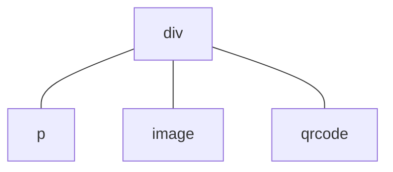

# Context File: 01_glyphix_framework_core_EN.md
Ограничения среды: MCU (No DOM), RTOS Zephyr, аппаратная платформа ATS3085S.

============================================================
FILE_PATH: src/transl/EN/framework/README.md

# Framework

Glyphix is an efficient, lightweight application development framework designed for MCU (Microcontroller Unit) devices, aiming to provide developers with an application development experience close to Web development. Through a declarative UI framework using HTML templates, CSS, and JavaScript, developers can easily build components and pages, and publish applications to various smart devices (such as smart watches). Glyphix solves the complexity and stability issues of UI and application development in traditional MCU systems, and provides critical cross-device application development and publishing capabilities, thereby empowering developers with unprecedented flexibility and ease of use.

In addition to an efficient development framework, Glyphix places special emphasis on application safety and stability. We have implemented robust memory management and security mechanisms in the underlying architecture to avoid common memory errors and resource waste, providing developers with a more reliable runtime environment. This security guarantees the operational stability of applications and significantly shortens the debugging cycle during development.

At the same time, Glyphix boasts exceptional performance, capable of running applications with near-native fluency and resource utilization even in resource-constrained MCU environments. The runtime has been deeply optimized by the framework, automatically managing resources and utilizing them efficiently. Consequently, developers can focus on feature implementation and user experience optimization without worrying about performance issues.

## Core Features

### Web Development Experience

- **Declarative UI Paradigm**: Similar to [Vue Options API](https://vuejs.org/guide/introduction#options-api), using HTML templates, CSS, and JavaScript, allowing developers to write applications in a way close to Web development and lowering the learning curve.
- **Component-Based Development**: Supports modular and component-based development, facilitating code reuse and maintenance, and making application development more efficient and readable.
- **Standardized Interfaces**: Supports Quick App standard system APIs, such as [HTTP Network](/api/system-fetch.md) and [Audio Streaming](/api/system-media.md), making it easy to develop device-agnostic internet applications.

### Cross-Device Support

- **Multi-Device Compatibility**: Glyphix supports running applications on various smart devices (such as smart watches, smart bands, etc.), achieving true cross-device development and deployment, and reducing the difficulty of adapting to different hardware platforms.
- **Unified Runtime Environment**: Leveraging Glyphix framework capabilities, applications can be automatically managed and executed across different devices, ensuring a consistent application interaction experience.
- **Quick App Standard Support**: Developers can publish applications to other ecosystems that support Quick Apps, further expanding the application's coverage.

### High Performance

- **Native-Level Performance**: Deeply optimized for MCU environments, achieving near-native fluency and low resource consumption even under limited resources.
- **Native Reactive Framework**: A reactive framework and GUI system implemented entirely in C++, avoiding the performance overhead issues of JavaScript implementations.

### Stability

- **Memory Management**: An underlying automated memory management mechanism prevents common memory errors, as well as the waste and inefficiency of manual memory allocation.
- **Lifecycle Model**: The application framework provides a comprehensive resource lifecycle model to ensure no resource leaks after the application exits, reducing stability risks.

### Debugging Support

- **Full-Featured Simulator**: Provides a simulator environment consistent with real devices, including simulations of multi-device screen sizes, enabling application development without physical devices.
- **Hot-Reloading Applications**: Developers can update and test applications without restarting the device, completely eliminating the need to flash firmware, which greatly improves development efficiency.

### Publishing Workflow

- **Cross-Device Publishing**: Supports developing an application once and publishing it multiple times across different device platforms. The Glyphix publishing tool supports automatic packaging and optimization for target devices, ensuring applications run stably on various devices.
- **App Store Distribution**: Supports aftermarket channel distribution such as app stores. Users can browse, download, and install applications without OTA firmware upgrades.
- **Independent Application Management**: Supports independent application installation and uninstallation, eliminating the need for unified firmware integration and version control.

## Comparison with Other Solutions

### Embedded C/C++ GUI Libraries

Glyphix is not just a GUI library providing C++ APIs, but a complete standard application runtime framework. It not only provides UI rendering capabilities but also manages application lifecycles, event handling, and data binding, endowing it with more complete application running and management capabilities.

Developing application logic using C/C++ typically requires recompiling and redeploying the entire program, whereas Glyphix supports application hot-reloading, allowing developers to quickly release and test updates without restarting the device, greatly enhancing development and maintenance efficiency.

On the other hand, traditional C/C++ development approaches usually require customization for different hardware and operating systems, whereas Glyphix provides a unified runtime environment capable of delivering a consistent application development experience across multiple MCU devices, reducing adaptation work.

### System-Level Solutions

Complete firmware system solutions typically cover the entire device OS, drivers, communications, and all other functions, whereas Glyphix focuses on providing an efficient application runtime framework. It does not replace or reconstruct the device's firmware system; instead, it acts as a component on the device to manage and run applications, ensuring the independence and flexibility of the applications relative to the firmware system.

In complete firmware systems, applications are usually tightly coupled with the system, resulting in high costs for development, updates, and maintenance. In contrast, as an independent application runtime, Glyphix allows developers to quickly add, update, and manage applications in a standard environment, reducing complexity and maintenance costs.

Furthermore, firmware systems are often deeply bound to specific hardware, whereas Glyphix can run across different systems, providing a unified development and runtime environment to achieve true cross-device support.

### Other Application Frameworks

Unlike application runtimes like Web, React Native, or Flutter, Glyphix—while offering a Vue-like development experience—is specifically designed for resource-constrained MCU environments, ensuring efficient operation even when memory and computing power are limited. It delivers near-native performance with lower resource consumption, adapting to the needs of small embedded devices.

Other application runtimes usually require execution in more powerful hardware environments (such as mobile phones or PCs), requiring more system resources for startup and operation. In contrast, the Glyphix runtime is extremely lightweight, capable of running on small devices like smart watches with ultra-low power consumption and memory footprint.

## Benefits for Developers

Glyphix is a friendly framework oriented toward Web developers. Developers can use familiar HTML, CSS, and JavaScript for development, eliminating the need to deeply learn C/C++ languages and complex MCU hardware development knowledge. This lowers the barrier to entry for MCU application development, enabling more Web developers to get started quickly and saving learning costs and time.

### Improving Development Efficiency

- **Web Development Experience**: Through a Web-like technology stack and hot-reloading support, developers can write MCU applications just like Web apps, fully leveraging their existing skills and dramatically increasing efficiency.
- **Write Once, Run Across Devices**: Glyphix provides robust cross-device compatibility. Code needs to be written only once, and the system automatically adapts and optimizes resources based on different device characteristics, without requiring independent development for each device. This effectively reduces the maintenance costs and complexity brought by device fragmentation.
- **Deeply Optimized System**: Developers do not need to invest a massive amount of energy into optimizing interaction fluency and lag issues, nor do they need to constantly watch out for device crashes, allowing them to focus entirely on feature implementation and user experience.

### Continuous Iteration

- **Long-Term Usability of Applications**: Glyphix's cross-device capabilities and long-term support for MCU devices ensure that applications can run continuously across multiple generations of devices. Even if a specific device is discontinued, developers do not need to worry about the application losing its runtime environment and can easily migrate to other devices, extending the application's lifecycle.
- **Compatibility with Future Devices**: The framework will continuously iterate and update to maintain compatibility with new hardware, and developers' applications can automatically adapt to future devices, avoiding extra maintenance costs caused by hardware updates.
- **Tooling and Documentation Support**: Alongside development tools, documentation will be continuously maintained along with framework updates to ensure accuracy and timeliness, enabling developers to always access the latest framework features and best practices to empower continuous application iteration and optimization.

============================================================
FILE_PATH: src/transl/EN/framework/component/life-cycle.md

# Lifecycle

Components, pages, and applications all have lifecycles. You can invoke specific features during particular lifecycle stages using **lifecycle functions**.

## Component and Page Lifecycles

You can trigger calls by defining lifecycle functions within component and page objects. For example:
``` html
<script>
export default {
  onInit() {
    console.log("onInit() called!")
  }
}
</script>
```
The `onInit()` lifecycle function is called after the component is instantiated. Lifecycle functions take no parameters and do not use return values.

### Component Lifecycle Functions

These lifecycle functions are common to both components and pages.

#### `onInit` <decl type="(): Promise<any> | void" method />

At this point, the component has been instantiated, and the data in the view-model is ready. You can access this data using the `this` keyword. Developers usually perform custom initialization logic in this lifecycle function.

#### `onReady` <decl type="(): Promise<any> | void" method />

At this point, the component rendering is complete. The component tree now has a corresponding control tree (similar to a DOM tree).

#### `onDestroy` <decl type="(): Promise<any> | void" method />

The component is about to be destroyed. Data in the view-model can still be accessed at this point. Custom resource release operations are usually performed in `onDestroy()`.

### Page Lifecycle Functions

These lifecycle functions exist only in pages.

#### `onShow` <decl type="(): Promise<any> | void" method />

Called when the page is about to be displayed. When returning via `router.back()`, `onShow()` is called when the underlying page is about to be displayed; it is also called before a newly created page is displayed for the first time.

#### `onHide` <decl type="(): Promise<any> | void" method />

Called when the page is about to be hidden. `onHide()` is called when the underlying page is hidden due to `router.push()`. However, the page is not hidden before it is destroyed, so `onHide()` will not be called in that case.

When the device screen turns off, `onHide()` for the foreground page is also called. For details, see [Screen State Changes](#screen-state-changes).

#### `onBackPress` <decl type="(): boolean" method />

Called when the user swipes back from the edge. Developers can handle the return logic in this function. If it returns `true`, it indicates that the developer has handled the return operation, and the system will not execute the default back behavior; if it returns `false`, it indicates that the developer has not handled the return operation, and the system will execute the default back behavior (i.e., close the current page and return to the previous page).

::: warning
This lifecycle function disables interactive edge-swipe to go back (i.e., following the gesture). It is generally **not recommended** to use this lifecycle function, nor should you define a regular method named `onBackPress`. If you wish to prevent the default back interaction, please refer to [Default Event Handling for Pages](/framework/generic/properties.md#页面的默认事件处理) to preserve interaction transition effects.
:::

#### `onRefresh` <decl type="(): Promise<any> | void" version="0.8" method />

Called when a page is opened in `singleTask` mode and returns to an existing page. For details, see [`launchMode`](../application/manifest.md#launchmode). You can refresh page data in this function.

## Application Lifecycle

### Application Lifecycle Functions

#### `onCreate` <decl type="(): Promise<any> | void" method />

Called when the application is loaded.

#### `onDestroy` <decl type="(): Promise<any> | void" method />

Called when the application is about to be destroyed.

#### `onShow` <decl type="(): Promise<any> | void" method />

Called when the application switches from the background to the foreground. The application's `onShow()` lifecycle function is always called after the page's `onShow()`. When the device screen is turned back on, the foreground application's `onShow()` is also called. For details, see [Screen State Changes](#screen-state-changes).

#### `onHide` <decl type="(): Promise<any> | void" method />

Called before the application is hidden from the foreground to the background.

If you do not want the application to remain active in the background, you can call [`launch.exit()`](/api/system-launch.md#exit) in `onHide()` to exit the application itself. For example:
```js
// in src/app.js
import launch from '@system.launch'

export default {
  onHide() {
    launch.exit()
  },
}
```

The application's `onHide()` lifecycle function is always called after the page's `onHide()`. When the device screen turns off, the foreground application's `onHide()` is also called. For details, see [Screen State Changes](#screen-state-changes).

#### `onRoute` <decl type="(page: string, query: {[key: string]: string}): Promise<any> | void" method />

The `onRoute` lifecycle function is called when the application is launched via a deeplink URI. The parameters `page` and `query` are the decoded URI fields. For example:
``` js
// file: app.ux
export default {
  // Assuming launch via app://example.app/page/to/deeplink?key=value&query=result
  onRoute(page, query) {
    console.log(page)  // Prints the string '/page/to/deeplink'
    console.log(query) // Prints the object {deeplink: 'key', query: 'result'}
  }
}
```

`onRoute()` is called after `onCreate()` and before `onShow()`. Developers can perform initialization in `onRoute()` based on parameters specified by the deeplink (such as navigating to a specific page).

#### `onLocaleChanged` <decl type="(locale: {language: string}): void" method />

Called when the application's locale changes. The `locale` parameter is an object containing the `language` field, which indicates the current locale (Language Tag), such as `'en-US'`, `zh-CN`, etc.

## Asynchronous Lifecycle Functions <experimental/>

Lifecycle functions of components, pages, or applications can be asynchronous—that is, `async` functions or functions returning a `Promise` object. For example:
``` js
import fs from "@system.file"

export default {
  async onInit() {
    // Wait for asynchronous file reading to complete before proceeding.
    let text = await fs.readText({ uri: "internal://files/test.txt" })
    console.log(text)
  }
}
```
Assuming this is the `onInit()` lifecycle function of a component, component rendering will only proceed after the asynchronous file reading completes. The following restrictions apply during the execution of asynchronous lifecycle functions:
- Component rendering will not be repeated; any operations on reactive properties during this period will not trigger UI updates;
- User input is temporarily blocked, and touches and key presses will not be responded to (otherwise, repeated user taps would cause repeated responses).

The main purpose of asynchronous lifecycle functions is to wait for asynchronous I/O and resource operations, avoiding the premature display of interfaces that have not finished loading. In particular, when opening a new page, the system will wait for all of the page's `onInit()`, `onReady()`, and `onShow()` lifecycle functions to finish executing before starting to display the page or play transition animations.

::: warning
Asynchronous lifecycle functions are currently experimental and may cause various issues, including crashes. Closing a page that is currently rendering during the execution of an asynchronous lifecycle function will cause a crash.

Firmware on most devices does not enable support for asynchronous lifecycle functions, and their behavior may not meet expectations. Please use asynchronous lifecycle functions with caution.
:::

## Screen State Changes

Changes in the device screen state affect the invocation of application and page lifecycle functions. When the device screen turns off, the `onHide()` lifecycle functions of the foreground application and page are called; when the screen is turned back on, the `onShow()` lifecycle functions of the foreground application and page are called. Developers can use these lifecycle functions to pause or resume network requests to reduce power consumption.

::: tip
Some devices switch applications to the background after the screen is turned off and kill the applications after a certain period of time. For applications that need to run continuously in the background, please pay attention to the background survival methods described in [Background Management](../application/README.md#后台管理).
:::

============================================================
FILE_PATH: src/transl/EN/framework/component/component-apis.md

# Built-in Component Interfaces

The Glyphix framework provides built-in properties for components, all of which are accessed using the `this.$xxx` format. These built-in properties offer features beyond the reactive framework for components.

All built-in properties are read-only.

## Properties

### `$app` <decl type="Applet" get />

The application object exported in `app.js` can be accessed via the `$app` property.

### `$page` <decl type="Component" get />

The component object of the page to which the component belongs can be accessed via the `$page` property. For page components, the value of `this.$page` is `this`.

### `$valid` <decl type="boolean" get />

Determines whether the component object is valid. A value of `false` indicates that the component has been destroyed.

::: tip
For destroyed components, any operations other than accessing the `$valid` property are illegal.
:::

#### Destroyed Components

The component lifecycle is controlled by the rendering framework, and properly written code typically does not access destroyed components. However, if you forget to cancel timers or listeners when destroying a component, for example:

``` js
setInterval(() => {
  this.secondCounter += 1
}, 1000)
```

If the component object is destroyed, you may encounter an error like this:

```
the component object has been destroyed
  stack backtrace:
    at <anonymous> (pkg://com.example.app/main/index.js:50)
TypeError: proxy: cannot set property
  stack backtrace:
    at <anonymous> (pkg://com.example.app/main/index.js:52)
```

If it is indeed difficult to delete timers or cancel listeners when the component is destroyed, you can use the `$valid` property to safely check whether the component has been destroyed. The following example suppresses the above runtime error:

``` js
let timer = setInterval(() => {
  if (this.$valid) {
    this.secondCounter += 1
  } else {
    clearTimeout(timer) // Delete the timer after the component is destroyed
  }
})
```
Such scenarios (such as recurring timers, event listener functions) generally follow a fixed code structure:
1. Use `this.$valid` to check whether the component is valid before accessing component properties;
2. Execute normal component property access operations in the valid branch;
3. Clear the timer or cancel the listener in the invalid branch, and **return immediately** to ensure that component properties are no longer accessed.

::: warning
When using the `$valid` property to determine whether a component has been destroyed, special attention should be paid to closures in listener functions, which may lead to memory leaks. Failing to correctly cancel event listeners or timers may result in the closure still being referenced by the system after the component is destroyed, preventing it from being garbage collected.
:::

#### Memory Leak Risk

In JavaScript, a closure refers to the association between a function and variables in its outer scope. When a function is created, it captures variables in the outer scope and maintains references to them, even if the outer scope has finished executing. This means that variables referenced inside the closure remain in memory until the closure itself is garbage collected.

In the component framework, when you register an event listener or start a timer, you typically pass a callback function, which may capture certain component properties or context (such as `this`).

Although the component object itself is correctly destroyed and memory is freed by the framework, these closure functions are not cleared. If event listener or timer callbacks are not actively removed, these closures may persist and accumulate over time, leading to memory leaks, especially in long-running applications. Such leaks can be difficult to detect.

The following example demonstrates a potential memory leak:
``` js
let timer = setInterval(() => {
  if (this.$valid) {
    this.secondCounter += 1;
  }
}, 1000)
```
Although `if (this.$valid)` is used inside the callback function to check whether the component is still valid, thereby avoiding throwing errors after the component is destroyed, this approach does not prevent memory leaks. The reason is that `$valid` only checks validity; checking this property prevents accessing an already destroyed component object. However, the problem is that because the timer is not turned off, the closure of the callback function itself is still referenced, and the closure cannot be garbage collected.

::: tip
To avoid such subtle memory leaks, you should actively cancel timers or remove event listeners when the component is [destroyed](./life-cycle.md#ondestroy), rather than relying solely on `$valid`. Even though `$valid` prevents improper operations after a component is destroyed, it cannot clean up the closure of the callback function itself.

All JavaScript memory is released after the application exits, so such memory leaks will not accumulate indefinitely.
:::

## Methods

### `$component` <decl type="(name: string, url: string): void" method />

Dynamically imports a component (the `<import>` tag can only import components statically), for example:
``` js
this.$component("Name", "url")
```
The string `"Name"` is the name of the imported component and must use PascalCase; the string `"url"` is the URI of the imported component.

### `$element` <decl type="(id: string): Element | undefined" method />

Returns the [native subcomponent](native-component.md#原生组件对象) object with the specified ID in the component, or `undefined` if no such subcomponent exists. The `$element()` method traverses all child nodes of the component, so component instances in other UX files can also be found.

The `$element()` method matches IDs across the entire rendered subcomponent tree and is not limited to subcomponents in the current [component template](template.md). Sometimes you need to be especially careful with this feature. For example, given the following template:
``` html
<scroll>
  <MyComponent />
  <div id="panel">...</div>
</scroll>
```
When an element with `id="panel"` also exists inside the custom component `MyComponent`, using `this.$element('panel')` will find the child element inside `MyComponent` instead of the `div` element in the example.

::: tip
The `$element()` method cannot be used for custom components, even if the `id` property is set for the custom component. Because `$element()` accesses the rendered component tree, it must be used in or after the [`onReady()`](life-cycle.md#onready) lifecycle method, and cannot be used in [`onInit()`](life-cycle.md#oninit).
:::

Please refer to [this documentation](README.md#组件对象和方法) to learn how to access the component object returned by the `$element()` method.

### `$emit` <decl type="(event: string, value: any): void" method />

See [Inter-component Communication](communicate) for details.


============================================================
FILE_PATH: src/transl/EN/framework/component/javascript.md

# JavaScript Script

JavaScript is the scripting language used for Glyphix application development. Developers can place JavaScript code inside the `<script>` tag of a UX file, or reference `*.js` script files directly.

## Syntax Support

ES6 syntax is supported.

## Importing Modules

Reference other JS files in your code by importing modules. Typically, developer-defined modules are imported via paths using one of two methods:
``` js
import utils from '../Common/utils.js' // Using the import keyword
const utils = require('../Common/utils.js' ) // Using the require function
```
For rules regarding module paths, please refer to [Paths and URIs](../application/resource). Additionally, the `.js` file extension can be omitted in module paths, so the import statements above can also be written as:
``` js
import utils from '../Common/utils' // Using the import keyword
const utils = require('../Common/utils') // Using the require function
```

To import built-in system modules, use the module name prefixed with the `@` character. All system modules start with the `@` character:
``` js
import router from '@system.router' // Using the import keyword
const router = require('@system.router') // Using the require function
```

::: warning
Developers must not start module names with the `@` character, as these names are reserved for system modules.
:::

# Exporting Modules

Use ES6 `export` syntax to export modules, for example:
``` js
// Export the default value
export default {
  method() {
    // ...
  }
  props: {
    // ...
  }
}

// Export named values
export function process(args) {
  // ...
}
```

============================================================
FILE_PATH: src/transl/EN/framework/component/prop-modifier.md

# Property Modifiers

Standard property operations allow for setting and observing properties. However, certain scenarios have common requirements for property operations—for example, requiring that setting a component's property value does not immediately change to the new value, but instead transitions using an animation. The direct solution is to write logic code to implement the transition effect, but in reality, such logic is common to any property.

To simplify or reuse code for certain common property operations, Glyphix includes several built-in property modifiers. Modifiers are property suffixes denoted by `.`, for example:

``` html
<progress :value="progress" value.transition="{curve: 'ease'}"/>
```

The property modifier key-value pair `value.transition="{curve: 'ease'}"` and the property key-value pair `value="{{progress}}"` filled in the component's XML attributes are independent of each other, and they may require completely different parameters.

This document will introduce the functions of each property modifier.

## The `transition` Modifier

This modifier proxies the property assignment operation, transforming the process of directly assigning a value to the property into a gradient assignment according to the animation transition method specified by the `transition` modifier. For example:

``` html
<!-- The transition modifier defines the transition effect for the value property -->
<progress :max="1000" :value="progress" value.transition="{curve: 'ease'}"/>
<!-- No transition effect -->
<progress :max="1000" :value="progress" />
```


<glyphix id="prop-modifier-transition" height="68" width="480" inline>

``` html
<div>
  <progress :max="1000" :value="progress" value.transition="{curve: 'ease'}"/>
  <progress :max="1000" :value="progress" />
</div>
```

``` css
div > * {
  margin: 8px;
  height: 0.75rem;
}
```

``` js
export default {
  data: {
    progress: 500
  },
  onInit() {
    setInterval(() => this.progress = parseInt(Math.random() * 1000), 3000)
  }
}
```

</glyphix>

Because the `value.transition` modifier of the [`progress`](/components/progress.md) component is defined, every time `this.progress` is modified, the displayed value of the `progress` component does not jump directly to the new value, but instead transitions smoothly via an animation. This effect can be achieved without writing any animation logic.

::: tip
The `value` property of the `progress` component in the example is an integer. Since the default range of $[0, 100]$ is prone to segmentation artifacts during transition animations, the example uses `:max="1000"` to increase the value range of `value`, thereby making the animation smoother.
:::

### Interpolation Calculation

Currently, only some properties of native components support the `transition` modifier. Supported properties must have an "interpolatable" value type. Specifically: for all property value types $a$ and $b$ and progress $p \in [0,1]$, the operation $(1-p)*a+p*b$ must be valid.

The JavaScript `number` type is interpolatable. In addition, transformations and color values can also be interpolated.

#### Transformations

Transformations are usually defined using strings, such as `scale(2) rotate(30deg)`. The string itself is not interpolatable, but when used for transformation properties, it is interpolatable (because these strings are parsed into sequences of transformation operations, which are interpolatable). Generally speaking, interpolation is performed step by step for each transformation operation. For example, in the interpolation between `scale(2) rotate(30deg)` and `scale(1) rotate(90deg)`, the transformation in each frame includes two steps: scaling and rotation. The scale factor transitions from $2$ to $1$, while the rotation angle transitions from $30\deg$ to $90\deg$.

#### Colors

Colors are usually represented using string codes, such as `#ff0000`. Color interpolation is calculated individually for the red, green, blue, and alpha channels.

### The `Transition` Object

The value type of the `transition` modifier is the `Transition` object:
``` ts
interface Transition {
  curve?: string,
  duration?: number
}
```

#### `curve` <decl type="?: string"/>

Specifies the [easing function](../render/animation.md#easing-curves) for the transition animation. The default is `'ease'`.

#### `duration` <decl type="?: number"/>

The duration of the animation in seconds. The default is `1`.

============================================================
FILE_PATH: src/transl/EN/framework/component/reuse.md

# Component Reuse

Application-level component reuse is primarily achieved through custom components.

## Child Components

Suppose the structure inside the `<template>` tag of a [UX file](/framework/component/README.md#ux-file) describes the organization of the user interface, for example:
``` html
<template>
  <div>
    <p>text</p>
    <image src="path/to/image.png" />
    <qrcode value="hello world!" />
  </div>
</template>
```
At runtime, this corresponds to the following component tree structure:

This component tree has a parent node `div` and $3$ child nodes: `p`, `image`, and `qrcode`. The `div` component is the outermost component within the `<template>` tag. We refer to this type of component as the **root component**. Root components are sometimes not unique; for example:
``` html
<template>
  <p>text</p>
  <image src="path/to/image.png" />
  <qrcode value="hello world!" />
</template>
```
contains $3$ root components. Additionally, using the [`for` directive](/framework/commands/for.md) may also result in multiple root component instances, for example:
``` html
<template>
  <p for="x in ['one', 'two', 'three']">
    label: {{x}}
  </p>
</template>
```
will be rendered as $3$ `p` component instances.

============================================================
FILE_PATH: src/transl/EN/framework/component/native-component.md

# Native Components

Native components refer to components implemented in C++. The main design goal of these components is to implement specific UI elements, such as buttons or list effects, without carrying business logic. Unlike Web technologies, native components themselves do not provide DOM interfaces, but only reactive component interfaces.

Native components in Glyphix provide a large number of configuration interfaces to achieve rich display effects. In addition, built-in components feature optimizations designed for embedded platforms.

In this document, **native components** refers to components implemented in C++; the term **built-in components** refers to component packages provided by WearOS, though these components are not necessarily implemented in C++.

::: tip
This document distinguishes between native components and built-in components in its descriptions, but readers generally do not need to worry about the difference between the two.
:::

## UI Functional Mechanisms

Most UI-related mechanisms are only available in native components. These mechanisms include:
- CSS style sheets, layouts, and other mechanisms
- Gestures and touch events
- Rendering and drawing mechanisms

Interfaces for certain native component mechanisms can be simulated in custom components through parameter/event passing between components, but these capabilities are essentially implemented by native components.

## UI Rendering

## Component Snapshots

Snapshots are a frame rate optimization technique. Enabling snapshots for complex components can speed up drawing and thus improve the frame rate. Essentially, snapshots take a "screenshot" of the component and accelerate rendering by directly drawing these screenshots. Therefore, for components with complex content but infrequent updates, snapshots are an effective technique. For other scenarios where updates are frequent but the loss of refresh updates can be tolerated, there are corresponding APIs to disable snapshot updates.

## Native Component Objects

You can obtain the native component object through the component's [`$element()`](component-apis#element) method, which allows you to access the properties of the native component or call its methods, for example:

``` js
let el = this.$element('scroll-id')
console.log(`width: ${el.width}`) // Get the width of the component through the native component object
el.scrollTo({ top: 100 }) // Scroll the list through the API
```

============================================================
FILE_PATH: src/transl/EN/framework/component/component-object.md

# Component Object

The `<script>` tag inside a UX file defines and exports a component object. A typical component object is defined as follows:
``` js
export default {
  data: {
    text: "Hello world"
  },
  onInit() {
    console.log("component onInit()")
  },
  clicked(event) {
    console.log(`clicked: ${event}`)
  }
}
```
The component framework allows developers to populate component objects with certain properties to implement functionality. This document will introduce these properties.

## Reactive Programming

**Reactive programming** is a programming paradigm used to dynamically update the UI and data states. Through **reactive properties**, developers can automatically track data changes and update the UI without manual triggering and management. This keeps data and the UI synchronized at all times, delivering a concise and efficient UI programming experience.

### Reactive Properties

Properties defined within the [`data` property](#data-property) and [`computed` property](#computed-property) objects of a component are **reactive properties** of the component, also known as view-model properties:
- **`data` property**: Directly reflects the state of the component. For example, temperature values, display text, or button states can be defined in `data`. When these property values change, the framework automatically synchronizes them to the view.
- **`computed` property**: Used to define derived properties calculated based on `data` or other `computed` properties. Computed properties are automatically updated when their dependent data changes, making complex logical expressions more intuitive and concise.

In summary, when a component's reactive property value changes, content depending on these properties will automatically update and re-render, thereby ensuring that the displayed content remains consistent with the data.

### Automatic Data Binding

**Automatic data binding** is a core concept of reactive programming, enabling data changes to be directly reflected on the UI without requiring manual handling by the developer.

Since each reactive property is automatically bound to the relevant parts of the UI, the UI updates automatically when the property value changes, eliminating the need to call property update functions on specific elements.

For example, defining a reactive property named `counter`:
``` js
export default {
  data: { // Define the counter reactive property in the data object
    counter: 0 // Initial value is 0
  }
}
```

Whenever the value of `counter` changes, the UI referencing this property will also update automatically. The following [template](template) code demonstrates this mechanism:
``` html
<p on:click="counter += 1">
  counter: {{ counter }}
</p>
```
This example demonstrates a counter where clicking the `<p>` tag increments the displayed value of `counter` by 1. You can click the online demo below to test it:

<glyphix id="component-object-reactive" height="50" width="200" inline>

``` html
<p on:click="counter += 1">
  counter: {{ counter }}
</p>
```

``` js
export default {
  data: {
    counter: 0
  }
}
```

``` css
p {
  border: 2px solid gray;
  border-radius: 16px;
  padding: 2px 8px;
  text-align: center;
  height: 100%;
}
```

</glyphix>

`{{ counter }}` inside the `<p>` tag is a template [interpolation expression](template.md#interpolation-expression), and its dependency on `counter` is automatically bound. Meanwhile, the [`on:click` listener](/framework/commands/on.md) on the `<p>` tag modifies the `counter` property value upon clicking. As you can see, automatic data binding eliminates the manual **data**-to-**UI** update operations typical of traditional GUI development, making UI logic cleaner and more straightforward.

## `data` Property

The `data` property is used to declare reactive data properties of a component. This property is an object, for example:
``` js
export default {
  data: {
    text: "Hello world"
  }
}
```
The value of the `data` property must be serializable via `JSON.stringify()`. Specifically, it must meet the following conditions:
- Primitive types: `number`, `string`, `boolean`, `null`, or `undefined`
- For recursively structured `Object`s and `Array`s, the values of the deepest elements must belong to one of the types above.

This means that the properties of the `data` object in the source code cannot contain functions or other special types of values, which also includes objects like `Date`.

::: note
The `data` object does not support non-JSON-compatible data types, such as `Date`, `Proxy` objects, etc.; this is a known limitation. If you need to use these types of data, you can define them as [custom properties](#custom-properties); otherwise, it will lead to unexpected behavior.
:::

All properties in the `data` property are view-model properties of the component, so the data within can be used for reactive programming. You can directly access properties in the `data` object inside the component object using `this.prop`. Therefore, in the following component object:
``` js
export default {
  data: {
    onInit: true
  },
  onInit() {}
}
```
The code `this.onInit` will access the `onInit` property inside the `data` object, rather than the `onInit` lifecycle function.

::: tip
To optimize performance, only define data used for UI rendering and state management in the `data` object. For non-reactive data, you can define them as [custom properties](#custom-properties). For example: timer IDs (return value of `setTimeout()`), [audio player](/api/system-media.md#createaudioplayer) handles, WebSocket connection objects, etc. Such objects generally do not need to be reactive properties and will not function correctly if they are.
:::

## `computed` Property

The `computed` property object of a component object declares computed properties within the component. Compared to reactive properties in `data`, computed properties can implement properties that require some calculation to obtain their results. For example:
``` html
<text> reversed message: {{ reversedMessage }}
```

``` js
export default {
  data: {
    message: "hello"
  },
  computed: {
    reversedMessage() { // This is the getter method for the reversedMessage computed property
      return this.message.split('').reverse().join('')
    }
  }
}
```
Here, a `reversedMessage` computed property is declared, implementing a getter function to retrieve the property value. You can directly use `this.reversedMessage` (the `this.` can be omitted in templates) to get the value of this computed property.

Computed properties are also view-model properties of the component. The values of computed properties are cached, so retrieving a computed property's value multiple times will not trigger recalculations. On the other hand, computed properties are automatically updated when their dependent view-model properties change. In this example, the value of the computed property is calculated from the `message` property, so when the `message` property changes, the value of `reversedMessage` will automatically update.

### Computed Property Setter Method

By default, computed properties only have a getter method, but you can also provide a setter method for a computed property:
``` js
export default {
  data: {
    message: "hello"
  },
  computed: {
    reversedMessage: {
      get() { // This is the getter method for the reversedMessage computed property
        return this.message.split('').reverse().join('')
      },
      set(value) {
        this.message = value.split('').reverse().join('')
      }
    }
  }
}
```
In this case, the value of the `reversedMessage` computed property is no longer a function, but an object containing two methods: a getter method `get` and a setter method `set`. The parameter of the `set` method is the new value to be set for the computed property.

## `watch` Property

The `watch` object method is used to watch for changes in view-model properties, for example:
``` js
export default {
  data: {
    value: 0
  },
  watch: {
    value(newValue, oldValue) {
      console.log(`value change: ${oldValue} -> ${newValue}`)
    }
  }
}
```
Methods in the `watch` object monitor changes to view-model properties with the same name, so `watch.value()` watches for changes to the `value` property. Changes to computed properties can also be watched by `watch`.

## Lifecycle Functions

See the [Lifecycle](life-cycle.md) documentation for details.

## Custom Properties

Users can also define custom properties in the component object. These properties are not in the view-model (i.e., not in the `data` or `computed` objects) and are therefore not reactive. Developers can define methods as custom properties and use custom properties to store data that does not require reactivity. For example:
``` html
<p on:click="onClick()">{{ text }}</p>
```

``` js
export default {
  data: {
    text: "some text"
  },
  // Custom properties are not in data or computed objects, defined directly within the component object
  timer: null, // Stores the timer handle; does not need to be predefined, assigning to this.timer creates this property automatically
  onInit() {
    // New properties assigned to this are custom properties
    this.timer = setInterval(() => this.text += "?", 1000)
  },
  onDestroy() {
    clearInterval(this.timer)
  },
  onClick() {
    this.text += "." // Operate on view-model properties within custom methods
  }
}
```

In the example, the `text` property is reactive, while `timer` is a non-reactive custom property. The `timer` property is used to store the timer handle. This value has nothing to do with the UI view, so it does not need to be a view-model property. For code standardization, custom properties can also be predefined in the component object:
``` js
export default {
  data: {
    text: "some text"
  },
  timer: null, // Custom properties are direct properties of the component object
  // ...
}
```
As shown in the example, custom properties can be defined directly inside the component object. The custom properties of each component are separate instances and are not shared.

::: warning
Custom properties, the `data` object, the `computed` object, lifecycle functions, and other properties must not share duplicate names; otherwise, some properties will be overwritten and become inaccessible.
:::

### Methods

Custom properties and methods are both direct properties of the component object, and the two are essentially equivalent. When you assign a function to a property of a component object, that property becomes a method. This section demonstrates this equivalence through two examples.

Approach 1: Define methods directly, which is the most common and recommended writing style.
``` js
export default {
  data: {
    count: 0
  },
  increment() {
    this.count++
  }
}
```

Approach 2: Define a property and assign a function to it.
``` js
export default {
  data: {
    count: 0
  },
  increment: function() {
    this.count++
  }
}
```
Both writing styles are functionally identical and can be called via `this.increment()`. They are also used identically within templates:
``` html
<button on:click="increment()">Count: {{ count }}</button>
```

::: tip
It is recommended to use Approach 1. This is the object method syntax supported by the ES6+ standard, making it more concise and straightforward.
:::

### Dynamically Assigning Methods

In addition to directly defining methods in the component object, you can also dynamically assign methods after the component is instantiated (e.g., in the `onInit` lifecycle). The key feature of this approach is that the dynamic methods of each component instance are independent and can capture and maintain different states via closures.

Consider a timer component where each instance has its own counter and can be stopped independently. This is a typical use case for dynamically assigned methods:
``` html
<div>
  <text>timeout: {{ counter }}</text>
  <button on:click="stopTimer">Stop</button>
</div>
```

``` js
export default {
  data: {
    counter: 0,
  },
  stopTimer: null, // Optional: Predefine the stopTimer method
  onInit() {
    const timer = setInterval(() => {
      this.counter++
    }, 1000)
    // Dynamically create the stopTimer method, capturing the timer variable through a closure
    this.stopTimer = () => {
      clearInterval(timer)
      this.stopTimer = null // Set the method to null after stopping
    }
  },
}
```

The following example instantiates 4 timer components simultaneously, and you can try stopping any of them independently:

<glyphix id="component-object-dynamic-method" height="200" width="300" inline>
</glyphix>

The implementation of this dynamic assignment method relies on the following key points:
- **Closure capture**: The `timer` constant created in `onInit` is a local variable, and the `stopTimer` method captures this variable via a closure.
- **Instance independence**: Each component instance creates its own `timer` and `stopTimer` when `onInit` is called, and they do not interfere with each other.
- **State isolation**: Clicking the "Stop" button of a specific instance only stops that instance's timer without affecting other instances.

Of course, for this example, a more common approach is to define the `stopTimer` method directly in the component object:
``` js
export default {
  data: {
    counter: 0,
  },
  timer: null,
  onInit() {
    // In this case, timer needs to be stored as a custom property
    this.timer = setInterval(() => {
      this.counter++
    }, 1000)
  },
  stopTimer() {
    // The stopTimer method accesses this.timer to stop the timer
    clearInterval(this.timer)
    this.timer = null // Clear the timer reference
  }
}
```
This is generally more intuitive for timers, but in some scenarios with complex contexts that require dynamic dispatch strategies, dynamic method assignment can be used to implement more flexible logic. The table below shows the differences between dynamic methods vs. directly defined methods:

| Feature | Directly Defined Methods | Dynamically Assigned Methods |
|---------|-------------------------|-----------------------------|
| Shareability | All instances share the same function object | Each instance has an independent function copy |
| Closure Capture | Does not capture local variables in the scope | Can capture local variables in the scope |
| Memory Footprint | Less (shared) | Slightly more (one per instance) |
| Applicable Scenarios | General, stateless operations | Operations requiring local state capture |

============================================================
FILE_PATH: src/transl/EN/framework/component/template-macro.md

# Template Macros

Template macros are a way to simplify repetitive code. They are top-level `<template>` elements in UX files with the `macro:` attribute:
``` html
<template macro:scroll>
  <scroll #props media-query="(shape: rect)">
    <slot />
  </scroll>
  <scroll #props deformation="fisheye"
          scroll-snap="center" media-query="(shape: circle)">
    <slot />
  </scroll>
</template>
```
For example, a macro named `scroll` is defined here. The macro will replace components with the same name inside the `<template>` of the current UX file, and:
- All attributes of the component with the same name will replace the `#props` placeholder in the template macro;
- The child elements of the component with the same name will replace the `<slot />` node in the template macro.

For example:
``` html
<template>
  <scroll :index="3" on:index="onIndexChange">
    <p for="i in 10">item {{i + 1}}</p>
  </scroll>
</template>
```
will be replaced by the `scroll` template macro with:
``` html
<template>
  <scroll :index="3" on:index="onIndexChange" media-query="(shape: rect)">
    <p for="i in 10">item {{i + 1}}</p>
  </scroll>
  <scroll :index="3" on:index="onIndexChange" deformation="fisheye"
          scroll-snap="center" media-query="(shape: circle)">
    <p for="i in 10">item {{i + 1}}</p>
  </scroll>
</template>
```

::: tip
In this example, the macro name is `scroll`, and the macro content also contains the `scroll` tag, but macro replacement is only performed once and will not be repeated recursively.
:::

## Purpose

As can be seen from the above example, template macros can statically replace ordinary components into another form. The replaced code is usually inconvenient to write and understand manually. For example:
``` html
<scroll :index="3" on:index="onIndexChange">
  <p for="i in 10">item {{i + 1}}</p>
</scroll>
```
is replaced with:
``` html
<scroll :index="3" on:index="onIndexChange" media-query="(shape: rect)">
  <p for="i in 10">item {{i + 1}}</p>
</scroll>
<scroll :index="3" on:index="onIndexChange" deformation="fisheye"
        scroll-snap="center" media-query="(shape: circle)">
  <p for="i in 10">item {{i + 1}}</p>
</scroll>
```
The replaced code actually statically selects different `scroll` component attributes based on screen shape [media queries](/framework/render/media-query.md). Specifically, it adds two attributes to the [`scroll`](/components/scroll.md) component on circular screens:
- [`deformation="fisheye"`](/components/scroll.md#deformation): Enables the fisheye effect for circular screens;
- [`scroll-snap="center"`](/components/scroll.md#scrollsnap): Aligns `scroll` child elements to the center on circular screens.

This template macro adds adaptation for non-standard screen shapes to the original hand-written code. This modification does not require changing the template source code, making it non-intrusive.

## Usage

Currently, there is no way to export template macros for use in other UX files. Therefore, template macros must be repeatedly written in each UX file where they are needed, meaning top-level elements like:
``` html
<template macro:scroll>
  ...
</template>
```
can be used. Template macro nodes and `<template>` nodes can appear in any order, but do not define template macros with the same name within a single UX file.

============================================================
FILE_PATH: src/transl/EN/framework/component/README.md

# Component Framework

Components are a technology in Glyphix used to achieve code reuse in App interface development. By nesting HTML-like elements, multiple components can be combined to form the overall appearance and function of an interface. On the other hand, each component encapsulates specific content and logic, and their rational use can reduce code complexity and maintenance costs.

Components are divided into built-in [**native components**](../render/native-component.md) and **custom components** implemented by developers. Native components are generally encapsulations of UI elements, used to display specific UI content or for layout and interaction, such as `text`, `image`, `div`, `list`, etc. Custom components, however, focus on logic implementation and functional encapsulation, because the interfaces implemented within custom components are ultimately hosted by native components.

## Defining Components

Each custom component is defined in a separate `.ux` file:

``` html
<template>
  <p>{{text}}</p>
</template>

<style>
  * {
    font-size: 48;
    text-align: center;
  }
</style>

<script>
  export default {
    data: {
      text: "Hello, World!"
    }
  }
</script>
```

As can be seen, a component consists of styles, JavaScript scripts, and a "template" that describes the interface.

## UX Files

A UX (UI XML) file is a component description using XML format. Each UX file defines a component, and a page is also a type of component.

The following root nodes can exist in a UX file:

- **`<import>`** tag: Used to import other components. This tag can be defined multiple times;
- **`<template>`** tag: Defines the content and structure of the component interface. There is one and only one such node;
- **`<template>`** macro tag: Defines reusable template structures. There can be multiple such nodes; see [Template Macros](./template-macro.md);
- **`<style>`** tag: Defines the CSS stylesheet. There is one and only one such node;
- **`<script>`** tag: A JavaScript script that implements the logical functions of the component. There is one and only one such node.

The order of the above nodes is arbitrary. Among them, the `<import>` node never contains child nodes. Note that the contents of the `<style>` and `<script>` nodes do not follow XML syntax; symbols like `>` and `&` do not require XML escaping rules, but instead follow CSS and JavaScript syntax (similar to HTML).

UX files require all tags to be closed. For example, `<div>...</div>` or `<div/>` are both valid, but a standalone `<div>` or `</div>` will result in an error.

## Page Components

Components declared in the `router.pages` field of `manifest.json` can be used directly as pages.

Compared to regular components, page components have more [lifecycle functions](life-cycle#组件和页面的生命周期), while other functions are basically the same. Component code already used for page components can also be used directly as regular components.

## Importing Components

### Custom Components

Defined components can be referenced in other components. Fill in the `<import>` tag in the UX file to reference the specified component:
``` xml
<import name="Panel" src="path/to/Panel">
```

The `src` attribute is the path URL of the component, where `Panel` is the component's filename (excluding the `.ux` extension); the `name` attribute is an optional component name. If this attribute is not defined, the component's filename will be used as its name.

`src` supports relative paths, absolute paths, and external paths:

- Relative paths are relative to the current UX file.
- Absolute paths are relative to the app's `src` path.
- External paths can import resource components outside the app. The specific path is the `package` value in the `appdb.json` of the resource component's app plus the absolute path.

### Global Components

Global components are non-native components defined in the framework. In an application, you can import a global component by using the `<import>` tag, specifying only the `name` attribute and omitting the `src` attribute:
``` html
<import name="TopBar" />
```

Applications can only import global components and cannot register new ones. System developers can use the [`globalComponent()`](/api/system-internal.md#globalcomponent) API to register global components.

## Attribute Documentation Specification

Component attribute documentation titles take the following form:

<div class="example-block">
  <h3 style="margin-bottom: 0.5rem">
    <span>
      <code>value</code>
      <decl type="number" get set listen />
    </span>
  </h3>
</div>

Where:
- `value` is the name of the attribute;
- `number` is the attribute value type;
- On the right, <span style="color:#666">Get • Set • Listen</span> indicates the supported access modes for the attribute.

### Access Modes

An attribute can support the following access modes:
- **Get**: The value of the attribute is readable;
- **Set**: The value of the attribute is writable;
- **Listen**: The attribute is [listenable](../commands/on.md), and listenable attributes typically trigger listening events when their values change.

Taking the [`index`](/components/scroll.md#index) attribute of the [scroll](/components/scroll.md) component as an example, this attribute supports reading, setting, and listening simultaneously. You can manipulate the `index` attribute in template syntax:
``` html
<scroll id="scroll1" :index="5" on:index="console.log($event)">
  ...
</scroll>
```
Here, `:index="5"` assigns `5` to the `index` attribute, while `on:index="console.log($event)"` listens for changes to the `index` attribute. For more details, please refer to [Inter-component Communication](/framework/component/communicate.md) and the [`on` Directive](../commands/on.md).

### Component Objects and Methods

You can also obtain the component object via the [`$element()`](component-apis.md#element) method to access its attributes:
``` js
const el = this.$element('scroll1') // Get the component object
console.log(el.index) // Read the index attribute of the scroll component
el.index = 4 // Set the index attribute of the scroll component
```
If supported, you can **get** or **set** the object returned by the `$element()` method. The `$element()` method does not support binding event listener functions to attributes.

A component's attribute can also be a **function** or a **method**. In this case, the documentation title format is as follows:

<div class="example-block">
  <h3 style="margin-bottom: 0.5rem">
    <span>
      <code>method</code>
      <decl type="(x: number, y: number): void" method />
    </span>
  </h3>
</div>

Where:
- `(x: number, y: number): void` is the signature of the function or method.
- On the right, <span style="color:#666">Method</span> indicates that the attribute is a method.

Component methods can only be accessed through the component object. For example, taking the [`setIndex`](/components/scroll.md#setindex) attribute of the scroll component:
``` js
const el = this.$element('scroll1') // Get the component object
el.setIndex(4) // Call the setIndex() method
```
Methods do not support get, set, and listen access modes, so such attributes only have the <span style="color:#666">Method</span> tag.

### Two-Way Binding

When an attribute simultaneously supports the <span style="color:#666">Set • Listen</span> access modes, it supports [two-way binding](../commands/model.md).

============================================================
FILE_PATH: src/transl/EN/framework/component/template.md

# Template Syntax

Templates are the contents inside the `<template>` tag of a UX file. Overall, templates use standard HTML syntax, but the template syntax also introduces syntax limitations and new features that differ from HTML. This document will cover these topics.

## Tags

Tag nesting is supported in templates, but all tags must be closed. Therefore, the following code is valid:
``` html
<div> <p>message</p> </div>
```
However, the following code is invalid:
``` html
<div> <p>message</p> <!-- <div> tag is not closed -->
```

## Text Values

Text elements and attribute values in templates are text values. For example, in:
``` html
<com name="value">A message</com>
```
both `A message` and `value` are text. The `A message` text value is passed to the `text` attribute of the `com` component, so the text node (the `A message` part) is actually syntactic sugar for the `text` attribute:
``` html
<p>text</p>
```
is equivalent to:
``` html
<p text="text"></p>
```
Text values are represented internally as JavaScript strings.

### Text Child Nodes

Text child nodes can be used not only in native components but also in custom components with a `text` attribute, such as:
```html
<p>The text element of P.</p>
<MyCom>The text element of MyCom.</MyCom>
```
You only need to provide a `text` [reactive property](component-object.md#reactive-properties) for the `MyCom` component to receive the content of the text node, without needing to use `<slot>` or other mechanisms.

::: warning
Some components do not have a `text` attribute (such as `div`), and placing text nodes as their child nodes will not display any content! Please make sure to place text nodes as child nodes of native components like `p`, `text`, or `span`.
:::

You can also use multiple text child nodes in a component, such as:
```html
<div>
  The switch <switch /> and <checkbox /> checkbox.
</div>
```
This will mix text and the [`switch`](/components/switch.md) component within the `div`:

<glyphix id="component-template-text-1" height="32" inline>

``` html
<div>
  The switch <switch /> and <checkbox /> checkbox.
</div>
```

</glyphix>

When text nodes are mixed with other nodes, the text nodes are translated into [`span`](/components/span.md) nodes rather than being passed to a component's `text` attribute. Therefore, the above example is equivalent to this code:
```html
<div>
  <span>The switch&nbsp;</span>
  <switch />
  <span>&nbsp;and&nbsp;</span>
  <checkbox />
  <span>&nbsp;checkbox.</span>
</div>
```
Such implicit `span` elements can also be assigned CSS styles, but class selectors cannot be used (because there is no `class` attribute).

### Whitespace

All whitespace characters, such as line breaks and tabs in the source code of text child nodes, are treated as spaces. The rules for processing spaces are as follows:
- Spaces at the beginning of the first text child node are removed.
- Spaces at the end of the last text child node are removed.
- Multiple consecutive spaces in other positions are treated as a single space.

::: tip
When there is only a single text node, it is both the first and the last text child node, so spaces at both its beginning and end will be removed. If a text node has no content (including when it has no content after removing spaces), it will be deleted.
:::

Therefore, writing `<p>  spances </p>` will not display any spaces, while:
```html
<div>
  The switch <switch /> and <checkbox /> checkbox.
</div>
```
will remove the spaces (and line breaks) between `<div>` and `The switch`, as well as between `checkbox.` and `</div>`. However, a single space between `The switch` and `<switch />`, etc., will be preserved.

When you find that you cannot control whitespace using the above rules, you should consider using [HTML character references](https://developer.mozilla.org/en-US/docs/Glossary/Character_reference).

::: tip
When mixing [interpolation expressions](#interpolation-expressions) within text nodes, keep in mind that the latter are JavaScript expressions, and strings within them must follow JavaScript [escape character](https://developer.mozilla.org/en-US/docs/Glossary/Escape_character) rules.
:::

## Attributes and Interpolation

### Interpolation Expressions

You can enclose an expression in double curly braces within text, which is an **interpolation** expression:
``` html
<p>Message: {{ msg }}!</p>
```
During rendering, the expression inside the double curly braces is evaluated and concatenated with the text before and after it. If there is no text before or after the expression, it forms an **unconcatenated** interpolation expression. In this case, the value of the expression is used directly without being converted to text.

Interpolation expressions can also be used in attribute values, for example:
``` html
<div visible="{{true}}"></div>
```
Here, `{{true}}` evaluates directly to a boolean `true` value rather than a string.

::: tip
Attributes like `visible` require a boolean value type, so you need to use unconcatenated syntax like `visible="{{ expr }}"` to prevent text around the curly braces from turning the interpolation expression into text. Due to JavaScript's value conversion rules, `visible="false"` would cause the attribute to evaluate to `true` (non-empty strings convert to boolean `true`). Of course, [implicit attribute values](#implicit-attribute-values) can also be used for this scenario.
:::

If you need to pass a numeric constant, both of the following approaches will work:
``` html
<scroll damping="{{1.5}}"></scroll>
<scroll damping="1.5"></scroll>
```
Because the string `"1.5"` can be automatically converted to the number `1.5`. We recommend using the first approach because it avoids unnecessary type conversion and is more semantically explicit.

The type of an unconcatenated interpolation expression attribute value is simply the type of the expression's value, for example, `{{1 + 2}}` has the type `number`. Other interpolation expressions result in text values.

### Attribute Binding Expressions

If a component's attribute is not of a text type, you can use an unconcatenated interpolation expression:
``` html
<com items="{{ [1, 2, 3] }}" />
```
You can also use the attribute binding expression syntax:
``` html
<com :items="[1, 2, 3]" />
```
Compared to regular attributes, attribute binding expressions require adding a `:` character before the attribute name. In this case, the attribute value is compiled as an expression rather than a string. This method avoids writing `{{ }}` and offers better readability.

### Implicit Attribute Values

If an element's attribute is written with only its name and no value, it is equivalent to a boolean `true`:
``` html
<com focus></com>
```
is equivalent to:
``` html
<com :focus="true"></com>
```
Implicit attribute values are suitable for various option attributes: providing the attribute name means enabling the option, while omitting it means disabling the option. If you need to pass an empty string via an attribute, you should explicitly write out an empty attribute value:
``` html
<com empty-property=""></com>
```
The rule for implicit attribute values applies to ordinary attributes and does not apply to [directive attributes](#directive-attribute-values). Directive attributes should always have their values written out.

### Directive Attribute Values

For [directives](/framework/commands/README.md) like `if`, `for`, and `on`, the attribute value is not text, so you cannot use interpolation expressions with concatenated text. For example:
``` html
<div on:click="console.dir({{$event}})"></div>
```
is invalid. Instead, you can use an unconcatenated interpolation expression:
``` html
<div on:click="{{console.dir($event)}}"></div>
```
All directive attributes support omitting the double curly braces, so the code above can be shortened to:
``` html
<div on:click="console.dir($event)"></div>
```
However, note that ordinary attributes must pass non-text values via unconcatenated interpolation expressions or attribute binding expressions.

### `this` Binding

In interpolation expressions (including attribute binding expressions), identifiers generally bind automatically to the component object's properties. That is, in:
``` html
<div on:visible="callback"></div>
```
the expression `callback` is equivalent to the JavaScript code `this.callback`.

Identifiers appearing within the scope of the template syntax do not bind to `this`. This is mainly reflected in `for` directives. For example:
``` html
<p for="v in ['one', 'two']">{{ v }}</p>
```
The identifier `v` in the interpolation expression `{{ v }}` binds to the iteration variable `v` defined in the `for` directive, rather than to the component object's `this` property.

Certain names used by global objects and reserved names also do not bind to the component object's `this` property. These names are:

- `this`, `true`, `false`, `undefined`, `null`
- `console`
- `Math`, `Date`, `Number`, `Array`, `Object`, `Boolean`, `String`, `RegExp`, `JSON`
- `NaN`, `Infinity`
- `isNaN`, `isFinite`
- `parseFloat`, `parseInt`

## Interpolation Expression Syntax

Interpolation expressions support most JavaScript expression syntax, but do not support statements or other syntaxes. This section lists all supported expressions.

Interpolation expressions cannot contain `}}` inside them, so constructs like `{key: {a: 1.0}}` cannot be compiled. This can be resolved by adding spaces: `{ key: { a: 1.0 } }`.

### Basic Expressions

- Numbers: Numeric literals such as `1`, `1.0`, `1e10`
- Identifiers: Variable names, as well as primitive enum values like `true`, `null`
- Strings: String literals enclosed in single or double quotes (double quotes are less convenient in XML/HTML environments)
- Parentheses: `( expr )`, using parentheses to elevate the evaluation priority of inner expressions

### Unary Expressions

- Negative: `- expr`
- Positive: `+ expr`
- Logical NOT: `! expr`

### Binary Expressions

Binary expressions formed by operands and operators `+`, `-`, `*`, `/`, `%`, `==`, `!=`, `>`, `>=`, `<`, `<=`, `&&`, `||`. The precedence and associativity of these operators are the same as in JavaScript.

Assignment operators `=`, `+=`, `-=`, `*=`, `/=`, `%=` are supported.

### Ternary Expressions

Ternary conditional expressions: `cond ? expr : expr`.

### Other Expressions

- Function calls: Same as JavaScript syntax
- Member expressions: `object.prop`
- Subscript expressions: `array[index]`
- Array literals: `[1, expr, ...]`, same as JavaScript syntax
- Object literals: `{ a: 1, b: expr }`, same as JavaScript syntax

### Template Literals

Interpolation expressions partially support [template literal](https://developer.mozilla.org/docs/Web/JavaScript/Reference/Template_literals) syntax. For example, in the following template literal:
``` js
`head ${ expr } tail`
```
The expression `expr` cannot contain the `}` character, which means you cannot use JavaScript object literals or nested template literals containing expressions. Other expressions mentioned in this section can be used within template literals.

Template literals in interpolation expressions do not support line breaks.

::: tip
Syntax errors in expressions can be inspected and located using the glyphix.js tool.
:::

## Other Tips

============================================================
FILE_PATH: src/transl/EN/framework/component/communicate.md

# Inter-component Communication

Communication between components is achieved through component parameters and event binding. For example:
``` html
<scroll scroll-snap="center" on:scroll="scrolled($event)" />
```
This passes the `scroll-snap` attribute parameter to the `scroll` component instance to center-align the element, and listens for changes to the `scroll` property.

## Attribute Parameters

You can pass parameters to child components through the **attribute** fields of component nodes. For example:
``` html
<p text="A message"></p>
```
This passes an attribute named `text` with the value `"A message"` to a `p` component instance. Multiple attributes can be passed according to XML/HTML syntax. Evaluated values can be passed to component attributes using [Interpolation Expressions](template#插值表达式).

## Event Response

[Native components](native-component) encapsulate many UI input events, such as responses to touch gestures and UI change events. All these events can be listened to via the [`on` command](../commands/on.md).

## Triggering Events

For custom components, you can use the component object's [`$emit(name, value)`](/framework/component/component-apis.md#emit) method to trigger an event:
``` html
<panel on:some-event="console.log(`the event ${$event} was emited!`)">
```

``` js
// in panel.ux
export default {
  emitEvent() {
    this.$emit('someEvent', 'hello')
  }
}
```

The `$emit` method takes two parameters:
- `name`: The name of the attribute to send the event, which must use lower camelCase (the corresponding template attribute can be in kebab-case or lower camelCase).
- `value`: Optional parameter, the value of the event attribute, which will be used as the value of the `$event` variable in the `on` command.

If the view-model of the component object has a property named `name`, the `$emit` method will not modify the property value to `value`.

============================================================
FILE_PATH: src/transl/EN/framework/generic/properties.md

---
icon: xml
---
# Properties and Events

This section introduces the common property interfaces and events provided by all native components.

## Property List

### Common Properties

#### `top` <decl type="number" get set listen />

The position of the top of the component relative to the parent native component, in pixels. This property is actually a shorthand for the `top` property in inline styles. For more usage methods, see [Component Position Operations](#component-position-operations).

Reading or listening to the `top` property returns the calculated position of the component, which is the actual measured value after layout.

#### `left` <decl type="number" get set listen />

The position of the left side of the component relative to the parent native component, in pixels. This property is actually a shorthand for the `left` property in inline styles. For more usage methods, see [Component Position Operations](#component-position-operations).

Reading or listening to the `left` property returns the calculated position of the component, which is the actual measured value after layout.

#### `width` <decl type="number" get set listen />

The width of the component. Setting the `width` property updates the [`width`](styles.md#width) property in the inline styles. Since CSS width uses the border-box model, the actually stored style value automatically adds the element's current `padding` and `border` dimensions to ensure that the content width after layout matches the set value.

Reading or listening to the `width` property returns the layout-calculated content width, excluding `padding` and `border`.

#### `height` <decl type="number" get set listen />

The height of the component. Setting the `height` property updates the [`height`](styles.md#height) property in the inline styles. Since CSS height uses the border-box model, the actually stored style value automatically adds the element's current `padding` and `border` dimensions to ensure that the content height after layout matches the set value.

Reading or listening to the `height` property returns the layout-calculated content height, excluding `padding` and `border`.

#### `show` <decl type="boolean" get set/>

Sets whether the component is visible. Hidden components are not displayed and do not occupy layout space.

#### `quiescent` <decl type="boolean" get set/>

Sets whether component snapshots update automatically (quiescent snapshot). If a component is displayed via a snapshot, when this property is `false` (default), snapshot views are refreshed immediately when the component content updates; otherwise, they are not updated immediately. Setting this property to `true` can improve UI performance, but will cause the displayed content to lag.

The following example demonstrates the role of the `quiescent` property. Two `p` elements are placed inside a `scroll` container, and the `scroll` container has [snapshot mode](../../components/scroll.md#snapshot) enabled. When the user scrolls the `scroll` component, snapshots of the elements within it are taken. Since the first `p` element uses normal snapshot mode while the second `p` element uses quiescent snapshot mode, only the content update of the first `p` element can be observed during scrolling.

<glyphix id="generic-properties-quiescent" height="200" title="Lazy Snapshot">

``` html
<scroll snapshot scroll-snap="center">
  <p>normal snapshot {{ count }}</p>
  <p quiescent>quiescent snapshot {{ count }}</p>
</scroll>
```

``` css
scroll {
  display: flex;
  flex-direction: column;
  background-color: lightgray;
}

p {
  background-color: lightgreen;
  text-align: center;
  padding: 10px;
  margin: 10px;
}
```

``` js
export default {
  data: {
    count: 0
  },
  onReady(event) {
    setInterval(() => this.count++, 500)
  }
}
```

</glyphix>

#### `style` <decl type="string" set />

Sets the inline style of the component. Currently, only [CSS properties](./styles.md) with the <badge type="info" text="inline" /> tag are supported.

#### `z-index` <decl type="number" get set />

The `z-index` property sets the Z-axis order of an element. Overlapping elements with a larger `z-index` will cover elements with a smaller one. This property value will be overridden by the [`z-index`](styles.md/#z-index) property in CSS.


#### `opacity` <decl type="number" get set />

Specifies the opacity of the component. The value range is $[0, 1]$, where $0$ means completely transparent. It has the same effect as the CSS property [`opacity`](styles.md#opacity).

::: warning
The `opacity` value affects the rendering performance of elements. For details, please refer to the description of the [`opacity`](styles.md#opacity) CSS property.
:::

#### `transform` <decl type="string" set />

Sets the transformation of the component, equivalent to the CSS [`transform`](styles.md#transform) property.

#### `disabled` <decl type="boolean" get set />

Used to set or get the disabled state of the component. When the property value is `true`, the element is disabled, the user cannot interact with it, and the element will not respond to any gestures (such as clicks, drags, etc.). When the property value is the **default** `false`, the component is available, and the user can interact with it normally.

The following example demonstrates the usage of the `disabled` property, while also using the [`:disabled`](styles.md#disabled) CSS pseudo-class to control styles. This example shows that a `div` element can respond to click gestures in its normal state, but does not respond to any gestures in the `disabled` state.

<glyphix id="generic-properties-disabled" height="200" title="disabled Property">

``` html
<div :disabled="disabled" on:click="onClick">
  {{disabled ? 'disabled' : 'normal'}} <switch />
</div>
```

``` css
div {
  background-color: lightgray;
  text-align: center;
  display: flex;
  justify-content: center;
}

/* The :disabled pseudo-class can control the style of an element in the disabled state */
div:disabled {
  opacity: 0.5;
}
```

``` js
import prompt from '@system.prompt'

export default {
  data: {
    disabled: false
  },
  onInit() {
    setInterval(() => {
      this.disabled = !this.disabled
    }, 2000)
  },
  onClick() {
    prompt.showToast({ message: 'clicked!', duration: 250 })
  }
}
```

</glyphix>

### Common Events

Most native components support common events, which can be listened to using the [`on` directive](../commands/on.md). The value types of these events are introduced in the [Event Types](#event-types) section.

#### `touchstart` <decl type="TouchEvent" listen />

Triggered when the user starts touching the component. The event value is of type [`TouchEvent`](#touchevent).

#### `touchmove` <decl type="TouchEvent" listen />

Triggered when the user's touch point moves on the component. During movement, this event will continue to trigger even if the touch point leaves the current native component's area. The event value is of type [`TouchEvent`](#touchevent).

There is a certain "dead zone" for movement when transitioning the touch state from `touchstart` to `touchmove`. If the sliding distance of the user's touch is less than the dead zone range, `touchmove` will not be triggered. The movement dead zone range varies by device. The following example demonstrates the movement dead zone.

<glyphix id="generic-properties-touchmove" height="200" title="Movement Dead Zone">

``` html
<p on:touchstart="state = 'start'"
   on:touchmove="onTouchMove($event)"
   on:touchend="onTouchEnd">
  {{ `state: ${state} \ndead area: (${dx}, ${dy})` }}
</p>
```

``` css
p {
  background-color: lightgreen;
  text-align: center;
}
```

``` js
export default {
  data: {
    state: null,
    dx: null,
    dy: null
  },
  onTouchMove(event) {
    if (!this.dx && !this.dy) {
      this.state = 'move'
      this.dx = event.touches[0].offsetX
      this.dy = event.touches[0].offsetY
    }
  },
  onTouchEnd() {
    this.state = 'end'
    this.dx = this.dy = null
  }
}
```

</glyphix>

#### `touchend` <decl type="TouchEvent" listen />

When the user's touch point leaves the screen, a `touchend` event is sent to the previously touched native component. The event value is of type [`TouchEvent`](#touchevent).

#### `touchcancel` <decl type="TouchEvent" listen />

Triggered when the touch on the native component is interrupted. The event value is of type [`TouchEvent`](#touchevent). There are various reasons that can cause a touch interruption, such as the component being hidden or the touch event being forcibly intercepted by other elements.

#### `click` <decl type="ClickEvent" listen />

Triggered when the native component is clicked and released. The event value is of type [`ClickEvent`](#clickevent).

<glyphix id="generic-properties-click" height="100">

``` html
<p on:click="click = JSON.stringify($event)">
  {{ click }}
</p>
```

``` css
p {
  background-color: lightgreen;
  text-align: center;
}
```

``` js
export default {
  data: {
    click: null
  }
}
```

</glyphix>

#### `longpress` <decl type="LongPressEvent" listen />

Triggered when the native component is pressed for a long time. The event value is of type [`LongPressEvent`](#longpressevent). The interactive example below demonstrates the triggering timing of `longpress` and other events:

<glyphix id="generic-properties-longpress" height="100">

``` html
<p on:touchstart="state = 'touching...'"
   on:longpress="state = `longpress: ${JSON.stringify($event)}`"
   on:click="state = 'clicked.'">
  {{ state }}
</p>
```

``` css
p {
  background-color: lightgreen;
  text-align: center;
}
```

``` js
export default {
  data: {
    state: null
  }
}
```

</glyphix>

The triggering timing and duration of the `longpress` event vary by device, typically triggered after pressing for $500 \rm ms$. Unlike the [`click`](#click) event, `longpress` is triggered during the press rather than upon release. For the above example, you will find that:
- When the press time is less than the long press trigger time, the `click` event is triggered upon release;
- When pressed long enough, the `longpress` event is triggered, and upon release, the `click` event is triggered (displayed as the "clicked." state);
- Moving during the press will not trigger the `longpress` or `click` events.

#### `swipe` <decl type="SwipeEvent" listen />

Triggered when the component is swiped quickly. The event value is of type [`SwipeEvent`](#swipeevent).

<glyphix id="generic-properties-swipe" height="250" >

``` html
<p on:swipe="onSwipe($event)">
  {{ swipe }}
</p>
```

``` css
p {
  background-color: lightgreen;
  text-align: center;
}
```

``` js
export default {
  data: {
    swipe: null
  },
  onSwipe(event) {
    this.swipe = event.direction
    event.strongResponse()
  }
}
```

</glyphix>

#### `keydown` <decl type="KeyEvent" listen />

Triggered when a key is pressed down. The `keydown` and `keyup` events are used to capture physical key operations. To capture events, the native component must be in focus. The root element of the page always automatically gets focus, so the following code can capture `keydown` and `keyup` events:
``` html
<!-- Assuming this is the root element of the page -->
<div on:keydown="console.log($event)" on:keyup="console.log($event)">
  ...
</div>
```
Please refer to [`KeyEvent`](#keyevent) for the event value type.

Watch devices usually register a [default key handler](/api/system-internal.md#setdefaultkeyhandler), so application code can interact even without responding to these types of events (for example, some watches return to the previous page when the Power button is pressed). To prevent the default key response, you can use the `stopPropagation()` method of the `KeyEvent` object to stop bubbling.

#### `keyup` <decl type="KeyEvent" listen />

Triggered when a key is released. For more details, please refer to the [`keydown`](#keydown) event.

#### `wheel` <decl type="WheelEvent" listen />

Triggered when the user operates the rotating wheel. Wheel devices include the rotating crown of a watch or a mouse wheel. To capture this event, the native component must be in focus. The root element of the page always automatically gets focus, so the following code can capture the `wheel` event:
``` html
<!-- Assuming this is the root element of the page -->
<div on:wheel="console.log($event)">
  ...
</div>
```
Please refer to [`WheelEvent`](#wheelevent) for the event value type.

## Event Types

### `BaseEvent`

The `BaseEvent` event object provides some methods to control event propagation. Its prototype is:
``` ts
interface BaseEvent {
  strongResponse(): void, // Force response to the event
  stopPropagation(): void // Stop event bubbling
}
```

### `TouchEvent`

The prototype of the `TouchEvent` event object is:
``` ts
interface TouchEvent extends BaseEvent {
  isTarget: boolean, // Whether the event target is the current component
  touches: { // All touch point data for this event
    clientX: number, // x coordinate of the touch point relative to the target component's content area
    clientY: number, // y coordinate of the touch point relative to the target component's content area
    offsetX: number, // Displacement of the touch point in the x direction during the touch process
    offsetY: number  // Displacement of the touch point in the y direction during the touch process
  }[];
}
```

### `ClickEvent`

The prototype of the `SwipeEvent` event object is:
``` ts
interface SwiperEvent extends BaseEvent  {
  isTarget: boolean, // Whether the event target is the current component
  clientX: number, // x coordinate of the click touch point relative to the target component's content area
  clientY: number // y coordinate of the click touch point relative to the target component's content area
}
```

### `LongPressEvent`

The prototype of the `LongPressEvent` event object is:
``` ts
interface SwiperEvent extends BaseEvent  {
  isTarget: boolean, // Whether the event target is the current component
  clientX: number, // x coordinate of the long-press touch point relative to the target component's content area
  clientY: number // y coordinate of the long-press touch point relative to the target component's content area
}
```

### `SwipeEvent`

The prototype of the `SwipeEvent` event object is:
``` ts
interface SwiperEvent extends BaseEvent  {
  isTarget: boolean, // Whether the event target is the current component
  direction: 'left' | 'right' | 'up' | 'down' // Swipe direction
}
```

### `KeyEvent`

The `KeyEvent` object describes the user's interaction event with physical keys. This type is used for the event properties of elements [`keydown`](#keydown) and [`keyup`](#keyup). The prototype of the `KeyEvent` event object is:
``` ts
interface KeyEvent  {
  type: 'keydown' | 'keyup', // Type of key event
  key: string, // Key name
  timestamp: number, // Timestamp when the key event was reported, in milliseconds
  stopPropagation(): void // Call this method to prevent event bubbling
}
```

Currently, the following key names are supported:
- `'Power'`: The power button of the watch;
- `'Fn'`: The function button of the watch;
- Other printable character keys form key names as single characters, such as the letter `'A'`, minus sign `'-'`, etc.

### `WheelEvent`

The `WheelEvent` object describes the user's interaction event with the rotating wheel. This type is used for the event property of the element [`wheel`](#wheel). The signature of the `WheelEvent` event object is:
``` ts
interface WheelEvent {
  deltaY: number, // Scroll increment in the y direction
  stopPropagation(): void // Call this method to prevent event bubbling
}
```

Unlike the web [wheel event](https://developer.mozilla.org/en-US/docs/Web/API/Element/wheel_event), the `WheelEvent` in Glyphix currently only contains the `deltaY` property.

## Event Response Mechanism

### Event Bubbling

Touch and gesture events support bubbling. Bubbling means that when an event occurs on an element, it first executes the handlers on that element, then executes the handlers on its parent element, and so on up to other ancestor handlers. In the following example, both the green `p` component and the gray `div` component listen for touch events. When clicking the `p` component, you can observe that both the `p` component and the `div` component receive the event.

<glyphix id="generic-event-bubbling" height="250" title="Touch Event Bubbling">

``` html
<div on:touchstart="onTouch('div', $event)"
     on:touchmove="onTouch('div', $event)"
     on:touchend="onRelease('div', $event)">
  <p on:touchstart="onTouch('p', $event)"
     on:touchmove="onTouch('p', $event)"
     on:touchend="onRelease('p', $event)">
    {{ `touchs: ${touchs.div ? 'div' : '-'} ${touchs.p ? 'p' : '-'}, target: ${target}` }}
  </p>
</div>
```

``` css
div {
  display: flex;
  flex-direction: column;
  background-color: lightgray;
  justify-content: space-around;
}

p {
  background-color: lightgreen;
  text-align: center;
  height: 150px;
}
```

``` js
export default {
  data: {
    touchs: { div: false, p: false },
    target: null
  },
  onTouch(name, event) {
    this.touchs[name] = true
    // The isTarget property can distinguish whether the target of the event is the current component listening to the event
    if (event.isTarget)
      this.target = name
  },
  onRelease(name, event) {
    this.touchs[name] = false
    if (event.isTarget)
      this.target = null
  }
}
```

</glyphix>

In Glyphix, only the touch and gesture events in this document bubble. Event capture cannot be performed in JavaScript code currently.

### Stopping Event Bubbling

Use the `stopPropagation()` method of `BaseEvent` to prevent the event from bubbling up to the parent.

### Strong Response Events

Touch or gesture events in Glyphix have two response priorities: strong response and weak response. When an event has multiple targets waiting to respond at the same time, strong response has a higher priority than weak response. Assuming there are 3 levels of parent-child elements on the interface: `A -> B -> C`, where `C` has a weak response to the event and `B` has a strong response, the event will be dispatched to `B` and will no longer be dispatched to `C`. An element that originally had a strong response event will re-dispatch events after being changed to weak response.

The touch and gesture events in [Common Events](#common-events) default to weak response. In the following example, a green `p` component is placed inside a gray `scroll`, and all touch events of the `p` component are listened to. Since `scroll` defaults to strongly responding to up-and-down swipe gestures, weakly responding to left-and-right swipe gestures, and not responding to other gestures, you can observe during operation that:
- Clicking the `p` component triggers the `touchstart` event, and releasing triggers the `touchend` event;
- Dragging the `p` component horizontally triggers the `touchmove` event;
- Dragging the `p` component vertically—because the parent `scroll` component strongly responds to vertical scrolling, while the `p` component in the template code only has a weak response to `touchmove`—results in the vertical scroll being handled by the `scroll` component, and the `p` component receives a `touchcancel` event.

<glyphix id="generic-event-strong-response-1" height="250" title="Strong Response Events">

``` html
<scroll>
  <p on:touchstart="state = 'touchstart'"
     on:touchmove="state = 'touchmove'"
     on:touchend="state = 'touchend'"
     on:touchcancel="state = 'touchcancel'">
    {{ `p.state: ${state}` }}
  </p>
</scroll>
```

``` css
scroll {
  background-color: lightgray;
}

p {
  background-color: lightgreen;
  text-align: center;
  height: 150px;
  margin: 50px;
}
```

``` js
export default {
  data: {
    state: null
  }
}
```

</glyphix>

The default gesture event handling mechanism of many native components is strong response. Using the `strongResponse()` method of the `BaseEvent` object allows you to specify an event as strong response mode in JavaScript code. In the following example, the outer gray `div` component strongly responds to gestures, so even if you touch the internal `p` element, the event will only be dispatched to the `div` element after the gesture starts.

<glyphix id="generic-event-strong-response-2" height="250" title="Strong Response Events">

``` html
<div on:touchstart="onTouch('div', 'start', $event)"
     on:touchmove="onTouch('div', 'move', $event)"
     on:touchend="onTouch('div', 'end', $event)"
     on:touchcancel="onTouch('div', 'cancel', $event)">
  <p on:touchstart="onTouch('p', 'start', $event)"
     on:touchmove="onTouch('p', 'move', $event)"
     on:touchend="onTouch('p', 'end', $event)"
     on:touchcancel="onTouch('p', 'cancel', $event)">
    {{ `div state: ${touchs.div}, p state: ${touchs.p}, target: ${target}` }}
  </p>
</div>
```

``` css
div {
  display: flex;
  flex-direction: column;
  background-color: lightgray;
  justify-content: space-around;
}

p {
  background-color: lightgreen;
  text-align: center;
  height: 150px;
}
```

``` js
export default {
  data: {
    touchs: { div: null, p: null },
    target: null
  },
  onTouch(name, state, event) {
    console.log(name, state, event.isTarget)
    this.touchs[name] = state
    // The isTarget property can distinguish whether the target of the event is the current component listening to the event.
    // If it's a cancel event, do not record the target.
    if (event.isTarget && state != 'cancel')
      this.target = name
    if (name == 'div')
      event.strongResponse()
  }
}
```

</glyphix>

### Default Event Handling of Pages

Pages default to weakly responding to gesture events and blocking event bubbling, so gesture events cannot be dispatched and transmitted through the page. In addition, the page will exit when receiving a rightward `touchmove` gesture. Developers can also intercept gestures to disable this feature.

The specific method is to listen to the `touchmove` gesture of the page component and stop bubbling:
``` html
<!-- This div is the root component of the page -->
<div on:touchmove="$event.stopPropagation()">
  ...
</div>
```
In this way, the page cannot be returned from via a right swipe operation, but can be returned from by pressing the physical Power button. To also prevent users from returning via keypress, you can use the following approach:
``` html
<!-- This div is the root component of the page -->
<div on:keydown="onKeyup">
  ...
</div>
```

``` js
export default {
  onKeyup(event) {
    // Prevent event bubbling when key value is 'Power' to block page exit
    if (event.key == 'Power')
      event.stopPropagation()
  }
}
```

::: warning
Be cautious when replacing the page's default event handling mechanism to avoid situations where users cannot return from the page.
:::

::: tip
In previous versions, the `swipe` gesture event was used to prevent the page's default return behavior, but this method was deprecated in version 0.6.4. Please use the `touchmove` event handling described above instead. This adjustment is due to the fact that the page's interactive return animation (i.e., follow-finger exit) is completely incompatible with the semantics of `swipe` preventing page return.
:::

## Usage Tips

### Component Position Operations

You can easily modify the component position using the `top` and `left` properties of native components:
``` html
<div :top="40" :left="20"> ... </div>
```
`top` and `left` are actually shorthands for CSS properties of the same name, so they will only take effect in absolute layout, which can be achieved via the following CSS:
``` css
div {
  position: absolute;
}
```

Then you can use reactive properties to modify the component's position. The following example demonstrates animated random component position movement implemented in combination with the [`transition` modifier](/framework/component/prop-modifier.md#transition-modifier).

<glyphix id="generic-widget-position" height="250" title="Random Component Position">

``` html
<div id="pane">
  <p id="tile" :top="top" :left="left"
     top.transition left.transition>
    Tile
  </p>
</div>
```

``` css
div {
  background-color: lightgray;
}

p {
  /* Must use absolute positioning to use the component's top / left properties */
  position: absolute;
  background-color: lightgreen;
  text-align: center;
  width: 3rem;
  height: 3rem;
  border: 4px solid red;
  border-radius: 10%;
}
```

``` js
export default {
  data: {
    top: 0,
    left: 0
  },
  timer: null,
  onReady() {
    // Get component objects; position range should not exceed the #pane container
    const pane = this.$element("pane")
    const tile = this.$element("tile")
    const width = pane.width - tile.width
    const height = pane.height - tile.height
    this.timer = setInterval(() => {
      this.top = Math.random() * height
      this.left = Math.random() * width
    }, 2000)
  },
  onDestroy() {
    clearInterval(this.timer)
  }
}
```

</glyphix>

This example randomly sets the position of the `#tile` component every two seconds, ensuring it does not exceed the boundaries of the container `#pane`. The default `transition` modifier plays a $1$-second transition animation.

============================================================
FILE_PATH: src/transl/EN/framework/generic/styles.md

---
icon: layers-outline
---
# CSS Properties

This section introduces all CSS properties supported by the Glyphix framework. For an introduction to the styling and layout mechanism, please refer to [this document](/framework/render/style-and-layout.md).

## Layout Control

### Basic Properties

#### `display`

The `display` property sets an element's layout scheme. Currently, it can be set to the following values:

- `inline`: Default value. The element generates one or more inline element boxes that do not generate line breaks before or after them. In normal flow, if there is space, the next element will be on the same line.
- `block`: The element generates a block-level element box, generating line breaks before and after the element in normal flow.
- `flex`: The element behaves like a block-level element and lays out its contents according to `Flex` layout.
- `inline-flex` and `inline flex`: The element behaves like an inline element and its contents are laid out according to `Flex` layout.
- `none`: In this mode, the element is not displayed (not recommended).

#### `width`

The `width` property specifies the width of an element, including `padding` and `border` (border-box). If the element is located within a layout container or other constraints exist, the final element dimensions may differ from the value of the `width` property.

::: tip
Glyphix currently only supports the [border-box](https://developer.mozilla.org/en-US/docs/Web/CSS/Reference/Properties/box-sizing) mode, and the value of `width` always includes `padding` and `border`.
:::

The value of the `width` property is a CSS [length](/framework/render/style-and-layout.md#长度). The specific values are as follows:

- `auto`: Default value. This mode automatically calculates the element's width based on content dimensions and layout constraints. For example, a text element determines its width based on the size of the text content, while a container element determines its width based on the layout dimensions of its internal elements.
- `value [unit]`: Specifies the element width using a length unit. Layout or other constraints may adjust the actual dimensions of the element.

The `width` property of an element in a flex layout serves as its initial width, which will be further adjusted to the optimal actual width during the layout process.

#### `height`

The `height` property specifies the height of an element, including `padding` and `border` (border-box). The behavior of this property is similar to [`width`](#width).

### Flex Layout

#### `flex-direction`

Sets the main axis direction (horizontal or vertical) when using a flex layout container. Values are as follows:

- `row`: Default value, the main axis runs horizontally.
- `column`: The main axis runs vertically.

The `flex-direction` property is only valid when the element uses a flex layout, for example:

```css
display: flex;
flex-direction: column;
```

#### `flex-flow`

`flex-flow` is a shorthand property for `flex-direction` and `flex-wrap`. The syntax is:

```css
flex-flow: <flex-direcion> <flex-wrap>;
```

Currently, the `flex-wrap` property is not yet implemented, so this part will not have any effect.

#### `justify-content`

Specifies the alignment of child elements along the container's main axis when using flex layout.

Property values:

- `flex-start`: Default value. The first element is flush against the start of the container's main axis, and subsequent elements are arranged sequentially. No extra space is filled between elements.
- `flex-end`: The last element is flush against the end of the container's main axis, and preceding elements are arranged sequentially. No extra space is filled between elements.
- `center`: All elements are arranged sequentially in the middle of the container's main axis, with remaining space left at both ends of the main axis. No extra space is filled between elements.
- `space-between`: Elements are evenly distributed; the first element is placed at the start, the last element is placed at the end, and the remaining space is evenly distributed between the elements.
- `space-around`: Elements are evenly distributed, with equal space allocated around each element. Remaining space is also left before the first element and after the last element.

#### `align-items` <badge type="info" text="Inline" />

Specifies the alignment of child elements along the container's cross axis when using flex layout. Supports the following values:

- `stretch`: Default value. Elements stretch to fill all space in the container's cross axis.
- `flex-start`: Elements are flush against the start of the container's cross axis and do not stretch.
- `flex-end`: Elements are flush against the end of the container's cross axis and do not stretch.
- `center`: Elements are centered along the container's cross axis and do not stretch.
- `baseline`: Elements' cross axes are aligned according to their font baselines.


**Baseline alignment** allows text, images, or elements such as [`switch`](/components/switch.md) and [`checkbox`](/components/checkbox.md) to align according to the text baseline position, thereby ensuring a neat visual effect. Note that `align-items: baseline` is only valid when the main axis direction is [`row`](#flex-direction).

#### `align-self` <badge type="info" text="Inline" />

Specifies the alignment of a flex item itself along the cross axis. This property has a higher priority than `align-items`. Supports the following values:

- `auto`: Default value. Uses the flex container's cross-axis alignment.
- `stretch`: The element stretches to fill all space in the container's cross axis.
- `flex-start`: The element is flush against the start of the container's cross axis and does not stretch.
- `flex-end`: The element is flush against the end of the container's cross axis and does not stretch.
- `center`: The element is centered along the container's cross axis and does not stretch.
- `baseline`: `align-self` does not support the `baseline` value and has the same effect as `flex-start`.

::: tip
Unlike `align-items`, you cannot use the `baseline` value in `align-self`. Therefore, cross-axis baseline alignment can currently only be set via the flex container's `align-items` property.
:::

#### `flex-grow`

Specifies the flex growth factor of a flex item along the main axis. It is an integer between $[0, 100]$, with a default value of $0$. If there is remaining space along the main axis, each element will grow in proportion to its growth factor. Therefore, if all elements have a `flex-grow` of $1$, they will evenly divide the remaining space on the main axis, whereas elements with a growth factor of $0$ will not grow.

#### `flex-shrink`

Specifies the flex shrink factor of a flex item along the main axis. It is an integer between $[0, 100]$, with a default value of $1$. If the remaining space on the main axis is insufficient, the elements will shrink. The actual reduced size is jointly determined by the initial size of the element, the ratio of its shrink factor to the sum of all elements' shrink factors, and the remaining space. The larger an element's shrink factor or initial size, the more its size will be reduced. Elements with a `flex-shrink` of $0$ will not shrink.

#### `flex`

`flex` is a shorthand property for `flex-grow` and `flex-shrink`. The syntax is:

```css
flex: <flex-grow> <flex-shrink>;
```

Currently, Glyphix does not introduce the `flex-basis` property, so no extra value needs to be filled.

#### `max-height` (Not yet supported)

Sets the maximum height of an element (the max-height property does not include padding, borders, or margins). The `max-height` property is specified as a single [length](/framework/render/style-and-layout.md#长度) value.

**Default value**: Maximum height of the parent widget

#### `max-width` (Not yet supported)

Sets the maximum width of an element (the max-width property does not include padding, borders, or margins). The `max-width` property is specified as a single [length](/framework/render/style-and-layout.md#长度) value.

**Default value**: Maximum width of the parent widget

#### `min-height` (Not yet supported)

Sets the minimum height of an element (the min-height property does not include padding, borders, or margins). The `min-height` property is specified as a single [length](/framework/render/style-and-layout.md#长度) value.

**Default value**: `0`

#### `min-width` (Not yet supported)

Sets the minimum width of an element (the min-width property does not include padding, borders, or margins). The `min-width` property is specified as a single [length](/framework/render/style-and-layout.md#长度) value.

**Default value**: `0`

### Positioning

#### `position`

Specifies the positioning method of an element in the document. Can be set to the following values:

- `static`: Default value. Specifies that the element uses normal layout behavior, meaning the element is in its current layout position in the document's normal flow. In this state, the `top`, `right`, `bottom`, and `left` properties have no effect.
- `absolute`: The element is removed from the normal document flow and no space is reserved for it. The element's position is determined by specifying offsets relative to its containing element. Absolutely positioned elements can have margins.

#### `left`

Specifies the offset of an element from the left edge of its containing element.

The value of the `left` property is a CSS [length](/framework/render/style-and-layout.md#长度), and the default value is `auto`.

#### `right`

Specifies the offset of an element from the right edge of its containing element.

The value of the `right` property is a CSS [length](/framework/render/style-and-layout.md#长度), and the default value is `auto`.

#### `top`

Specifies the offset of an element from the top edge of its containing element.

The value of the `top` property is a CSS [length](/framework/render/style-and-layout.md#长度), and the default value is `auto`.

#### `bottom`

Specifies the offset of an element from the bottom edge of its containing element.

The value of the `bottom` property is a CSS [length](/framework/render/style-and-layout.md#长度), and the default value is `auto`.

## Text and Fonts

### Basic Properties

#### `font-family` <badge type="info" text="Inherited" />

Specifies a prioritized list of font family names for an element. Multiple fonts are separated by commas. If a font name contains spaces, it must be enclosed in quotes:

```css
font-family: serif;
font-family: "Times New Roman", serif;
```

Font names are defined by the [`@font-face`](#font-face-rule) rule. If `font-family` is not defined, the element will inherit the font family of its parent element. If none of the parent elements define a font family, the [system default font](/framework/application/font-config.md#默认字体) will be used.

#### `font-size` <badge type="info" text="Inherited" />

Specifies the font size of an element, which is a [length](/framework/render/style-and-layout.md#长度) value. Similar to `font-family`, `font-size` is also inherited from parent elements. If no parent element defines a font size, the font size of the [system default font](/framework/application/font-config.md#默认字体) will be used.

#### `font-weight` <badge type="info" text="Inherited" />

Specifies the font weight, i.e., the boldness of the font. The value is an integer in the range $[100, 900]$, with a default value of `400`. If the parent element does not define a font weight, the default weight `400` is used. If the specified weight is not found, the system will use the closest available weight.

::: tip
The `font-weight` property only supports values that are integer multiples of `100`, such as `100`, `200`, `300`, etc. Values with remainders (like `450`) are rounded to the nearest multiple. Devices currently on the market only support the `400` weight.
:::

#### `line-height` <badge type="info" text="Inherited" />

This property is used to set the amount of space used for lines, such as the spacing between lines of multi-line text. The `line-height` property is specified as a single [length](/framework/render/style-and-layout.md#长度) value or a **number** value. The **default** is `auto`.

In addition to length values, `line-height` can also use number values, representing a multiple of the font size. For example, `line-height: 1.5` means the line height is 1.5 times the font size. Older versions used `line-height: 150%` to achieve the same effect. <version-badge since="0.9" />

::: important Value Range
The valid range for calculated `line-height` is $[0, 1000\rm px]$. A line height of $0$ will fall back to the default line height (rather than having no line height at all). Regardless of whether a length or a number (ratio) is used, the calculated line height cannot exceed $1000\rm px$. For example, `line-height: 2.0; font-size: 32px` calculates to $64\rm px$, which is a valid line height value.
:::

##### Automatic Line Height <experimental /> <version-badge since="0.9" />

The `auto` value for `line-height` indicates that the line height will be automatically calculated based on the font size, with the following behavior:
- Normally, the default line height is close to 1.2 times the font size.
- For special fonts such as Arabic and Tibetan, the default line height is automatically increased to prevent overlapping between lines; this means different lines within a piece of text may have different line heights.
- Using any non-`auto` `line-height` value overrides the default line height behavior, causing all lines to have the same line height.
- `auto` is semantically similar to CSS's `normal` line height; direct use of the `normal` keyword is not currently supported.

For line height behavior in internationalization scenarios, please refer to the [i18n documentation](/framework/application/i18n.md#自动行高).

::: note Rendering Consistency <version-badge since="0.9" />
Text rendering behavior varies across devices, and the default line height value for `line-height: auto` may differ. Some devices do not automatically adjust line heights for special fonts, instead simply using a fixed line height, which may result in line overlapping when using automatic line height.
:::

##### Line Height Inheritance

When an element does not set `line-height`, it inherits the line height value of its parent element. The inherited line height is the raw value, not the calculated line height value. For example, if the parent element's `line-height` is `1.5`, the child element inherits `1.5` as well, rather than the parent's calculated line height (i.e., $1.5$ times the parent font size). If the parent element's `line-height` is `auto`, the child element also inherits `auto`, rather than the parent's calculated default line height value.

::: tip `auto` Line Height and Inheritance
`line-height: auto` does not inherit the parent element's line height; it defaults to the automatic line height. To use inherited line height, you must omit the `line-height` property. The `inherit` keyword for explicit inheritance is currently not supported.
:::

#### `text-align` <badge type="info" text="Inherited" />

Defines how text is aligned relative to its block parent element. `text-align` does not control the alignment of the block element itself, but only the alignment of its inline text.

Supports the following values:

- `left`: Left-aligned
- `right`: Right-aligned
- `hcenter`: Horizontally centered
- `justify`: Justified
- `top`: Top-aligned
- `bottom`: Bottom-aligned
- `vcenter`: Vertically centered
- `baseline`: Baseline-aligned
- `center`: Centered horizontally and vertically

::: tip
`text-align: center` centers alignment in both horizontal and vertical directions simultaneously, which is different from CSS `text-align: center` where it only centers horizontally. Please note this distinction. If you only need horizontal centering, please use `text-align: hcenter`.
:::

**Default value**: `left`

#### `max-lines`

Specifies the maximum number of lines text can display, with overflowing content handled as specified by [`text-overflow`](#text-overflow). The value type is number, with a default value of `0`, which means no limit on the maximum number of lines.

Syntax and examples:

```css
max-lines: 0; /* No limit on maximum lines */
max-lines: 1; /* Fixed to single-line display */
max-lines: 2; /* Display up to 2 lines of text */
max-lines: <number>; /* Specify the maximum number of text lines that can be displayed */
```

This property is compatible with the Quick App standard `lines` property.

#### `text-overflow`

Specifies how to signal to users that hidden overflow text content exists. It can be directly clipped or display an ellipsis (`...`). This property is used in conjunction with [`max-lines`](#max-lines)—meaning the overflow behavior is only triggered when the text reaches the `max-lines` limit; other clipping caused by layout height constraints is not considered.

Property values:

- `clip`: Overflowing text is simply hidden;
- `ellipsis`: When text overflows, an ellipsis is appended to the displayed text.

**Default value**: `clip`

<glyphix id="css-prop-text-overflow" height="100" width="600" title="Comparison of clip and ellipsis">

```html
<div>
  <p>Lorem ipsum dolor sit amet, consectetur adipisicing elit.</p>
  <p class="ellipsis">
    Lorem ipsum dolor sit amet, consectetur adipisicing elit.
  </p>
</div>
```

```css
div {
  display: flex;
}

p {
  background-color: #ddd;
  margin: 8px;
  padding: 8px;
  max-lines: 2;
}

.ellipsis {
  text-overflow: ellipsis;
}
```

</glyphix>

### `@font-face` Rule

The `@font-face` CSS at-rule specifies a custom font for displaying text. This font can be used as a font name in the [`font-family`](#font-family) property.

```css
@font-face {
  font-family: sans-serif;
  src: url("fonts/Roboto-Regular.ttf");
  font-weight: 400;
  font-style: normal;
}
```

It is recommended to define `@font-face` rules in the [app-level font mapping file](/framework/application/font-config.md#应用级字体). This section introduces the property definitions within the `@font-face` rule block.

#### `font-family`

The specified font name will be used for the [`font-family`](#基本属性-1) property. Note that this can only be a single font name, not a list of font names. For example: `font-family: <family-name>`.

#### `src`

Specifies the URI of the font file. The value of this property is a list, allowing developers to specify multiple font files for a font. For example:

```css
src: url("fonts/Roboto-Regular.ttf"), url("font/Other-Font.ttf");
```

Currently, the `src` property only supports the `url()` function or a list of strings; functions like `local()` and `format()` available in Web are not supported.

## Animation

For more knowledge about animations, please refer to the [Animation](../render/animation.md) chapter.

### Basic Properties

#### `animation`

Defines the animation effect to be executed by the element. Currently supported formats are:

```css
animation: <name>;
animation: <duration> <timing> <name>;
```

Descriptions of placeholders are as follows:

- `<name>`: A sequence name of keyframes defined by the [`@keyframes` rule](#keyframes-规则);
- `<duration>`: Animation duration in seconds or milliseconds, e.g., `1000ms`, `0.2s`, defaults to `1s`;
- `<timing>`: [Easing function](../render/animation.md#缓动函数), defaults to `ease`.

### `@keyframes` Rule

Please refer to MDN's [`@keyframes`](https://developer.mozilla.org/zh-CN/docs/Web/CSS/@keyframes) documentation.

## Transform and Display Effects

#### `transform`

The `transform` property allows developers to rotate, scale, skew, or translate elements. This property applies a visual transformation effect to the element without altering its layout properties. The value of the `transform` property can be a cascade of various transformation functions from the table below:

|          Value         | Description                                                                 |
| :--------------------: | --------------------------------------------------------------------------- |
|     `scale(x, y)`      | Scaling transform, where $x$ and $y$ specify the horizontal and vertical scaling ratios of the element respectively. |
|    `rotate(angle)`     | Rotation transform, where $\it angle$ specifies the angle of rotation, in units of `deg` or `rad`. |
|     `shear(h, v)`      | Shearing transform, where $h$ is the horizontal shear distance and $v$ is the vertical shear distance. |
| `skew(angleX, angleY)` | Skews the element along the $x$ and $y$ axes.                               |
|   `translate(x, y)`    | Translation transform, moving the element along the $x$ and $y$ axes.       |

For example, the following code first scales the element by $(2, 0.5)$ and then rotates it by $100^{\circ}$:

```css
transform: scale(2, 0.5) rotate(100deg);
```

**Default value**: `none`

Transformed elements may be clipped by parent elements or obscured by elements behind them. You can use the [`z-index`](#z-index) property to elevate the element's Z-axis order to prevent it from being obscured by sibling elements. Currently, the `transform` property may need to be used in conjunction with the [`transparent`](#transparent) property to work properly; otherwise, an incorrect black background may be generated.

#### `z-index`

The `z-index` property sets the Z-axis order of an element. Overlapping elements with a larger `z-index` will cover those with a smaller one.

#### `opacity`

This property specifies the opacity of an element. It is a numeric value in the range $[0, 1.0]$.

**Default value**: $1.0$ (completely opaque)

::: warning
`opacity` values other than `0` or `1` affect the rendering performance of elements. It is recommended to use this property only when necessary. If you only need to make text or background semi-transparent, you should use the RGBA format of color values, such as `rgba(255, 0, 0, 0.5)` or `#ff000080` for semi-transparent red.
:::

#### `object-fit`

Used to specify the strategy for how an image should be resized to fit its box determined by its height and width.

Property values:

- `none`: Default value. The image retains its original size.
- `contain`: The image is scaled to maintain its aspect ratio while filling the element's content box. The entire object retains its aspect ratio while filling the box.
- `cover`: The image fills the element's entire content box while maintaining its aspect ratio. If the aspect ratio of the object does not match the content box, the object will be clipped to fit.
- `fill`: The image exactly fills the element's content box. The entire object will completely fill this box. If the aspect ratio of the object does not match the content box, the object will be stretched to fit.
- `scale-down`: The image is scaled down to fit the content box while maintaining its aspect ratio, but is not scaled up when smaller than the content box. The actual scale factor for `scale-down` is equivalent to the smaller of `none` and `contain`.

::: note
Unlike the [Web standard](https://developer.mozilla.org/docs/Web/CSS/Reference/Properties/object-fit), the default value of the `object-fit` property is `none` rather than `fill`. For details, please refer to the description of the [`image`](/components/image.md#object-fit) component.
:::

#### `transparent`

Sets whether an element is transparent. This property usually does not affect the display effect of an element, but elements with snapshots may need to configure this property according to their actual transparency situation.

Property values:

- `false`: Marks this element as opaque;
- `true`: Marks this element as transparent.

**Default value**: `false`

#### `stroke-width`

Specifies the brush width when certain components are rendered, such as [`progress-arc`](/components/progress-arc.md). The value type is a [length](/framework/render/style-and-layout.md#长度).

#### `visibility` <badge type="info" text="Inherited" />

Sets whether an element is displayed. This property does not affect layout.

Property values:

- `hidden`: Hides the element;
- `visible`: Displays the element.

**Default value**: `visible`

#### `filter` <experimental />

Applies effects like blur to an element. Currently supported values are:

- `blur(<length>)`: Applies a blur effect to the element, e.g., `blur(5px)`.

::: warning Experimental Feature
On existing devices, using filter effects like `blur()` may cause severe performance issues. Note that the `blur()` function is not strictly a Gaussian blur, and its supported blur radius range is $r \in [8, 300]\,\rm px$. Specifically:
- When $r \lt 8\rm px$, no blur effect is produced;
- The degree of blur does not vary continuously with changes in $r$.

To improve performance, choose a larger blur radius whenever visual effects permit (recommended $r \ge 50\rm px$), because Glyphix optimizes for this scenario.
:::

Due to the high cost of blur effects, it is recommended to use them in conjunction with the [`quiescent`](/framework/generic/properties.md#quiescent) property of native components to avoid frequent rendering updates.

#### `overflow` <experimental /> <version-badge since="0.9" />

The `overflow` property is used to specify how to handle content that exceeds an element's dimensions. The value of this property can be one of the following:
```css
overflow: auto | clip | visible;
```
- `auto`: Default value. Overflowing content will be clipped, equivalent to `clip`.
- `clip`: Overflowing content will be clipped, and portions exceeding the element's content-box dimensions will not be visible.
- `visible`: Overflowing content will not be clipped by the element's own content-box, but will continue to be displayed.

When `overflow` is set to `visible`, content can be rendered within the content-box range of the nearest `clip` ancestor, unaffected by clipping from itself or intermediate visible containers.

::: tip Differences from Web CSS Standard
The default value of the `overflow` property is not `visible`, but clipping by default. Furthermore, Glyphix does not support values such as `scroll` and `hidden`, nor does it support sub-properties like `overflow-x` and `overflow-y`.
:::

##### `overflow` Behavior in Multi-Level Containers

`overflow: visible` is not an inherited property. If you want the overflowing content of the innermost element not to be clipped, you must set `overflow: visible` on every level of container along the path from the root to the target element. For example:
```html
<!-- The overflowing content of the inner item can be fully displayed -->
<div style="width:100px; height:100px; overflow:visible">     <!-- Intermediate container -->
  <p style="width:200px; line-height:100%; overflow:visible"> <!-- Overflowing element itself -->
    Long text in Tibetan, Thai, etc. will not go out of bounds
  </p>
</div>
```

##### Overflow Issues with i18n Text

In internationalization scenarios, text in many languages has a large height and tends to exceed the reserved line-height range, resulting in vertical clipping. For such cases, it is recommended to set the text element's `overflow` to `visible` and pair it with an appropriate `line-height` to ensure that the text content can be displayed in full.

The following example shows the effect when line height is too small under both `overflow: visible` and `overflow: clip`:

<glyphix id="css-overflow-visible" height="80" width="640" title="Text overflow">

```html
<div>
  <p>Some i18n text with large line height.</p>
  <p style="overflow: visible">Some i18n text with large line height.</p>
</div>
```

```css
div {
  font-size: 1.2rem;
  display: flex;
  flex-direction: column;
}

p {
  line-height: 22px;
  margin: 6px;
  border: 1px solid gray;
}
```

</glyphix>

The text above is clipped at `line-height: 22px` (e.g., the lower half of the letter 'g' is cut off), whereas setting `overflow: visible` allows the text to be displayed completely.

For more details, please refer to the [i18n documentation](/framework/application/i18n.md#文本溢出).

##### Component-Specific Behavior

Details of how various components handle `overflow` may vary. Please refer to component documentation such as [`scroll`](/components/scroll.md#padding-和-overflow), [`p`](/components/p.md), and [`marquee`](/components/marquee.md).

## Color and Background

#### `color` <badge type="info" text="Inherited" /> <badge type="info" text="Inline" />

Sets the text color (foreground color) of an element. For the syntax of color values, please refer to [Color Values](/framework/render/style-and-layout.md#颜色值).

**Default value**: `#ff0000`

#### `background-color` <badge type="info" text="Inline" />

Specifies the background color, which is mutually exclusive with the [`background-image`](#background-image) property. For the syntax of color values, please refer to [Color Values](/framework/render/style-and-layout.md#颜色值).

**Default value**: `#ff0000` (black background)

#### `background-image`

Sets the background image, which is mutually exclusive with [`background-color`](#background-color). Supports the following writing style:

- `background-image: url("path/to/image")`: The `url()` function provides the [URI](../application/resource.md#uri-和路径) of the background image.

Background images are fixed and aligned to the upper-right corner of the element for display, and stretching or scaling background images using properties similar to [`object-fit`](#object-fit) is not supported. For such complex scenarios, it is recommended to use a combination of [`stack`](/components/stack.md) and [`image`](/components/image.md) elements.

## Margins and Borders

#### `margin`

Sets the outer margins of an element in all four directions. The `margin` property accepts $1\sim4$ values, following this syntax:

- `margin: x`: Sets top, bottom, left, and right margins all to `x`
- `margin: v h`: Sets top and bottom margins to `v`, and left and right margins to `h`
- `margin: t h b`: Sets top margin to `t`, bottom margin to `b`, and left and right margins to `h`
- `margin: t r b l`: Sets top, right, bottom, and left margin widths to `t`, `r`, `b`, and `l` respectively.

Each value type is a [length](/framework/render/style-and-layout.md#长度).

**Default value**: `0`. In fluid layout, setting the left and right margins of a block-level element to `auto` can make the margins fill the width of the container, for example:

```css
.center-box {
  margin: 0 auto;
}
```

This centers the block-level element with the class `center-box` in the container. Similarly, if only the left or right margin is set to `auto`, that margin of the element will expand to fill the space, resulting in a right-aligned or left-aligned effect.

<glyphix id="css-margin-auto" height="120" width="360" title="auto margins">

```html
<div>
  <p class="auto">margin: 0 auto</p>
  <p class="left-auto">margin: 0 0 0 auto</p>
  <p class="right-auto">margin: 0 auto 0 0</p>
</div>
```

```css
div {
  background-color: lightgreen;
}

.auto {
  margin: 0 auto;
}

.left-auto {
  margin: 0 0 0 auto;
}

.right-auto {
  margin: 0 auto 0 0;
}

div > p {
  border: 1px solid gray;
  margin-top: 4px;
  margin-bottom: 4px;
}
```

</glyphix>

#### `margin-left`

Sets the left outer margin of an element.

#### `margin-top`

Sets the top outer margin of an element.

#### `margin-right`

Sets the right outer margin of an element.

#### `margin-bottom`

Sets the bottom outer margin of an element.

#### `padding`

Sets the inner padding of an element in all four directions. The `padding` property accepts $1\sim4$ values, following this syntax:

- `padding: x`: Sets top, bottom, left, and right padding all to `x`
- `padding: v h`: Sets top and bottom padding to `v`, and left and right padding to `h`
- `padding: t h b`: Sets top padding to `t`, bottom padding to `b`, and left and right padding to `h`
- `padding: t r b l`: Sets top, right, bottom, and left padding widths to `t`, `r`, `b`, and `l` respectively.

Each value type is a [length](/framework/render/style-and-layout.md#长度).

**Default value**: `auto`. Under the default value, the element's `padding` is $0$.

#### `padding-left`

Sets the left inner padding of an element.

#### `padding-top`

Sets the top inner padding of an element.

#### `padding-right`

Sets the right inner padding of an element.

#### `padding-bottom`

Sets the bottom inner padding of an element.

#### `border`

Sets the border style of an element. Supports the following writing styles:

- `border: <length>`: Represents a border with an outline width of `<length>` and a black color;
- `border: solid`: Represents a border with an outline width of `1 px` and a black color;
- `border: <length> solid <color>`: Represents a border with an outline width of `<length>` and a color of `<color>`.

Where `<length>` is a [length](/framework/render/style-and-layout.md#长度), and `<color>` is a [color value](/framework/render/style-and-layout.md#颜色值).

Glyphix only supports elements having all borders or one of the top, bottom, left, or right borders. For example, `border: solid` gives the element all borders, while `border-top: solid` gives the element only a top border. When multiple conflicting border properties coexist in CSS, only the last one will take effect.

#### `border-top`

Specifies the top border style of an element. The value format is consistent with the [`border`](#border) property.

#### `border-right`

Specifies the right border style of an element. The value format is consistent with the [`border`](#border) property.

#### `border-bottom`

Specifies the bottom border style of an element. The value format is consistent with the [`border`](#border) property.

#### `border-left`

Specifies the left border style of an element. The value format is consistent with the [`border`](#border) property.

#### `border-radius`

**Default value**: `0 px`

Sets the corner radius of the border. Currently supports a single [length](/framework/render/style-and-layout.md#长度) value. The `border-radius` property only takes effect when the element has all borders (see the [`border`](#border) property).

## Pseudo-classes

### `active`

Elements such as buttons will have this pseudo-class when in the pressed state.

### `disabled`

An element has this pseudo-class when it is in the [`disabled`](properties.md#disabled) state, during which the element does not respond to gesture events. You can typically lower the element's opacity to communicate this state to the user, for example:

```css
<some-selector>:disabled {
  opacity: 0.5;
}
```

For a more complete example, please refer to the [`disabled`](properties.md#disabled) property.

============================================================
FILE_PATH: src/transl/EN/framework/commands/for.md

---
icon: format-list-bulleted
---
# for Directive

The `for` directive is used for list rendering.

## Syntax

``` html
<div for="expr"></div> <!-- Without index and iteration variables defined -->
<div for="value in expr"></div> <!-- Without index variable defined -->
<div for="index, value in expr"></div>
<div for="(index, value) in expr"></div>
```
The value expressed by `expr` is an [`Array` object](https://developer.mozilla.org/en-US/docs/Web/JavaScript/Reference/Global_Objects/Array) or a number. The `for` directive traverses the entire list and passes the index value and the iteration item value during the iteration process. If neither the index variable nor the iteration variable is defined, the default name for the index variable is `$idx`, and the default name for the iteration variable is `$item`.

When both the `for` directive and the `if` directive are present on the same element, the `if` directive has higher priority. This means that if the `if` directive evaluates to falsy, the entire list will not be rendered.

The attribute value of the `for` directive supports the [directive attribute value](/framework/component/template.md#directive-attribute-values) syntax, so expressions enclosed in double curly braces can also be used.

::: warning
It is not recommended to use the `if` and `for` directives simultaneously in order to improve code readability.
:::

## List Rendering

Render a [JavaScript array](https://developer.mozilla.org/en-US/docs/Learn/JavaScript/First_steps/Arrays) into a list using the `for` directive. It is typically used on child components of [`scroll`](/components/scroll.md), for example:
``` html
<scroll :damping="damping">
  <p for="item in items" class="item">
    {{ item.message }}
  </p>
</scroll>
```
The `for` directive on the `p` component iterates over the `items` array and generates a `p` component node for each iteration item. `item` is the variable name for the iteration item, and its `message` property is accessed in the `{{ item.message }}` [interpolation expression](/framework/component/template.md#interpolation-expressions).

`items` is a [component object property](/framework/component/component-object.md) of array type, for example:
``` js
export default {
  data: {
    items: [
      { message: 'Foo' },
      { message: 'Bar' },
      { message: 'Baz' },
    ]
  }
}
```

This code will render the following interface:

<glyphix id="commands-for-1" height="200" width="360" inline>

``` html
<scroll :damping="damping">
  <p for="item in items" class="item">
    {{ item.message }}
  </p>
</scroll>
```

``` js
export default {
  data: {
    items: [
      { message: 'Foo' },
      { message: 'Bar' },
      { message: 'Baz' },
    ]
  }
}
```

``` css
scroll {
  display: flex;
  flex-direction: column;
  background-color: #f0f0f0;
}

.item {
  color: #fafafa;
  background-color: #bdbdbd;
  text-align: center;
  padding: 40px 10px;
  margin: 10px;
  border-radius: 16px;
}
```

</glyphix>

The rendering result is a scrollable list containing three items with the contents "Foo", "Bar", and "Baz". You can use the `for` directive on native [components](/framework/component/README.md) or custom components to achieve list rendering.

You can also use the default `$item` iteration variable name:
``` html
<scroll :damping="damping">
  <p for="items" class="item">
    {{ $item.message }}
  </p>
</scroll>
```
The rendering result of this is the same as above.

## Nesting and Scoping

Within the same tag, the index and iteration variables can only be accessed after the `for` directive, so you need to pay attention to the order of related attributes:
``` html
<panel for="value in expr" title="value.title"></panel> <!-- Correct -->
<panel title="value.title" for="value in expr"></panel> <!-- Incorrect -->
```
The incorrect order will not cause a compilation error, but will instead attempt to look up the `value` property in the `this` scope. In other words, variables defined in the `for` directive will shadow names in the outer scope, which include:
- The component's view-model (i.e., accessed via properties of `this`)
- Global objects

Considering variable scoping and directive priority issues, the `if` directive should be placed before the `for` directive, otherwise it may lead to confusing behavior.

For the current component node, variables defined in the `for` directive are only visible in attributes that appear after it. They are also visible in static child components, for example:
``` html
<panel for="value in expr" title="value.title">
  <p>message: {{value.message}}</p>
</panel>
<p>{{value.message}}</p> <!-- Accessing this.value.message here -->
```
Except for the last `{{value.message}}` expression, the `value` in all other places is within the scope of the `for` directive.

The `for` directive can be nested, and the scoping rules in this case are the same as above. Note that index and iteration variables with the same name will be shadowed by the inner `for` directive, so these variables need to be explicitly defined.

## Array Change Detection

The `for` directive can detect changes in [reactive](/framework/component/component-object.md#reactive-programming) arrays and update the interface. The following operations will trigger `for` rendering updates:
- Replacing with a new array;
- Calling array mutation methods, such as [`push()`](https://developer.mozilla.org/docs/Web/JavaScript/Reference/Global_Objects/Array/push), [`pop()`](https://developer.mozilla.org/docs/Web/JavaScript/Reference/Global_Objects/Array/pop), [`shift()`](https://developer.mozilla.org/docs/Web/JavaScript/Reference/Global_Objects/Array/shift), [`unshift()`](https://developer.mozilla.org/docs/Web/JavaScript/Reference/Global_Objects/Array/unshift), [`splice()`](https://developer.mozilla.org/docs/Web/JavaScript/Reference/Global_Objects/Array/splice), [`sort()`](https://developer.mozilla.org/docs/Web/JavaScript/Reference/Global_Objects/Array/sort), and [`reverse()`](https://developer.mozilla.org/docs/Web/JavaScript/Reference/Global_Objects/Array/reverse).

### Replacing an Array

You can trigger an interface update by replacing the reactive property used for list rendering with a new array. For example:
``` js
this.items = this.items.filter((item) => item.message.match(/Foo/))
```
In this way, `this.items` is assigned a new array, and the `for` directive will re-render the new list after this operation.

::: tip
Arrays have some immutable methods, such as `filter()`, `concat()`, and `slice()`, which do not mutate the original array but always **return a new array**. When encountering immutable methods, you need to use the method above to replace the old array with the new one.
:::

### Array Mutation Methods

Using array mutation methods can also trigger view updates, for example:
``` js
// Insert a new element with content 'Grault' at the bottom of the original list
this.items.push({ message: 'Grault' })
```

You can also truncate the array by directly modifying its length, such as:
``` js
// Remove elements after the third item in the list
this.items.length = 2
```

You can also change elements of the list:
``` js
// Change the content of the second element to 'Grault'
this.items[1] = { message: 'Grault' }
```

::: warning
The `for` directive currently cannot track property mutations of list elements. See [List Element Updates](#list-element-updates) for details.
:::

## Caveats and Limitations

### List Element Updates

The `for` directive cannot listen for deep property updates of array items, meaning that
``` js
this.items[1].message = 'Grault'
```
will not correctly trigger an interface update. To solve this problem, you must replace the array item with a new object:
``` js
this.items[1] = { message: 'Grault' }
```

When an item object has many properties, but you only want to update a few of them, it is recommended to first copy the object using the [Spread syntax (`...`)](https://developer.mozilla.org/docs/Web/JavaScript/Reference/Operators/Spread_syntax), and then update the properties:
``` js
this.items[1] = {
  ...this.items[1], // Copy all properties of the second element
  message: 'Grault' // Update the message property
}
```

::: warning
The number of properties on array item objects will impact performance. When you notice lag in list updates, please refer to [Unnecessary Updates](#unnecessary-updates).

Due to reasons such as other elements in the interface updating simultaneously, directly mutating deep properties of an item might sometimes update the interface, but this is unstable; please do not use it this way.
:::

### List Index Issues

Although the `for` directive supports getting the item index during rendering, such as:
``` html
<p for="index, value in items">
  {{ index }} - {{ value }}
</p>
```
It currently does not support reactive index updates. Modifications to the `items` array may lead to display disorders. Updating the entire array can avoid this problem.

However, due to certain optimization mechanisms, it is difficult for developers to guarantee that the entire `items` array is **truly** updated, which can lead to strange and unexpected index disorder issues.

### Unnecessary Updates

List rendering can be a bottleneck for fluency and performance, especially as rendering long lists can be slow. Reducing unnecessary list updates can be an effective optimization technique.

#### Direct List Updates

Consider a list like this:
``` html
<div for="(idx, task) in tasks" on:click="process(idx)">
  <p>{{ task.name }}</p>
  <p>{{ task.progress }}%</p>
</div>
```
This is a task processing interface that displays a task list and processes a specific task when the user clicks it. For simplicity, we initialize this task list like this:
``` js
this.tasks = Array.from({ length: 10 },
  (_, i) => ({ name: `Task #${i + 1}`, progress: 0 }))
```
At this point, you will see a task list containing 10 items. The following `process()` method simply implements task progress updating:
``` js
process(idx) { // idx is the index of the clicked task item
  this.tasks[idx].progress = 0
  // Create a timer to simulate processing progress
  let timer = setInterval(() => {
    // Since the for directive does not support deep property updates, copy an object first
    let task = {...this.tasks[idx]}
    task.progress += 10
    this.tasks[idx] = task
    if (task.progress >= 100)
      clearInterval(timer) // Delete the timer when processing is complete
  }, 100)
}
```
As shown below, this implementation can be interacted with normally.

<glyphix id="commands-for-tasklist-1" height="360" width="360" title="Task List">

``` html
<scroll>
  <div for="(idx, task) in tasks" on:click="process(idx)">
    <p>{{ task.name }}</p>
    <p>{{ task.progress }}%</p>
  </div>
</scroll>
```

``` js
export default {
  data: {
    tasks: []
  },
  onInit() {
    this.tasks = Array.from({ length: 10 },
      (_, i) => ({ name: `Task #${i + 1}`, progress: 0 }))
  },
  process(idx) {
    this.tasks[idx].progress = 0
    let timer = setInterval(() => {
      let task = {...this.tasks[idx]}
      task.progress += 10
      this.tasks[idx] = task
      if (task.progress >= 100)
        clearInterval(timer)
    }, 100)
  }
}
```

``` css
scroll {
  display: flex;
  flex-direction: column;
  background-color: #f0f0f0;
}

div {
  color: #fafafa;
  background-color: #bdbdbd;
  display: flex;
  justify-content: space-between;
  padding: 40px 10px;
  margin: 10px;
  border-radius: 16px;
}
```

</glyphix>

This simple approach can become very laggy in complex and long list interfaces, at which point you might observe:
- Frame drops in animations such as progress bars in the interface;
- Noticeable stuttering when scrolling up and down the list.

#### Optimization via Child Components

An optimization method is to split the items into independent components. In this example, a `Task` component can be added:
``` html
<div on:click="process">
  <p>{{ name }}</p>
  <p>{{ progress }}%</p>
</div>
```
The JavaScript script of the `Task` component can handle its own `process()` operation:
``` js
export default {
  data: {
    name: null, // Task name needs to be passed in from the outside
    progress: 0
  },
  // Each Task component object will handle its own process operation,
  // and access its own reactive properties via this.
  process() {
    this.progress = 0
    let timer = setInterval(() => {
      this.progress += 10
      if (this.progress >= 100)
        clearInterval(timer)
    }, 100)
  }
}
```

Compared to the previous method, the new solution can be used directly after [importing the `Task` component](/framework/component/README.md#importing-components):
``` html
<task for="task in tasks" :name="task.name" />
```
And the parent component's JavaScript code can be simpler:
``` js
export default {
  data: {
    tasks: []
  },
  onInit() {
    for (let i = 0; i < 10; ++i)
      this.tasks.push({ name: `Task #${i + 1}` })
  }
}
```
Compared to updating the list directly, this brings the following changes:
- The inserted array items do not have a `progress` property, because it only needs to be handled within the `Task` subcomponent;
- The `process()` method has been removed and moved inside the `Task` component;
- There is no need to use the `idx` index variable to distinguish different items.

This approach achieves the same task list interface, but moves the handling of `progress` into the `Task` subcomponent, thereby avoiding updating the task array when modifying progress. Using this method can optimize the issue of internal interface updates for list elements while reducing code complexity.

============================================================
FILE_PATH: src/transl/EN/framework/commands/on.md

---
icon: alternate-email
---
# on Directive

The `on` directive is used to listen for changes in property values that support listening.

## Syntax

``` html
<div on:attribute="expr"></div>
<div onattribute="expr"></div> <!-- Syntax compatible with Quick App -->
<div @attribute="expr"></div>  <!-- Vue-style syntax -->
```

`attribute` is the name of the property to listen for changes on, and `expr` is the expression to execute when the property changes. The standard `on` directive uses the `on:` prefix, and `on` and `@` character prefixes are also supported.

The property value of the `on` directive supports the [directive property value](/framework/component/template.md#指令属性值) syntax.

::: tip
It is recommended to use the `on:attribute` format. `onattribute` can easily lead developers to unconsciously confuse the `on` directive with regular properties. In addition, property names like `oneself` will be parsed as the `on:eself` directive, which requires special attention.
:::

## Listening Expressions

### Basic Usage

The following code listens to a touch event on a `div` component:
``` html
<div on:touchmove="console.log($event)"></div>
```
In this example, the [`touchmove`](../generic/properties.md#touchmove) event is listened to, and the [touch event object](../generic/properties.md#touchevent) is printed directly. The `$event` variable is used to get the event value, which is defined by the `on` directive (its scope is limited to the `on` directive expression).

You can also call methods defined in the component object:
``` html
<div on:touchmove="onTouch('move', $event)"></div>
```

``` js
export default {
  onTouch(type, event) {
    console(`touch ${type}:`, event)
  }
}
```

For methods on custom events, please refer to [Inter-component Communication](../component/communicate.md).

### Function Expressions

If the value of the listening expression is a function, that function will be called automatically:
``` html
<div on:click="onClick" />
```

``` js
export default {
  onClick(event) {
    console.log(event)
  }
}
```
As shown in the example, the event value will be passed as the sole argument to the function.

::: tip
The listening expression does not necessarily have to be a function variable; it can also be a complex expression (such as an expression containing a function call). As long as the value of the expression is a function, it will be invoked by the `on` directive.
:::

## Listening to Component Property Value Changes

Some component property values generate events when they change, which can be listened to using the `on` directive:

``` html
<list on:index="indexChanged($event)">
  <content/>
</list>
```

As described in the [Property Documentation Specification](../component/README.md#属性文档规范), properties that support **listening** can have their value changes listened to using the `on` directive.

============================================================
FILE_PATH: src/transl/EN/framework/commands/model.md

---
icon: swap-horizontal
---
# model Directive

The `model` directive enables two-way data binding for component properties.

## Syntax

``` html
<com model:prop="value"></com>
<com ::prop="value"></com>
```
You can use the `model:` prefix or the shorthand `::` modifier on an attribute to enable two-way data binding with the `model` directive. Here, `prop` is the target component's property name, and `value` is the view-model property name in the current component that needs to be two-way bound.

## Two-Way Binding

By using the [`on` directive](on.md) and [property binding expressions](/framework/component/template.md#属性绑定表达式), you can achieve two-way binding between component properties and view-model properties:
``` html
<div>
  <switch :value="state" on:value="state = $event"/> value: {{state}}
</div>
```

``` js
export default {
  data: {
    state: false
  },
  onReady() {
    setInterval(() => this.state = !this.state, 2000)
  }
}
```

<Glyphix id="commands-model-1" height="32" inline>

``` html
<div>
  <switch :value="state" on:value="state = $event"/> value: {{state}}
</div>
```

``` js
export default {
  data: {
    state: false
  },
  onReady() {
    setInterval(() => this.state = !this.state, 2000)
  }
}
```

</Glyphix>

When the value of `this.state` is modified in the JavaScript code, the `:value="state"` expression in the `switch` tag updates the display state of the `switch` element, while the `on` directive expression updates the value of `state` after the user clicks the `switch` element.

In this process, the UI display state (the `switch` component and the text `value: {{state}}`) remains consistent with the `state` property in the view-model. We call this mechanism **two-way binding**.

The `model` directive is essentially syntactic sugar for the syntax shown above, providing a simplified way to implement two-way binding:
``` html
<div>
  <switch ::value="state"/> value: {{state}}
</div>
```

<Glyphix id="commands-model-2" height="32" inline>

``` html
<div>
  <switch ::value="state"/> value: {{state}}
</div>
```

``` js
export default {
  data: {
    state: false
  },
  onReady() {
    setInterval(() => this.state = !this.state, 2000)
  }
}
```

</Glyphix>

## Two-Way Binding for Custom Components

Two-way binding is commonly used for form components, but the `model` directive also supports custom components. As long as you provide an event with the same name as the custom component's property and trigger it when the property changes. For example:

``` js
// file: com.ux
export default {
  data: {
    prop: 0 // Assuming we want two-way binding for the prop property
  },
  watch: {
    prop(x) { // Trigger an event with the same name when the prop property value changes
      this.$emit('prop', x)
    }
  }
}
```
Suppose this is part of a custom component's definition object, where the `prop` property is used for two-way binding. In this example, the `watch` object is used to monitor changes to the `prop` property and trigger an event named `'prop'` when it changes. In the parent/calling component, you can simply perform two-way binding like this:
``` html
<com ::prop="valueName"></com>
```

============================================================
FILE_PATH: src/transl/EN/framework/commands/if.md

---
icon: file-tree
---
# if / elif / else Directives

The `if` / `elif` / `else` directives are used for conditional rendering. These directives control whether a component is rendered. For example, the `if` directive renders the component only when the condition is true; otherwise, it removes the component. This is different from the component's `show` property, which controls whether the component is displayed but does not remove it.

## Syntax

### if Directive

``` html
<p if="cond">if: true</p>
```
If the `cond` expression is true, the component is rendered; otherwise, it is not rendered.

## elif and else Directives

Components with `elif` and `else` directives must follow a component with an `if` or `elif` directive, and use the negation of the previous condition to control whether the component is rendered:
``` html
<p if="cond1">if cond1: true</p> 
<p elif="cond2">elif cond2: true</p>
<p elif="cond3">elif cond3: true</p>
<p else>else</p> <!-- The else directive does not support property values -->
```
The behavior of this code is as follows:
- If the `cond1` condition is true, only the `if cond1: true` text is rendered;
- Otherwise, if `cond2` is true, only `elif cond2: true` is rendered;
- Otherwise, if `cond3` is true, only `elif cond3: true` is rendered;
- If all conditions are false, the `else` text is rendered.

The property values of `if` / `elif` / `else` directives support the [Directive Property Values](/framework/component/template.md#指令属性值) syntax.

============================================================
FILE_PATH: src/transl/EN/framework/application/font-config.md

# Font Specifications

The Glyphix framework comes with built-in system fonts, and applications can also define their own custom fonts.

## System-Level Fonts

These system fonts are guaranteed to be provided in all environments where Glyphix runs:
- `sans-serif`: The default sans-serif font.

Different devices may provide different actual font files, but these font names are always available.

### Default Font

If a UI element does not specify all font properties (font family, font size, etc.), the remaining properties will use system defaults. Therefore, when a UI element has no font properties specified, the default system font is used. The default font properties are specified by the device and have the following values:
- [`font-family`](/framework/generic/styles.md#font-family) is `sans-serif`;
- [`font-size`](/framework/generic/styles.md#font-size) is `1rem`.

### Glyph Fallback Issue

Due to device performance limitations, it is not possible to pre-install complete fonts for all languages and character sets. We only provide "primary fonts" for specific languages, which typically include common letters, numbers, and symbols. However, if you attempt to use uncommon characters, special symbols, or characters not included in these primary fonts, a "glyph fallback" phenomenon will occur.

When a character cannot be rendered by the currently supported font, it falls back to display as a "box". For example, here is the effect of displaying the text "Hello, 世界。" using the Roboto font, which does not support Chinese:

<glyphix id="font-config-fallback" height="30" width="300" inline>

```html
<p>Hello, 世界。</p>
```

</glyphix>

Here, the three characters "世界。" are not supported and are therefore rendered as three boxes.

## Application-Level Fonts

### Font Mapping File

The [`manifest.config.fontFaces`](manifest.md#fontfaces) field can be used to configure application-level font mapping files. This is a CSS file containing only [`@font-face` rules](/framework/generic/styles.md#font-face-rules). Fonts defined in this file can be used directly within the application without needing to reference the CSS file.

Assuming the font mapping file is located at `src/assets/font-faces.css` in the project, the `manifest.config.fontFaces` field should be configured as follows:
``` json
{
  "config": {
    "fontFaces": "assets/font-faces.css"
  }
}
```
Below is an example of the contents of the `src/assets/font-faces.css` file:
``` css
@font-face {
  font-family: Montserrat;
  src: url("fonts/Montserrat-Regular.ttf");
  font-weight: 400;
  font-style: normal;
}
```
Other CSS files can also be imported via `@import` rules, but only `@font-face` rule information will be retained in the font mapping file.

### `@font-face` Rules

You can also define and use fonts directly in CSS using [`@font-face` rules](/framework/generic/styles.md#font-face-rules). This approach is similar to standard web development workflows.

::: tip
Compared to defining fonts in individual CSS files, application-level fonts defined in the font mapping file run more efficiently and should be preferred.
:::

### When to Use Application-Level Fonts

For performance- and resource-constrained devices, the default fonts provided by the system have a lower resource footprint and better performance, and developers should prioritize using them. Application-level fonts are recommended only for specific requirements. Here are the specific guidelines:
- **Prioritize system-level fonts**: System-level fonts are optimized to reduce storage footprint and processing overhead. They can meet the needs of ordinary text display in most cases, such as menus, main pages, and descriptive text.
- **Use custom fonts for specific design requirements**: If an application needs to comply with a specific visual design style or brand requirement, custom fonts can be used. For example, an application may need to display a digital clock with a unique style, or emphasize text in certain titles and buttons; using custom fonts can achieve results that better match the design language.
- **Custom fonts should have a streamlined character set**: To avoid unnecessary storage and processing overhead, the character set of a custom font should be kept as lean as possible. Generally, it only needs to include Latin letters, numbers, and necessary punctuation marks. For example, when designing a digital clock, the custom font should only contain the numeric characters $0 \sim 9$.

::: warning
Do not use large font files (such as Chinese fonts) in your application. Large font files can introduce severe performance and resource risks. Typically, system-level fonts already include the character support required for the current language, eliminating the need to supplement the character set with custom fonts.
:::

## `rem` Font Size Unit

To achieve a font style consistent with the system across different devices, we introduce the `rem` unit, which is slightly different from web development. `1rem` is the system body font size defined by the device vendor. When the [`font-size`](/framework/generic/styles.md#font-size) property is not defined in CSS, the default font size of an element is `1rem`. There is no fixed conversion relationship between `rem` and [length](/framework/render/style-and-layout.md#长度) units such as `px` or `pt`. A font size of `1rem` typically corresponds to around `24px` to `32px`.

Using `rem` as the font size unit ensures consistent rendering of all applications in the system. **Do not** use units like `px` to set font sizes, otherwise, they may fail to work properly across devices. Specifically, the following configurations are recommended:
- **Headings** should use a `1.25rem` font size, and multi-level headings can choose other appropriate font sizes;
- **Body text** should use the default font size, which is `1rem`, and generally should not have this font size explicitly specified;
- **Footnotes** should use a `0.85rem` font size.

Developers are advised to choose a small, fixed set of font size tiers and use our recommended font sizes in the $3$ scenarios mentioned above.

============================================================
FILE_PATH: src/transl/EN/framework/application/cross-device.md

# Cross-Device Adaptation

When your application needs to run on multiple types of devices, you may encounter various interaction compatibility issues. For example:
- Different devices have different screen resolutions and sizes, so applications should layout and scale appropriately across different devices;
- Different devices have different system fonts and font sizes, so applications should adhere to the system style;
- Interface layouts must account for different screen shapes, such as circular screens which often use fisheye-distorted lists;
- Safe margins of pages may vary under different screen shapes and resolutions.

This document describes how to use the Glyphix application framework to develop watch applications compatible with a wide range of devices while writing minimal adaptation code.

## Simulator Parameters

When starting the simulator using the `gx emu` command, the `-d` or `--device` parameter can specify the target simulated device. For example, `gx emu -d default-watch-466x466` will simulate a circular screen device with a resolution of $466\times 466$ pixels. `gx emu` will remember the device specified by the last `-d` instead of automatically falling back to the default device.

::: tip
If you have installed the PowerShell or Zsh completion script for the `gx` command, you can press the `Tab` key to autocomplete available device names after typing `gx emu -d`. Otherwise, please use `gx list device` first to view the device list, for example:
``` bash
$ gx list device
default-watch-466x466
default
```
:::

By default, the simulator's screen resolution matches that of the actual device. You can use the `-r` or `--real-scale` parameter (`gx emu -r`) to simulate the actual physical screen size of the device rather than its resolution. It is not recommended to use the `-r` parameter on non-high-resolution displays, as it may cause the display to appear overly blurry.

Using the `-d` and `-r` parameters allows you to test the display effects of various devices through the simulator without needing physical hardware.

## Multi-Resolution Adaptation

In Web development, developers typically rely on media queries and units like `px` for precise layout and style adjustments. However, on wearable devices, the optimal font sizes vary too greatly between different devices, making precise planning during development difficult. More importantly, ensuring consistent readability and operational experience for all applications on a given device through a unified visual specification is one of the core issues in wearable UI design.

Taking smartwatches as an example, the screen width of different devices may range between $360\rm px$ and $466\rm px$, while the height ranges from around $450\rm px$ to $500\rm px$. Therefore, despite the [`designWidth`](manifest.md#designwidth) configuration, it is usually impossible to specify the sizes of most interface elements using `px` units. No matter how it is scaled, the `px` unit always presents these issues:
- Devices have different DPIs or sizes, making it impossible to achieve ideal font sizes through fixed pixel dimensions;
- Circular and rectangular screens have large aspect ratio differences, making it difficult to specify large padding gaps using pixel values.

This section will introduce layout techniques to address these issues.

### Font Size Specifications

Please refer to the [`rem` font size units](font-config.md#rem-字号单位) guide in the font specifications to standardize font sizes in your application. **Do not** use `px` as a font size unit.

### Margin Configuration

You can use `px` or any other [length](/framework/render/style-and-layout.md#长度) unit to specify smaller margin values, for example:

``` css
p {
  border: 2px solid gray;
  font-size: 1.25rem;
  padding: 8px; /* Use px as the margin unit */
  margin: 8px;
}
```

<glyphix id="font-config-margins-pixel" height="80" width="300" inline>

```html
<p>The message text.</p>
```

```css
p {
  border: 2px solid gray;
  font-size: 1.25rem;
  padding: 8px;
  margin: 8px;
}
```

</glyphix>

Except for `font-size` which uses `rem`, the other properties use `px` units. This is because Glyphix automatically scales the proportion of `px` units for the target device, and smaller `px` values usually carry no risk of overflow or clipping.

However, when size values are large, it is recommended to use percentage values instead, for example:

``` css
p {
  border: 2px solid gray;
  font-size: 1.25rem;
  /* Left padding uses percentage unit, please note the margin on the left side of the sample text */
  padding: 8px 8px 8px 40%;
}
```

<glyphix id="font-config-margins-percent" height="80" width="300" inline>

```html
<p>Message</p>
```

```css
p {
  border: 2px solid gray;
  font-size: 1.25rem;
  padding: 8px 8px 8px 40%;
}
```

</glyphix>

This allows better adaptation to devices with vastly different resolutions.

::: warning
Watch device screen heights vary significantly, and large vertical margins require extra attention regarding compatibility issues.
:::

### Flex Layout

In addition to percentage length units, flex layout provides more flexible interface adaptability. Flex layout should be prioritized over percentage length units. Manual layouts—i.e., directly specifying the `width` and `height` CSS properties of elements—should be avoided.

An exception where manual layout should be used is an interface displaying network icons, for example:
``` html
<scroll>
  <div class="item" for="item in items">
    <image :src="item.icon" />
    <p>{{ item.title }}</p>
  </div>
</scroll>
```
If the image size pointed to by `item.icon` is not fixed, specifying appropriate width and height for the `image` element makes it more aesthetically pleasing, for example:
``` css
scroll {
  display: flex;
  flex-direction: column;
}

.item {
  display: flex;
}

/* Specify fixed width and height for network icons */
.item > image {
  width: 92px;
  height: 92px;
  border-radius: 10px;
  object-fit: fill; /* Stretch or scale the image when necessary */
}

/* The text in the item occupies the remaining space on the line */
.item > p {
  flex: 1;
}
```

Since the [`image`](/components/image.md) component automatically centers images, you do not need to worry about differences in image aspect ratios.

### Media Queries

When no layout strategy can accommodate resolution differences, you can also use [media queries](/framework/render/media-query.md) to make targeted adjustments.

## Screen Shape Adaptation

Smartwatches typically come in two screen shapes: circular and rectangular. Circular screens require larger safe margins in the four corners and may use fisheye-effect lists.

### Media Queries

Taking the top bar as an example, circular screens may require top bar text to be center-aligned, while rectangular screens have left-aligned top bar text. The following example demonstrates the layout differences corresponding to the two screen shapes.

<glyphix id="circle-square-screens" height="400" width="800" title="Irregular Screen Layout">

```html
<div class="screens">
  <div class="square-screen">
    <p>TITLE BAR</p>
  </div>
  <div class="circle-screen">
    <p>TITLE BAR</p>
  </div>
</div>
```

```css
p {
  font-size: 1.25rem;
  color: #353535;
  margin: 32px;
}

.screens {
  display: flex;
}

.screens > div {
  display: flex;
  flex-direction: column;
  background-color: #adb5bd;
  flex: 1;
  margin: 10px;
}

.square-screen {
  border-radius: 10%;
}

.circle-screen {
  border-radius: 50%;
  /* The left and right sides of circular screens are usually left blank to improve display effects */
  padding: 0 48px;
}

.square-screen > p {
}

.circle-screen > p {
  text-align: center;
}
```

</glyphix>

You can use the [`shape`](/framework/render/media-query.md#shape) feature of media queries to handle the two screen shapes separately, for example:
``` css
.title {
  font-size: 1.25rem;
  color: #353535;
  /* By default, the title simply leaves a 32px safe margin around all sides. */
  margin: 32px;
}

/* These style rules only apply to circular screens. */
@media (shape: circle) {
  .title {
    /* On circular screens, the title text should be centered. Other properties are inherited from the .title rule above. */
    text-align: center;
  }
}
```
This CSS code first defines style rules for square screens, and then overrides them in a media query block for rules applicable to circular screens.

### Template Macros

While media queries can define CSS rules for different types of devices, combining [template macros](/framework/component/template-macro.md) with the [`media-query` attribute](/framework/render/media-query.md#组件的-media-query-属性) allows applying different UX template structures for different devices. This technique can automatically add fisheye distortion effects to list interfaces on circular devices.

For specific usage methods, please refer to the [Template Macros](/framework/component/template-macro.md) section.

## JavaScript Adaptation

If you need to write different logic for different devices, you can also retrieve [device information](/api/system-device.md). For example, you can obtain the screen shape enum value of the device at runtime via [`device.screenShape`](/api/system-device.md#screenshape).

============================================================
FILE_PATH: src/transl/EN/framework/application/resource.md

# Resource Access

## URIs and Paths

Resources within an application can be accessed via URIs or paths. These resources include files within the application installation package, the application's runtime data files, and shared data files. Unlike Web environments, URIs and paths in Glyphix applications are primarily used to access local files rather than resources on the network.

Many [APIs](/api/README.md) and [native components](/components/README.md) use URIs or paths to access resources, and these two can generally be used interchangeably in these interfaces.

### URI

The format of a URI is similar to a [URL](https://developer.mozilla.org/docs/Glossary/URL), and its syntax is defined as shown in the figure below:


Descriptions of each field:
- **scheme**: Specifies the protocol for resource access, such as `app`, `internal`, etc.;
- **authority**: Usually represents the package name or domain name, and its meaning is determined by the specific resource protocol;
- **path**: The path of the resource inside the resource package, which must be a string starting with the `/` character (just like paths in Unix);
- **query**: Specifies query data, generally used only to pass parameters during application navigation.

Here are some examples of URIs:
```
      authority
      ↓
app://com.example.app/icon.png
↑                    ↑
scheme               path
           authority
           ↓
internal://files/favicon.png
↑                ↑
scheme           path
      authority                query
      ↓                        ↓
app://com.example.app/icon.png?key=value
↑                    ↑
scheme               path
```

URIs can be used to locate resources in other applications as well as system resources, and can also access application caches or temporary files. Pay attention to whether the application has the corresponding permissions when accessing external resources. Unlike the Web platform, Glyphix URIs are usually used to access local resources and cannot access network resources. Please use the [`system.fetch`](/api/system-fetch.md) or [`system.request`](/api/system-request.md) module instead.

### Paths

A path is another way to locate resources, and it can only define resources inside the application package. There are two ways to write a path: one is an absolute path starting with `/`, such as `/assets/images/icon.png`; the other is a relative path, such as `images/icon.png`. Absolute paths are relative to the root directory of the application resource package (which is the project's `src` directory), while relative paths are relative to the current resource file. Therefore, in
``` js
// in file: /Common/module-a.js
import x from '/Common/module-b.js'
import y from 'module-b.js'
```
`x` and `y` actually import the same module.

`..` can be used to locate the parent directory, such as `../fonts/Times.ttf` or `/images/../fonts/Times.ttf`. However, `..` cannot go beyond the root directory of the project, so `/a/../..` will be restricted to `/`.

Absolute paths can be used for the path field of a URI.

## URI Protocols

### `app`

Under this protocol, the authority field is the application's package name, which is the `manifest.package` field. The `path` field is the path of the resource within the application resource package.

Resources of other applications can be accessed using the `app` protocol.

### `file`

To be added

### `pkg`

To be added

### `internal`

The `internal` URI protocol is used to access resource files inside the application, especially those that cannot be accessed through regular static [paths](#paths). For example, an application might generate temporary files, cache files, or private files that cannot be accessed via paths (paths can only access static resources within the resource package) and should instead be accessed and managed through the internal protocol.

The basic format of common `internal` URI protocols is as follows:
``` ebnf
internal://<authority>/<path>
```
- **authority**: Determines the storage location of the resource file, see below for specific functions.
- **path**: The path relative to the specified storage location, pointing to the specific file.

#### authority Field

The **authority** field determines the category and storage location of the internal resource. Depending on its value, the meaning of the `authority` field is as follows:
- `cache`: Indicates that the URI points to the application's cache directory, usually used to store cache files. Files in this directory are temporary files generated during application runtime and can be deleted or rebuilt at any time.
- `files`: Indicates that the URI points to the application's private file directory. This is a storage location dedicated to the application for saving file data that needs to be persisted.
- `mass`: Indicates that the URI points to a file directory shared by all applications. This is usually a public directory where multiple applications can store and read files.
- `tmp`: Indicates that the URI points to the system's temporary file directory, usually used to store short-term temporary files. Files stored here have a short lifespan and may be cleared when the system or application restarts.

For example, `internal://cache/images/avatar.png` represents accessing the image file `avatar.png` in the cache directory. This URI can be used in multiple scenarios such as the [image](/components/image.md) component:
``` html
<image src="internal://cache/images/avatar.png" />
```

::: warning
The **authority** field does not support URI encoding and must directly use literal values such as `cache` and `files`, rather than encodings in the form of `%63%61%63%68%65`. The **path** field supports URI encoding (though not recommended), but in addition to regular file path rules, it must comply with the following restrictions: the `%` character must not appear in the path, and it cannot traverse up to the root directory using `..`.

These restrictions are designed to prevent bypassing internal resource access rules through encoding or path traversal, thereby avoiding potential security risks.
:::

#### Application File Isolation

When using the `internal` URI protocol, the `cache`, `files`, and `tmp` categories are all private storage areas of the application, and only the current application can access the files in these directories. Therefore, the same `internal` URI may point to different files in different applications. Each application has an independent private storage space for caches, files, and temporary files, ensuring file isolation and data security between applications.

Suppose there are two different applications A and B, both using the same URI to access a private file:
```
internal://files/config/settings.json
```
Then
- In **Application A**, this URI points to the `settings.json` file in its private file directory.
- In **Application B**, this URI points to the `settings.json` file in its private file directory.

This mechanism ensures that applications manage their own files independently without interfering with each other, and also avoids potential data leaks.

In contrast, `internal://mass/` is a public file storage area shared by all applications. The same `internal` URI points to the same file in different applications. Therefore, files under the `mass` directory can be jointly accessed and shared by multiple applications. For example, if both Application A and Application B use:
```
internal://mass/public/shared_image.png
```
Then the URI points to the same public file `shared_image.png` in both applications, allowing them to share this file resource.

::: warning
If an application stores sensitive data in the `mass` space, other applications may read that data. Therefore, developers should avoid storing any sensitive or private information in the `mass` directory, and ensure that the files stored therein are publicly accessible and shareable resources.
:::

## Resource APIs

The [`URI`](/api/global.md#uri) global function, [`@system.path`](/api/system-path.md), [`@system.file`](/api/system-file.md), and other interfaces provide the capability to manipulate resources in JavaScript. Please refer to the relevant documentation for details.

============================================================
FILE_PATH: src/transl/EN/framework/application/applet-object.md

# Application Object

Each application has an `app.ux` or `app.js` file.

============================================================
FILE_PATH: src/transl/EN/framework/application/manifest.md

# The manifest File

The `manifest.json` file contains information such as application descriptions, interface declarations, and page routing.

`manifest.json` is a JSON file, and its content must be a JSON Object. This document introduces the functions of each field in `manifest.json`.

## Field Descriptions

### Root Properties

These fields are properties of the root JSON object in the `manifest.json` file.

::: details Type Signature
``` ts
interface Manifest {
  package: string,
  name: string,
  icon: string,
  versionName: string,
  versionCode: number,
  config?: Config,
  permissions?: PermissionInfo[],
  router: Router,
  display?: Display,
  dial?: Dial,
  widgets?: Widget[]
}
```
:::

#### `package` <decl type="string" />

The `package` field is the application's package name and is a mandatory field. It is recommended to use the format `com.company.module`, such as `com.example.demo`. Application package names must be unique within the system.

::: important
App stores of many device manufacturers do not support hyphens `-` as part of the package name, so please avoid them. We also do not recommend using underscores `_` or `.` as substitutes; in such cases, simply connect the words directly, e.g., `com.wateralert.demo`.
:::

#### `name` <decl type="string" />

The display name of the application, a mandatory field. It should be within 6 Chinese characters and match the name saved in the app store. It is used to display the app name on desktop icons, pop-up windows, etc. This field can use `${}` expressions to reference [internationalized strings](i18n.md), for example:
``` json
{
  "name": "${appName}"
}
```
Here, `appName` is a key for an internationalized string. Internationalized application names allow the device's application list to display the application name in the current language rather than a fixed language.

#### `icon` <decl type="string" />

The path to the application icon, for example, `/assets/icon.png`.

#### `versionName` <decl type="string" />

The application version string.

#### `versionCode` <decl type="number" />

The application version code, which is an integer. It is recommended to increment the version code by one every time an application is released.

#### `config` <decl type="?: Config" />

An optional field describing system configuration information, see [`Config` Object](#config-object).

#### `permissions` <decl type="?: PermissionInfo[]" />

An array consisting of `PermissionInfo` objects, representing the list of permissions used by the application. When the application needs to access location information, sensors, device information, audio recording, Bluetooth, health data, and other capabilities, the corresponding permissions must be declared in this field, for example:

``` json
{
  "permissions": [
    { "name": "watch.permission.LOCATION" },
    { "name": "watch.permission.RECORD" }
  ]
}
```
The `PermissionInfo` object describes the permission information required by the application. It currently only has a `name` field. Its signature is as follows:
``` ts
type PermissionInfo = {
  name: string; // Permission name, uniquely identifies a permission item
}
```
The `name` field identifies the specific permission name. The permission names correspond to the system module interface list as follows:

| Permission Name                       | Corresponding System Module                         | Permission Description                           |
| ------------------------------------- | --------------------------------------------------- | ------------------------------------------------ |
| `watch.permission.FOREGROUND_SERVICE` | [`@system.app`](/api/system-app.md)                 | Keep the application running in the foreground   |
| `watch.permission.LOCATION`           | [`@system.geolocation`](/api/system-geolocation.md) | Location information                             |
| `watch.permission.ACCESS_SENSORS`     | [`@system.compass`](/api/system-sensor.md)         | Built-in sensors (e.g., compass, accelerometer)  |
| `watch.permission.DEVICE_INFO`        | [`@system.device`](/api/system-device.md)           | Device information                               |
| `watch.permission.RECORD`             | [`@system.media`](/api/system-media.md)             | Audio recording related APIs only require permissions |
| `watch.permission.BLUETOOTH`          | [`@system.bluetooth.ble`](/api/system-ble.md)       | Allow using device Bluetooth                     |
| `watch.permission.READ_HEALTH_DATA`   | Not supported yet                                   | Read health data (e.g., step count, heart rate)  |
| `watch.permission.SCHEDULE`           | [`@system.schedule`](/api/system-schedule.md)       | Set scheduled tasks                              |
| `watch.permission.NOTIFICATION`       | [`@system.notification`](/api/system-notified.md)   | Allow application notification reminders         |

#### `router` <decl type="Router" />

A mandatory field describing page routing information within the application, see [`Router` Object](#router-object) for details.

#### `display` <decl type="?: Display" />

Configuration for display effects within the application, see [`Display` Object](#display-object) for details.

#### `dial` <decl type="?: Dial" />

If the `dial` field is present, it indicates that this project is a watch face package rather than an application. Exclusive watch face metadata is described by the [`Dial` Object](#dial-object). Watch face packages do not use the [`icon`](#icon) field.

#### `widgets` <decl type="?: Widget[]" />

Represents the configuration information for the list of widgets and small components. For configuration fields, see [`Widget` Object](#widget-object).

### `Config` Object

::: details Type Signature
``` ts
interface Config {
  designWidth?: number,
  designImageScale?: number,
  fontFaces?: string,
  assets?: string | string[]
}
```
:::

#### `designWidth` <decl type="?: number" />

The baseline width for page design (in pixels), with a default value of `750`. The `px` length unit in CSS will be scaled based on the ratio of the actual device width to `designWidth`. For example, when `designWidth` is `466`, pixel lengths on a device with an actual width of `410` pixels will be scaled by a factor of $410/466$.

It is recommended to use the screen size of the device currently being designed for, rather than the default `750`, to avoid a large amount of conversion during development.

#### `designImageScale` <decl type="?: number" />

The scaling factor for sliced image resources, with a default value of $1.0$. To meet multi-device resolution adaptation, designers need to scale images up according to the design draft before slicing to ensure quality after packaging.

`designImageScale` is the ratio between the size of the original resource image in the project and the logical resolution of the scaled image. Specifically, the scaling factor $\it{scale}$ of the resource image on the actual device is:
$$
\it{scale} = \tt{designImageScale}\frac{\tt{deviceWidth}}{\tt{designWidth}}
$$
Where $\tt{deviceWidth}$ is the actual width of the device screen. Therefore, the actual display size $(w', h')$ of the image is:
$$
(w', h') = \it{scale} \cdot (w, h)
$$
Where $(w, h)$ is the size of the original resource image.

::: tip
Do not use a `designImageScale` configuration smaller than $1$, as this means resource images will be enlarged during packaging, resulting in noticeable blurring and distortion. If you want your application to display images exquisitely across multiple devices, you should prepare resource images at a larger size than actually required and set the correct `designImageScale` parameter.

For example, if the image size displayed on the actual device (assuming $\tt{designWidth} == \tt{deviceWidth}$) is $96\rm px \times 96\rm px$, you can prepare $192\rm px \times 192\rm px$ assets with twice the resolution and set `designImageScale` to $2$.
:::

#### `fontFaces` <decl type="?: string" />

Specifies the file path of the application-level font mapping table, where fonts defined within it can be used directly in the application. This path can be a relative path to `manifest.json` or an absolute path relative to the root directory of the application resource package.

Refer to [Font Configuration](font-config.md).

#### `assets` <decl type="?: string | string[]" />

Specifies the path glob patterns (file wildcards) for custom resources. For example:
``` json
{
  "config": {
    "assets": [ "assets/**", "**/data.bin" ]
  }
}
```
This will package all files under the `assets` directory in the project and all `data.bin` files in the project. These files will only be packaged in the form of static resource files (i.e., copied directly).

File wildcards can be the same as paths, but have the following special forms:
- `*` matches a single path component, excluding path separators (`/`).
- `**` matches any number of path components and can include path separators.

For example:
- `test.js` can match the `test.js` file in the root directory of the project.
- `**/*-data.bin` can match files with the `-data.bin` suffix under any path.
- `*/*.bin` matches files with the `.bin` suffix under any level of directory in the project root.

### `Router` Object

Defines the composition of pages and related configuration information.

::: details Type Signature
``` ts
interface Router {
  entry?: string,
  pages: { [name: string]: PageInfo }
}
```
:::

#### `entry` <decl type="?: string" />

The name of the application home page. When the application starts, it will first navigate to this page. Defaults to `"main"`.

#### `pages` <decl type="{ [name: string]: PageInfo }" />

Declares the information for each page. The key `name` of the `pages` property is the page name, and the property value, the [`PageInfo` Object](#pageinfo-object), is the detailed configuration information of the page. For example:
``` json
{
  "router": {
    "entry": "Main",
    "pages": {
      "Main": {
        "path": "/Path/To/Main",
        "component": "index",
        "launchMode": "singleTask"
      }
    }
  }
}
```

All pages in the application must be entered into the routing table before they can be used, and each page must also have a unique name.

### `Display` Object

#### `pageAnimation` <decl type="?: PageAnimation" />

The default transition animation configuration for pages within the application. The value is a [`PageAnimation` Object](#pageanimation-object).

## `PageInfo` Object

The page configuration object is the property value of the `router.pages` object. The type of the page configuration object is Object. This section introduces the property field definitions of the page configuration object.

::: details Type Signature
``` ts
interface PageInfo {
  path?: string,
  component?: string,
  pageAnimation?: PageAnimation,
  launchMode?: 'standard' | 'singleTask'
}
```
:::

#### `path` <decl type="?: string" />

The path of the page directory (the path of the folder storing page components). Defaults to the same as the page name, which is the key of the `Router` object.

#### `component` <decl type="?: string" />

The name of the page component, which matches the UX file name without the *.ux* extension. For example, the component name `"index"` corresponds to the `index.ux` file.

#### `pageAnimation` <decl type="?: PageAnimation" />

The transition animation configuration of the page, whose value is a [`PageAnimation` Object](#pageanimation-object). This configuration has a higher priority than the `display.pageAnimation` configuration in `manifest.json`.

#### `launchMode` <decl type="?: 'standard' | 'singleTask'" version="0.8" />

The launch mode of the page, defaulting to `standard`. When a page's `launchMode` is configured as `singleTask`, if you attempt to open a page instance that is already in the back stack, all page instances above that instance will be popped out of the stack, returning to the page where that instance resides (similar to [`router.back('<page-name>')`](/api/system-router.md#back)), rather than creating a new page instance.

When "opening" and returning to an existing page in `singleTask` mode, the [`onRefresh`](../component/life-cycle.md#onrefresh) lifecycle function is triggered.

### `PageAnimation` Object

The properties of this object configure the behavior of page transition animations. Transition animations are only valid for the top-most page; non-top pages will not play transition animations.

::: details Type Signature
``` ts
interface PageAnimation {
  openEnter?: string,
  closeEnter?: string,
  openExit?: string,
  closeExit?: string
}
```
:::

Each property can take the following values:
- `"none"`: No transition animation, which is the default value for all properties.
- `"slide"`: The page transitions with a sliding animation. This transition effect varies under different transition configuration properties:
  - For `openEnter` transitions, the slide effect is that the page enters from the left side of the screen towards the right until it completely covers the screen.
  - For `closeExit` transitions, the slide effect is that the page starts sliding to the right from a position completely covering the screen until it completely leaves the screen.
  - For `closeEnter` and `openExit` transitions, the slide effect has no animation.

Default transition animations for pages and applications are defined by the device. If `manifest.json` does not specify fields related to `pageAnimation`, some devices may not play transition animations, while other devices may use manufacturer-customized animation effects.

::: warning
The simulator always plays slide page transition animations, regardless of which device it is simulating. If you want to ensure that page transition animations are disabled, use syntax like:
``` json
{
  "pageAnimation": { "openEnter": "none" }
}
```
Rather than `"pageAnimation": {}`, as the latter does not take effect for unknown reasons.
:::

#### `openEnter` <decl type="?: string" />

This property configures the transition animation of the new page when opening a new page.

#### `closeEnter` <decl type="?: string" />

This property configures the transition animation of the old page underneath that will be covered when opening a new page.

#### `openExit` <decl type="?: string" />

This property configures the exit transition animation of the closed page when closing a page.

#### `closeExit` <decl type="?: string" />

This property configures the transition animation of the page that is about to be re-displayed underneath the closed page when closing a page.

### `Dial` Object

The `Dial` object describes configuration information related to watch faces.

::: details Type Signature
``` ts
interface Dial {
  component: string,
  preview: string
}
```
:::

#### `component` <decl type="string" />

The path of the watch face entry component. It can be an absolute path within the package or a relative path to the `manifest.json` file.

#### `preview` <decl type="string" />

The path of the watch face preview image. It can be an absolute path within the package or a relative path to the `manifest.json` file.

### `Widget` Object

The `Widget` object describes configuration information for widgets or small components.

::: details Type Signature
``` ts
interface Widget {
  name: string,
  component: string,
  preview: string
}
```
:::

#### `name` <decl type="string" />

The name of the widget/small component. Widgets within the same application package cannot have duplicate names.

#### `component` <decl type="string" />

The path of the widget/small component entry component. It can be an absolute path within the package or a relative path to the `manifest.json` file.

#### `preview` <decl type="string" />

The path of the widget/small component preview image. It can be an absolute path within the package or a relative path to the `manifest.json` file.

============================================================
FILE_PATH: src/transl/EN/framework/application/i18n.md

# Internationalization

Internationalization is used to translate the interface into different languages so that users of different languages can use it.

## Internationalization Resources

The internationalization mechanism requires developers to first create the application's internationalization resource files and then use them in component code. Internationalization resources are JSON files stored in the application's `src/i18n` directory (developers need to create this folder first). Each file is named with a language code, for example:
``` bash
src                # Project source code path
└─ i18n            # Internationalization resources folder
   ├─ default.json # Default fallback language
   ├─ ja.json      # Japanese translation file
   ├─ it.json      # Italian translation file
   └─ zh-CN.json   # Simplified Chinese translation file
```
As shown in the example, `default.json` is the translation file for the default fallback language. Its rules are used when the text to be translated is not present in the selected language.

The content of an internationalization resource file is a JSON object in the following format:
``` json
// default.json
{
  "helloWorld": "Hello, world!"
}
// zh-CN.json
{
  "helloWorld": "你好，世界！"
}
```
The values of this JSON object are the translated texts in the target language, and the keys are used to index the translated texts in the code. Each key corresponds to translated texts with the same meaning in multiple language resource files. For example, the `helloWorld` key corresponds to the translated text `Hello, world!` in English and `你好，世界！` in Chinese.

### `default.json`

Unlike general language internationalization files, `default.json` is also used as a fallback for translation texts that are not defined in the current language. That is, if a key for an internationalization string is not defined in the JSON file of the target language, but exists in `default.json`, the translation from the latter will be used.

When a key does not exist in any of the above internationalization files, the internationalization framework will directly return the key itself.

## Using Internationalized Text

### `$t()` Function

`$t()` is a global function used to retrieve internationalized text. Its signature is:
``` ts
function $t(key: string): string
```
`key` is the key to be translated, and the return value is the corresponding internationalized text in the current language. If this key-value pair is not found in the internationalization resources, the `key` itself will be returned.

This function is typically used in component code, for example:
``` html
<p>{{ $t('helloWorld') }}</p>
```

It can also be used in JavaScript code:
``` js
console.log($t('helloWorld'))
```

### `t` Command

Native components support the `t` command for automatically translating internationalized text:
``` html
<p t>helloWorld</p>
```
The `<p>` component in the example contains an attribute named `t` (which is actually a command). This command is equivalent to taking the text child node `helloWorld` as a parameter to automatically call the `$t()` function and using the returned internationalized text to set the text content of the `<p>` component. In template code, the `t` command is simpler to use than the `$t()` function.

The `t` command also supports being used as an attribute prefix for native components, for example:
``` html
<p t:text="helloWorld" />
```
Similar to the standalone `t` command, the attribute value string `helloWorld` will be used as a key to query the corresponding internationalized text. This is also more convenient than the equivalent code using the `$t()` function:
``` html
<p :text="$t('helloWorld')" />
```

::: tip
The `t` command currently only supports native components and has no effect in custom components.

Where the `t` command can be used, please prioritize using the `t` command over the `$t()` function, because the implementation of the `t` directive results in better performance.
:::

### Switching Languages

When the application switches languages, all reactive properties of all components are recalculated, at which point the internationalized text is re-queried, so there is no need to manually update the interface. However, `$t()` functions called outside of the reactivity framework do not have these effects.

Cached computed property values are not recalculated when switching languages, so translated text calling `$t()` within a computed property's `get()` method will not be re-fetched.

### Getting Internationalization Configuration

You can access the application's internationalization configuration via the [`@system.i18n`](/api/i18n.md) module. You can also listen for locale changes through the application's [`onLocaleChanged()`](/framework/component/life-cycle.md#onlocalechanged) lifecycle function.

## Layout and Rendering

### Automatic Line Height

[[To be completed]]

### Text Overflow <version-badge since="0.9"/>

In some scenarios where the UI design layout height is limited, some internationalized text may not be fully displayed because the required line height is too large. This may occur when a UI designed for languages like Chinese or English is translated into other languages. For example, in Tibetan, the same text content requires a larger line height to display completely.

The following example shows that the same piece of Tibetan text will be clipped under `line-height: 1` due to default rendering behavior (left red box):

<div style="display:flex; gap:20px; font-family:monospace; font-size:22px">
<span style="border:1px solid red; width:220px; line-height:1; overflow:clip; background:#fff8f8;white-space:nowrap">
  &#x0F40;&#x0FB5; བོད་ཡིག་གི་ཚིག་ཐུང་།
</span>
<div style="border:1px solid green; width:220px; line-height:1; overflow:visible; background:#f8fff8;white-space:nowrap">
  &#x0F40;&#x0FB5; བོད་ཡིག་གི་ཚིག་ཐུང་།
</div>
</div>

The reserved line height for UIs designed for Chinese or English may not be sufficient, meaning that generally, you cannot solve this problem simply by setting a larger `line-height` or using `line-height: auto`. The only solution is to let the text overflow using `overflow: visible` (right green box).

In internationalization scenarios, it is recommended to use [`overflow: visible`](/framework/generic/styles.md#overflow) to prevent text from being clipped.

The [`scroll` component](/components/scroll.md#i18n-场景的推荐设置) documentation also contains i18n configuration instructions regarding the `overflow` property. Please refer to the relevant documentation for more details.

============================================================
FILE_PATH: src/transl/EN/framework/application/README.md

# Application Framework

A Glyphix application is an interactive program that can run independently, designed specifically for MCU (Microcontroller Unit) devices. It consists of a series of pages, components, and related logic, and is supported and managed by a runtime environment. Through the Glyphix application framework, developers can build and organize applications using HTML templates, CSS, and JavaScript in a way that is close to Web development.

You can think of an application as a standalone program like a mobile app: they can be installed, launched, switched, and uninstalled. Each application has its own resources and data storage space, and runs in a controlled environment.

## Runtime

The runtime is a native system integrated into the device firmware. It provides a standard application execution environment and manages all system resources required by the application. This section introduces the various responsibilities of the runtime and its behavioral standards.

### Launching Applications

The runtime can launch an application via native or JavaScript interfaces. Each application has an independent execution environment, which means that:
- Applications run in independent JavaScript execution environments without interfering with each other.
- Each application has independent resource access, including page structures, file resources, data storage, and various other resources.
- No low-level privileges: An application's execution environment is decoupled from the underlying system, and therefore it cannot bypass the runtime to access low-level resources.

However, certain resources are globally unique, such as the visible area of the screen and public file directories. As user operations occur, some applications will enter the **foreground** interactive state, while others will switch to the background.

### Page Management

The interface of a Glyphix application is primarily provided by **pages**. Therefore, the runtime maintains the page objects for each application and manages global popup pages. These management mechanisms include page switching, rendering, and lifecycle control.

### Memory Resource Management

The runtime system centrally manages memory and various system resources—both within individual applications and across multiple applications—to optimize overhead and prevent leaks:
- Postpone loading operations for images, text, and other resources to reduce interface loading latency.
- Cache and optimize page and component files to accelerate hot-loading performance.
- Maintain resource and underlying file mappings to achieve device-agnostic I/O and resource access.
- Optimize memory footprint to avoid exhausting MCU memory.

### Resource Recycling

When an application exits, the runtime reclaims all resources, releasing system usage back to the level before the application was launched. This is a system-level mechanism that cannot be controlled at the application level, which also means that:
- Pending Promise objects will not be settled when an application exits, so asynchronous operations may never return a result. Please make sure to handle necessary cleanup in the application's [`onDestroy`](/framework/component/life-cycle.md#ondestroy-1) lifecycle function.
- The underlying system may kill the application at any time and has full operational permissions. It is impossible to absolutely keep an application alive at the application level, nor can you assume the device's application scheduling policy.

### Standard APIs

The runtime provides a set of standard [APIs](/api/README.md) that abstract differences in Bluetooth, networking, sensors, and system functions across specific devices. Most APIs are supported by all devices, but some are only supported on specific devices.

### Background Management

The application framework supports running applications in the background. This allows users to return to interfaces like the application list and then return to the current application without restarting it. Applications running in the background are subject to certain restrictions, such as:
- Background applications cannot navigate between pages; APIs like [`router.push()`](/api/system-router.md#push) will directly hang/suspend.
- Background applications may automatically return to the main page (i.e., the bottommost page), just as if the user manually returned.
- Most applications can only stay in the background briefly and will be killed by the system in about half a minute to free up resources.
- Applications performing specific tasks such as audio playback can continue running in the background.

::: tip
If your application needs to play audio in the background (such as a podcast app), make sure to start the audio playback task in the main page or an interface-agnostic script, rather than playing it deep within sub-pages. Otherwise, when the background application returns to the main page, audio playback may be interrupted and lose background residency.
:::

The application background mechanism involves a series of lifecycle management details; see [Application Lifecycle](../component/life-cycle.md) for details.

## Pages

An application is divided into multiple pages, similar to HTML pages: each page implements a specific type of interaction logic, and multiple pages can navigate to each other.

A page is an interface element that fills the entire screen, so only one page can be displayed on the device at a time. To support this, the application framework provides a page stack mechanism: each application can open several pages at runtime, and these pages are maintained in a stack manner, displaying only the topmost page at any time. Since the page stack is a stack, it supports `push` and `pop` operations. Through these two operations, new pages can be pushed onto the application's page stack, or the top page can be closed. In addition, the application framework also extends several practical page operations.

Most pages reside in the application's page stack. When the application is in the foreground (i.e., it is the currently displayed application), the page at the top of the page stack is displayed, while all pages of background applications are hidden. The page stacks of different applications are completely independent.

A page consists of a **page component** and several child components. All pages must be declared in [`manifest.json`](manifest.md#router) before they can be used. Intra-application pages use the [`system.router`](/api/system-router.md) API for navigation and switching, which includes a routing mechanism and a data transfer method between pages.

Pages use a stacked layout by default, just like the [`stack`](/components/stack.md) component. Therefore, using a template like this within a page component:
``` html
<scroll>
  <p>background</p>
</scroll>
<p>overlay</p>
```

has the same effect as placing it inside a `stack` component:
``` html
<stack>
  <scroll>
    <p>Background</p>
  </scroll>
  <p>Overlay</p>
</stack>
```

You can observe this stacking effect using the interactive demo below. You can use your mouse or trackpad to scroll the "Background" text and observe the stacking layer effect.

<glyphix id="application-page-component" height="200" width="300" title="Page Component Stacking Effect">

``` html
<scroll>
  <p>Background</p>
</scroll>
<p>Overlay</p>
```

``` css
p {
  text-align: center;
  color: #f088;
  font-size: 1.5rem;
}

scroll>p {
  height: 100%;
  color: black;
  font-size: 1.25rem;
}
```

</glyphix>

## Components

See [Component Framework](/framework/component/README.md) for details.

============================================================
FILE_PATH: src/transl/EN/framework/testing/api.md

# API

## 内容定位


============================================================
FILE_PATH: src/transl/EN/framework/testing/README.md

# Testing Framework

Glyphix provides an automated testing framework for applications, designed to simulate user operations and check interface behavior. This testing framework does not simulate operations randomly; instead, it requires developers to write test cases.

## Basic Concepts

The Glyphix testing framework is essentially a set of JavaScript APIs that generally implement the following features:

- Registering test cases
- Finding interface elements
- Simulating user operations or actions
- Assertions and verification logic

### Test Steps

The basic principle of a test step is to **find a specific element**, **execute a simulated action**, and (optionally) **verify the content**. For example:

1. Find an element with the CSS class `play-button`;
2. Click this element;
3. Do not verify the content.

In an actual interface, `.play-button` might be a play button that starts playing music when clicked. The JavaScript code corresponding to this test is as follows:

```js
await tc.getByClass("play-button").click();
```

This test code will automatically wait for the `.play-button` element to appear and move it into the interface viewport before clicking the element. These testing APIs automatically wait for animations or gestures in the interface and will fulfill the `await` only after the click gesture is fully completed. Therefore, it is usually unnecessary to manually move elements or explicitly wait for operations to complete.

### Finding Elements

The testing framework provides a series of interfaces to find elements in the interface, such as:

- `tc.getByClass()`: Finds elements by class name;
- `tc.getByTag()`: Finds elements by tag name.

All these interfaces wait for the element to appear and attempt to move the element into the visible area before the next operation.

### Simulating User Operations

## Getting Started with Writing Tests

### Test Case Files

Glyphix test cases are written in JavaScript and stored within the application's resource package. It is recommended to store test cases separately in the project's `src/tests` directory, for example:

```shell
<app-name>
├─ README.md         # Project README file
└─ src               # Project source code directory
    ├─ app.js        # App entry script file
    ├─ manifest.json # Configures basic application information
    ├─ tests         # Stores all test cases
    │  └─ spec.js    # Test case code
    └─ Main          # Directory for the home page
        └─ index.ux  # Interface description file for the home page
```

The test code in this example is the `src/tests/spec.js` file, and multiple test files can be created as needed.

::: tip
The filename for test cases is usually `spec`, which is short for specification. A spec file is used to define and describe the expected behavior and functionality of software, typically containing a set of test cases to verify whether the software works as expected.
:::

### Writing Test Cases

Suppose our application has a home page with a `span` element whose class name is `clickable`:

```html
<div>
  <span class="clickable" on:click="console.log('click span')"> click me </span>
</div>
```

Now, we want to write an automated test script that clicks the `span` component once every second and ends the test after 3 clicks. To do this, add the following code to `src/tests/spec.js`:

```js
// Import the @system.test module which provides the testing framework API
import tc from "@system.test";

// Register an automated test case named click-test
tc.testcase("click-test", async () => {
  for (let i = 0; i < 3; ++i) {
    // Find the element with class="clickable" and click it
    await tc.getByClass("clickable").click();
    // Wait for one second
    await tc.wait(1);
  }
});
```

Next, we need to register this test script and start the test.

### Registering Test Scripts

In general code, statements like `import 'tests/spec.js'` are typically used to import scripts, but this would cause the JavaScript module to always be loaded. To optimize application loading speed and memory usage, we do not need to import these scripts in non-test environments. To achieve this, you can register the test script in the App object within the `src/app.js` file:

```js
export default {
  // Use the testsuite property to register a list of test scripts
  testsuite: ["tests/spec.js"],
  onCreate() {
    /* ... */
  },
  // ...
};
```

This method does not immediately import these test scripts; instead, it delays their import until the tests are executed. Therefore, when tests are not being run, using the `testsuite` property incurs no extra overhead, and developers do not need to worry about the performance burden of loading test scripts.

::: warning
Even if there is only a single test script, the `testsuite` property must be an `Array` object, with the path of the test script included within it, just like the example in this section. The path of the test script is always relative to the directory where the `app.js` file is located, or you can use an absolute path, such as `/tests/spec.js`.
:::

## Running Test Cases

### Emulator

To run test cases, you should use the `gx emu -i` command to start the emulator. You will see information like this in the terminal:

```shell
❯ gx emu -i
[emu] Open inspector http://localhost:14200 in browser.
```

Next, open the link `http://localhost:14200` in your browser, go to the "Console" tab, and enter the following text in the "RPC" bar at the bottom:
```json
{"fn": "test.start", "name": "click-test"}
```
This will start the `click-test` test case written earlier. At this point, you should see the following logs in the log viewer:

```log
19:14:33.320 [inspector] test com.example.app . click-test started
19:14:33.640 [js] 'click span'
19:14:35.090 [js] 'click span'
19:14:36.510 [js] 'click span'
19:14:37.600 [tester] com.example.app testcase click-test finished
```

This indicates that the test executed successfully and that the `span` element was indeed clicked $3$ times.


============================================================
FILE_PATH: src/transl/EN/framework/render/style-and-layout.md

# Styles and Layout

The styling system of Glyphix is similar to CSS in Web technologies. Typically, CSS is defined directly within the `<style>` tag of a UX file.

## Writing CSS

You can write CSS inside the `<style>` tag:

``` html
<style>
  div { display: flex; }
</style>
```

You can use the `@import` command to import CSS files:

``` html
<style>
  @import 'style.css';
  div { display: flex; }
</style>
```

Glyphix also provides limited support for inline styles, which are written directly in the `style` attribute of a component:
``` html
<div style="background: #f00; color: #fff"> ... </div>
```
The value of an inline style is a string, and you can update the styles by changing this string. [CSS properties](/framework/generic/styles.md) that support being used in inline styles are tagged with <badge type="info" text="Inline" />.

::: warning
Inline styles in the current version are relatively inefficient and should only be used as a solution for updating component styles via JS logic. Heavy usage may cause performance issues. In general, you should define CSS rules within the `<style>` tag.
:::

## Style Selectors

Currently, the style framework supports the following selectors:

- Class selector
- Type selector
- ID selector
- Pseudo-classes (rarely used)
- Pseudo-elements (rarely used)
- Descendant and direct child selectors, such as `div > .title` or `div .title`
- Compound selectors, such as `#id.class` or `div.class`

### Class Selector

A class selector selects components with the corresponding `class` attribute. A component can have multiple class values, for example:
``` html
<p class="ceil content">...</p>
```
This will match the following two style definitions:
``` css
.ceil {
  background-color: #222;
  border-radius: 12px;
}

.content {
  font-size: 24px;
  padding: 12px;
}
```

### Combined Selectors

You can use `,` to specify multiple selectors for a rule-set:
``` css
#id, .class, div {
  display: flex;
  flex-direction: column;
  color: red;
}
```

### Inherited Properties

Certain CSS properties can be inherited by child elements from their parent element. Taking `font-size` as an example:
``` html
<div>
  <p>Text</p>
</div>
```

``` css
div {
  font-size: 1.25rem;
}
```
Even though no `font-size` attribute is set on the `<p>` element, it will still display at a font size of `1.25rem`. This is because the `<p>` element inherits the font size setting from its parent `<div>`. In other words, once an inheritable style property is set on a container, all child elements will also inherit that property setting. However, note that the priority of the CSS property inheritance mechanism is very low, and inherited values are only used when the element has no explicitly specified style property. Suppose the following CSS is applied to the example above:
``` css
* {
  font-size: 1rem;
}
div {
  font-size: 1.25rem;
}
```
Due to the presence of the `*` rule style block, the font size of the `<p>` element will now be `1rem` instead of using the inherited value.

In the [CSS Properties](/framework/generic/styles.md) documentation, properties that support inheritance are tagged with <badge type="info" text="Inherited" />.

### Reactivity Support

Currently, neither the `class` attribute nor the `id` attribute supports reactivity. Therefore:
``` html
<div class="{{expr}}" id="{{expr}}"> ... </div>
```
Neither of these is supported; you can only write static `class` and `id` attribute values directly.

::: warning
Developers must be aware of the limitation that `class` and `id` do not support reactive properties!
:::

## Color Values

### Color Codes

Color values support RGB or RGBA color codes starting with the `#` character. Valid color codes include:

- `#RRGGBB[AA]`, for example, `#102000`, `#00ff0080`
- `#RGB[A]`, for example, `#0f0`, `#ff08`

If a color code does not contain an alpha channel, the value of that channel defaults to `ff` (for `#RRGGBB` format) or `f` (for `#RGB` format). Each digit in a color code is a hexadecimal number, using characters `0-9`, `A-F`, and `a-f`. `#RGB[A]` is a shorthand method for `#RRGGBB[AA]` codes; for example, the color `#0f38` is identical to `#00ff3388`.

### Color Functions

Currently, defining color values using `rgb()` and `rgba()` functions is supported within CSS blocks. HSL color formats are not supported.

### Standard Color Names

Web standard color names can be used within CSS blocks, for example:
``` css
color: brown;
color: lightgray;
```

### Colors in Inline Styles

Inline styles only support color codes starting with `#`, for example:
``` html
<p style="color: #ff00ff">...</p> <!-- Supported -->
<p style="color: gray">...</p> <!-- Not supported, cannot be parsed -->
```

## Lengths

The general format for length values is `<value><unit>`, where `value` is the numeric length and `unit` is the length unit, such as `15px`. There should be no space between `value` and `unit`.

A special length value `auto` is also supported. This length value has no specific numerical value or unit, and its actual rendered length is determined by the specific scenario and rules.

The following length units are available:

- `px`: Pixels as the unit of length
- `pt`: Points as the unit of length, where one point is $1/72$ of an inch
- `%`: Percentage length unit; the specific value varies in conversion relation depending on the property and layout
- [`rem`](/framework/application/font-config.md#rem-字号单位): A length unit relative to the system default font size; for example, `1rem` equals the size of the system default font, and $1.5\rm rem$ is $1.5$ times that size.

Here, `pt` is an absolute length unit (e.g., `72pt` corresponds to $1''$ or $25.4\rm mm$), which is device-independent. On the other hand, `px` is device-dependent, though it does not directly correspond to physical pixels. For conversion relations, please refer to the description of the [`manifest.config.designWidth`](/framework/application/manifest.md#designwidth) field. Percentage length units are typically calculated relative to the dimensions of the parent element or the element itself; for example, percentage values for CSS properties like `width` and `margin` are calculated based on the parent element's dimensions, whereas `border-radius` is calculated based on the element's own dimensions.

The `rem` unit is specifically used for font sizes (i.e., the `font-size` property) as a simple cross-device font consistency solution. For more details, please refer to the [`rem` Font Size Unit](/framework/application/font-config.md#rem-字号单位).

## Layout

The layout framework can automatically arrange elements based on interface content and screen geometric information, eliminating the need for developers to manually specify element positions and sizes. The layout framework is a powerful mechanism that allows interfaces to adapt to devices of varying resolutions or sizes, and handles dynamic content as well. Most native Glyphix components support two automatic layout modes: flow layout and flexbox layout, while also supporting manual layout. Certain native components have mandatory special layouts; for example, the child elements of the [`swiper`](/components/swiper.md) component are always as large as the viewport, while the [`stack`](/components/stack.md) component is designed entirely to provide a stacking layout.

The concepts of flow layout and flexbox layout originate from Web standards, but have been adapted for low-performance devices.

## Media Queries

In CSS, [media queries](media-query.md) are primarily used to control CSS styles based on specific device or media types via [`@media` rules](media-query.md#css-media-规则). For specific details regarding media queries, please refer to the related [documentation](media-query.md).

## Less Extensions

If you want to use [less](https://lesscss.org/) as your CSS preprocessor, you must first install the `less` package using a [package manager](/tutorials/nodejs.md):

::: code-tabs
@tab npm
```bash
npm install -D less
```

@tab pnpm
```bash
pnpm i -D less

@tab yarn
```bash
yarn add -D less
```
:::

::: tip
A globally installed `less` (such as `npm install -g less`) will not be recognized by the Glyphix build tool, so you must install the `less` package within your project using the method above.
:::

You can then use the `lang="less"` attribute in the `<style>` tag of a UX file to specify the style type:

``` html
<style lang="less">
@color: #4D926F;

.header {
  color: @color;
  .nested {
    font-size: 0.75rem;
  }
}
</style>
```

============================================================
FILE_PATH: src/transl/EN/framework/render/media-query.md

# Media Queries

Media queries allow developers to use different styles for different device types. Currently, media queries support CSS `@media` rules, but do not yet support the `media` attribute of components.

## CSS `@media` Rules

The syntax for the `@media` rule is:
``` css
@media <query> {
  <css-rules>
}
```
[`<query>`](#query-conditions) is used to query media types and media features, and can be combined using various logical operators. When the media query condition is met, the CSS rules within `<css-rules>` will take effect. For example:
``` css
@media screen and (shape: circle) {
  @import "circle.css";
}
```
The `@import "circle.css"` rule is only used on devices with circular screens. `<css-rules>` can be any CSS rules, including any number of `@import`, `@font-face`, selectors, and `@media` rules.

## The `media-query` Attribute of Components

The `media-query` attribute can be used on any component to determine whether the component should be rendered using media [query conditions](#query-conditions). For example:
``` html
<div media-query="(shape: circle)">
  ...
</div>
```
The `<div>` in the example above is a component that is only rendered on devices with circular screens.

The `media-query` attribute is processed only during the build stage, and components that do not meet the media query conditions are directly removed. When elements selected by the `media-query` attribute are relatively complex, consider using [Template Macros](../component/template-macro.md).

## Query Conditions

A query condition is an expression with the following structure:
``` ebnf
(* Media query expression *)
<query> := <query> and | or | , <query>  (* Logical combination using and, or, , *)
         | (not <query>) (* not expression *)
         | <media-type>  (* Media type *)
         | (<feature>: <value>)
         | (<feature> <relop> <value>)
         | (<value> <relop> <feature> <relop> <value>)
(* Relational operators *)
<relop> := < | <= | > | >=
```
Where `<media-type>` is a [media type](#media-types), `<feature>` is any [media feature](#media-features), and `<value>` is the value supported by that media feature. All of the following are valid query condition expressions:
``` css
@media screen { ... }
@media screen and (shape: rect) and (width < 500px) { ... }
@media not (shape: rect) { ... } /* This is equivalent to selecting circular screens */
```

### Logical Operators

Multiple query condition expressions can be combined using `and`, `or`, and `,`. The `not` operator can be used to negate a query condition. Parentheses can also be used to increase operator precedence:
``` css
@media (not (width < 500px)) or (orientation: portrait) { ... }
```
The meanings of the various operators are as follows:
- `A and B` is satisfied when both `A` and `B` are met;
- `A and B` (referring to `or` logic context) and `A, B` are satisfied when either `A` or `B` is met;
- `not A` is not satisfied when `A` is met, and vice versa.

### Relational Operators

Certain media features support relational operators, such as `width`:
``` css
@media (width > 500px) { ... } /* Selects devices with a width greater than 500px */
@media (400px < width <= 600px) { ... } /* Range comparison is supported */
```
There are 4 relational operators: `<`, `<=`, `>`, `>=`.

## Query Properties

### Media Types

A media type is a name. Currently, only the `screen` media type is supported. `screen` is also the default media type, so it can be omitted.

### Media Features

#### `width`

Queries the width of the device screen, supporting relational operators. The unit of the value must be `px`, for example, `500px`.

#### `max-width`

Specifies the maximum width of the screen. The unit of the value must be `px`. `(max-width: 500px)` is equivalent to `(width <= 500px)`.

#### `min-width`

Specifies the minimum width of the screen. The unit of the value must be `px`. `(min-width: 500px)` is equivalent to `(width >= 500px)`.

#### `height`

Queries the height of the device screen, supporting relational operators. The unit of the value must be `px`, for example, `500px`.

#### `max-height`

Specifies the maximum height of the screen. The unit of the value must be `px`. `(max-height: 500px)` is equivalent to `(height <= 500px)`.

#### `min-height`

Specifies the minimum height of the screen. The unit of the value must be `px`. `(min-height: 500px)` is equivalent to `(height >= 500px)`.

#### `shape`

Specifies the shape of the screen. Supported values are:
- `rect`: Represents a rectangular screen;
- `circle`: Represents a circular screen;

#### `aspect-ratio`

Queries the aspect ratio of the screen, supporting relational operators. The value can be a number or a fraction, for example, both `1.5` and `3/2` represent an aspect ratio of $3 / 2$.

#### `max-aspect-ratio`

Specifies the maximum screen aspect ratio of the device.

#### `min-aspect-ratio`

Specifies the minimum screen aspect ratio of the device.

#### `orientation`

Specifies the screen orientation. Supported values are:
- `portrait`: Represents a portrait screen device;
- `landscape`: Represents a landscape screen device.

#### `memory-profile`

The memory profile attribute is a reference value used to guide developers in trimming features under different memory budgets. It is set based on parameters such as the device's actual memory capacity and screen resolution. The memory profile helps developers optimize and adjust features according to a set memory budget, ensuring that applications run smoothly even on low-end devices.

The `memory-profile` attribute supports the following syntax:
``` ebnf
 memory-profile := <number>   (* Memory profile size, default unit is KiB *)
                 | <number> K (* Memory profile size, unit is KiB *)
                 | <number> M (* Memory profile size, unit is MiB, can include decimals *)
```

Note that `memory-profile` is not the device's actual memory capacity. Generally, the values of this attribute are categorized as follows:
- $2048$ ($2\rm M$): Less than $2\rm MiB$ belongs to low-end devices. Applications should cut features like fish-eye lists, long lists with a large number of images, etc. Some complex pages may also need to be simplified or removed.
- $4096$ ($4\rm M$): Less than $4\rm MiB$ belongs to mid-to-low-end devices. Applications can use a small number of fish-eye lists, but overly long lists with images are not recommended.
- $8192$ ($8\rm M$): Less than $8\rm MiB$ belongs to mid-to-high-end devices. Basically, all features can be used, but performance improvements can still be achieved with larger capacity.

For example, the following media query statement matches devices with a memory profile between $2{\rm MiB}$ and $4{\rm MiB}$:

``` css
@media (2M < memory-profile <= 4M) {
  /* Specific CSS rule-set */
}
```

If you need to get the device's memory profile in JavaScript, please use the [`memoryProfile`](/api/system-device.md#memoryprofile) property of the `@system.device` module.

============================================================
FILE_PATH: src/transl/EN/framework/render/README.md

# Rendering Mechanism

============================================================
FILE_PATH: src/transl/EN/framework/render/rich-text.md

# Rich Text

When using a flow layout, inline elements such as [`a`](/components/a.md), [`span`](/components/span.md), and [`checkbox`](/components/checkbox.md) can be laid out along lines and can wrap. The text of components like `span` can even span multiple lines, which can be used to implement rich text display.

## Plain Text Display

Let's first look at how Glyphix displays plain text. The [`p`](/components/a.md) and [`text`](/components/text.md) components can be used for plain text display. You simply need to specify the text string as the `text` property of these components:
``` html
<p text="plain text string." />
<text text="plain text string." />
```
Web-style text nodes (where the text is a child node of the element) are also supported:
``` html
<p>plain text string."</p>
<text>plain text string."</text>
```
Glyphix converts the single text child node of a component into the `text` property, so these two syntaxes are essentially identical. In other words, as long as a custom component supports the `text` property, it can use text child nodes just like the `p` component.

## Rich Text Display

The `p` and `text` components cannot be used for rich text because they always form a complete box and cannot wrap across multiple lines. To implement rich text, you first need a container with a flow layout, and then use components such as `span` to display the text. For example:
``` html
<div>
  <span>rich&nbsp;</span>
  <span style="color: red">text&nbsp;</span>
  <span>string.</span>
</div>
```
Many components use a flow layout by default, such as `div`, `p`, etc. For simplicity, the `<span>` tags can also be omitted:
``` html
<div>
  rich <span style="color: red">text</span> string.
</div>
```
When a component has multiple child elements, any text child elements among them will be automatically converted into `span` components.

============================================================
FILE_PATH: src/transl/EN/framework/render/animation.md

# Animation

## Basics

"Animation" creates transition effects for an interface over a period of time by playing a sequence of frames continuously and rapidly. There are two ways to implement animations in Glyphix:
- **Slideshow animation**, which rapidly plays a set of images;
- **Keyframe animation**, where intermediate frames are automatically calculated by the program.

### Keyframe Animation

Slideshow animations are implemented using dedicated components, and their principle is similar to that of videos. This section focuses primarily on keyframe animation. The following example demonstrates a keyframe animation:

<div class="animation-example-box">
  <div style="visibility: hidden">Hello World!</div>
  <div class="animation-span">Hello World!</div>
  <div class="keyframes-from">Hello World</div>
  <div class="keyframes-to">Hello World</div>
</div>

To achieve this animation, developers need to define the starting frame (red text) and ending frame (green text) of the animation, while the program automatically calculates each frame in between. The start and end frames specified by the developer are called **keyframes**. Keyframe animations also allow defining intermediate keyframes. The frames calculated by the program are called **interpolation frames** (or tweened frames). In this example, the initial keyframe is the original text component, the ending keyframe is the text translated by $200\rm px$ and scaled by a factor of $0.75$, and the interpolation frames are the intermediate transformation values calculated based on the animation progress. For instance, the interpolation frame at $50\%$ animation progress translates the original text by $100\rm px$ and scales it by $0.875$.

Compared to slideshows, keyframe animations are easier to create and are well-suited for interface element transition effects (such as button press visual effects).

Keyframe animations are mainly defined by several elements:
- Keyframes: Manually specified frames; typically, keyframes are used at $0\%$ and $100\%$ progress.
- Animation duration: The time required for the animation progress to go from $0\%$ to $100\%$.
- Easing function: Defines the progress adjustment curve for interpolation frames; linear animation effects tend to look less natural.
- Repeat count, delay, playback direction (forward, reverse, alternate), etc.

### Property Animation

Keyframe animations used in Glyphix are primarily **property animations**. This means that keyframes are defined by the properties of elements, and interpolation frames calculate the intermediate property values. For example, as implemented by the [`transition` property modifier](../component/prop-modifier.md#transition-modifier): the animation system automatically handles transition effects for property changes.

Property animations are mainly divided into two categories:
- Component property animations: Add animation transitions to component properties, implemented via the `transition` property modifier.
- CSS animations: Add animations to style properties.

## Easing Functions

Easing functions define the adjustment curve for animation progress, avoiding monotonous linear interpolation effects. Readers can experience the effects of easing functions at https://cubic-bezier.com/.

In the [`transition` property modifier](../component/prop-modifier.md#transition-modifier) and CSS [`animation` property](../generic/styles.md#animation), the easing function is a string, as shown in the table below.

|              Value              | Description                                                                                                                                    |
| :-----------------------------: | ---------------------------------------------------------------------------------------------------------------------------------------------- |
|             `ease`              | Default value. The animation starts slowly, then accelerates, and slows down before ending.                                                    |
|            `ease-in`            | The animation starts at a slow speed.                                                                                                          |
|           `ease-out`            | The animation ends at a slow speed.                                                                                                            |
|          `ease-in-out`          | The animation starts and ends at a slow speed.                                                                                                 |
|            `linear`             | The animation has the same speed from start to finish.                                                                                         |
|            `spring`             | Simulates a spring rebound animation effect, equivalent to `spring(1,1,1)`.                                                                    |
| `cubic-bezier(x1, y1, x2, y2)`  | Defines the easing function using a [cubic Bézier curve](https://developer.mozilla.org/en-US/docs/Web/CSS/easing-function#cubic_b%C3%A9zier_easing_function). |
| `spring(spring, damping, mass)` | Simulates a spring rebound animation effect, allowing you to specify elasticity coefficients, damping, and mass parameters (documentation needed). |

For most animations, the `ease` easing function yields good results, while complex requirements can be handled using the `cubic-bezier()` function. The `spring()` function is suitable for scenarios requiring physical rebound effects, such as rotating pointers.

## Examples

### Button Animation

As shown below, the default button effect has no press animation:

<Glyphix id="render-animation-button1" width="200" height="80">

``` html
<div>
  <button>Button</button>
</div>
```

``` css
button {
  display: block;
  background-color: #8af;
  padding: 8px 16px;
  border-radius: 50%;
  margin: 16px;
}

button:active {
  transform: scale(1.1, 1.1);
}
```
</Glyphix>

You can add interactive animations to this button using the CSS [`animation`](../generic/styles.md#animation) property:

<Glyphix id="render-animation-button2" width="200" height="80">

``` html
<div>
  <button>Button</button>
</div>
```

``` css
/* Define keyframes for the active pseudo-class. Omitting the from / 0% keyframe
   causes the animation to start playing from the component's current state. */
@keyframes button-active {
  to {
    transform: scale(1.1, 1.1);
  }
}

/* Define keyframes for the non-pseudo-class state. Omitting the from / 0% keyframe
   causes the animation to start playing from the component's current state. */
@keyframes button-normal {
  to {
    transform: scale(1, 1);
  }
}

button {
  display: block;
  background-color: #8af;
  padding: 8px 16px;
  border-radius: 50%;
  margin: 16px;
  /* Animate the button to scale to 100% in the normal style */
  animation: 0.2s ease button-normal;
}

button:active {
  /* Animate the button to scale to 120% in the active pseudo-class style */
  animation: 0.2s ease button-active;
}
```
</Glyphix>

Currently, the CSS `transition` property is not supported, so animations must be defined separately for the button's normal and `active` pseudo-class styles.


### `spring` Animation Effect

The `spring` easing function provides an interpolation effect similar to spring-damped oscillation, which can be used for moving pointers. The following example demonstrates two ways to implement pointer animation: the left side uses uniform pointer rotation, while the right side uses the `spring` easing function.

<Glyphix id="render-animation-spring" width="400" height="200">

``` html
<div class="window">
  <div class="clock">
    <div class="pointer"
      transform="translate(0, -40%) rotate({{angle}}deg) translate(0, 50%)"
      transform.transition="{curve: 'linear', duration: 1}" />
    <div class="pointer invisible"></div>
  </div>
  <div class="clock">
    <div class="pointer"
      transform="translate(0, -40%) rotate({{angle}}deg) translate(0, 50%)"
      transform.transition="{curve: 'spring(1.2,1,1.2)', duration: 1}" />
    <div class="pointer invisible"></div>
  </div>
</div>
```

``` css
.window {
  display: flex;
}

.clock {
  background-color: gray;
  border-radius: 50%;
  flex: 1;
  margin: 4px;
}


.pointer {
  background-color: #0f0;
  width: 12px;
  height: 50%;
  margin: 4px auto;
  border-radius: 50%;
}

.invisible {
  visibility: hidden;
}
```

``` js
export default {
  data: {
    angle: 0
  },
  onInit() {
    setInterval(() => this.angle += 5, 1000)
  }
}
```

</Glyphix>

Both animations update the pointer angle at $1$-second intervals, but the component property's `transition` modifier automatically adds the rotation animation.

<style scoped>
@keyframes animation-example {
  to {
    transform: translate(200px, 0) scale(0.75);
  }
}

.animation-example-box {
  position: relative;
  width: 320px;
  margin: 0 auto;
  font-family: sans-serif;
  font-size: 24px;
  user-select: none;
}

.animation-span {
  position: absolute;
  left: 0;
  top: 0;
  animation: 5s ease infinite animation-example;
}

.keyframes-from, .keyframes-to {
  color: red;
  position: absolute;
  left: 0;
  top: 0;
  opacity: 0.5;
}

.keyframes-to {
  color: green;
  transform: translate(200px, 0) scale(0.75);
}
</style>


