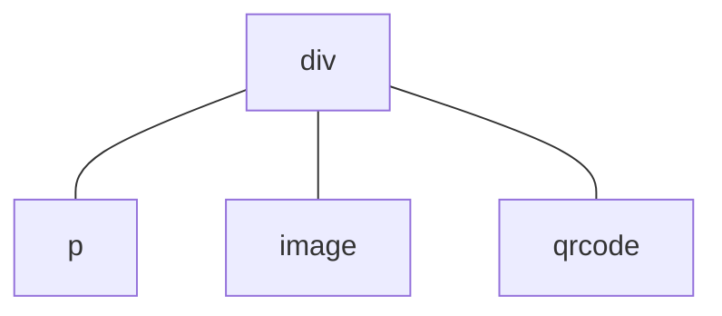

# Context File: 01_glyphix_framework_core_RU.md
Ограничения среды: MCU (No DOM), RTOS Zephyr, аппаратная платформа ATS3085S.

============================================================
FILE_PATH: src/transl/RU/framework/README.md

# 框架

Glyphix 是一种面向 MCU（微控制器）设备的高效、轻量级应用开发框架，旨在为开发者提供接近 Web 开发体验的应用开发方案。通过 HTML 模板、CSS 和 JavaScript 的声明式 UI 框架，开发者可以轻松构建组件和页面，并将应用发布到各种智能设备（如智能手表）上。Glyphix 解决了传统 MCU 系统的 UI 和应用开发的复杂性和稳定性问题，并提供关键的跨设备应用开发和发布能力，从而赋予开发者前所未有的灵活性和易用性。

除了高效的开发框架，Glyphix 特别注重应用的安全性（safety）和稳定性，我们在底层架构中实现了强大的内存管理和安全机制，避免了常见的内存错误和资源浪费，为开发者提供一个更加可靠的运行时环境。这种安全性保障了应用运行的稳定性，也会显著缩短开发过程中的调试周期。

与此同时，Glyphix 在性能方面表现卓越，即使在资源受限的 MCU 环境中，也能以接近原生的流畅性和资源占用运行应用。框架对运行时进行了深度优化，会自动管理资源并高效利用。因此开发者可以专注于实现功能和优化用户体验，而不用担心性能问题。

## 核心特性

### Web 开发体验

- **声明式 UI 范式**：类似于 [Vue Options API](https://vuejs.org/guide/introduction#options-api)，使用 HTML 模板、CSS 和 JavaScript，让开发者可以以接近 Web 开发的方式来编写应用，降低学习成本。
- **组件化开发**：支持模块化、组件化的开发方式，方便代码复用和维护，使应用的开发效率和可读性更高。
- **标准化接口**：支持快应用标准的系统 API，如 [HTTP 网络](/api/system-fetch.md)和[音频流媒体](/api/system-media.md)，可以方便地开发设备无关的互联网应用。

### 跨设备支持

- **多设备兼容**：Glyphix 支持应用在多种智能设备（如智能手表、手环等）上运行，实现真正的跨设备开发和部署，降低了针对不同硬件平台的适配难度。
- **统一运行时环境**：借助 Glyphix 框架能力，可在不同设备上自动管理和执行应用，并确保一致的应用交互体验。
- **快应用标准支持**：开发者可以将应用发布到其他支持快应用的生态系统中，进一步扩大应用的覆盖范围。

### 高效性能

- **原生级性能**：针对 MCU 环境进行深度优化，即使在资源有限的情况下，也能实现接近原生的流畅性和低资源占用。
- **原生响应式框架**：完全使用 C++ 实现的响应式框架和 GUI 系统，避免了 JavaScript 实现的性能开销问题。

### 稳定性

- **内存管理**：底层实现的自动内存管理机制，防止常见的内存错误和手动分配内存存在的浪费和低效。
- **生命周期模型**：应用框架提供完善的资源生命周期模型，确保应用退出后无资源泄漏，降低稳定性风险。

### 调试支持

- **全功能模拟器**：提供与真实设备一致的模拟器环境，包括多设备屏幕尺寸的模拟，无需真机也可以开发应用。
- **热更新应用**：开发者可以在不重启设备的情况下更新和测试应用，并且完全不需要刷入固件，极大地提高了开发效率。

### 发布流程

- **跨设备发布**：支持将应用一次开发、多次发布到不同设备平台。Glyphix 发布工具支持自动为目标设备打包和优化，确保应用在各设备上稳定运行。
- **应用商店分发**：支持应用商店等后装渠道分发应用。用户可以浏览、下载和安装应用，而不需要 OTA 升级固件。
- **独立应用管理**：支持独立的应用安装和卸载，无需统一的固件集成和版本控制。 

## 与其他方案的比较

### 嵌入式 C/C++ GUI 库

Glyphix 不是一个提供 C++ API 的 GUI 库，而是一套标准的应用运行时框架。它不仅提供 UI 渲染能力，还负责管理应用的生命周期、事件处理以及数据绑定，使其具备更完整的应用运行和管理能力。

使用 C/C++ 开发应用逻辑通常需要重新编译和部署整个程序，而 Glyphix 支持应用的热更新，开发者可以在不重启设备的情况下快速发布和测试更新，极大提升了开发和维护效率。

另一方面，传统的 C/C++ 开发方式通常需要针对不同的硬件和操作系统进行定制，而 Glyphix 提供了统一的运行时环境，能够在多种 MCU 设备上实现一致的应用开发体验，减少适配工作。

### 系统级方案

完整的固件系统方案通常涵盖了整个设备操作系统、驱动、通信等所有功能，而 Glyphix 专注于提供一个高效的应用运行时框架。它不需要替代或重构设备的固件系统，而是作为设备上的一个组件，管理和运行应用，确保应用与固件系统的独立性和灵活性。

在完整固件系统中，应用通常与系统深度耦合，开发、更新和维护的成本较高。而 Glyphix 作为独立的应用运行时，允许开发者在标准环境中快速添加、更新和管理应用，降低了复杂度和维护成本。

此外，固件系统往往与特定硬件深度绑定，而 Glyphix 可以在不同系统中运行，提供统一的开发和运行环境，实现真正的跨设备支持。

### 其他应用框架

与 Web、React Native 或 Flutter 等应用运行时框架不同，Glyphix 虽然提供类似 Vue 的开发体验，但专为资源受限的 MCU 环境设计，确保在内存、计算能力有限的情况下依然能够高效运行。它以更低的资源占用提供了接近原生的性能，适应小型嵌入式设备的需求。

其他应用运行时框架通常需要运行在更强大的硬件环境（如手机或电脑）中，启动和运行都需要更多的系统资源。而 Glyphix 的运行时极为轻量，能够在智能手表等小型设备上以极低的功耗和内存占用运行。

## 开发者的收益

Glyphix 是面向 Web 开发者的友好框架，开发者可以使用熟悉的 HTML、CSS 和 JavaScript 来进行开发，无需深入学习 C/C++ 语言和复杂的 MCU 硬件开发知识。这降低了 MCU 应用开发的门槛，使得更多 Web 开发者能够快速上手，节省了学习成本和时间。

### 提高开发效率

- **Web 开发体验**：通过类似 Web 的技术栈和热更新支持，开发者可以像开发 Web 应用一样编写 MCU 应用，充分利用现有的技能，极大地提高效率。
- **一次开发，跨设备运行**：Glyphix 提供了强大的跨设备兼容性，只需编写一次代码，系统会根据不同设备的特性自动进行适配和资源优化，无需针对每个设备独立开发。这有效地降低了设备碎片化带来的维护成本和复杂性。
- **深度优化的系统**：开发者无需将大量精力投入到交互流畅性和卡顿问题的优化中，也不需要时刻关注设备死机问题，从而能够专注于功能实现和用户体验。

### 持续迭代

- **应用的长久可用性**：Glyphix 的跨设备特性以及对 MCU 设备的长期支持，确保了应用能够在多代设备上持续运行。即使某款设备退市，开发者也无需担心应用失去运行环境，可以轻松迁移到其他设备，延长应用的生命周期。
- **未来设备的兼容性**：框架将持续迭代更新，保持与新硬件的兼容性，开发者的应用可以自动适应未来的设备，避免因硬件更新而导致的额外维护成本。
- **工具和文档支持**：除了开发工具，文档也将随着框架的更新而持续维护，确保准确性和时效性，使开发者能够始终获取最新的框架特性和最佳实践，助力应用的持续迭代与优化。

============================================================
FILE_PATH: src/transl/RU/framework/component/life-cycle.md

# Жизненный цикл

Компоненты, страницы и приложения имеют свой жизненный цикл. Вы можете вызывать определенный функционал на конкретных этапах жизненного цикла объекта с помощью **функций жизненного цикла**.

## Жизненный цикл компонентов и страниц

Функции жизненного цикла можно вызывать, определяя их в объектах компонентов и страниц. Например:
``` html
<script>
export default {
  onInit() {
    console.log("onInit() called!")
  }
}
</script>
```
Функция жизненного цикла `onInit()` вызывается после инициализации компонента. Функции жизненного цикла не имеют параметров и не используют возвращаемые значения.

### Функции жизненного цикла компонентов

Эти функции жизненного цикла являются общими для компонентов и страниц.

#### `onInit` <decl type="(): Promise<any> | void" method />

На этом этапе компонент уже инициализирован, а данные во view-model подготовлены. Вы можете получить к ним доступ с помощью ключевого слова `this`. Обычно в этой функции жизненного цикла выполняется пользовательская логика инициализации разработчика.

#### `onReady` <decl type="(): Promise<any> | void" method />

К этому моменту компонент полностью отрендерен. Дерево компонентов на данном этапе имеет соответствующее дерево элементов управления (аналогично дереву DOM).

#### `onDestroy` <decl type="(): Promise<any> | void" method />

Компонент готовится к уничтожению. На этом этапе данные во view-model все еще доступны. Обычно пользовательские операции по освобождению ресурсов выполняются в `onDestroy()`.

### Функции жизненного цикла страниц

Эти функции жизненного цикла существуют только на страницах.

#### `onShow` <decl type="(): Promise<any> | void" method />

Вызывается, когда страница собирается отобразиться. При возврате назад с помощью `router.back()` функция `onShow()` вызывается для нижележащей страницы, которая собирается отобразиться; `onShow()` также вызывается перед первым отображением только что созданной страницы.

#### `onHide` <decl type="(): Promise<any> | void" method />

Вызывается, когда страница собирается скрыться. Вызов `router.push()` приводит к скрытию нижележащей страницы, при этом вызывается `onHide()`. Однако страница не скрывается перед своим уничтожением, поэтому `onHide()` в таком случае не вызывается.

При выключении экрана устройства также вызывается `onHide()` для страницы на переднем плане, подробнее см. в разделе [Изменение состояния экрана](#изменение-состояния-экрана).

#### `onBackPress` <decl type="(): boolean" method />

Эта функция жизненного цикла вызывается, когда пользователь делает жест смахивания (свайп) для возврата назад. Разработчики могут обрабатывать логику возврата в этой функции. Если возвращается `true`, это означает, что разработчик обработал операцию возврата и система не будет выполнять действие возврата по умолчанию; если возвращается `false`, это означает, что разработчик не обработал операцию возврата и система выполнит действие по умолчанию (то есть закроет текущую страницу и вернется на предыдущую).

::: warning
Эта функция жизненного цикла отключает интерактивный возврат смахиванием (то есть жест свайпа вслед за пальцем). Как правило, **не рекомендуется** использовать эту функцию жизненного цикла, а также не следует определять обычный метод с именем `onBackPress`. Если вы хотите предотвратить поведение возврата по умолчанию, обратитесь к разделу [Обработка событий страницы по умолчанию](/framework/generic/properties.md#обрабатывать-события-страницы-по-умолчанию), так как это позволяет сохранить интерактивные анимации.
:::

#### `onRefresh` <decl type="(): Promise<any> | void" version="0.8" method />

Эта функция жизненного цикла вызывается, когда страница открывается в режиме `singleTask` и происходит возврат к уже существующей странице, подробнее см. [`launchMode`](../application/manifest.md#launchmode). В этой функции можно обновить данные страницы.

## Жизненный цикл приложения

### Функции жизненного цикла приложения

#### `onCreate` <decl type="(): Promise<any> | void" method />

Эта функция жизненного цикла вызывается при загрузке приложения.

#### `onDestroy` <decl type="(): Promise<any> | void" method />

Эта функция жизненного цикла вызывается, когда приложение собирается уничтожиться.

#### `onShow` <decl type="(): Promise<any> | void" method />

Эта функция жизненного цикла вызывается, когда приложение переключается из фонового режима на передний план. Функция жизненного цикла `onShow()` приложения всегда вызывается после `onShow()` страницы. При повторном включении экрана устройства также вызывается `onShow()` приложения на переднем плане, подробнее см. в разделе [Изменение состояния экрана](#изменение-состояния-экрана).

#### `onHide` <decl type="(): Promise<any> | void" method />

Эта функция жизненного цикла вызывается перед тем, как приложение скрывается с переднего плана в фоновый режим.

Если вы не хотите, чтобы приложение оставалось активным в фоновом режиме, вы можете вызвать [`launch.exit()`](/api/system-launch.md#exit) внутри `onHide()`, чтобы завершить работу самого приложения. Например:
```js
// в файле src/app.js
import launch from '@system.launch'

export default {
  onHide() {
    launch.exit()
  },
}
```

Функция жизненного цикла `onHide()` приложения всегда вызывается после `onHide()` страницы. При выключении экрана устройства также вызывается `onHide()` приложения на переднем плане, подробнее см. в разделе [Изменение состояния экрана](#изменение-состояния-экрана).

#### `onRoute` <decl type="(page: string, query: {[key: string]: string}): Promise<any> | void" method />

Функция жизненного цикла `onRoute` вызывается при запуске приложения через URI глубокой ссылки (deeplink). Параметры `page` и `query` представляют собой декодированные поля URI. Например:
``` js
// файл: app.ux
export default {
  // Предположим, запуск происходит через app://example.app/page/to/deeplink?key=value&query=result
  onRoute(page, query) {
    console.log(page)  // Выводит строку '/page/to/deeplink'
    console.log(query) // Выводит объект {deeplink: 'key', query: 'result'}
  }
}
```

`onRoute()` вызывается после `onCreate()` и перед `onShow()`. Разработчики могут выполнять инициализацию в `onRoute()` на основе параметров, указанных в deeplink (например, переходить на определенную страницу).

#### `onLocaleChanged` <decl type="(locale: {language: string}): void" method />

Эта функция жизненного цикла вызывается при изменении языкового стандарта (локали) приложения. Параметр `locale` представляет собой объект, содержащий поле `language`, которое указывает текущий языковой стандарт (языковой тег), например `'en-US'`, `zh-CN` и т. д.

## Асинхронные функции жизненного цикла <experimental/>

Функции жизненного цикла компонентов, страниц или приложений могут быть асинхронными, то есть являться функциями `async` или возвращать объект `Promise`. Например:
``` js
import fs from "@system.file"

export default {
  async onInit() {
    // Ожидание завершения асинхронного чтения файла перед продолжением выполнения.
    let text = await fs.readText({ uri: "internal://files/test.txt" })
    console.log(text)
  }
}
```
Предположим, что это функция жизненного цикла `onInit()` некоторого компонента — в этом случае рендеринг компонента продолжится только после завершения асинхронного чтения файла. Во время выполнения асинхронной функции жизненного цикла действуют следующие ограничения:
- Рендеринг компонента не будет выполняться повторно; любые операции с реактивными свойствами в этот период не приведут к обновлению интерфейса;
- Пользовательский ввод временно блокируется: касания и нажатия клавиш не обрабатываются (в противном случае многократные нажатия пользователя привели бы к повторной обработке).

Основная роль асинхронных функций жизненного цикла заключается в ожидании асинхронного ввода-вывода (IO) и операций с ресурсами, чтобы избежать преждевременного отображения недозагруженного интерфейса. В частности, при открытии новой страницы система дождется завершения выполнения всех функций жизненного цикла `onInit()`, `onReady()` и `onShow()`, и только после этого начнет отображение страницы или воспроизведение анимации перехода.

::: warning
В настоящее время асинхронные функции жизненного цикла являются экспериментальными и могут вызывать различные проблемы, включая сбои. Закрытие рендерируемой страницы во время выполнения асинхронной функции жизненного цикла приведет к сбою.

Прошивки большинства устройств не поддерживают асинхронные функции жизненного цикла, и их поведение может отличаться от ожидаемого. Пожалуйста, используйте асинхронные функции жизненного цикла с осторожностью.
:::

## Изменение состояния экрана

Изменение состояния экрана устройства влияет на вызов функций жизненного цикла приложения и страниц. Когда экран устройства выключается, вызываются функции жизненного цикла `onHide()` приложения и страниц, находящихся на переднем плане; когда экран снова включается, вызываются функции жизненного цикла `onShow()` переднего плана. Разработчики могут использовать эти функции жизненного цикла для приостановки или возобновления сетевых запросов в целях снижения энергопотребления.

::: tip
Некоторые устройства после выключения экрана переводят приложение в фоновый режим и через некоторое время завершают (убивают) его процесс. Для приложений, которым требуется непрерывная работа в фоновом режиме, необходимо учитывать методы поддержания активности в [фоновом режиме](../application/README.md#后台管理).
:::

============================================================
FILE_PATH: src/transl/RU/framework/component/component-apis.md

# Встроенные интерфейсы компонентов

Фреймворк Glyphix предоставляет для компонентов ряд встроенных свойств, которые доступны через формат `this.$xxx`. Эти встроенные свойства предоставляют компонентам функциональные возможности, выходящие за рамки реактивного фреймворка.

Все встроенные свойства доступны только для чтения.

## Свойства

### `$app` <decl type="Applet" get />

С помощью свойства `$app` можно получить доступ к объекту приложения, экспортированному из `app.js`.

### `$page` <decl type="Component" get />

С помощью свойства `$page` можно получить доступ к объекту компонента страницы, которой принадлежит данный компонент. Для компонентов страниц значение `this.$page` совпадает с `this`.

### `$valid` <decl type="boolean" get />

Определяет, действителен ли объект компонента. Значение `false` означает, что компонент уже был уничтожен.

::: tip
Для уничтоженных компонентов любые операции, кроме обращения к свойству `$valid`, являются незаконными.
:::

#### Уничтоженные компоненты

Жизненный цикл компонентов управляется фреймворком рендеринга, и написанный по всем правилам код обычно не обращается к уничтоженным компонентам. Однако если забыть отменить таймер или подписку при уничтожении компонента, например:

``` js
setInterval(() => {
  this.secondCounter += 1
}, 1000)
```

То при уничтожении объекта компонента вы можете столкнуться со следующей ошибкой:

```
the component object has been destroyed
  stack backtrace:
    at <anonymous> (pkg://com.example.app/main/index.js:50)
TypeError: proxy: cannot set property
  stack backtrace:
    at <anonymous> (pkg://com.example.app/main/index.js:52)
```

Если действительно сложно удалить таймер или отменить подписку в момент уничтожения компонента, вы можете использовать свойство `$valid` для безопасной проверки того, был ли компонент уничтожен. Следующий пример позволяет подавить описанную выше ошибку времени выполнения:

``` js
let timer = setInterval(() => {
  if (this.$valid) {
    this.secondCounter += 1
  } else {
    clearTimeout(timer) // Удаление таймера после уничтожения компонента
  }
})
```
Подобные сценарии (например, повторяющиеся таймеры, функции прослушивания событий) обычно имеют фиксированную структуру кода:
1. Перед обращением к свойствам компонента используется `this.$valid` для проверки валидности компонента;
2. В валидной ветке выполняются обычные операции с доступными свойствами компонента;
3. В невалидной ветке очищается таймер или отменяется подписка, а также **немедленно возвращается управление (return)**, чтобы гарантировать отсутствие дальнейших обращений к свойствам компонента.

::: warning
При использовании свойства `$valid` для проверки уничтожения компонента следует уделять особое внимание тому, что замыкания функций прослушивания могут привести к утечке памяти. Неправильная отмена подписки на события или таймеров может привести к тому, что замыкание продолжит ссылаться на систему после уничтожения компонента, из-за чего оно не сможет быть собрано сборщиком мусора.
:::

#### Риск утечки памяти

В JavaScript под замыканием понимается связь между функцией и переменными ее внешней области видимости. Когда функция создается, она захватывает переменные во внешней области видимости и сохраняет ссылки на эти переменные, даже если внешняя область видимости больше не выполняется. Это означает, что переменные, на которые ссылаются внутри замыкания, продолжают существовать в памяти до тех пор, пока само замыкание не будет собрано сборщиком мусора.

В фреймворке компонентов при регистрации прослушивателей событий или запуске таймеров обычно передается функция обратного вызова (callback), которая может захватывать определенные свойства или контекст компонента (например, `this`).

Хотя сам объект компонента корректно уничтожается фреймворком и освобождает память, эти функции-замыкания не очищаются. Если прослушиватель событий или callback таймера не удаляются явно, такие замыкания могут продолжать существовать и накапливаться со временем, что приводит к утечке памяти, особенно в долго работающих приложениях. Такую утечку бывает трудно обнаружить.

В следующем примере демонстрируется возможная утечка памяти:
``` js
let timer = setInterval(() => {
  if (this.$valid) {
    this.secondCounter += 1;
  }
}, 1000)
```
Хотя проверка `if (this.$valid)` внутри функции обратного вызова определяет, остается ли компонент действенным, и тем самым предотвращает выброс ошибки после уничтожения компонента, такой подход не решает проблему утечки памяти. Причина в том, что `$valid` лишь проверяет валидность, и проверка этого свойства позволяет избежать обращений к уже уничтоженному объекту компонента. Но проблема заключается в том, что из-за незакрытого таймера на само замыкание функции обратного вызова по-прежнему ссылаются, и это замыкание не может быть собрано сборщиком мусора.

::: tip
Во избежание подобных скрытых утечек памяти следует активно отменять таймеры или удалять прослушиватели событий при [уничтожении](./life-cycle.md#ondestroy) компонента, а не полагаться исключительно на проверку `$valid`. Хотя `$valid` предотвращает некорректные действия после уничтожения компонента, он не очищает замыкание самой функции обратного вызова.

После выхода из приложения вся память JavaScript освобождается, поэтому такие утечки памяти не накапливаются бесконечно.
:::

## Методы

### `$component` <decl type="(name: string, url: string): void" method />

Динамический импорт компонента (тег `<import>` позволяет импортировать компоненты только статически), например:
``` js
this.$component("Name", "url")
```
Строка `"Name"` — это имя импортируемого компонента, которое должно быть записано в формате UpperCamelCase; строка `"url"` — это URI импортируемого компонента.

### `$element` <decl type="(id: string): Element | undefined" method />

Возвращает [нативный дочерний компонент](native-component.md#原生组件对象) с указанным ID внутри текущего компонента. Если такой дочерний компонент не существует, возвращается `undefined`. Метод `$element()` обходит все дочерние узлы компонента, поэтому могут быть найдены также экземпляры компонентов из других UX-файлов.

Метод `$element()` производит поиск ID по всему дереву дочерних компонентов после рендеринга и не ограничивается дочерними компонентами текущего [шаблона компонента](template.md). Иногда нужно быть особенно осторожным с этой особенностью. Например, для следующего шаблона:
``` html
<scroll>
  <MyComponent />
  <div id="panel">...</div>
</scroll>
```
Если в пользовательском компоненте `MyComponent` также присутствует элемент с `id="panel"`, то использование `this.$element('panel')` найдет дочерний элемент внутри `MyComponent`, а не элемент `div` из данного примера.

::: tip
Метод `$element()` не может применяться к пользовательским компонентам, даже если для пользовательского компонента задан атрибут `id`. Поскольку `$element()` обращается к дереву компонентов после рендеринга, его необходимо использовать в функции жизненного цикла [`onReady()`](life-cycle.md#onready) или после нее, но его нельзя использовать в [`onInit()`](life-cycle.md#oninit).
:::

Обратитесь к [этому документу](README.md#组件对象和方法), чтобы узнать, как работать с объектом компонента, возвращаемым методом `$element()`.

### `$emit` <decl type="(event: string, value: any): void" method />

Подробности см. в разделе [Взаимодействие между компонентами](communicate).

============================================================
FILE_PATH: src/transl/RU/framework/component/javascript.md

# JavaScript Скрипты

JavaScript — это язык сценариев для разработки приложений Glyphix. Разработчики могут размещать код JavaScript внутри тегов `<script>` в UX-файлах или ссылаться непосредственно на файлы скриптов `*.js`.

## Поддержка синтаксиса

Поддерживается синтаксис ES6.

## Импорт модулей

Другие JS-файлы можно подключать в код с помощью импорта модулей. Как правило, модули, определенные разработчиком, импортируются по пути. Существует два способа импорта:
``` js
import utils from '../Common/utils.js' // Использование ключевого слова import
const utils = require('../Common/utils.js') // Использование функции require
```
Правила путей для модулей описаны в разделе [Пути и URI](../application/resource). Кроме того, в путях модулей можно опускать расширение файла `.js`, поэтому приведенные выше инструкции импорта можно записать следующим образом:
``` js
import utils from '../Common/utils' // Использование ключевого слова import
const utils = require('../Common/utils') // Использование функции require
```

Для импорта встроенных системных модулей используются их имена. Все системные модули начинаются с символа `@`:
``` js
import router from '@system.router' // Использование ключевого слова import
const router = require('@system.router') // Использование функции require
```

::: warning
Разработчикам не следует называть свои модули именами, начинающимися с символа `@`, так как эти имена зарезервированы для системных модулей.
:::

# Экспорт модулей

Для экспорта модулей используется синтаксис `export` из ES6, например:
``` js
// Экспорт значения default
export default {
  method() {
    // ...
  }
  props: {
    // ...
  }
}

// Экспорт именованных значений
export function process(args) {
  // ...
}
```

============================================================
FILE_PATH: src/transl/RU/framework/component/prop-modifier.md

# Модификаторы свойств

Обычные операции со свойствами позволяют устанавливать их значения и отслеживать их изменения. Однако в некоторых сценариях возникают общие требования к операциям со свойствами. Например, требуется, чтобы изменение определенного свойства компонента не происходивало мгновенно, а сменялось с помощью плавной анимации. Прямым решением было бы написание логического кода для реализации эффекта перехода, но на практике такая логика универсальна для любого свойства.

Чтобы упростить или переиспользовать код для некоторых общих операций со свойствами, Glyphix содержит несколько встроенных модификаторов свойств. Модификаторы — это суффиксы свойств, обозначающиеся через `.`, например:

``` html
<progress :value="progress" value.transition="{curve: 'ease'}"/>
```

Пара ключ-значение модификатора свойства `value.transition="{curve: 'ease'}"` и пара ключ-значение свойства `value="{{progress}}"`, указанные в XML-атрибутах компонента, независимы друг от друга, и им могут требоваться совершенно разные параметры.

В этом документе описываются функции различных модификаторов свойств.

## Модификатор `transition`

Этот модификатор перехватывает операцию присваивания значения свойству, превращая процесс прямого присваивания в плавное изменение значения в соответствии с заданным анимационным переходом, указанным в модификаторе `transition`. Например:

``` html
<!-- Модификатор transition определяет эффект перехода для свойства value -->
<progress :max="1000" :value="progress" value.transition="{curve: 'ease'}"/>
<!-- Без эффекта перехода -->
<progress :max="1000" :value="progress" />
```


<glyphix id="prop-modifier-transition" height="68" width="480" inline>

``` html
<div>
  <progress :max="1000" :value="progress" value.transition="{curve: 'ease'}"/>
  <progress :max="1000" :value="progress" />
</div>
```

``` css
div > * {
  margin: 8px;
  height: 0.75rem;
}
```

``` js
export default {
  data: {
    progress: 500
  },
  onInit() {
    setInterval(() => this.progress = parseInt(Math.random() * 1000), 3000)
  }
}
```

</glyphix>

Поскольку для компонента [`progress`](/components/progress.md) определен модификатор `value.transition`, при каждом изменении `this.progress` отображаемое значение компонента `progress` не переключается мгновенно на новое, а изменяется плавно с помощью анимации. Этот эффект достигается без написания какой-либо логики анимации.

::: tip
В примере свойство `value` компонента `progress` является целым числом. Поскольку диапазон по умолчанию $[0, 100]$ в анимации перехода легко создает ощущение дискретности (ступенчатости), в примере используется `:max="1000"` для увеличения диапазона возможных значений `value`, что делает анимацию более плавной.
:::

### Вычисление интерполяции

В настоящее время модификатор `transition` поддерживают только некоторые свойства нативных компонентов. Поддерживаемые свойства должны иметь тип значения, допускающий интерполяцию. Говоря конкретно: для всех значений $a$ и $b$ типа свойства и прогресса $p \in [0,1]$, операция $(1-p)*a+p*b$ должна быть валидной.

Тип JavaScript `number` поддерживает интерполяцию. Кроме того, интерполяцию поддерживают трансформации и значения цветов.

#### Трансформации

Трансформации обычно задаются с помощью строк, например `scale(2) rotate(30deg)`. Сама по себе строка не допускает интерполяцию, но когда она используется в качестве свойства трансформации — допускает (поскольку эти строки анализируются как последовательность операций трансформации, которые поддерживают интерполяцию). Как правило, интерполяция выполняется для каждой операции трансформации по отдельности. Например, в процессе интерполяции между `scale(2) rotate(30deg)` и `scale(1) rotate(90deg)` каждый кадр трансформации содержит два шага: масштабирование и вращение, где коэффициент масштабирования переходит от $2$ к $1$, а угол поворота — от $30\deg$ к $90\deg$.

#### Цвета

Цвета обычно обозначаются строковым кодом, например `#ff0000`. Интерполяция цветов вычисляется покомпонентно для красного, зеленого, синего и альфа-канала (прозрачности).

### Объект `Transition`

Типом значения модификатора `transition` является объект `Transition`:
``` ts
interface Transition {
  curve?: string,
  duration?: number
}
```

#### `curve` <decl type="?: string"/>

Задает [функцию плавности](../render/animation.md#缓动曲线) анимации перехода. По умолчанию используется `'ease'`.

#### `duration` <decl type="?: number"/>

Длительность анимации в секундах. По умолчанию равна `1`.

============================================================
FILE_PATH: src/transl/RU/framework/component/reuse.md

# Повторное использование компонентов

Повторное использование компонентов на уровне приложения реализуется главным образом с помощью пользовательских компонентов.

## Дочерние компоненты

Предположим, что структура внутри тега `<template>` в некотором [UX-файле](/framework/component/README.md#ux-文件) описывает организацию интерфейса, например:
``` html
<template>
  <div>
    <p>text</p>
    <image src="path/to/image.png" />
    <qrcode value="hello world!" />
  </div>
</template>
```
Во время выполнения этому соответствует следующая структура дерева компонентов:

Это дерево компонентов имеет один родительский узел `div` и $3$ дочерних узла: `p`, `image` и `qrcode`. Компонент `div` является самым внешним компонентом внутри тега `<template>`, и такие компоненты мы называем **корневыми компонентами**. Корневые компоненты иногда не являются единственными, например:
``` html
<template>
  <p>text</p>
  <image src="path/to/image.png" />
  <qrcode value="hello world!" />
</template>
```
Здесь содержится 3 корневых компонента. Кроме того, использование [директивы `for`](/framework/commands/for.md) также может привести к созданию нескольких экземпляров корневых компонентов, например:
``` html
<template>
  <p for="x in ['one', 'two', 'three']">
    label: {{x}}
  </p>
</template>
```
будет отрендерено как $3$ экземпляра компонента `p`.

============================================================
FILE_PATH: src/transl/RU/framework/component/native-component.md

# Нативные компоненты

Нативные компоненты — это компоненты, реализованные на C++. Основная цель их проектирования заключается в реализации определенных элементов интерфейса, таких как кнопки или эффекты списков, без размещения бизнес-логики. В отличие от веб-технологий, нативные компоненты сами по себе не предоставляют DOM-интерфейс, а предлагают только реактивный интерфейс компонентов.

Нативные компоненты в Glyphix предоставляют множество конфигурационных интерфейсов, позволяющих добиваться богатых визуальных эффектов. Кроме того, встроенные компоненты обладают оптимизированными функциями, разработанными специально для встраиваемых платформ.

В этой документации термин **нативные компоненты** используется для обозначения компонентов, реализованных на C++; термин **встроенные компоненты** обозначает пакеты компонентов, предоставляемые WearOS, однако такие компоненты не обязательно реализованы на C++.

::: tip
В описаниях данной документации проводится различие между нативными и встроенными компонентами, однако читателям, как правило, не нужно вдаваться в различия между ними.
:::

## Механизмы интерфейса

Большинство механизмов, связанных с интерфейсом, доступны только для нативных компонентов. К таким механизмам относятся:
- Таблицы стилей CSS, механизмы компоновки (layout) и т.д.
- Жесты и события касания
- Механизмы рендеринга и отрисовки

Посредством передачи параметров и событий между компонентами можно имитировать интерфейсы некоторых механизмов нативных компонентов в пользовательских компонентах, но по своей сути эти возможности все равно реализуются нативными компонентами.

## Рендеринг интерфейса

## Снимок компонента (Snapshot)

Снимок — это технология оптимизации частоты кадров (FPS). Включение снимков для сложных компонентов позволяет ускорить отрисовку и тем самым повысить частота кадров. По своей сути снимок представляет собой «скриншот» компонента, ускорение достигается за счет прямой отрисовки этих скриншотов. Поэтому снимки являются эффективной технологией для компонентов со сложным содержимым, которое обновляется нечасто. Для других сценариев, где обновления происходят часто, но допускается отсутствие перерисовки, существуют соответствующие API для отключения обновления снимков.

## Объект нативного компонента

С помощью метода [`$element()`](component-apis#element) компонента можно получить объект нативного компонента, который позволяет обращаться к его свойствам или вызывать его методы, например:

``` js
let el = this.$element('scroll-id')
console.log(`width: ${el.width}`) // Получение ширины компонента через объект нативного компонента
el.scrollTo({ top: 100 }) // Прокрутка списка с помощью API
```

============================================================
FILE_PATH: src/transl/RU/framework/component/component-object.md

# Компонентный объект

Тег `<script>` внутри UX-файла определяет и экспортирует компонентный объект. Типичное определение компонентного объекта выглядит следующим образом:
``` js
export default {
  data: {
    text: "Hello world"
  },
  onInit() {
    console.log("component onInit()")
  },
  clicked(event) {
    console.log(`clicked: ${event}`)
  }
}
```
Фреймворк компонентов позволяет разработчикам заполнять определенные свойства компонентного объекта для реализации функционала. В данном документе будут рассмотрены эти свойства.

## Реактивное программирование

**Реактивное программирование** — это парадигма программирования, используемая для динамического обновления интерфейса и состояния данных. С помощью **реактивных свойств** разработчики могут автоматически отслеживать изменения данных и обновлять интерфейс без необходимости вручную инициировать и управлять этими обновлениями. Это позволяет поддерживать постоянную синхронизацию данных и интерфейса, обеспечивая простой и эффективный опыт UI-программирования.

### Реактивные свойства

Свойства, определенные в объектах [`data`](#свойство-data) и [`computed`](#свойство-computed) компонентного объекта, являются **реактивными свойствами** компонента, также известными как свойства view-model:
- **Свойство `data`**: напрямую отражает состояние компонента. Например, значения температуры, отображаемый текст или состояние кнопок могут быть определены в `data`. Когда значения этих свойств изменяются, фреймворк автоматически синхронизирует их с представлением (view).
- **Свойство `computed`**: используется для определения производных свойств, вычисляемых на основе `data` или других свойств `computed`. Вычисляемые свойства автоматически обновляются при изменении зависимых данных, что делает выражение сложной логики более интуитивным и лаконичным.

Подводя итог, можно сказать, что когда значение реактивного свойства компонента изменяется, содержимое, зависящее от этих свойств, автоматически обновляется и перерисовывается, обеспечивая соответствие отображаемого контента данным.

### Автоматическое связывание данных

**Автоматическое связывание данных** — это ключевая концепция реактивного программирования, которая позволяет изменениям данных напрямую отражаться в интерфейсе без необходимости ручной обработки со стороны разработчика.

Поскольку каждое реактивное свойство автоматически связано с соответствующей частью интерфейса, при изменении значения свойства интерфейс обновляется автоматически, без вызова функций обновления свойств для конкретных элементов.

Например, определим реактивное свойство с именем `counter`:
``` js
export default {
  data: { // Определяем реактивное свойство counter в объекте data
    counter: 0 // Начальное значение равно 0
  }
}
```

Каждый раз, когда значение `counter` изменяется, интерфейс, ссылающийся на это свойство, также обновляется автоматически. Следующий код [шаблона](template) демонстрирует этот механизм:
``` html
<p on:click="counter += 1">
  counter: {{ counter }}
</p>
```
Этот пример демонстрирует счетчик, значение которого увеличивается на 1 при клике на тег `<p>`. Вы можете нажать на интерактивную демо-версию ниже, чтобы протестировать его:

<glyphix id="component-object-reactive" height="50" width="200" inline>

``` html
<p on:click="counter += 1">
  counter: {{ counter }}
</p>
```

``` js
export default {
  data: {
    counter: 0
  }
}
```

``` css
p {
  border: 2px solid gray;
  border-radius: 16px;
  padding: 2px 8px;
  text-align: center;
  height: 100%;
}
```

</glyphix>

Выражение `{{ counter }}` внутри тега `<p>` является [выражением интерполяции](template.md#интерполяция-выражений) в шаблоне, и его зависимость от `counter` связывается автоматически. А [`on:click` слушатель](/framework/commands/on.md) в теге `<p>` изменяет значение свойства `counter` при клике. Как видно, благодаря автоматическому связыванию данных устраняются операции ручного обновления **данных** и **интерфейса**, характерные для традиционной разработки GUI, что делает логику интерфейса более лаконичной и понятной.

## Свойство `data`

Свойство `data` используется для объявления реактивных свойств данных компонента. Это свойство представляет собой объект, например:
``` js
export default {
  data: {
    text: "Hello world"
  }
}
```
Значение свойства `data` должно подлежать сериализации через `JSON.stringify()`, а именно — удовлетворять следующим условиям:
- Значения простых типов: `number`, `string`, `boolean`, `null` или `undefined`.
- В объектах `Object` и массивах `Array` с рекурсивной структурой значения самых глубоких элементов должны принадлежать к одному из типов, указанных выше.

Это означает, что свойства объекта `data` в исходном коде не могут содержать функции или другие специальные типы значений, включая такие объекты, как `Date`.

::: note
Объект `data` не поддерживает типы данных, не совместимые с JSON, такие как `Date`, объекты `Proxy` и т. д. Это известное ограничение. Если вам нужно использовать данные таких типов, вы можете определить их как [пользовательские свойства](#пользовательские-свойства), в противном случае это приведет к непредвиденному поведению.
:::

Свойства `data` являются свойствами view-model компонента, поэтому данные в них могут использоваться для реактивного программирования. Внутри компонентного объекта свойства из объекта `data` можно напрямую вызывать через `this.prop`. Следовательно, в следующем компонентном объекте:
``` js
export default {
  data: {
    onInit: true
  },
  onInit() {}
}
```
Код `this.onInit` обратится к свойству `onInit` внутри объекта `data`, а не к функции жизненного цикла `onInit`.

::: tip
Для оптимизации производительности определяйте в объекте `data` только те данные, которые используются для отрисовки UI и управления состоянием. Данные, не требующие реактивности, можно определить как [пользовательские свойства](#пользовательские-свойства). Например: идентификаторы таймеров (возвращаемое значение `setTimeout()`), дескрипторы [аудиоплеера](/api/system-media.md#createaudioplayer), объекты соединения WebSocket и т. д. Подобным объектам обычно не нужно быть реактивными свойствами, и они не будут работать корректно.
:::

## Свойство `computed`

Свойство `computed` компонентного объекта объявляет вычисляемые свойства в компоненте. По сравнению с реактивными свойствами в `data`, вычисляемые свойства позволяют реализовывать свойства, значения которых требуют определенных вычислений. Например:
``` html
<text> reversed message: {{ reversedMessage }}
```

``` js
export default {
  data: {
    message: "hello"
  },
  computed: {
    reversedMessage() { // Это геттер-метод для вычисляемого свойства reversedMessage
      return this.message.split('').reverse().join('')
    }
  }
}
```
Здесь объявлено вычисляемое свойство `reversedMessage`, которое реализует функцию-геттер для получения значения свойства. Значение этого вычисляемого свойства можно получить, просто используя `this.reversedMessage` (в шаблоне префикс `this.` можно опустить).

Вычисляемые свойства также являются свойствами view-model компонента. Значения вычисляемых свойств кэшируются, поэтому многократное получение значения вычисляемого свойства не приводит к повторным вычислениям. С другой стороны, вычисляемые свойства автоматически обновляются после изменения свойств view-model, от которых они зависят. В этом примере значение вычисляемого свойства рассчитывается на основе свойства `message`, поэтому при изменении свойства `message` значение свойства `reversedMessage` обновится автоматически.

### Метод setter для вычисляемого свойства

По умолчанию вычисляемые свойства имеют только метод getter, но вы также можете предоставить для вычисляемого свойства метод setter:
``` js
export default {
  data: {
    message: "hello"
  },
  computed: {
    reversedMessage: {
      get() { // Это геттер-метод для вычисляемого свойства reversedMessage
        return this.message.split('').reverse().join('')
      },
      set(value) {
        this.message = value.split('').reverse().join('')
      }
    }
  }
}
```
В этом случае значение вычисляемого свойства `reversedMessage` представляет собой не функцию, а объект, который имеет два метода: геттер `get` и сеттер `set`. Аргументом метода `set` является новое значение, которое необходимо установить для вычисляемого свойства.

## Свойство `watch`

Метод объекта `watch` используется для прослушивания изменений свойств view-model, например:
``` js
export default {
  data: {
    value: 0
  },
  watch: {
    value(newValue, oldValue) {
      console.log(`value change: ${oldValue} -> ${newValue}`)
    }
  }
}
```
Методы объекта `watch` прослушивают изменения свойства view-model с тем же именем, поэтому `watch.value()` прослушивает изменения свойства `value`. Изменения вычисляемых свойств также могут отслеживаться с помощью `watch`.

## Функции жизненного цикла

Подробности см. в документации по [жизненному циклу](life-cycle.md).

## Пользовательские свойства

Пользователи также могут определять пользовательские свойства в компонентном объекте. Эти свойства не находятся во view-model (то есть не входят в объект `data` или `computed`), а следовательно, не являются реактивными. Разработчики могут определять методы как пользовательские свойства, а также использовать пользовательские свойства для хранения данных, не требующих реактивности. Например:
``` html
<p on:click="onClick()">{{ text }}</p>
```

``` js
export default {
  data: {
    text: "some text"
  },
  // Пользовательские свойства не находятся в объекте data или computed, а определяются прямо внутри компонентного объекта
  timer: null, // Хранит дескриптор таймера, можно не определять заранее, это свойство создастся автоматически при присваивании значения через this.timer
  onInit() {
    // Новое свойство, которому присваивается значение через this, является пользовательским свойством
    this.timer = setInterval(() => this.text += "?", 1000)
  },
  onDestroy() {
    clearInterval(this.timer)
  },
  onClick() {
    this.text += "." // Манипуляции со свойством view-model внутри пользовательского метода
  }
}
```

Свойство `text` в примере является реактивным, в то время как `timer` — нереактивным пользовательским свойством. Свойство `timer` используется для хранения дескриптора таймера, это значение не связано с графическим представлением и поэтому не должно быть свойством view-model. Исходя из стандартов кодирования, пользовательские свойства также можно заранее определить в компонентном объекте:
``` js
export default {
  data: {
    text: "some text"
  },
  timer: null, // Пользовательское свойство является прямым свойством компонентного объекта
  // ...
}
```
Как показано в примере, пользовательские свойства достаточно определить непосредственно внутри компонентного объекта. Пользовательские свойства каждого компонента представляют собой отдельные экземпляры и не разделяются между ними.

::: warning
Пользовательские свойства, объект `data`, объект `computed`, функции жизненного цикла и другие свойства не должны иметь одинаковых имен, иначе некоторые из них будут перезаписаны и станут недоступны.
:::

### Методы

Как пользовательские свойства, так и методы являются прямыми свойствами компонентного объекта, и по сути они эквивалентны. Когда вы присваиваете функцию свойству компонентного объекта, это свойство превращается в метод. В этом разделе на двух примерах показана такая эквивалентность.

Способ 1: Прямое определение метода — это наиболее распространенный и рекомендуемый вариант написания.
``` js
export default {
  data: {
    count: 0
  },
  increment() {
    this.count++
  }
}
```

Способ 2: Определение свойства и присваивание ему функции.
``` js
export default {
  data: {
    count: 0
  },
  increment: function() {
    this.count++
  }
}
```
Оба варианта написания полностью функционально эквивалентны, и оба могут вызываться через `this.increment()`. Использование в шаблоне также идентично:
``` html
<button on:click="increment()">Count: {{ count }}</button>
```

::: tip
Рекомендуется использовать Способ 1. Это синтаксис методов объекта, поддерживаемый стандартом ES6+, он более лаконичен и понятен.
:::

### Динамическое присваивание методов

Помимо прямого определения методов в компонентном объекте, вы также можете динамически присваивать методы после инициализации компонента (например, в жизненном цикле `onInit`). Ключевая особенность этого подхода заключается в том, что динамический метод каждого экземпляра компонента является независимым и может захватывать и удерживать различные состояния с помощью замыканий.

Рассмотрим компонент таймера, у которого каждый экземпляр имеет собственный счетчик и может останавливаться независимо. Это типичный сценарий применения динамического присваивания методов:
``` html
<div>
  <text>timeout: {{ counter }}</text>
  <button on:click="stopTimer">Stop</button>
</div>
```

``` js
export default {
  data: {
    counter: 0,
  },
  stopTimer: null, // Необязательно: предварительное определение метода stopTimer
  onInit() {
    const timer = setInterval(() => {
      this.counter++
    }, 1000)
    // Динамическое создание метода stopTimer, захватывающего переменную timer через замыкание
    this.stopTimer = () => {
      clearInterval(timer)
      this.stopTimer = null // Обнуляем метод после остановки
    }
  },
}
```

В следующем примере одновременно создается 4 экземпляра компонента таймера, вы можете попробовать остановить любой из них независимо:

<glyphix id="component-object-dynamic-method" height="200" width="300" inline>
</glyphix>

Реализация такого динамического присваивания методов опирается на следующие ключевые моменты:
- **Захват замыкания (Closure capture)**: константа `timer`, созданная в `onInit`, является локальной переменной, и метод `stopTimer` захватывает эту переменную через замыкание.
- **Независимость экземпляров**: при вызове `onInit` каждым экземпляром компонента создаются собственные `timer` и `stopTimer`, они не мешают друг другу.
- **Изоляция состояний**: нажатие кнопки "Stop" у определенного экземпляра остановит таймер только этого экземпляра, не затрагивая остальные.

Конечно, для данного примера более распространенным подходом является прямое определение метода `stopTimer` в компонентном объекте:
``` js
export default {
  data: {
    counter: 0,
  },
  timer: null,
  onInit() {
    // В этом случае timer нужно сохранить как пользовательское свойство
    this.timer = setInterval(() => {
      this.counter++
    }, 1000)
  },
  stopTimer() {
    // Метод stopTimer обращается к this.timer для остановки таймера
    clearInterval(this.timer)
    this.timer = null // Очищаем ссылку на timer
  }
}
```
Для таймера это обычно более интуитивно понятно, однако в некоторых случаях со сложным контекстом и необходимостью динамической диспетчеризации стратегий вы можете использовать динамическое присваивание методов для реализации более гибкой логики. В следующей таблице показаны различия между динамическими методами и прямым определением методов:

| Характеристика | Прямое определение метода | Динамическое присваивание метода |
|----------------|---------------------------|----------------------------------|
| Совместное использование | Все экземпляры разделяют один объект функции | Каждый экземпляр имеет независимую копию функции |
| Захват замыканием | Не захватывает локальные переменные области видимости | Может захватывать локальные переменные области видимости |
| Использование памяти | Меньше (общий доступ) | Чуть больше (по копии на каждый экземпляр) |
| Сценарии применения | Универсальные операции без сохранения состояния | Операции, требующие захвата локального состояния |

============================================================
FILE_PATH: src/transl/RU/framework/component/template-macro.md

# Шаблонные макросы

Шаблонные макросы — это способ упрощения повторяющегося кода. Они представляют собой корневой элемент `<template>` с атрибутом `macro:` в UX-файле:
``` html
<template macro:scroll>
  <scroll #props media-query="(shape: rect)">
    <slot />
  </scroll>
  <scroll #props deformation="fisheye"
          scroll-snap="center" media-query="(shape: circle)">
    <slot />
  </scroll>
</template>
```
Например, здесь определен макрос с именем `scroll`. Макрос заменяет компонент с тем же именем внутри шаблона `<template>` текущего UX-файла, при этом:
- Все атрибуты компонента с тем же именем заменяют заполнитель `#props` в макросе шаблона;
- Дочерние элементы компонента с тем же именем заменяют узел `<slot />` в макросе шаблона.

Например, следующий код:
``` html
<template>
  <scroll :index="3" on:index="onIndexChange">
    <p for="i in 10">item {{i + 1}}</p>
  </scroll>
</template>
```
будет заменен макросом шаблона `scroll` на следующий вариант:
``` html
<template>
  <scroll :index="3" on:index="onIndexChange" media-query="(shape: rect)">
    <p for="i in 10">item {{i + 1}}</p>
  </scroll>
  <scroll :index="3" on:index="onIndexChange" deformation="fisheye"
          scroll-snap="center" media-query="(shape: circle)">
    <p for="i in 10">item {{i + 1}}</p>
  </scroll>
</template>
```

::: tip
В этом примере макрос называется `scroll`, и его содержимое также содержит тег `scroll`, однако замена макроса происходит только один раз и не повторяется рекурсивно.
:::

## Назначение

Как видно из примера выше, шаблонные макросы могут статический заменять обычные компоненты на другую форму, причем полученный код обычно неудобен для ручного написания и понимания. Например:
``` html
<scroll :index="3" on:index="onIndexChange">
  <p for="i in 10">item {{i + 1}}</p>
</scroll>
```
заменяется на:
``` html
<scroll :index="3" on:index="onIndexChange" media-query="(shape: rect)">
  <p for="i in 10">item {{i + 1}}</p>
</scroll>
<scroll :index="3" on:index="onIndexChange" deformation="fisheye"
        scroll-snap="center" media-query="(shape: circle)">
  <p for="i in 10">item {{i + 1}}</p>
</scroll>
```
Результирующий код фактически статический выбирает различные свойства компонента `scroll` на основе [медиазапросов](/framework/render/media-query.md) для формы экрана. В частности, он добавляет два свойства к компоненту [`scroll`](/components/scroll.md) для экранов круглой формы:
- [`deformation="fisheye"`](/components/scroll.md#deformation): включает эффект «рыбий глаз» для круглых экранов;
- [`scroll-snap="center"`](/components/scroll.md#scrollsnap): выравнивание дочерних элементов `scroll` по центру на круглом экране.

Этот шаблонный макрос добавляет адаптацию под нестандартную форму экрана в исходный код, написанный вручную. Такая модификация не требует изменения исходного кода шаблона, поэтому она является неинтрузивной.

## Использование

В настоящее время нет возможности экспортировать шаблонные макросы для использования в других UX-файлах. Поэтому шаблонные макросы необходимо дублировать в каждом UX-файле, где они требуются, определяя корневой элемент вида:
``` html
<template macro:scroll>
  ...
</template>
```
Узел шаблонного макроса и узел `<template>` могут располагаться в любом порядке, однако не следует определять шаблонные макросы с одинаковыми именами в рамках одного UX-файла.

============================================================
FILE_PATH: src/transl/RU/framework/component/README.md

# Компонентный фреймворк

Компоненты — это технология повторного использования кода для разработки интерфейсов приложений (App) в Glyphix. С помощью механизма, похожего на вложенные HTML-элементы, можно комбинировать несколько компонентов, формируя общий вид и функционал интерфейса. С другой стороны, каждый компонент инкапсулирует определенный контент и логику, что при разумном использовании позволяет снизить сложность кода и затраты на его поддержку.

Компоненты делятся на встроенные [**нативные компоненты**](../render/native-component.md) и **пользовательские компоненты**, создаваемые разработчиком. Нативные компоненты, как правило, представляют собой инкапсуляцию UI-элементов и могут использоваться для отображения определенного UI-контента, компоновки или взаимодействия (например, `text`, `image`, `div`, `list` и т. д.). Пользовательские компоненты ориентированы на реализацию логики и инкапсуляцию функционала, поскольку интерфейсы, реализованные внутри пользовательских компонентов, в конечном итоге поддерживаются нативными компонентами.

## Определение компонента

Каждый пользовательский компонент определяется в отдельном `.ux` файле:

``` html
<template>
  <p>{{text}}</p>
</template>

<style>
  * {
    font-size: 48;
    text-align: center;
  }
</style>

<script>
  export default {
    data: {
      text: "Hello, World!"
    }
  }
</script>
```

Как видно из примера, компонент состоит из стилей, скрипта JavaScript и «шаблона», описывающего интерфейс.

## UX-файлы

UX-файл (UI XML) — это описание компонента в формате XML. Каждый UX-файл определяет один компонент; страница также является разновидностью компонента.

В UX-файлах могут присутствовать следующие корневые узлы:

- Тег **`<import>`**: используется для импорта других компонентов, этот тег можно определять многократно;
- Тег **`<template>`**: определяет содержимое и структуру интерфейса компонента, этот узел должен быть ровно один;
- Макрос-тег **`<template>`**: определяет структуры шаблонов, которые можно использовать повторно. Таких узлов может быть несколько, подробнее см. [Макросы шаблонов](./template-macro.md);
- Тег **`<style>`**: определяет таблицы стилей CSS, этот узел должен быть ровно один;
- Тег **`<script>`**: JavaScript-скрипт для реализации логики компонента, этот узел должен быть ровно один.

Порядок следования вышеуказанных узлов произвольный. При этом узел `<import>` никогда не содержит дочерних элементов. Обратите внимание, что внутри узлов `<style>` и `<script>` синтаксис XML не соблюдается: такие символы, как `>`, `&` и другие, не требуют использования правил экранирования XML, а подчиняются синтаксису CSS и JavaScript (аналогично HTML).

UX-файлы требуют, чтобы все теги были закрытыми. Например, `<div>...</div>` или `<div/>` являются валидными, но одиночные `<div>` или `</div>` вызовут ошибку.

## Компоненты страниц

Компоненты, объявленные в поле `router.pages` файла `manifest.json`, могут напрямую использоваться в качестве страниц.

По сравнению с обычными компонентами, компоненты страниц имеют больше [функций жизненного цикла](life-cycle#组件和页面的生命周期), остальные функции в целом идентичны. Код компонентов, уже используемых для страниц, может напрямую применяться и как обычные компоненты.

## Импорт компонентов

### Пользовательские компоненты

Определенный компонент можно использовать в других компонентах. Чтобы импортировать нужный компонент, пропишите тег `<import>` в UX-файле:
``` xml
<import name="Panel" src="path/to/Panel">
```

Атрибут `src` — это URL-путь к компоненту, где `Panel` — имя файла компонента (без суффикса `.ux`); атрибут `name` — это необязательное имя компонента. Если этот атрибут не задан, в качестве имени компонента будет использоваться имя его файла.

`src` поддерживает относительные пути, абсолютные пути и внешние пути:

- Относительный путь отсчитывается относительно текущего UX-файла.
- Абсолютный путь отсчитывается относительно папки `src` приложения (APP).
- Внешний путь позволяет импортировать ресурсные компоненты за пределами приложения; конкретный путь состоит из значения `package` в файле `appdb.json` целевого приложения ресурсного компонента плюс абсолютный путь.

### Глобальные компоненты

Глобальные компоненты — это ненативные компоненты, определенные во фреймворке. Их можно импортировать в приложение с помощью тега `<import>`, указав только атрибут `name` и опустив атрибут `src`:
``` html
<import name="TopBar" />
```

Внутри приложения можно только импортировать глобальные компоненты, но не регистрировать новые. Разработчики систем могут использовать API [`globalComponent()`](/api/system-internal.md#globalcomponent) для регистрации глобальных компонентов.

## Спецификация документации по свойствам

Заголовки документации по свойствам компонентов имеют следующий вид:

<div class="example-block">
  <h3 style="margin-bottom: 0.5rem">
    <span>
      <code>value</code>
      <decl type="number" get set listen />
    </span>
  </h3>
</div>

Где:
- `value` — имя свойства;
- `number` — тип значения свойства;
- Элементы справа <span style="color:#666">读取 • 设置 • 监听</span> (чтение • запись • прослушивание) обозначают поддерживаемые режимы доступа к свойству.

### Режимы доступа

Свойство может поддерживать следующие режимы доступа:
- **Чтение (读取)**: значение свойства доступно для чтения;
- **Запись (设置)**: значение свойства доступно для записи;
- **Прослушивание (监听)**: свойство доступно для [прослушивания](../commands/on.md), обычно при изменении значения прослушиваемого свойства генерируется соответствующее событие.

В качестве примера рассмотрим свойство [`index`](/components/scroll.md#index) компонента [scroll](/components/scroll.md). Это свойство одновременно поддерживает чтение, запись и прослушивание. Вы можете работать со свойством `index` в синтаксисе шаблонов:
``` html
<scroll id="scroll1" :index="5" on:index="console.log($event)">
  ...
</scroll>
```
Здесь `:index="5"` присваивает `5` свойству `index`, а `on:index="console.log($event)"` прослушивает изменения свойства `index`. Дополнительные сведения см. в разделах [Взаимодействие между компонентами](/framework/component/communicate.md) и [Директива `on`](../commands/on.md).

### Объекты и методы компонентов

Получить доступ к свойствам также можно, обратившись к объекту компонента через метод [`$element()`](component-apis.md#element):
``` js
const el = this.$element('scroll1') // Получение объекта компонента
console.log(el.index) // Чтение свойства index компонента scroll
el.index = 4 // Запись свойства index компонента scroll
```
Если это поддерживается, вы можете **читать** или **записывать** свойства объекта, возвращаемого методом `$element()`. Метод `$element()` не поддерживает привязку функций прослушивания событий к свойствам.

Свойство компонента также может быть **функцией** или **методом**. В этом случае заголовок документации имеет следующий вид:

<div class="example-block">
  <h3 style="margin-bottom: 0.5rem">
    <span>
      <code>method</code>
      <decl type="(x: number, y: number): void" method />
    </span>
  </h3>
</div>

Где:
- `(x: number, y: number): void` — сигнатура функции или метода;
- Элемент справа <span style="color:#666">方法</span> (метод) указывает на то, что данное свойство является методом.

Методы компонентов доступны только через объект компонента. Например, рассмотрим свойство [`setIndex`](/components/scroll.md#setindex) компонента `scroll`:
``` js
const el = this.$element('scroll1') // Получение объекта компонента
el.setIndex(4) // Вызов метода setIndex()
```
Методы не поддерживают режимы доступа чтения, записи и прослушивания, поэтому такие свойства имеют только метку <span style="color:#666">方法</span> (метод).

### Двусторонняя привязка

Когда свойство одновременно поддерживает режимы доступа <span style="color:#666">设置 • 监听</span> (запись • прослушивание), оно становится доступным для [двусторонней привязки](../commands/model.md).

============================================================
FILE_PATH: src/transl/RU/framework/component/template.md

# Синтаксис шаблонов

Шаблоны — это содержимое внутри тега `<template>` в файлах UX. В целом шаблоны используют стандартный синтаксис HTML, однако синтаксис шаблонов также вводит ограничения и новые синтаксические конструкции, отличающиеся от HTML. В этом документе будут рассмотрены эти особенности.

## Теги

В шаблонах поддерживается вложенность тегов, но все теги должны быть закрытыми. Поэтому следующее написание является корректным:
``` html
<div> <p>message</p> </div>
```
Но следующее написание некорректно:
``` html
<div> <p>message</p> <!-- Тег <div> не закрыт -->
```

## Текстовые значения

Текстовые элементы и значения атрибутов в шаблонах являются текстовыми значениями. Например, в
``` html
<com name="value">A message</com>
```
как `A message`, так и `value` являются текстом. Текстовое значение `A message` будет передано в атрибут `text` компонента `com`, поэтому текстовый узел (часть `A message`) фактически является синтаксическим сахаром для атрибута `text`:
``` html
<p>text</p>
```
эквивалентно
``` html
<p text="text"></p>
```
Текстовые значения внутренне представляются в виде строк JavaScript.

### Текстовые дочерние узлы

Текстовые дочерние узлы могут использоваться не только для нативных компонентов, но и для пользовательских компонентов с атрибутом `text`, например:
```html
<p>The text element of P.</p>
<MyCom>The text element of MyCom.</MyCom>
```
Достаточно предоставить [реактивный атрибут](component-object.md#响应式属性) `text` для компонента `MyCom`, чтобы принимать содержимое текстового узла, без необходимости использовать слоты `<slot>` или другие механизмы.

::: warning
Некоторые компоненты не имеют атрибута `text` (например, `div`), и размещение текстового узла в качестве их дочернего элемента не приведет к отображению какого-либо контента! Убедитесь, что текстовые узлы являются дочерними элементами таких нативных компонентов, как `p`, `text` или `span`.
:::

В компоненте также можно использовать несколько текстовых дочерних узлов, например:
```html
<div>
  The switch <switch /> and <checkbox /> checkbox.
</div>
```
В результате в `div` будут смешанно отображаться текст и компонент [`switch`](/components/switch.md):

<glyphix id="component-template-text-1" height="32" inline>

``` html
<div>
  The switch <switch /> and <checkbox /> checkbox.
</div>
```

</glyphix>

Когда текстовые узлы смешиваются с другими узлами, текстовые узлы транслируются в узлы [`span`](/components/span.md), а не передаются в атрибут `text` какого-либо компонента. Поэтому приведенный выше пример эквивалентен следующему коду:
```html
<div>
  <span>The switch&nbsp;</span>
  <switch />
  <span>&nbsp;and&nbsp;</span>
  <checkbox />
  <span>&nbsp;checkbox.</span>
</div>
```
Для таких неявных элементов `span` также можно задавать CSS-стили, но нельзя использовать селекторы классов (поскольку у них нет атрибута `class`).

### Пробельные символы

Все пробельные символы, такие как переносы строк и табуляции в исходном коде текстовых дочерних узлов, обрабатываются как пробелы, а правила обработки пробелов следующие:
- Пробелы в начале первого текстового дочернего узла удаляются.
- Пробелы в конце последнего текстового дочернего узла удаляются.
- Несколько подряд идущих пробелов в других позициях считаются за один пробел.

::: tip
Если имеется только один текстовый узел, он одновременно является и первым, и последним дочерним узлом, поэтому все пробелы до и после него удаляются. Если текстовый узел не содержит никакого контента (включая ситуации, когда после удаления пробелов ничего не осталось), он удаляется.
:::

Поэтому такое написание, как `<p>  spances </p>`, не отобразит никаких пробелов, в то время как
```html
<div>
  The switch <switch /> and <checkbox /> checkbox.
</div>
```
удалит пробелы (и переносы строк) между `<div>` и `The switch`, а также между `checkbox.` и `</div>`. Однако будет сохранен один пробел между `The switch` и `<switch />` и т.д.

Если вы обнаружите, что не можете управлять пробельными символами с помощью указанных выше правил, вам следует подумать об использовании [ссылок на символы HTML](https://developer.mozilla.org/en-US/docs/Glossary/Character_reference).

::: tip
При смешивании [выражений интерполяции](#插值表达式) в текстовых узлах следует помнить, что последние являются выражениями JavaScript, и строки в них должны использовать правила JavaScript для [экранирования символов](https://developer.mozilla.org/en-US/docs/Glossary/Escape_character).
:::

## Атрибуты и интерполяция

### Выражения интерполяции

Вы можете использовать выражение, заключенное в двойные фигурные скобки, внутри текста — это называется выражением **интерполяции**:
``` html
<p>Message: {{ msg }}!</p>
```
При рендеринге выражение внутри двойных фигурок вычисляется и объединяется с текстом до и после него. Если до и после выражения нет текста, получается **несвязанное** выражение интерполяции; в этом случае значение выражения используется напрямую без преобразования в текст.

Выражения интерполяции также можно использовать в значениях атрибутов, например:
``` html
<div visible="{{true}}"></div>
```
Здесь `{{true}}` вычисляется напрямую как логическое значение `true`, а не как строка.

::: tip
Атрибуты вроде `visible` требуют передачи значения логического типа (boolean), поэтому необходимо использовать несвязанный формат вроде `visible="{{ expr }}"`, чтобы избежать превращения выражения интерполяции в текст из-за текста до или после фигурных скобок. Из-за правил преобразования значений в JavaScript, `visible="false"` приведет к тому, что атрибут будет вычислен как `true` (непустая строка преобразуется в логическое `true`). Разумеется, в таких сценариях можно также использовать [неявные значения атрибутов](#隐式属性值).
:::

Если вам нужно передать числовую константу, будут работать оба следующих варианта написания:
``` html
<scroll damping="{{1.5}}"></scroll>
<scroll damping="1.5"></scroll>
```
Потому что строка `"1.5"` может быть автоматически преобразована в число `1.5`. Мы рекомендуем использовать первый вариант, так как он не требует лишних преобразований типов и имеет более четкую семантику.

Типом несвязанного выражения интерполяции в качестве значения атрибута является тип самого выражения интерполяции, например, типом `{{1 + 2}}` является number. Остальные выражения интерполяции являются текстовыми значениями.

### Выражения привязки атрибутов

Если атрибут компонента не является текстовым типом, вы можете использовать несвязанное выражение интерполяции:
``` html
<com items="{{ [1, 2, 3] }}" />
```
Также можно использовать синтаксис выражения привязки атрибута:
``` html
<com :items="[1, 2, 3]" />
```
По сравнению с обычными атрибутами, выражения привязки атрибутов требуют добавления символа `:` перед атрибутом. В этом случае значение атрибута компилируется как выражение, а не как строка. Такой подход избавляет от необходимости писать `{{ }}` и повышает читаемость.

### Неявные значения атрибутов

Если у атрибута элемента указано только его имя, но не указано значение, это эквивалентно логическому `true`:
``` html
<com focus></com>
```
что эквивалентно
``` html
<com :focus="true"></com>
```
Неявные значения атрибутов подходят для различных атрибутов-опций: указание имени атрибута означает включение опции, а его отсутствие — выключение. Если необходимо передать пустую строку через атрибут, следует явно указать пустое значение атрибута:
``` html
<com empty-property=""></com>
```
Правила неявных значений атрибутов применимы к обычным атрибутам и не применимы к [атрибутам-директивам](#指令属性值); для атрибутов-директив значение должно указываться всегда.

### Значения атрибутов-директив

Для таких [директив](/framework/commands/README.md), как `if`, `for` и `on`, значение атрибута не является текстом, поэтому использование выражений интерполяции со склеенным текстом недопустимо, например:
``` html
<div on:click="console.dir({{$event}})"></div>
```
является некорректным. В этом случае вы можете использовать несвязанное выражение интерполяции:
``` html
<div on:click="{{console.dir($event)}}"></div>
```
Все атрибуты-директивы поддерживают опускание двойных фигурных скобок, поэтому приведенный выше код можно записать короче:
``` html
<div on:click="console.dir($event)"></div>
```
Но учтите, что обычные атрибуты должны передавать нетекстовые значения либо через несвязанные выражения интерполяции, либо через выражения привязки атрибутов.

### Привязка `this`

В выражениях интерполяции (включая выражения привязки атрибутов) идентификаторы (identifiers) обычно автоматически привязываются к свойствам объекта компонента. То есть выражение `callback` в
``` html
<div on:visible="callback"></div>
```
эквивалентно коду JavaScript `this.callback`.

Идентификаторы, появляющиеся в области видимости синтаксиса шаблона, не привязываются к `this`, что главным образом проявляется в директиве `for`. Например:
``` html
<p for="v in ['one', 'two']">{{ v }}</p>
```
Идентификатор `v` в выражении интерполяции `{{ v }}` привязывается к переменной итерации `v`, определенной в директиве `for`, а не к свойству `this` объекта компонента.

Имена, используемые некоторыми глобальными объектами, а также зарезервированные имена также не привязываются к свойству `this` объекта компонента. К таким именам относятся:

- `this`, `true`, `false`, `undefined`, `null`
- `console`
- `Math`, `Date`, `Number`, `Array`, `Object`, `Boolean`, `String`, `RegExp`, `JSON`
- `NaN`, `Infinity`
- `isNaN`, `isFinite`
- `parseFloat`, `parseInt`

## Синтаксис выражений интерполяции

Выражения интерполяции поддерживают большую часть синтаксиса выражений JavaScript, но не поддерживают операторы (statements) и некоторые другие конструкции. В этом разделе перечислены все поддерживаемые выражения.

Внутри выражений интерполяции не должны появляться символы `}}`, поэтому такие конструкции, как `{key: {a: 1.0}}`, не могут быть скомпилированы. Эту проблему можно решить, добавив пробелы: `{ key: { a: 1.0 } }`.

### Базовые выражения

- Числа: числовые литералы вроде `1`, `1.0`, `1e10` и т.д.
- Идентификаторы: имена переменных, а также литералы базовых типов, такие как `true`, `null` и т.д.
- Строки: строковые литералы, заключенные в одинарные или двойные кавычки (в окружении XML/HTML двойные кавычки неудобны)
- Круглые скобки: `( expr )`, используются для повышения приоритета вычисления внутреннего выражения.

### Унарные выражения

- Отрицание: `- expr`
- Положительное число: `+ expr`
- Логическое отрицание: `! expr`

### Бинарные выражения

Бинарные выражения, состоящие из операторов `+`, `-`, `*`, `/`, `%`, `==`, `!=`, `>`, `>=`, `<`, `<=`, `&&`, `||` и операндов. Приоритет и ассоциативность этих операторов такие же, как в JavaScript.

Поддерживаются операторы присваивания `=`, `+=`, `-=`, `*=`, `/=`, `%=`.

### Тернарные выражения

Тернарное условное выражение: `cond ? expr : expr`.

### Прочие выражения

- Вызов функций: синтаксис аналогичен JavaScript
- Выражения обращения к членам: `object.prop`
- Выражения обращения по индексу: `array[index]`
- Литералы массивов (Array): `[1, expr, ...]`, синтаксис аналогичен JavaScript
- Литералы объектов (Object): `{ a: 1, b: expr }`, синтаксис аналогичен JavaScript

### Шаблонные строки

Выражения интерполяции частично поддерживают синтаксис [шаблонных строк](https://developer.mozilla.org/docs/Web/JavaScript/Reference/Template_literals). Например, в следующей шаблонной строке:
``` js
`head ${ expr } tail`
```
выражение `expr` не должно содержать символ `}`, что означает, что вы не можете использовать литералы объектов JavaScript и шаблонные строки, содержащие вложенные выражения. Другие выражения, упомянутые в этом разделе, могут использоваться внутри шаблонных строк.

Шаблонные строки в выражениях интерполяции не поддерживают переносы строк.

::: tip
Синтаксические ошибки в выражениях можно просматривать и локализовать с помощью утилиты glyphix.js.
:::

## Прочие примечания

============================================================
FILE_PATH: src/transl/RU/framework/component/communicate.md

# Взаимодействие между компонентами

Взаимодействие между компонентами реализуется с помощью параметров компонентов и привязки событий. Например:
``` html
<scroll scroll-snap="center" on:scroll="scrolled($event)" />
```
Этот код передает параметр атрибута `scroll-snap` экземпляру компонента `scroll` для выравнивания элемента по центру, а также прослушивает изменения свойства `scroll`.

## Параметры атрибутов

Параметры могут передаваться дочерним компонентам через поле **атрибутов** (attribute) узла компонента, например:
``` html
<p text="A message"></p>
```
передает экземпляр компонента `p` с атрибутом `text` и значением `"A message"`. Можно передавать несколько атрибутов в соответствии с синтаксисом XML/HTML. С помощью [интерполяционных выражений](template#插值表达式) в атрибуты компонентов можно передавать вычисляемые значения.

## Реакция на события

[Встроенные компоненты](native-component) инкапсулируют множество событий пользовательского ввода, таких как реакция на сенсорные жесты и события изменения пользовательского интерфейса. Все эти события можно прослушивать с помощью [директивы `on`](../commands/on.md).

## Генерация событий

Для пользовательских компонентов вы можете использовать метод [`$emit(name, value)`](/framework/component/component-apis.md#emit) объекта компонента для генерации события:
``` html
<panel on:some-event="console.log(`the event ${$event} was emited!`)">
```

``` js
// in panel.ux
export default {
  emitEvent() {
    this.$emit('someEvent', 'hello')
  }
}
```

Метод `$emit` принимает два параметра:
- `name`: имя отправляемого события, которое должно быть записано в формате camelCase (соответствующий атрибут шаблона записывается в формате kebab-case или camelCase).
- `value`: необязательный параметр, значение свойства события, которое будет передано в качестве значения переменной `$event` директивы `on`.

Если в view-model объекта компонента есть свойство с именем `name`, метод `$emit` не станет изменять значение этого свойства на `value`.

============================================================
FILE_PATH: src/transl/RU/framework/generic/properties.md

---
icon: xml
---
# Свойства и события

В этом разделе описываются общие интерфейсы свойств и события, которые предоставляются всеми нативными компонентами.

## Список свойств

### Общие свойства

#### `top` <decl type="number" get set listen />

Положение верхней границы компонента относительно родительского нативного компонента в пикселях. Это свойство по сути является сокращением для свойства `top` в инлайн-стилях. Подробнее о вариантах использования см. в разделе [Операции с позицией компонента](#операции-с-позицией-компонента).

При чтении или прослушивании свойства `top` возвращается вычисленное положение компонента, то есть фактическое измеренное значение после компоновки (layout).

#### `left` <decl type="number" get set listen />

Положение левой границы компонента относительно родительского нативного компонента в пикселях. Это свойство по сути является сокращением для свойства `left` in инлайн-стилях. Подробнее о вариантах использования см. в разделе [Операции с позицией компонента](#операции-с-позицией-компонента).

При чтении или прослушивании свойства `left` возвращается вычисленное положение компонента, то есть фактическое измеренное значение после компоновки.

#### `width` <decl type="number" get set listen />

Ширина компонента. При установке свойства `width` обновляется свойство [`width`](styles.md#width) в инлайн-стилях. Поскольку ширина в CSS использует модель `border-box`, к фактически сохраняемому значению стиля автоматически добавляются текущие размеры `padding` и `border` элемента, что гарантирует соответствие ширины содержимого после компоновки установленному значению.

При чтении или прослушивании свойства `width` возвращается ширина содержимого, вычисленная после компоновки (без учета `padding` и `border`).

#### `height` <decl type="number" get set listen />

Высота компонента. При установке свойства `height` обновляется свойство [`height`](styles.md#height) в инлайн-стилях. Поскольку высота в CSS использует модель `border-box`, к фактически сохраняемому значению стиля автоматически добавляются текущие размеры `padding` и `border` элемента, что гарантирует соответствие высоты содержимого после компоновки установленному значению.

При чтении или прослушивании свойства `height` возвращается высота содержимого, вычисленная после компоновки (без учета `padding` и `border`).

#### `show` <decl type="boolean" get set/>

Определяет, виден ли компонент. Скрытый компонент не отображается и не занимает место в структуре макета.

#### `quiescent` <decl type="boolean" get set/>

Определяет, должен ли снимок компонента обновляться автоматически (статичный снимок). Если компонент отображается с помощью снимка, и значение этого свойства равно `false` (значение по умолчанию), то при обновлении содержимого компонента снимок будет немедленно перерисован для обновления представления; в противном случае снимок обновляться не будет. Установка этого свойства в значение `true` может повысить производительность пользовательского интерфейса, но приведет к задержке отображения контента.

В следующем примере демонстрируется работа свойства `quiescent`. На экране внутри контейнера `scroll` размещены два элемента `p`, причем для контейнера `scroll` включен [режим снимков](../../components/scroll.md#snapshot). Когда пользователь прокручивает компонент `scroll`, для находящихся в нем элементов создаются снимки. Поскольку первый элемент `p` использует обычный режим снимков, а второй — режим статичного снимка, при прокрутке можно наблюдать обновление содержимого только первого элемента `p`.

<glyphix id="generic-properties-quiescent" height="200" title="Ленивые снимки">

``` html
<scroll snapshot scroll-snap="center">
  <p>normal snapshot {{ count }}</p>
  <p quiescent>quiescent snapshot {{ count }}</p>
</scroll>
```

``` css
scroll {
  display: flex;
  flex-direction: column;
  background-color: lightgray;
}

p {
  background-color: lightgreen;
  text-align: center;
  padding: 10px;
  margin: 10px;
}
```

``` js
export default {
  data: {
    count: 0
  },
  onReady(event) {
    setInterval(() => this.count++, 500)
  }
}
```

</glyphix>

#### `style` <decl type="string" set />

Устанавливает инлайн-стили компонента. В настоящее время поддерживаются только [CSS-свойства](./styles.md) с меткой <badge type="info" text="Инлайн" />.

#### `z-index` <decl type="number" get set />

Свойство `z-index` устанавливает порядок элементов по оси Z. Перекрывающиеся элементы с большим значением `z-index` будут располагаться поверх элементов с меньшим значением. Это значение свойства будет переопределено свойством [`z-index`](styles.md/#z-index) из CSS.


#### `opacity` <decl type="number" get set />

Задает прозрачность компонента. Диапазон значений составляет $[0, 1]$, где $0$ означает полную прозрачность. Эффект аналогичен CSS-свойству [`opacity`](styles.md#opacity).

::: warning
Значение `opacity` влияет на производительность отрисовки элементов. Подробности см. в описании CSS-свойства [`opacity`](styles.md#opacity).
:::

#### `transform` <decl type="string" set />

Задает трансформацию компонента, что эквивалентно CSS-свойству [`transform`](styles.md#transform).

#### `disabled` <decl type="boolean" get set />

Используется для установки или получения состояния блокировки компонента. Когда значение свойства равно `true`, элемент находится в заблокированном состоянии: пользователь не может взаимодействовать с ним, и элемент не реагирует на какие-либо жесты (такие как нажатия, перетаскивания и т. д.). Когда значение свойства равно значению **по умолчанию** `false`, компонент доступен, и пользователь может нормально с ним взаимодействовать.

В следующем примере демонстрируется использование свойства `disabled`, а также управление стилями с помощью псевдокласса [`:disabled`](styles.md#disabled). Пример показывает, что элемент `div` в обычном состоянии реагирует на жесты нажатия, но в состоянии `disabled` не реагирует ни на какие жесты.

<glyphix id="generic-properties-disabled" height="200" title="Свойство disabled">

``` html
<div :disabled="disabled" on:click="onClick">
  {{disabled ? 'disabled' : 'normal'}} <switch />
</div>
```

``` css
div {
  background-color: lightgray;
  text-align: center;
  display: flex;
  justify-content: center;
}

/* Псевдокласс :disabled позволяет управлять стилем элемента в состоянии disabled */
div:disabled {
  opacity: 0.5;
}
```

``` js
import prompt from '@system.prompt'

export default {
  data: {
    disabled: false
  },
  onInit() {
    setInterval(() => {
      this.disabled = !this.disabled
    }, 2000)
  },
  onClick() {
    prompt.showToast({ message: 'clicked!', duration: 250 })
  }
}
```

</glyphix>

### Общие события

Большинство нативных компонентов поддерживают общие события, которые можно прослушивать с помощью [директивы `on`](../commands/on.md). Типы значений этих событий описаны в разделе [Типы событий](#типы-событий).

#### `touchstart` <decl type="TouchEvent" listen />

Событие `touchstart` срабатывает, когда пользователь начинает касаться компонента. Значением события является тип [`TouchEvent`](#touchevent).

#### `touchmove` <decl type="TouchEvent" listen />

Событие `touchmove` срабатывает при перемещении точки касания по компоненту. Оно продолжает срабатывать в процессе перемещения, даже если точка касания вышла за пределы текущего нативного компонента. Значением события является тип [`TouchEvent`](#touchevent).

Между состояниями `touchstart` и `touchmove` существует определенная «мертвая зона перемещения» (dead zone): если расстояние прокрутки при касании меньше этой зоны, событие `touchmove` не сработает. Размер мертвой зоны зависит от устройства. В следующем примере показана мертвая зона перемещения.

<glyphix id="generic-properties-touchmove" height="200" title="Мертвая зона перемещения">

``` html
<p on:touchstart="state = 'start'"
   on:touchmove="onTouchMove($event)"
   on:touchend="onTouchEnd">
  {{ `state: ${state} \ndead area: (${dx}, ${dy})` }}
</p>
```

``` css
p {
  background-color: lightgreen;
  text-align: center;
}
```

``` js
export default {
  data: {
    state: null,
    dx: null,
    dy: null
  },
  onTouchMove(event) {
    if (!this.dx && !this.dy) {
      this.state = 'move'
      this.dx = event.touches[0].offsetX
      this.dy = event.touches[0].offsetY
    }
  },
  onTouchEnd() {
    this.state = 'end'
    this.dx = this.dy = null
  }
}
```

</glyphix>

#### `touchend` <decl type="TouchEvent" listen />

Когда точка касания пользователя покидает экран, нативному компоненту, к которому прикасались ранее, отправляется событие `touchend`. Значением события является тип [`TouchEvent`](#touchevent).

#### `touchcancel` <decl type="TouchEvent" listen />

Событие `touchcancel` срабатывает при прерывании касания нативного компонента. Значением события является тип [`TouchEvent`](#touchevent). Касание может прерываться по разным причинам, например, если компонент был скрыт или событие касания было принудительно перехвачено другим элементом.

#### `click` <decl type="ClickEvent" listen />

Событие `click` срабатывает при нажатии на нативный компонент и последующем отпускании палица/курсора. Значением события является тип [`ClickEvent`](#clickevent).

<glyphix id="generic-properties-click" height="100">

``` html
<p on:click="click = JSON.stringify($event)">
  {{ click }}
</p>
```

``` css
p {
  background-color: lightgreen;
  text-align: center;
}
```

``` js
export default {
  data: {
    click: null
  }
}
```

</glyphix>

#### `longpress` <decl type="LongPressEvent" listen />

Событие `longpress` срабатывает при длительном нажатии на нативный компонент. Значением события является тип [`LongPressEvent`](#longpressevent). Следующий интерактивный пример демонстрирует моменты срабатывания `longpress` и других событий:

<glyphix id="generic-properties-longpress" height="100">

``` html
<p on:touchstart="state = 'touching...'"
   on:longpress="state = `longpress: ${JSON.stringify($event)}`"
   on:click="state = 'clicked.'">
  {{ state }}
</p>
```

``` css
p {
  background-color: lightgreen;
  text-align: center;
}
```

``` js
export default {
  data: {
    state: null
  }
}
```

</glyphix>

Момент срабатывания и длительность события `longpress` зависят от устройства; обычно оно срабатывает после удержания в течение $500 \rm ms$. В отличие от события [`click`](#click), `longpress` срабатывает во время удержания, а не в момент отпускания. В приведенном выше примере вы заметите следующее:
- Если время удержания меньше времени срабатывания долгого нажатия, то при отпускании сработает событие `click`;
- Если удерживать палец достаточно долго, сработает событие `longpress`, а после отпускания сработает событие `click` (отобразится статус «clicked.»);
- Перемещение пальца во время удержания предотвратит срабатывание событий `longpress` и `click`.

#### `swipe` <decl type="SwipeEvent" listen />

Событие `swipe` срабатывает при быстром свайпе (смахивании) по компоненту. Значением события является тип [`SwipeEvent`](#swipeevent).

<glyphix id="generic-properties-swipe" height="250" >

``` html
<p on:swipe="onSwipe($event)">
  {{ swipe }}
</p>
```

``` css
p {
  background-color: lightgreen;
  text-align: center;
}
```

``` js
export default {
  data: {
    swipe: null
  },
  onSwipe(event) {
    this.swipe = event.direction
    event.strongResponse()
  }
}
```

</glyphix>

#### `keydown` <decl type="KeyEvent" listen />

Событие срабатывает при нажатии аппаратной клавиши. События `keydown` и `keyup` используются для перехвата действий с физическими кнопками. Для перехвата событий нативный компонент должен находиться в фокусе. Корневой элемент страницы всегда получает фокус автоматически, поэтому следующий код позволяет перехватывать события `keydown` и `keyup`:
``` html
<!-- Предполагается, что это корневой элемент страницы -->
<div on:keydown="console.log($event)" on:keyup="console.log($event)">
  ...
</div>
```
Описание типа значения события см. в разделе [`KeyEvent`](#keyevent).

Устройства-часы обычно регистрируют [обработчик клавиш по умолчанию](/api/system-internal.md#setdefaultkeyhandler), поэтому код приложения может взаимодействовать с ними, даже не реагируя на такие события напрямую (например, при нажатии кнопки питания некоторые часы возвращаются на предыдущую страницу). Чтобы заблокировать реакцию на клавишу по умолчанию, используйте метод `stopPropagation()` объекта `KeyEvent` для предотвращения всплытия.

#### `keyup` <decl type="KeyEvent" listen />

Событие срабатывает при отпускании клавиши. Подробнее см. в описании события [`keydown`](#keydown).

#### `wheel` <decl type="WheelEvent" listen />

Событие `wheel` срабатывает при вращении колесика. К устройствам с колесиком относятся вращающаяся заводная головка (колесико) часов, колесико мыши и т. д. Для перехвата этого события нативный компонент должен находиться в фокусе. Корневой элемент страницы всегда получает фокус автоматически, поэтому следующий код позволяет перехватывать событие `wheel`:
``` html
<!-- Предполагается, что это корневой элемент страницы -->
<div on:wheel="console.log($event)">
  ...
</div>
```
Описание типа значения события см. в разделе [`WheelEvent`](#wheelevent).

## Типы событий

### `BaseEvent`

Объект события `BaseEvent` предоставляет методы для управления передачей событий. Его прототип выглядит следующим образом:
``` ts
interface BaseEvent {
  strongResponse(): void, // Принудительный ответ на событие (strong response)
  stopPropagation(): void // Остановить всплытие события
}
```

### `TouchEvent`

Прототип объекта события `TouchEvent`:
``` ts
interface TouchEvent extends BaseEvent {
  isTarget: boolean, // Является ли цель события текущим компонентом
  touches: { // Данные всех точек касания для данного события
    clientX: number, // Координата X точки касания относительно области содержимого целевого компонента
    clientY: number, // Координата Y точки касания относительно области содержимого целевого компонента
    offsetX: number, // Смещение точки касания по оси X в процессе движения
    offsetY: number  // Смещение точки касания по оси Y в процессе движения
  }[];
}
```

### `ClickEvent`

Прототип объекта события `ClickEvent`:
``` ts
interface SwiperEvent extends BaseEvent  {
  isTarget: boolean, // Является ли цель события текущим компонентом
  clientX: number, // Координата X точки нажатия относительно области содержимого целевого компонента
  clientY: number // Координата Y точки нажатия относительно области содержимого целевого компонента
}
```

### `LongPressEvent`

Прототип объекта события `LongPressEvent`:
``` ts
interface SwiperEvent extends BaseEvent  {
  isTarget: boolean, // Является ли цель события текущим компонентом
  clientX: number, // Координата X точки долгого нажатия относительно области содержимого целевого компонента
  clientY: number // Координата Y точки долгого нажатия относительно области содержимого целевого компонента
}
```

### `SwipeEvent`

Прототип объекта события `SwipeEvent`:
``` ts
interface SwiperEvent extends BaseEvent  {
  isTarget: boolean, // Является ли цель события текущим компонентом
  direction: 'left' | 'right' | 'up' | 'down' // Направление свайпа
}
```

### `KeyEvent`

Объект `KeyEvent` описывает взаимодействие пользователя с физическими кнопками. Этот тип используется для свойств событий [`keydown`](#keydown) и [`keyup`](#keyup) элементов. Прототип объекта события `KeyEvent`:
``` ts
interface KeyEvent  {
  type: 'keydown' | 'keyup', // Тип события клавиши
  key: string, // Имя клавиши
  timestamp: number, // Временная метка ( timestamp ) отправки события клавиши в миллисекундах
  stopPropagation(): void // Вызов этого метода предотвращает всплытие события
}
```

В настоящее время поддерживаются следующие имена клавиш:
- `'Power'` — кнопка питания часов;
- `'Fn'` — функциональная кнопка часов;
- Другие символьные клавиши обозначаются одним символом, например, буква `'A'`, дефис `'-'` и т. д.

### `WheelEvent`

Объект `WheelEvent` описывает взаимодействие пользователя с вращающимся колесиком. Этот тип используется для свойства события [`wheel`](#wheel) элементов. Сигнатура объекта `WheelEvent`:
``` ts
interface WheelEvent {
  deltaY: number, // Приращение прокрутки колесика по оси Y
  stopPropagation(): void // Вызов этого метода предотвращает всплытие события
}
```

В отличие от [wheel event](https://developer.mozilla.org/en-US/docs/Web/API/Element/wheel_event) в веб-стандартах, `WheelEvent` в Glyphix в настоящее время содержит только свойство `deltaY`.

## Механизм реагирования на события

### Всплытие событий (Bubbling)

События касаний и жестов поддерживают всплытие (bubbling). Всплытие означает, что когда событие происходит на каком-то элементе, оно сначала выполняет обработчик на этом элементе, затем на его родительском элементе и так далее вверх по цепочке предков. В следующем примере зеленый компонент `p` и серый компонент `div` оба прослушивают события касания. При нажатии на компонент `p` можно заметить, что событие получают как компонент `p`, так и компонент `div`.

<glyphix id="generic-event-bubbling" height="250" title="Всплытие событий касания">

``` html
<div on:touchstart="onTouch('div', $event)"
     on:touchmove="onTouch('div', $event)"
     on:touchend="onRelease('div', $event)">
  <p on:touchstart="onTouch('p', $event)"
     on:touchmove="onTouch('p', $event)"
     on:touchend="onRelease('p', $event)">
    {{ `touchs: ${touchs.div ? 'div' : '-'} ${touchs.p ? 'p' : '-'}, target: ${target}` }}
  </p>
</div>
```

``` css
div {
  display: flex;
  flex-direction: column;
  background-color: lightgray;
  justify-content: space-around;
}

p {
  background-color: lightgreen;
  text-align: center;
  height: 150px;
}
```

``` js
export default {
  data: {
    touchs: { div: false, p: false },
    target: null
  },
  onTouch(name, event) {
    this.touchs[name] = true
    // Свойство isTarget позволяет определить, является ли целью события компонент, который в данный момент прослушивает это событие
    if (event.isTarget)
      this.target = name
  },
  onRelease(name, event) {
    this.touchs[name] = false
    if (event.isTarget)
      this.target = null
  }
}
```

</glyphix>

В Glyphix всплывают только события касаний и жестов, описанные в этом документе. В настоящее время перехват событий (capturing) в коде JavaScript не поддерживается.

### Предотвращение всплытия событий

Используйте метод `stopPropagation()` объекта `BaseEvent`, чтобы предотвратить всплытие события к родительским элементам.

### Принудительный ответ на событие (Strong Response)

В Glyphix события касаний и жестов имеют два приоритета реагирования: сильный (strong response) и слабый (weak response). Если на одно событие претендуют несколько целей, приоритет сильного ответа выше приоритета слабого. Предположим, на странице есть 3 уровня родительских и дочерних элементов: `A -> B -> C`, где `C` имеет слабый ответ на событие, а `B` — сильный. В этом случае событие будет передано в `B`, а до `C` оно уже не дойдет. Элемент, имевший изначально сильный ответ на событие, может перенаправить событие повторно, если его перевести в режим слабого ответа.

События касаний и жестов из раздела [Общие события](#общие события) по умолчанию имеют слабый ответ. В следующем примере зеленый компонент `p` помещен внутрь серого контейнера `scroll` и прослушивает все события касания компонента `p`. Поскольку `scroll` по умолчанию имеет сильный ответ на вертикальные жесты свайпа, слабый ответ на горизонтальные жесты и не реагирует на остальные жесты, в процессе работы можно наблюдать следующее:
- При нажатии на компонент `p` срабатывает событие `touchstart`, а при отпускании — `touchend`;
- При горизонтальном перетаскивании компонента `p` срабатывает событие `touchmove`;
- При вертикальном перетаскивании компонента `p`, поскольку родительский компонент `scroll` имеет сильный ответ на вертикальную прокрутку, а компонент `p` в коде шаблона имеет слабый ответ только на `touchmove`, вертикальное перетаскивание будет перехвачено компонентом `scroll`, а компонент `p` получит событие `touchcancel`.

<glyphix id="generic-event-strong-response-1" height="250" title="Сильный ответ на событие">

``` html
<scroll>
  <p on:touchstart="state = 'touchstart'"
     on:touchmove="state = 'touchmove'"
     on:touchend="state = 'touchend'"
     on:touchcancel="state = 'touchcancel'">
    {{ `p.state: ${state}` }}
  </p>
</scroll>
```

``` css
scroll {
  background-color: lightgray;
}

p {
  background-color: lightgreen;
  text-align: center;
  height: 150px;
  margin: 50px;
}
```

``` js
export default {
  data: {
    state: null
  }
}
```

</glyphix>

Механизм обработки жестов по умолчанию у многих нативных компонентов настроен на сильный ответ. Метод `strongResponse()` объекта `BaseEvent` позволяет явно указать в коде JavaScript режим сильного ответа для события. В следующем примере внешний серый компонент `div` дает сильный ответ на жесты, поэтому даже при касании внутреннего элемента `p` после начала жеста событие будет отправляться исключительно компоненту `div`.

<glyphix id="generic-event-strong-response-2" height="250" title="Сильный ответ на событие">

``` html
<div on:touchstart="onTouch('div', 'start', $event)"
     on:touchmove="onTouch('div', 'move', $event)"
     on:touchend="onTouch('div', 'end', $event)"
     on:touchcancel="onTouch('div', 'cancel', $event)">
  <p on:touchstart="onTouch('p', 'start', $event)"
     on:touchmove="onTouch('p', 'move', $event)"
     on:touchend="onTouch('p', 'end', $event)"
     on:touchcancel="onTouch('p', 'cancel', $event)">
    {{ `div state: ${touchs.div}, p state: ${touchs.p}, target: ${target}` }}
  </p>
</div>
```

``` css
div {
  display: flex;
  flex-direction: column;
  background-color: lightgray;
  justify-content: space-around;
}

p {
  background-color: lightgreen;
  text-align: center;
  height: 150px;
}
```

``` js
export default {
  data: {
    touchs: { div: null, p: null },
    target: null
  },
  onTouch(name, state, event) {
    console.log(name, state, event.isTarget)
    this.touchs[name] = state
    // Свойство isTarget позволяет определить, является ли целью события компонент, который в данный момент прослушивает это событие.
    // Если это событие cancel, цель не записывается.
    if (event.isTarget && state != 'cancel')
      this.target = name
    if (name == 'div')
      event.strongResponse()
  }
}
```

</glyphix>

### Обработка событий по умолчанию на странице

Страница по умолчанию имеет слабый ответ на жесты и предотвращает всплытие событий, поэтому события жестов не могут передаваться и распространяться сквозь страницу. Кроме того, страница закрывается при получении жеста `touchmove` вправо. Разработчики также могут перехватывать жесты, чтобы отключить эту особенность.

Для этого нужно прослушивать жест `touchmove` компонента страницы и останавливать всплытие:
``` html
<!-- Этот div является корневым компонентом страницы -->
<div on:touchmove="$event.stopPropagation()">
  ...
</div>
```
После этого страница перестанет закрываться по свайпу вправо, но ее по-прежнему можно будет закрыть нажатием физической кнопки Power. Чтобы заблокировать возврат по нажатию кнопки, можно использовать следующий подход:
``` html
<!-- Этот div является корневым компонентом страницы -->
<div on:keydown="onKeyup">
  ...
</div>
```

``` js
export default {
  onKeyup(event) {
    // Если значение клавиши 'Power', останавливаем всплытие, чтобы предотвратить закрытие страницы
    if (event.key == 'Power')
      event.stopPropagation()
  }
}
```

::: warning
Относитесь с осторожностью к изменению стандартного механизма обработки событий страницы, чтобы избежать ситуаций, когда пользователь не сможет вернуться со страницы.
:::

::: tip
В предыдущих версиях для предотвращения стандартного поведения возврата на странице использовался жест `swipe`, однако начиная с версии 0.6.4 этот способ устарел. Используйте описанную выше обработку события `touchmove`. Это изменение связано с тем, что интерактивная анимация возврата страницы (т.е. закрытие вслед за пальцем) была полностью несовместима с семантикой блокировки возврата через `swipe`.
:::

## Советы по использованию

### Операции с позицией компонента

Используя свойства `top` и `left` нативного компонента, можно легко изменять его положение:
``` html
<div :top="40" :left="20"> ... </div>
```
Поскольку `top` и `left` на самом деле являются сокращениями для одноименных CSS-свойств, они работают только при абсолютном позиционировании (absolute layout), которое задается с помощью следующего CSS:
``` css
div {
  position: absolute;
}
```

Затем вы можете использовать реактивные свойства для изменения положения компонента. В следующем примере показано случайное перемещение компонента с анимацией в сочетании с [модификатором `transition`](/framework/component/prop-modifier.md#transition-модификатор).

<glyphix id="generic-widget-position" height="250" title="Случайная позиция компонента">

``` html
<div id="pane">
  <p id="tile" :top="top" :left="left"
     top.transition left.transition>
    Tile
  </p>
</div>
```

``` css
div {
  background-color: lightgray;
}

p {
  /* Чтобы использовать свойства top / left компонента, он должен иметь абсолютное позиционирование */
  position: absolute;
  background-color: lightgreen;
  text-align: center;
  width: 3rem;
  height: 3rem;
  border: 4px solid red;
  border-radius: 10%;
}
```

``` js
export default {
  data: {
    top: 0,
    left: 0
  },
  timer: null,
  onReady() {
    // Получаем объекты компонентов, диапазон позиций не должен выходить за пределы контейнера #pane
    const pane = this.$element("pane")
    const tile = this.$element("tile")
    const width = pane.width - tile.width
    const height = pane.height - tile.height
    this.timer = setInterval(() => {
      this.top = Math.random() * height
      this.left = Math.random() * width
    }, 2000)
  },
  onDestroy() {
    clearInterval(this.timer)
  }
}
```

</glyphix>

В этом примере положение компонента `#tile` случайным образом меняется каждые две секунды, не выходя за границы контейнера `#pane`. Модификатор `transition` по умолчанию воспроизводит анимацию перехода длительностью в $1$ секунду.

============================================================
FILE_PATH: src/transl/RU/framework/generic/styles.md

---
icon: layers-outline
---
# CSS 属性

本节介绍 Glyphix 框架支持的所有 CSS 属性，关于样式和布局机制的介绍请参考[这篇文档](/framework/render/style-and-layout.md)。

## 布局控制

### 基本属性

#### `display`

`display` 属性设置元素的布局方案。目前可以设置为以下值：

- `inline`：默认值，该元素生成一个或多个内联元素盒，它们之前或者之后并不会产生换行。在正常的流中，如果有空间，下一个元素将会在同一行上。
- `block`：该元素生成一个块级元素盒，在正常的流中，该元素之前和之后产生换行。
- `flex`：该元素的行为类似块级元素并且根据 `Flex` 布局它的内容。
- `inline-flex` 和 `inline flex`：元素的行为类似于内联元素并且它的内容根据 `Flex` 布局。
- `none`：这种模式下元素不会显示（不建议使用）。

#### `width`

`width` 属性指定元素的宽度，包含 `padding` 和 `border`（border-box）。如果元素位于布局容器中或者存在其他限制，最终的元素尺寸可能和 `width` 属性的值不一致。

::: tip
Glyphix 现在只支持 [border-box](https://developer.mozilla.org/en-US/docs/Web/CSS/Reference/Properties/box-sizing) 模式，`width` 的值始终包含 `padding` 和 `border`。
:::

`width` 属性的值是一个 CSS [长度](/framework/render/style-and-layout.md#长度)，具体的取值如下：

- `auto`：默认值，此模式会依据内容尺寸和布局约束自动计算元素的宽度。例如一个文本元素会根据文本内容的尺寸来确定宽度，而容器元素会根据内部元素的布局尺寸来确定宽度。
- `value [unit]`：使用某种长度单位来指定元素宽度，布局或其他约束可能会调整元素实际的尺寸。

使用 flex 布局中元素的 `width` 属性会作为元素的初始宽度，布局过程中会进一步调整为最佳的实际宽度。

#### `height`

`height` 属性指定元素的高度，包含 `padding` 和 `border`（border-box）。该属性的行为与 [`width`](#width) 类似。

### Flex 布局

#### `flex-direction`

设置 flex 布局容器时的主轴方向（水平或垂直），取值如下：

- `row`：默认值，主轴沿水平方向。
- `column`：主轴沿垂直方向。

`flex-direcion` 属性仅在元素使用 flex 布局时有效，例如：

```css
display: flex;
flex-direction: column;
```

#### `flex-flow`

`flex-flow` 是 `flex-direction` 和 `flex-wrap` 的简写。语法为

```css
flex-flow: <flex-direcion> <flex-wrap>;
```

目前 `flex-wrap` 属性还没有实装，因此这部分不会起作用。

#### `justify-content`

指定在使用 flex 布局时子元素在容器的主轴方向上的对齐方式。

属性值：

- `flex-start`：默认值，首个元素紧靠容器主轴的起始位置，后续元素依次排列。元素之间不额外填充空隙。
- `flex-end`：最后一个元素紧靠容器主轴的尾部位置，前面的元素依次排列。元素之间不额外填充空隙。
- `center`：所有元素依次排列在容器主轴的中间，主轴两端的剩余空间将会空出。元素之间不额外填充空隙。
- `space-between`：均匀排列每个元素，首个元素放置于起点，末尾元素放置于终点，剩余空间均匀填充在元素之间。
- `space-around`：均匀排列每个元素，每个元素周围分配相同的空间，首尾元素前后也会空出剩余空间。

#### `align-items` <badge type="info" text="内联" />

指定在使用 flex 布局时子元素在容器的交叉轴方向上的对齐方式。支持以下值：

- `stretch`：默认值，元素拉伸填充容器交叉轴的所有空间。
- `flex-start`：元素紧靠在容器交叉轴起点位置，不拉伸。
- `flex-end`：元素紧靠在容器交叉轴终点位置，不拉伸。
- `center`：元素在容器交叉轴上居中对齐，不拉伸。
- `baseline`：元素的交叉轴按照字体基线对齐。


**基线对齐**可以让文本、图片或者 [`switch`](/components/switch.md)、[`checkbox`](/components/checkbox.md) 等元素按照文本的基线位置对齐，从而保证比较整齐的视觉效果。注意，`align-items: baseline` 只在主轴方向为 [`row`](#flex-direction) 时有效。

#### `align-self` <badge type="info" text="内联" />

指定 flex 元素自身在交叉轴上的对齐方式，该属性的优先级比 `align-items` 更高。支持以下值：

- `auto`：默认值，使用 flex 容器的交叉轴对齐方式。
- `stretch`：元素拉伸填充容器交叉轴的所有空间。
- `flex-start`：元素紧靠在容器交叉轴起点位置，不拉伸。
- `flex-end`：元素紧靠在容器交叉轴终点位置，不拉伸。
- `center`：元素在容器交叉轴上居中对齐，不拉伸。
- `baseline`：`align-self` 不支持 `baseline` 值，和 `flex-start` 的效果相同。

::: tip
和 `align-items` 不同，你不能在 `align-self` 中使用 `baseline` 值。因此目前只能通过 flex 容器的 `align-items` 属性来设置交叉轴的基线对齐。
:::

#### `flex-grow`

指定 flex 元素在主轴方向上的 flex 增长系数。是 $[0, 100]$ 间的整数，默认值为 $0$。如果主轴方向上有剩余空间，各元素将增长按照增长系数比例所分配的剩余空间。因此，如果元素的 `flex-grow` 都为 $1$ 那么它们将平分主轴的剩余空间，而增长系数为 $0$ 的元素不会增长。

#### `flex-shrink`

指定 flex 元素在主轴方向的收缩率。是 $[0, 100]$ 间的整数，默认值为 $1$。如果主轴的剩余空间不足将对元素进行收缩。实际缩小的尺寸由元素初始尺寸、元素自己的收缩率占所有元素搜索率之和的比例，以及剩余空间共同决定。元素的收缩率越大或初始尺寸越大，那么该元素将产生更多的收缩尺寸。`flex-shrink` 为 $0$ 的元素不会收缩。

#### `flex`

`flex` 是 `flex-grow` 和 `flex-shrink` 的简写。语法为

```css
flex: <flex-grow> <flex-shrink>;
```

目前 Glyphix 没有引入 `flex-basis` 属性，因此不需要填写额外的值。

#### `max-height`(暂未支持)

设置元素的最大高度（max-height 属性不包括填充，边框，或页边距）。`max-height` 属性被指定为一个单一的[长度](/framework/render/style-and-layout.md#长度)值。

**默认值**：父控件的最大高度

#### `max-width`(暂未支持)

设置元素的最大宽度（max-width属性不包括填充，边框，或页边距）。`max-width` 属性被指定为一个单一的[长度](/framework/render/style-and-layout.md#长度)值。

**默认值**：父控件的最大宽度

#### `min-height`(暂未支持)

设置元素的最低高度（min-height属性不包括填充，边框，或页边距）。`min-height` 属性被指定为一个单一的[长度](/framework/render/style-and-layout.md#长度)值。

**默认值**：`0`

#### `min-width`(暂未支持)

设置元素的最小宽度（min-width 属性不包括填充，边框，或页边距）。`min-width` 属性被指定为一个单一的[长度](/framework/render/style-and-layout.md#长度)值。

**默认值**：`0`

### 定位方式

#### `position`

指定一个元素在文档中的定位方式。可以设置为以下值：

- `static`：默认值，指定元素使用正常的布局行为，即元素在文档常规流中当前的布局位置。此时 `top`, `right`, `bottom`, `left` 属性无效。
- `absolute`：元素会被移出正常文档流，并不为元素预留空间。通过指定元素相对于父元素的偏移，来确定元素位置。绝对定位的元素可以设置外边距（margins）。

#### `left`

指定元素相对于其包含元素左边缘的偏移量。

`left` 属性的值是一个 CSS [长度](/framework/render/style-and-layout.md#长度)，默认值是 `auto`。

#### `right`

指定元素相对于其包含元素右边缘的偏移量。

`right` 属性的值是一个 CSS [长度](/framework/render/style-and-layout.md#长度)，默认值是 `auto`。

#### `top`

指定元素相对于其包含元素顶部边缘的偏移量。

`top` 属性的值是一个 CSS [长度](/framework/render/style-and-layout.md#长度)，默认值是 `auto`。

#### `bottom`

指定元素相对于其包含元素底部边缘的偏移量。

`bottom` 属性的值是一个 CSS [长度](/framework/render/style-and-layout.md#长度)，默认值是 `auto`。

## 文本和字体

### 基本属性

#### `font-family` <badge type="info" text="继承" />

为元素指定一个有先后顺序的，有名字组成的字体族列表。多个字体之间使用逗号分隔，如果字体名字中存在空格还需要用引号包含字体名：

```css
font-family: serif;
font-family: "Times New Roma", serif;
```

字体名由 [`@font-face`](#font-face-规则) 规则定义。如果不定义 `font-family`，元素将继承父级元素的字体族，如果父级都没有定义字体族将使用[系统默认字体](/framework/application/font-config.md#默认字体)。

#### `font-size` <badge type="info" text="继承" />

指定元素的字体大小，是一个[长度](/framework/render/style-and-layout.md#长度)值。和 `font-family` 类似，`font-size` 也会从父级元素继承，在所有父级元素都没有定义字体大小的时候将使用[系统默认字体](/framework/application/font-config.md#默认字体)的字号。

#### `font-weight` <badge type="info" text="继承" />

指定元素的字重，即字体的粗细。值的范围是 $[100, 900]$ 的整数，默认值是 `400`。如果父级元素没有定义字重，则使用默认的 `400` 字重。如果找不到指定的字重，系统会使用最接近的可用字重。

::: tip
`font-weight` 属性只支持 `100` 的整数倍数值，例如 `100`、`200`、`300` 等。带有余数的值（如 `450`）会被四舍五入到最接近的整倍数。目前发售的设备仅支持 `400` 字重。
:::

#### `line-height` <badge type="info" text="继承" />

该属性用于设置多行元素的空间量，如多行文本的间距。`line-height` 属性被指定为一个单一的[长度](/framework/render/style-and-layout.md#长度)值或**数字**值。**默认** 为 `auto`。

除了长度值，`line-height` 还可以使用数字值，表示相对于字体大小的倍数。例如，`line-height: 1.5` 表示行高为字体大小的 1.5 倍。旧版本中使用 `line-height: 150%` 来表示相同的效果。<version-badge since="0.9" />

::: important 取值范围
计算后的 `line-height` 有效值范围为 $[0, 1000\rm px]$。其中 $0$ 行高会回退到默认行高（而不是完全没有行高）。无论使用长度还是数值（比例），计算后的行高都不能超过 $1000\rm px$，例如 `line-height: 2.0; font-size: 32px` 的计算结果为 $64\rm px$，因此是有效的行高值。
:::

##### 自动行高 <experimental /> <version-badge since="0.9" />

`line-height` 的 `auto` 值表示行高将根据字体大小自动计算，行为如下：
- 通常情况下，默认行高接近字体大小的 1.2 倍。
- 对于阿拉伯文、藏文等特殊字体，默认行高会自动加大以免行间重叠；这使得一段文本中的不同行可能具有不同的行高。
- 使用任何非 `auto` 的 `line-height` 值都会覆盖默认行高的行为，导致所有行具有相同的行高。
- `auto` 与 CSS 的 `normal` 行高语义相似，暂不支持直接使用 `normal` 关键字。

关于国际化场景中的行高行为请参考[ i18n 文档](/framework/application/i18n.md#自动行高)。

::: note 渲染一致性 <version-badge since="0.9" />
不同设备所使用的文本渲染行为不完全一致，`line-height: auto` 的默认行高值可能会有差异。一些设备不会自动调整特殊字体的行高，而是简单地使用固定行高，因此在使用自动行高时可能会出现行间重叠的情况。
:::

##### 行高继承

元素没有设置 `line-height` 时会继承父级元素的行高值。继承的行高是原始值，而不是计算后的行高值。例如，如果父级元素的 `line-height` 是 `1.5`，子级元素继承的也是 `1.5`，而不是父级元素计算后的行高值（即父元素字体大小的 $1.5$ 倍）。如果父级元素的 `line-height` 是 `auto`，子级元素继承的也是 `auto`，而不是父级元素计算后的默认行高值。

::: tip `auto` 行高与继承
`line-height: auto` 并不继承父级元素的行高，而是默认行高。要使用继承行高，必须不设置 `line-height` 属性。当前不支持 `inherit` 关键字来显式继承。
:::

#### `text-align` <badge type="info" text="继承" />

定义文字如何相对它的块父元素对齐，`text-align` 并不控制块元素自己的对齐，只控制它行内文本的对齐。

支持以下值：

- `left`: 左对齐
- `right`: 右对齐
- `hcenter`: 水平居中对齐
- `justify`: 自定调整
- `top`: 顶对齐
- `bottom`: 底对齐
- `vcenter`: 垂直居中对齐
- `baseline`: 基线对齐
- `center`: 水平垂直对齐

::: tip
`text-align: center` 是同时在水平和垂直方向上居中对齐，这和 CSS 中的 `text-align: center` 只在水平方向上居中对齐不同，应注意区分。如果只需要水平居中对齐，请使用 `text-align: hcenter`。
:::

**默认值**：`left`

#### `max-lines`

指定文本最多显示多少行，溢出的内容按照 [`text-overflow`](#text-overflow) 指定的方式处理。值类型为 number，默认值是 `0`，表示不限制最大行数。

语法和示例：

```css
max-lines: 0; /* 不限制最大行数 */
max-lines: 1; /* 固定为单行显示 */
max-lines: 2; /* 最多显示 2 行文本 */
max-lines: <number>; /* 指定最多可显示的文本行数 */
```

该属性兼容快应用标准的 `lines` 属性。

#### `text-overflow`

指定如何提示用户存在隐藏的溢出文本内容。可以直接裁剪或是显示一个省略号（`...`）。该属性配合 [`max-lines`](#max-lines) 使用，即只在文本行数达到 `max-lines` 限制时触发溢出行为，其他因为布局高度限制导致的裁剪则不会被考虑。

属性值：

- `clip`：溢出的文本直接被隐藏；
- `ellipsis`：当文本溢出时会在显示的文本后面添加省略号。

**默认值**：`clip`

<glyphix id="css-prop-text-overflow" height="100" width="600" title="clip 和 ellipses 对比">

```html
<div>
  <p>Lorem ipsum dolor sit amet, consectetur adipisicing elit.</p>
  <p class="ellipsis">
    Lorem ipsum dolor sit amet, consectetur adipisicing elit.
  </p>
</div>
```

```css
div {
  display: flex;
}

p {
  background-color: #ddd;
  margin: 8px;
  padding: 8px;
  max-lines: 2;
}

.ellipsis {
  text-overflow: ellipsis;
}
```

</glyphix>

### `@font-face` 规则

`@font-face` CSS at-rule 指定一个用于显示文本的自定义字体。该字体可以在 [`font-family`](#font-family) 属性中作为字体名使用。

```css
@font-face {
  font-family: sans-serif;
  src: url("fonts/Roboto-Regular.ttf");
  font-weight: 400;
  font-style: normal;
}
```

建议在[应用级字体映射文件](/framework/application/font-config.md#应用级字体)中定义 `@font-face` 规则。本节介绍 `@font-face` 规则块中的属性定义。

#### `font-family`

所指定的字体名字将会被用于 [`font-family`](#基本属性-1) 属性。注意这里只能是一个字体名，而不是字体名的列表。例如：`font-family: <family-name>`。

#### `src`

指定字体文件的 URI，该属性的值是一个列表，允许开发者为字体指定多个字体文件。例如

```css
src: url("fonts/Roboto-Regular.ttf"), url("font/Other-Font.ttf");
```

目前 `src` 属性只支持 `url()` 函数或者字符串列表，Web 中可用的 `local()`、`format()` 等函数不受支持。

## 动画

有关动画的更多知识请参考[动画](../render/animation.md)章节。

### 基础属性

#### `animation`

定义元素要执行动画效果。目前支持的格式如下：

```css
animation: <name>;
animation: <duration> <timing> <name>;
```

各占位符描述如下：

- `<name>`：一个由 [`@keyframes` 规则](#keyframes-规则)定义的关键帧序列名；
- `<duration>`：动画持续时间，单位为秒或者毫秒，例如 `1000ms`，`0.2s`，默认为 `1s`；
- `<timing>`：[缓动函数](../render/animation.md#缓动函数)，默认为 `ease`。

### `@keyframes` 规则

请参考 MDN 的 [`@keyframes`](https://developer.mozilla.org/zh-CN/docs/Web/CSS/@keyframes) 文档。

## 变换和显示效果

#### `transform`

`transform` 属性允许开发者旋转、缩放倾斜或者平移元素。该属性对元素施加视觉上的变换效果，并不会改变元素的布局属性。`transform` 属性的值可以是下表中各种变换函数的级联：

|           值           | 描述                                                                |
| :--------------------: | ------------------------------------------------------------------- |
|     `scale(x, y)`      | 缩放转换，$x$ 和 $y$ 分别指定元素水平和垂直方向的缩放比例。         |
|    `rotate(angle)`     | 旋转变换，$\it angle$ 指定旋转的角度，单位可以是 `deg` 或者 `rad`。 |
|     `shear(h, v)`      | 错切变换，$h$ 为水平方向的错切距离，$v$ 为垂直方向的错切距离。      |
| `skew(angleX, angleY)` | 沿着 $x$ 和 $y$ 轴的倾斜元素。                                      |
|   `translate(x, y)`    | 平变换移，沿着 $x$ 和 $y$ 轴移动元素。                              |

例如下面的代码会将元素先缩放 $(2, 0.5)$ 倍，然后旋转 $100^{\circ}$：

```css
transform: scale(2, 0.5) rotate(100deg);
```

**默认值**：`none`

变换后的元素可能会被父级元素裁剪，也可以被位于后面的元素遮挡。可以使用 [`z-index`](#z-index) 属性提升元素的 Z 轴顺序，避免被同级别的元素遮挡。目前 `transform` 属性可能要配合 [`transparent`](#transparent) 属性才能正常工作，否则可能会产生错误的黑色背景。

#### `z-index`

`z-index` 属性设置元素的 Z 轴顺序，`z-index` 较大的重叠元素会覆盖较小的元素。

#### `opacity`

该属性指定了一个元素的不透明度。是一个取值范围为 $[0, 1.0]$ 的数值。

**默认值**：$1.0$（完全不透明）

::: warning
`0` 或 `1` 以外的 `opacity` 值会影响元素的绘制性能，建议仅在必要时使用该属性。如果只是需要使文本或背景呈现半透明，应该使用颜色值的 RGBA 格式来实现，例如 `rgba(255, 0, 0, 0.5)` 或 `#ff000080` 表示半透明的红色。
:::

#### `object-fit`

用来指定图像应该如何适应到其使用高度和宽度确定的框的策略。

属性值：

- `none`：默认值，图像将保持其原有的尺寸。
- `contain`：图像将被缩放，以在填充元素的内容框时保持其宽高比。整个对象在填充盒子的同时保留其长宽比。
- `cover`：图像在保持其宽高比的同时填充元素的整个内容框。如果对象的宽高比与内容框不相匹配，该对象将被剪裁以适应内容框。
- `fill`：图像正好填充元素的内容框。整个对象将完全填充此框。如果对象的宽高比与内容框不相匹配，那么该对象将被拉伸以适应内容框。
- `scale-down`：图像可以被保持长宽比地缩小以适应内容框的尺寸，但是当图像小于内容框的尺寸时不会进行缩放。`scale-down` 实际的缩放系数等效于 `none` 和 `contain` 中较小的那一个。

::: note
与 [Web 标准](https://developer.mozilla.org/docs/Web/CSS/Reference/Properties/object-fit)不同，`object-fit` 属性的默认值是 `none` 而不是 `fill`。详情请参考 [`image`](/components/image.md#object-fit) 组件的说明。
:::

#### `transparent`

设置元素是否透明。该属性通常不会影响元素的显示效果，但对存在快照的元素可能需要按照实际的透明情况配置此属性。

属性值：

- `false`：标记此元素不透明；
- `true`：标记元素是透明的。

**默认值**：`false`

#### `stroke-width`

指定某些组件绘制时的画笔宽度，例如 [`progress-arc`](/components/progress-arc.md)。值的类型是一个[长度](/framework/render/style-and-layout.md#长度)。

#### `visibility` <badge type="info" text="继承" />

设置元素是否显示，该属性不会影响布局。

属性值：

- `hidden`：隐藏元素；
- `visible`：显示元素。

**默认值**：`visible`

#### `filter` <experimental />

将模糊等效果应用于元素。目前支持这些值：

- `blur(<length>)`：将模糊效果应用于元素，例如 `blur(5px)`。

::: warning 实验性功能
在现有的设备上，使用 `blur()` 等过滤器效果可能会导致较严重的性能问题。需要注意的是，`blur()` 函数并非严格的高斯模糊，其模糊半径 $r$ 的支持范围为 $r \in [8, 300]\,\rm px$。具体来说：
- 当 $r \lt 8\rm px$ 时，不会产生模糊效果；
- 模糊程度随着 $r$ 的变化并不连续。

为了提升性能，在视觉效果允许的情况下，应尽量选择较大的模糊半径（建议 $r \ge 50\rm px$），这是因为 Glyphix 优化了这种情况。
:::

由于模糊效果的开销较大，建议配合原生组件的 [`quiescent`](/framework/generic/properties.md#quiescent) 属性来避免频繁的绘制更新。

#### `overflow` <experimental /> <version-badge since="0.9" />

`overflow` 属性用于指定当元素内容超过元素尺寸时的处理方式。该属性的值可以是以下之一：
```css
overflow: auto | clip | visible;
```
- `auto`：默认值，内容溢出时会被裁剪，等同于 `clip`。
- `clip`：内容溢出时会被裁剪，超出元素 content-box 尺寸的部分将不可见。
- `visible`：内容溢出时不会被元素自身的 content-box 裁剪，而是继续显示。

当 `overflow` 设置为 `visible` 时，内容可在最近 `clip` 祖先的 content-box 范围内绘制，不被自身及中间 visible 容器的裁剪影响。

::: tip 与 Web CSS 标准差异
`overflow` 属性的默认值不是 `visible`，而是默认裁剪。且 Glyphix 不支持 `scroll` 和 `hidden` 等值；也不支持 `overflow-x` 和 `overflow-y` 等子属性。
:::

##### 多级容器的 `overflow` 行为

`overflow: visible` 不是继承属性。如果希望最内层元素的溢出内容不被裁剪，需要从根到目标元素路径上的每一级容器都设置 `overflow: visible`。例如：
```html
<!-- 内层 item 的溢出内容可完整显示 -->
<div style="width:100px; height:100px; overflow:visible">     <!-- 中间容器 -->
  <p style="width:200px; line-height:100%; overflow:visible"> <!-- 溢出元素自身 -->
    藏文、泰文等长文本不出界
  </p>
</div>
```

##### i18n 文本的溢出问题

在国际化场景中，许多语言的文本高度较大，容易超出预留的行高范围，导致垂直被裁剪。对于这种情况，建议将文本元素的 `overflow` 设置为 `visible`，并且配合适当的 `line-height` 来确保文本内容能够完整显示。

下面的示例展示了在 `overflow: visible` 和 `overflow: clip` 两种情况下，行高过小时的效果：

<glyphix id="css-overflow-visible" height="80" width="640" title="文本 overflow">

```html
<div>
  <p>Some i18n text with large line height.</p>
  <p style="overflow: visible">Some i18n text with large line height.</p>
</div>
```

```css
div {
  font-size: 1.2rem;
  display: flex;
  flex-direction: column;
}

p {
  line-height: 22px;
  margin: 6px;
  border: 1px solid gray;
}
```

</glyphix>

上面的文本在 `line-height: 22px` 的情况下被裁剪了（如字母 'g' 的下半部分被切掉了），而设置 `overflow: visible` 后文本就能完整显示了。

更多说明请参考 [i18n 文档](/framework/application/i18n.md#文本溢出)。

##### 组件特定行为

各组件对于 `overflow` 的处理细节也有所不同，请参考 [`scroll`](/components/scroll.md#padding-和-overflow)、[`p`](/components/p.md)、[`marquee`](/components/marquee.md) 等组件的文档说明。

## 颜色和背景

#### `color` <badge type="info" text="继承" /> <badge type="info" text="内联" />

设置元素的文本颜色（前景色），颜色值的语法请参考[颜色值](/framework/render/style-and-layout.md#颜色值)。

**默认值**： `#ff0000`

#### `background-color` <badge type="info" text="内联" />

指定背景颜色，和 [`background-image`](#background-image) 属性互斥。颜色值的语法请参考[颜色值](/framework/render/style-and-layout.md#颜色值)。

**默认值**： `#ff0000` (黑色背景)

#### `background-image`

设置背景图片，和 [`background-color`](#background-color) 互斥。支持如下写法：

- `background-image: url("path/to/image")`：`url()` 函数给出背景图片的 [URI](../application/resource.md#uri-和路径)。

背景图片固定对齐到元素的右上角显示，并且不支持用类似 [`object-fit`](#object-fit) 类似的属性来拉伸或者缩放背景图片。对于此类复杂场景，建议使用 [`stack`](/components/stack.md) 和 [`image`](/components/image.md) 元素的组合来实现。

## 边距和边框

#### `margin`

设置元素的在四个方向上的外边距。`margin` 属性接受 $1\sim4$ 个值，即如下写法

- `margin: x`：将上、下、左、右边距的都设置为 `x`
- `margin: v h`：将上、下边距设置为 `v`，左、右边距设置为 `h`
- `margin: t h b`：将上边距设置为 `t`，下边距设置为 `b`，左、右边距设置为 `h`
- `margin: t r b l`：将上、右、下、左边距宽度设置为 `t`、`r`、`b`、`l`

每个值的类型为[长度](/framework/render/style-and-layout.md#长度)。

**默认值**：`0`。在流式布局中，将块级元素的左、右边距设置为 `auto` 可以使边距占满容器的宽度，例如：

```css
.center-box {
  margin: 0 auto;
}
```

会让类为 `center-box` 的块级元素在容器中居中。类似的，如果仅设置了左或者右边距为 `auto`，那么元素的该边距将会占满，产生居右或者居左的效果。

<glyphix id="css-margin-auto" height="120" width="360" title="auto 边距">

```html
<div>
  <p class="auto">margin: 0 auto</p>
  <p class="left-auto">margin: 0 0 0 auto</p>
  <p class="right-auto">margin: 0 auto 0 0</p>
</div>
```

```css
div {
  background-color: lightgreen;
}

.auto {
  margin: 0 auto;
}

.left-auto {
  margin: 0 0 0 auto;
}

.right-auto {
  margin: 0 auto 0 0;
}

div > p {
  border: 1px solid gray;
  margin-top: 4px;
  margin-bottom: 4px;
}
```

</glyphix>

#### `margin-left`

设置元素的左外边距。

#### `margin-top`

设置元素的上外边距。

#### `margin-right`

设置元素的右外边距。

#### `margin-bottom`

设置元素的下外边距。

#### `padding`

设置元素的在四个方向上的内边距。`padding` 属性接受 $1\sim4$ 个值，即如下写法

- `padding: x`：将上、下、左、右边距的都设置为 `x`
- `padding: v h`：将上、下边距设置为 `v`，左、右边距设置为 `h`
- `padding: t h b`：将上边距设置为 `t`，下边距设置为 `b`，左、右边距设置为 `h`
- `padding: t r b l`：将上、右、下、左边距宽度设置为 `t`、`r`、`b`、`l`

每个值的类型为[长度](/framework/render/style-and-layout.md#长度)。

**默认值**：`auto`。在默认值下，元素的 `padding` 为 $0$。

#### `padding-left`

设置元素的左内边距。

#### `padding-top`

设置元素的上内边距。

#### `padding-right`

设置元素的右内边距。

#### `padding-bottom`

设置元素的下内边距。

#### `border`

设置元素的边框样式。支持如下写法：

- `border: <length>`：表示轮廓宽度为 `<length>` ，颜色为黑色的边框；
- `border: solid`：表示轮廓宽度为 `1 px` ，颜色为黑色的边框；
- `border: <length> solid <color>`：表示轮廓宽度为 `<length>` ，颜色为 `<color>` 的边框。

其中 `<length>` 是一个[长度](/framework/render/style-and-layout.md#长度)，而 `<color>` 是一个[颜色值](/framework/render/style-and-layout.md#颜色值)。

Glyphix 只支持元素具有所有边框或者上、下、左、右边框之一。例如 `border: solid` 会让元素具有所有边框，而 `border-top: solid` 则让元素具有上边框。当 CSS 中同时存在这些边框属性时只有最后一个属性会生效。

#### `border-top`

指定元素的上边框样式。值的格式和 [`border`](#border) 属性一致。

#### `border-right`

指定元素的右边框样式。值的格式和 [`border`](#border) 属性一致。

#### `border-bottom`

指定元素的下边框样式。值的格式和 [`border`](#border) 属性一致。

#### `border-left`

指定元素的左边框样式。值的格式和 [`border`](#border) 属性一致。

#### `border-radius`

**默认值**：`0 px`

设置边框的圆角半径。目前支持一个[长度](/framework/render/style-and-layout.md#长度)值。`border-radius` 属性只在元素具有所有边框时生效（参见 [`border`](#border) 属性）。

## 伪类

### `active`

按钮等元素在按下状态时会会具有此伪类。

### `disabled`

元素处于 [`disabled`](properties.md#disabled) 状态下时具有此伪类，此时元素不响应手势事件。通常可以将元素的透明度降低来向用户传达此状态，例如：

```css
<some-selector>:disabled {
  opacity: 0.5;
}
```

更完整的示例请参考 [`disabled`](properties.md#disabled) 属性。

============================================================
FILE_PATH: src/transl/RU/framework/commands/for.md

---
icon: format-list-bulleted
---
# Директива for

Директива `for` используется для рендеринга списков.

## Синтаксис

``` html
<div for="expr"></div> <!-- Индекс и переменная итерации не определены -->
<div for="value in expr"></div> <!-- Переменная индекса не определена -->
<div for="index, value in expr"></div>
<div for="(index, value) in expr"></div>
```
Значение, выраженное через `expr`, является [`Array` объектом](https://developer.mozilla.org/en-US/docs/Web/JavaScript/Reference/Global_Objects/Array) или числом. Директива `for` обходит весь список и в процессе итерации передает значение индекса и значение элемента итерации. Если переменная индекса или переменная итерации не определены, то именем переменной индекса по умолчанию будет `$idx`, а именем переменной итерации по умолчанию — `$item`.

Когда директивы `for` и `if` присутствуют одновременно, директива `if` имеет более высокий приоритет. Это означает, что если значение директивы `if` ложно, весь список не будет отрендерен.

Значение атрибута директивы `for` поддерживает синтаксис [значений атрибутов директив](/framework/component/template.md#指令属性值), поэтому выражение также можно заключить в двойные фигурные скобки.

::: warning
Не рекомендуется использовать директивы `if` и `for` одновременно для повышения читаемости кода.
:::

## Рендеринг списков

Рендеринг [массива JavaScript](https://developer.mozilla.org/en-US/docs/Learn/JavaScript/First_steps/Arrays) в список с помощью директивы `for`. Обычно она используется для дочерних компонентов [`scroll`](/components/scroll.md), например:
``` html
<scroll :damping="damping">
  <p for="item in items" class="item">
    {{ item.message }}
  </p>
</scroll>
```
Директива `for` на компоненте `p` перебирает массив `items` и создает узел компонента `p` для каждого элемента итерации. `item` — это имя переменной элемента итерации, а его свойство `message` доступно в [выражении интерполяции](/framework/component/template.md#插值表达式) `{{ item.message }}`.

`items` — это [свойство объекта компонента](/framework/component/component-object.md) типа массив, например:
``` js
export default {
  data: {
    items: [
      { message: 'Foo' },
      { message: 'Bar' },
      { message: 'Baz' },
    ]
  }
}
```

Этот код отобразит следующий интерфейс:

<glyphix id="commands-for-1" height="200" width="360" inline>

``` html
<scroll :damping="damping">
  <p for="item in items" class="item">
    {{ item.message }}
  </p>
</scroll>
```

``` js
export default {
  data: {
    items: [
      { message: 'Foo' },
      { message: 'Bar' },
      { message: 'Baz' },
    ]
  }
}
```

``` css
scroll {
  display: flex;
  flex-direction: column;
  background-color: #f0f0f0;
}

.item {
  color: #fafafa;
  background-color: #bdbdbd;
  text-align: center;
  padding: 40px 10px;
  margin: 10px;
  border-radius: 16px;
}
```

</glyphix>

Результатом рендеринга является прокручиваемый список, содержащий три элемента с содержимым «Foo», «Bar» и «Baz». Вы можете использовать директиву `for` для реализации рендеринга списков на нативных [компонентах](/framework/component/README.md) или пользовательских компонентах.

Также можно использовать имя переменной итерации по умолчанию `$item`:
``` html
<scroll :damping="damping">
  <p for="items" class="item">
    {{ $item.message }}
  </p>
</scroll>
```
Результат такого рендеринга будет аналогичен приведенному выше.

## Вложенность и область видимости

Внутри одного тега индекс и переменная итерации доступны только после директивы `for`, поэтому следует обратить внимание на порядок связанных атрибутов:
``` html
<panel for="value in expr" title="value.title"></panel> <!-- Корректно -->
<panel title="value.title" for="value in expr"></panel> <!-- Некорректно -->
```
Неправильный порядок не приведет к ошибке компиляции, а вместо этого попытается найти свойство `value` в области видимости `this`. Другими словами, переменные, определенные в директиве `for`, скрывают имена внешней области видимости, включая:
- View-model компонента (т.е. доступ через свойства `this`);
- Глобальные объекты.

Учитывая проблему области видимости переменных и приоритета директив, директива `if` должна располагаться перед директивой `for`, в противном случае это может вызвать запутанное поведение.

Для текущего узла компонента переменные, определенные в директиве `for`, видны только в атрибутах, следующих за ней. Они также видны в статических дочерних компонентах, например:
``` html
<panel for="value in expr" title="value.title">
  <p>message: {{value.message}}</p>
</panel>
<p>{{value.message}}</p> <!-- Обращение к this.value.message в данный момент -->
```
За исключением последнего выражения `{{value.message}}`, все остальные вхождения `value` находятся в области видимости директивы `for`.

Директивы `for` можно вкладывать друг в друга, при этом правила области видимости остаются прежними. Обратите внимание, что области видимости одноименных индексов и переменных итерации будут скрыты внутренними директивами `for`, поэтому эти переменные необходимо определять явно.

## Отслеживание изменений массива

Директива `for` может обнаруживать изменения в [реактивных](/framework/component/component-object.md#响应式编程) массивах и обновлять интерфейс. Следующие операции вызывают обновление рендеринга `for`:
- Замена на новый массив;
- Вызов методов обновления массива, таких как [`push()`](https://developer.mozilla.org/docs/Web/JavaScript/Reference/Global_Objects/Array/push), [`pop()`](https://developer.mozilla.org/docs/Web/JavaScript/Reference/Global_Objects/Array/pop), [`shift()`](https://developer.mozilla.org/docs/Web/JavaScript/Reference/Global_Objects/Array/shift), [`unshift()`](https://developer.mozilla.org/docs/Web/JavaScript/Reference/Global_Objects/Array/unshift), [`splice()`](https://developer.mozilla.org/docs/Web/JavaScript/Reference/Global_Objects/Array/splice), [`sort()`](https://developer.mozilla.org/docs/Web/JavaScript/Reference/Global_Objects/Array/sort) и [`reverse()`](https://developer.mozilla.org/docs/Web/JavaScript/Reference/Global_Objects/Array/reverse).

### Замена массива

Вы можете заменить реактивное свойство, используемое для рендеринга списка, новым массивом, чтобы вызвать обновление интерфейса. Например:
``` js
this.items = this.items.filter((item) => item.message.match(/Foo/))
```
Таким образом, `this.items` получает значение нового массива, и директива `for` перерисовывает новый список после этой операции.

::: tip
Массивы имеют некоторые неизменяемые (immutable) методы, такие как `filter()`, `concat()` и `slice()`. Они не изменяют исходный массив, а всегда **возвращают новый массив**. При столкновении с неизменяемыми методами необходимо использовать вышеуказанный способ для замены старого массива новым.
:::

### Методы обновления массива

Использование методов обновления массива также может вызывать обновление представления, например:
``` js
// Вставка нового элемента с содержимым Grault в конец исходного списка
this.items.push({ message: 'Grault' })
```

Вы также можете напрямую изменить длину массива, чтобы обрезать его, например:
``` js
// Удаление элементов после третьего элемента в списке
this.items.length = 2
```

Вы также можете изменить элементы списка:
``` js
// Изменение содержимого второго элемента на Grault
this.items[1] = { message: 'Grault' }
```

::: warning
Директива `for` в настоящее время не может отслеживать изменения свойств элементов списка, подробнее см. в разделе [Обновление элементов списка](#列表元素更新).
:::

## Недостатки и ограничения

### Обновление элементов списка

Директива `for` не может прослушивать обновления глубоких свойств элементов массива, что означает:
``` js
this.items[1].message = 'Grault'
```
не вызовет обновление интерфейса должным образом. Чтобы решить эту проблему, необходимо заменить элемент массива новым объектом:
``` js
this.items[1] = { message: 'Grault' }
```

Когда у объекта элемента много свойств, но вы хотите обновить лишь немногие из них, рекомендуется сначала использовать [синтаксис распределения (`...`)](https://developer.mozilla.org/docs/Web/JavaScript/Reference/Operators/Spread_syntax) для копирования объекта, а затем обновить свойства:
``` js
this.items[1] = {
  ...this.items[1], // Копирование всех свойств второго элемента
  message: 'Grault' // Обновление свойства message
}
```

::: warning
Количество свойств объектов элементов массива влияет на производительность. Если вы заметите задержки при обновлении списка, обратитесь к разделу [Ненужные обновления](#不必要的更新).

Из-за одновременного обновления других элементов в интерфейсе и по другим причинам интерфейс может обновиться после прямого изменения глубоких свойств элемента, однако это нестабильно, пожалуйста, не используйте такой подход.
:::

### Проблема с индексами списка

Хотя директива `for` поддерживает получение индекса элемента во время рендеринга, например:
``` html
<p for="index, value in items">
  {{ index }} - {{ value }}
</p>
```
В настоящее время она не поддерживает реактивное обновление индексов, и изменения в массиве `items` могут привести к путанице на экране. Обновление всего массива позволяет избежать этой проблемы.

Однако из-за некоторых механизмов оптимизации разработчикам сложно гарантировать **реальное** обновление всего массива `items`, что приведет к странным непредвиденным проблемам с путаницей индексов.

### Ненужные обновления

Рендеринг списков может быть одним из узких мест, влияющих на плавность и производительность, особенно скорость рендеринга длинных списков может быть ниже. Сокращение ненужных обновлений списков может быть эффективным методом оптимизации.

#### Прямое обновление списка

Рассмотрим следующий список:
``` html
<div for="(idx, task) in tasks" on:click="process(idx)">
  <p>{{ task.name }}</p>
  <p>{{ task.progress }}%</p>
</div>
```
Это интерфейс обработки задач, который отображает список задач и обрабатывает определенную задачу при клике пользователя. Для простоты инициализируем этот список задач следующим образом:
``` js
this.tasks = Array.from({ length: 10 },
  (_, i) => ({ name: `Task #${i + 1}`, progress: 0 }))
```
В этот момент вы увидите список задач, состоящий из 10 элементов. Следующий метод `process()` просто реализует обновление прогресса задачи:
``` js
process(idx) { // idx - это индекс элемента задачи, на который нажали
  this.tasks[idx].progress = 0
  // Создание таймера для симуляции прогресса обработки
  let timer = setInterval(() => {
    // Поскольку директива for не поддерживает обновление глубоких свойств, сначала копируем объект
    let task = {...this.tasks[idx]}
    task.progress += 10
    this.tasks[idx] = task
    if (task.progress >= 100)
      clearInterval(timer) // Удаление таймера по завершении обработки
  }, 100)
}
```
Как показано ниже, эта реализация может взаимодействовать нормально.

<glyphix id="commands-for-tasklist-1" height="360" width="360" title="Список задач">

``` html
<scroll>
  <div for="(idx, task) in tasks" on:click="process(idx)">
    <p>{{ task.name }}</p>
    <p>{{ task.progress }}%</p>
  </div>
</scroll>
```

``` js
export default {
  data: {
    tasks: []
  },
  onInit() {
    this.tasks = Array.from({ length: 10 },
      (_, i) => ({ name: `Task #${i + 1}`, progress: 0 }))
  },
  process(idx) {
    this.tasks[idx].progress = 0
    let timer = setInterval(() => {
      let task = {...this.tasks[idx]}
      task.progress += 10
      this.tasks[idx] = task
      if (task.progress >= 100)
        clearInterval(timer)
    }, 100)
  }
}
```

``` css
scroll {
  display: flex;
  flex-direction: column;
  background-color: #f0f0f0;
}

div {
  color: #fafafa;
  background-color: #bdbdbd;
  display: flex;
  justify-content: space-between;
  padding: 40px 10px;
  margin: 10px;
  border-radius: 16px;
}
```

</glyphix>

Такой простой подход может начать сильно лагать в сложных и длинных интерфейсах списков, и в этот момент вы можете заметить:
- Пропуск кадров в анимации прогресса и т.д.;
- Заметные подтормаживания при прокрутке списка вверх и вниз.

#### Оптимизация с помощью дочерних компонентов

Один из методов оптимизации заключается в разбиении элемента на независимый компонент. В этом примере можно добавить компонент `Task`:
``` html
<div on:click="process">
  <p>{{ name }}</p>
  <p>{{ progress }}%</p>
</div>
```
Скрипт JavaScript компонента `Task` может обрабатывать собственную операцию `process()`:
``` js
export default {
  data: {
    name: null, // Имя задачи должно передаваться извне
    progress: 0
  },
  // Каждый объект компонента Task будет обрабатывать собственную операцию process
  // и получать доступ к собственным реактивным свойствам через this.
  process() {
    this.progress = 0
    let timer = setInterval(() => {
      this.progress += 10
      if (this.progress >= 100)
        clearInterval(timer)
    }, 100)
  }
}
```

По сравнению с предыдущим методом, новое решение можно использовать сразу после [импорта компонента `Task`](/framework/component/README.md#引入组件):
``` html
<task for="task in tasks" :name="task.name" />
```
А код JavaScript родительского компонента может стать еще проще:
``` js
export default {
  data: {
    tasks: []
  },
  onInit() {
    for (let i = 0; i < 10; ++i)
      this.tasks.push({ name: `Task #${i + 1}` })
  }
}
```
По сравнению с прямым обновлением списка, здесь произошли следующие изменения:
- Вставленные элементы массива не имеют свойства `progress`, так как оно обрабатывается только внутри дочернего компонента `Task`;
- Метод `process()` был удален и перемещен внутрь компонента `Task`;
- Нет необходимости использовать переменную индекса `idx` для различения разных элементов.

Этот подход позволяет реализовать тот же интерфейс списка задач, но переносит обработку `progress` внутрь дочернего компонента `Task`, избегая тем самым обновления массива задач при изменении прогресса. Использование этого метода позволяет оптимизировать проблему обновления внутреннего интерфейса элементов списка и одновременно снизить сложность кода.

============================================================
FILE_PATH: src/transl/RU/framework/commands/on.md

---
icon: alternate-email
---
# Директива on

Директива `on` используется для прослушивания изменений значений свойств, которые поддерживают отслеживание.

## Синтаксис

``` html
<div on:attribute="expr"></div>
<div onattribute="expr"></div> <!-- Синтаксис, совместимый с Quick App -->
<div @attribute="expr"></div>  <!-- Синтаксис в стиле Vue -->
```

`attribute` — это имя свойства, изменения которого необходимо отслеживать, а `expr` — это выражение, которое должно быть выполнено при изменении свойства. Стандартная директива `on` использует префикс `on:`, также поддерживаются префиксы `on` и `@`.

Значение атрибута директивы `on` поддерживает синтаксис [значений атрибутов директив](/framework/component/template.md#指令属性值).

::: tip
Рекомендуется использовать формат `on:attribute`. Использование `onattribute` может привести к тому, что разработчик непреднамеренно перепутает директиву `on` с обычным атрибутом. Кроме того, такие имена свойств, как `oneself`, будут интерпретироваться как директива `on:eself`, на что следует обратить особое внимание.
:::

## Выражение прослушивания

### Базовое использование

Следующий код прослушивает событие касания компонента `div`:
``` html
<div on:touchmove="console.log($event)"></div>
```
В примере прослушивается событие [`touchmove`](../generic/properties.md#touchmove), и здесь же напрямую выводится [объект события касания](../generic/properties.md#touchevent). Переменная `$event` используется для получения значения события, она определяется директивой `on` (её область видимости ограничена выражением директивы `on`).

Также можно вызывать методы, определенные в объекте компонента:
``` html
<div on:touchmove="onTouch('move', $event)"></div>
```

``` js
export default {
  onTouch(type, event) {
    console(`touch ${type}:`, event)
  }
}
```

Инструкции по созданию пользовательских событий см. в разделе [Взаимодействие между компонентами](../component/communicate.md).

### Функциональные выражения

Если значением выражения прослушивания является функция, эта функция будет вызвана автоматически:
``` html
<div on:click="onClick" />
```

``` js
export default {
  onClick(event) {
    console.log(event)
  }
}
```
Как показано в примере, значение события передается функции в качестве единственного аргумента.

::: tip
Выражение прослушивания не обязательно должно быть переменной функции, оно также может быть сложным выражением (например, выражением, содержащим вызов функции). До тех пор, пока значением этого выражения является функция, она будет вызываться директивой `on`.
:::

## Прослушивание изменений значений свойств компонентов

Значения свойств некоторых компонентов генерируют события при их изменении, которые можно прослушивать с помощью директивы `on`:

``` html
<list on:index="indexChanged($event)">
  <content/>
</list>
```

Как описано в [спецификации документации по свойствам](../component/README.md#属性文档规范), свойства, поддерживающие **прослушивание** (监听), могут использовать директиву `on` для отслеживания изменений их значений.

============================================================
FILE_PATH: src/transl/RU/framework/commands/model.md

---
icon: swap-horizontal
---
# model 指令

使用 `model` 指令可以实现组件属性的双向绑定。

## 语法

``` html
<com model:prop="value"></com>
<com ::prop="value"></com>
```
В свойствах можно использовать префикс `model:` или его сокращенный вариант `::` для модификации свойства, чтобы задействовать директиву `model` для двустороннего связывания. Здесь `prop` — это имя свойства целевого компонента, а `value` — имя свойства view-model в текущем компоненте, для которого необходимо настроить двустороннее связывание.

## 双向绑定

使用 [`on` 指令](on.md)和[属性绑定表达式](/framework/component/template.md#属性绑定表达式)可以实现组件属性和 view model 属性之间的双向绑定：
``` html
<div>
  <switch :value="state" on:value="state = $event"/> value: {{state}}
</div>
```

``` js
export default {
  data: {
    state: false
  },
  onReady() {
    setInterval(() => this.state = !this.state, 2000)
  }
}
```

<Glyphix id="commands-model-1" height="32" inline>

``` html
<div>
  <switch :value="state" on:value="state = $event"/> value: {{state}}
</div>
```

``` js
export default {
  data: {
    state: false
  },
  onReady() {
    setInterval(() => this.state = !this.state, 2000)
  }
}
```

</Glyphix>

当 JavaScript 代码中修改了 `this.state` 的值时，`switch` 标签中的 `:value="state"` 表达式会使 `switch` 元素的显示状态被更新，而 `on` 指令表达式会在用户点击 `switch` 元素后使 `state` 的值得到更新。

这个过程中界面的显示状态（`switch` 组件和文本 `value: {{state}}`）和 view-model 中的 `state` 属性都是一致的，我们称这种机制为**双向绑定**。

`model` 指令本质上是上面写法的语法糖，它可以简单地实现双向绑定：
``` html
<div>
  <switch ::value="state"/> value: {{state}}
</div>
```

<Glyphix id="commands-model-2" height="32" inline>

``` html
<div>
  <switch ::value="state"/> value: {{state}}
</div>
```

``` js
export default {
  data: {
    state: false
  },
  onReady() {
    setInterval(() => this.state = !this.state, 2000)
  }
}
```

</Glyphix>

## 自定义组件的双向绑定

Двустороннее связывание часто используется для компонентов форм, но директива `model` также поддерживает пользовательские компоненты. Для этого достаточно предоставить событие с тем же именем, что и у свойства пользовательского компонента, и генерировать (trigger) его при изменении свойства. Например:

``` js
// file: com.ux
export default {
  data: {
    prop: 0 // 假设要对 prop 属性进行双向绑定
  },
  watch: {
    prop(x) { // 在 prop 属性值变化时触发同名事件
      this.$emit('prop', x)
    }
  }
}
```
Предположим, это часть объекта пользовательского компонента, где свойство `prop` используется для двустороннего связывания. В этом примере используется объект `watch` для отслеживания изменений свойства `prop` и генерации события с именем `'prop'` при его изменении. В компоненте-родителе для настройки двустороннего связывания достаточно написать следующее:
``` html
<com ::prop="valueName"></com>
```

============================================================
FILE_PATH: src/transl/RU/framework/commands/if.md

---
icon: file-tree
---
# Директивы if / elif / else

Директивы `if`, `elif` и `else` используются для условного рендеринга. Эти директивы управляют тем, будет ли компонент отрендерен. Например, директива `if` рендерит компонент только тогда, когда условие истинно, в противном случае компонент удаляется. Это отличается от свойства компонента `show`, которое управляет видимостью компонента, но не удаляет его из DOM.

## Синтаксис

### Директива if

``` html
<p if="cond">if: true</p>
```
Если выражение `cond` истинно (true), компонент будет отрендерен, в противном случае — нет.

## Директивы elif и else

Компоненты с директивами `elif` и `else` должны следовать сразу за компонентом с директивой `if` или `elif`, и используют отрицание предыдущего условия для управления рендерингом:
``` html
<p if="cond1">if cond1: true</p> 
<p elif="cond2">elif cond2: true</p>
<p elif="cond3">elif cond3: true</p>
<p else>else</p> <!-- Директива else не поддерживает значения атрибутов -->
```
Этот код ведет себя следующим образом:
- Если условие `cond1` истинно, будет отрендерен только текст `if cond1: true`;
- Иначе, если `cond2` истинно, будет отрендерен только `elif cond2: true`;
- Иначе, если `cond3` истинно, будет отрендерен только `elif cond3: true`;
- Если все условия ложны, будет отрендерен текст `else`.

Значения атрибутов директив `if`, `elif` и `else` поддерживают синтаксис [значений атрибутов директив](/framework/component/template.md#指令属性值).

============================================================
FILE_PATH: src/transl/RU/framework/application/font-config.md

# Правила работы со шрифтами

В фреймворке Glyphix встроен ряд системных шрифтов, кроме того, приложения могут определять собственные шрифты.

## Системные шрифты

Эти системные шрифты гарантированно доступны во всех средах, где работает Glyphix:
- `sans-serif`: шрифт без засечек по умолчанию.

Фактические файлы шрифтов, предоставляемые различными устройствами, могут различаться, но эти названия шрифтов доступны всегда.

### Шрифт по умолчанию

Если для элемента интерфейса указаны не все свойства шрифта (семейство, размер и т. д.), для остальных свойств будут использоваться системные значения по умолчанию. Таким образом, если у элемента интерфейса вообще нет свойств шрифта, будет применен системный шрифт по умолчанию. Свойства шрифта по умолчанию задаются устройством и имеют следующие параметры:
- [`font-family`](/framework/generic/styles.md#font-family) установлен в `sans-serif`;
- [`font-size`](/framework/generic/styles.md#font-size) установлен в `1rem`.

### Проблемы с заменой глифов (Font Fallback)

Из-за ограничений производительности устройств невозможно предустановить полные шрифты для всех языков и наборов символов. Мы будем предоставлять только «основной шрифт» для конкретного языка, который обычно включает в себя наиболее распространенные буквы, цифры и символы. Однако, если вы попытаетесь использовать редкие символы, специальные знаки или символы, не входящие в эти основные шрифты, возникнет феномен «замены глифов» (font fallback).

Когда текущий поддерживаемый шрифт не может отобразить какой-либо символ, он заменяется на «квадратик». Например, вот как выглядит текст «Hello, 世界.» при использовании шрифта Roboto, который не поддерживает китайский язык:

<glyphix id="font-config-fallback" height="30" width="300" inline>

```html
<p>Hello, 世界。</p>
```

</glyphix>

Здесь три символа «世界.» не поддерживаются, поэтому они отображаются в виде трех квадратиков.

## Шрифты уровня приложения

### Файл сопоставления шрифтов

Поле [`manifest.config.fontFaces`](manifest.md#fontfaces) позволяет настроить файл сопоставления шрифтов уровня приложения. Это CSS-файл, содержащий только [правила `@font-face`](/framework/generic/styles.md#font-face-规则). Определенные в нем шрифты можно использовать непосредственно в текущем приложении без необходимости ссылаться на CSS-файл.

Предположим, путь к файлу сопоставления шрифтов в проекте — `src/assets/font-faces.css`, тогда поле `manifest.config.fontFaces` нужно заполнить следующим образом:
``` json
{
  "config": {
    "fontFaces": "assets/font-faces.css"
  }
}
```
Ниже приведен пример содержимого файла `src/assets/font-faces.css`:
``` css
@font-face {
  font-family: Montserrat;
  src: url("fonts/Montserrat-Regular.ttf");
  font-weight: 400;
  font-style: normal;
}
```
Вы также можете импортировать другие CSS-файлы с помощью правила `@import`, но в файле сопоставления шрифтов будет сохранена только информация о правилах `@font-face`.

### Правила `@font-face`

Вы также можете напрямую использовать [правила `@font-face`](/framework/generic/styles.md#font-face-规则) в CSS для определения и использования шрифтов. Этот метод аналогичен обычному процессу веб-разработки.

::: tip
По сравнению с определением шрифтов в отдельных CSS-файлах, шрифты уровня приложения, определенные в файле сопоставления шрифтов, работают эффективнее, и им следует отдавать предпочтение.
:::

### Когда использовать шрифты уровня приложения

Для устройств с ограниченными ресурсами и производительностью системные шрифты по умолчанию имеют меньшее потребление ресурсов и лучшую производительность, поэтому разработчикам следует отдавать им предпочтение. Использование шрифтов уровня приложения рекомендуется только для специфических задач. Ниже приведены конкретные рекомендации:
- **Отдавайте предпочтение системным шрифтам**: системные шрифты оптимизированы для снижения затрат на хранение и обработку. В большинстве случаев они могут удовлетворить потребности в отображении обычного текста, такого как меню, главные страницы, описательный текст и т. д.
- **Используйте пользовательские шрифты для особых дизайнерских требований**: если приложение должно соответствовать определенному визуальному стилю или требованиям бренда, вы можете использовать пользовательские шрифты. Например, если приложению нужно отобразить цифровые часы в уникальном стиле или выделить определенный текст в заголовках и кнопках, использование пользовательских шрифтов позволит достичь эффекта, более точно соответствующего языку дизайна.
- **Пользовательские шрифты должны иметь сокращенный набор символов**: во избежание избыточных затрат на хранение и обработку набор символов пользовательского шрифта должен быть максимально компактным. Как правило, требуется включать только латинские буквы, цифры и необходимые знаки препинания. Например, при разработке цифровых часов пользовательский шрифт должен содержать только цифровые символы от $0$ до $9$.

::: warning
Не используйте в приложениях файлы шрифтов большого размера (например, шрифты для китайского языка). Крупные файлы шрифтов могут создать серьезные риски для производительности и ресурсов. Как правило, системные шрифты уже содержат набор символов, необходимый для текущего языка, и нет необходимости дополнять его с помощью пользовательских шрифтов.
:::

## Единица измерения размера шрифта `rem`

Чтобы обеспечить единый со стилем системы шрифт на разных устройствах, мы ввели единицу измерения `rem`, которая немного отличается от используемой в веб-разработке. `1rem` — это размер основного текста системы, определяемый производителем устройства. Если свойство [`font-size`](/framework/generic/styles.md#font-size) не задано в CSS, размер шрифта элемента по умолчанию равен `1rem`. Между `rem` и такими единицами [длины](/framework/render/style-and-layout.md#长度), как `px` или `pt`, нет фиксированного коэффициента пересчета. Размер шрифта `1rem` обычно соответствует примерно `24px` – `32px`.

Использование `rem` в качестве единицы размера шрифта гарантирует единообразие отображения всех приложений в системе. **Не используйте** такие единицы, как `px`, для установки размера шрифта, иначе приложение может некорректно отображаться на разных устройствах. В частности, рекомендуется использовать следующие настройки:
- Для **заголовков** используйте размер шрифта `1.25rem`, для многоуровневых заголовков допускается выбор других размеров;
- Для **основного текста** используйте размер по умолчанию, то есть `1rem`, и, как правило, не указывайте этот размер явно;
- Для **сносок/подписей** используйте размер шрифта `0.85rem`.

Разработчикам рекомендуется выбрать небольшой фиксированный набор размеров шрифта и использовать рекомендованные нами размеры в указанных выше $3$ сценариях.

============================================================
FILE_PATH: src/transl/RU/framework/application/cross-device.md

# Адаптация под разные устройства

Когда ваше приложение работает на самых разных устройствах, вы можете столкнуться с различными проблемами совместимости интерфейса, например:
- Разрешения и размеры экранов разных устройств отличаются, поэтому приложение должно соответствующим образом адаптировать верстку и масштабирование;
- Системные шрифты и их размеры на разных устройствах различаются, и приложение должно следовать системному стилю;
- Макет интерфейса должен учитывать различные формы экранов (например, на круглых экранах часто используются списки с «эффектом рыбьего глаза»);
- Безопасные отступы страниц могут отличаться в зависимости от формы и разрешения экрана.

В этом документе описывается, как с помощью фреймворка Glyphix разрабатывать часовые приложения, совместимые с широким спектром устройств, при написании минимального объема адаптивного кода.

## Параметры симулятора

При запуске симулятора с помощью команды `gx emu`, параметры `-d` или `--device` позволяют указать эмулируемое устройство, например, `gx emu -d default-watch-466x466` запустит эмуляцию круглого экрана с разрешением $466\times 466$ пикселей. `gx emu` запоминает устройство, указанное в последний раз с помощью параметра `-d`, вместо того чтобы автоматически возвращаться к устройству по умолчанию.

::: tip
Если вы установили скрипт автодополнения команды `gx` для PowerShell или Zsh, то после ввода `gx emu -d` вы можете использовать клавишу `Tab` для автодополнения доступных имен устройств. В противном случае сначала используйте `gx list device` для просмотра списка устройств, например:
``` bash
$ gx list device
default-watch-466x466
default
```
:::

По умолчанию разрешение экрана симулятора совпадает с реальным устройством. Вы можете использовать параметр `-r` или `--real-scale` (`gx emu -r`), чтобы эмулировать реальный физический размер экрана устройства, а не его разрешение. Не рекомендуется использовать параметр `-r` на дисплеях с невысоким разрешением, так как это приведет к излишней размытости изображения.

Использование параметров `-d` и `-r` позволяет тестировать отображение на самых разных устройствах прямо в симуляторе, избавляя от необходимости иметь физические устройства.

## Адаптация под разные разрешения

В веб-разработке разработчики обычно полагаются на медиазапросы и такие единицы измерения, как `px`, для точной настройки макетов и стилей. Однако на носимых устройствах оптимальные размеры шрифтов на разных устройствах слишком сильно различаются, что затрудняет их точное планирование на этапе разработки. Более того, одной из ключевых проблем UI-дизайна носимых устройств является обеспечение единообразия читаемости и удобства взаимодействия для всех приложений на конкретном устройстве с помощью единых визуальных стандартов.

Например, ширина экранов умных часов может составлять от $360\rm px$ до $466\rm px$, а высота — примерно от $450\rm px$ до $500\rm px$. Поэтому, несмотря на наличие конфигурации [`designWidth`](manifest.md#designwidth), обычно нельзя задавать размеры большинства элементов интерфейса в единицах `px`. Независимо от масштабирования, использование единиц `px` всегда сопряжено со следующими проблемами:
- Различная плотность пикселей (DPI) или размеры устройств не позволяют получить идеальный размер шрифта с помощью фиксированных пиксельных размеров;
- Большая разница в соотношении сторон между круглыми и прямоугольными экранами затрудняет задание больших отступов через пиксельные значения.

В этом разделе будут рассмотрены приемы верстки для решения данных проблем.

### Стандарты размеров шрифтов

Пожалуйста, обратите внимание на руководство по [единицам шрифта `rem`](font-config.md#rem-字号单位) в стандартах шрифтов. **Не используйте** `px` в качестве единицы измерения шрифта.

### Настройка отступов

Для задания небольших отступов можно использовать `px` или любые другие единицы [длины](/framework/render/style-and-layout.md#长度), например:

``` css
p {
  border: 2px solid gray;
  font-size: 1.25rem;
  padding: 8px; /* Использование px в качестве единицы отступа */
  margin: 8px;
}
```

<glyphix id="font-config-margins-pixel" height="80" width="300" inline>

```html
<p>The message text.</p>
```

```css
p {
  border: 2px solid gray;
  font-size: 1.25rem;
  padding: 8px;
  margin: 8px;
}
```

</glyphix>

Здесь, за исключением `font-size`, в котором используется `rem`, остальные свойства используют единицы `px`. Это связано с тем, что Glyphix автоматически масштабирует пропорции для единиц `px` на целевом устройстве, к тому же небольшие значения `px` обычно не несут риска переполнения или обрезки.

Однако, когда значения размеров велики, настоятельно рекомендуется использовать процентные значения, например:

``` css
p {
  border: 2px solid gray;
  font-size: 1.25rem;
  /* Левый внутренний отступ задан в процентах, обратите внимание на отступ слева от текста в примере */
  padding: 8px 8px 8px 40%;
}
```

<glyphix id="font-config-margins-percent" height="80" width="300" inline>

```html
<p>Message</p>
```

```css
p {
  border: 2px solid gray;
  font-size: 1.25rem;
  padding: 8px 8px 8px 40%;
}
```

</glyphix>

Это позволяет лучше адаптироваться под устройства с сильно различающимися разрешениями.

::: warning
Высота экранов умных часов сильно различается, и большие отступы по вертикали требуют повышенного внимания к вопросам совместимости.
:::

### Flexbox-верстка

Помимо процентных единиц длины, flexbox-верстка обеспечивает еще большую гибкость адаптации интерфейса. В первую очередь следует использовать flexbox, и лишь затем — процентные единицы длины. Следует избегать ручной верстки, то есть прямого задания CSS-свойств `width` и `height` для элементов.

Исключением, когда ручная верстка допустима, являются интерфейсы с отображением сетевых иконок, например:
``` html
<scroll>
  <div class="item" for="item in items">
    <image :src="item.icon" />
    <p>{{ item.title }}</p>
  </div>
</scroll>
```
Если размер изображений, на которые указывает `item.icon`, не фиксирован, то задание подходящих ширины и высоты для элемента `image` сделает интерфейс более аккуратным, например:
``` css
scroll {
  display: flex;
  flex-direction: column;
}

.item {
  display: flex;
}

/* Задание фиксированных ширины и высоты для сетевой иконки */
.item > image {
  width: 92px;
  height: 92px;
  border-radius: 10px;
  object-fit: fill; /* Растягивание или масштабирование изображения при необходимости */
}

/* Текст в item занимает оставшееся пространство строки */
.item > p {
  flex: 1;
}
```

Поскольку компонент [`image`](/components/image.md) автоматически центрирует изображение, вам не нужно беспокоиться о разнице в соотношении сторон изображений.

### Медиазапросы

Когда никакие стратегии компоновки не могут справиться с различиями в разрешении, вы также можете использовать [медиазапросы](/framework/render/media-query.md) для точечной настройки.

## Адаптация под форму экрана

Умные часы обычно имеют экраны двух форм: круглые и прямоугольные. При этом по четырем углам круглых экранов необходимо оставлять большие безопасные отступы, а также на них могут использоваться списки с эффектом «рыбьего глаза».

### Медиазапросы

В качестве примера рассмотрим верхнюю панель (топ-бар): на круглом экране текст верхней панели может требовать выравнивания по центру, в то время как на прямоугольном — по левому краю. В следующем примере показаны различия в верстке для этих двух форм экранов.

<glyphix id="circle-square-screens" height="400" width="800" title="Макет для экранов нестандартной формы">

```html
<div class="screens">
  <div class="square-screen">
    <p>TITLE BAR</p>
  </div>
  <div class="circle-screen">
    <p>TITLE BAR</p>
  </div>
</div>
```

```css
p {
  font-size: 1.25rem;
  color: #353535;
  margin: 32px;
}

.screens {
  display: flex;
}

.screens > div {
  display: flex;
  flex-direction: column;
  background-color: #adb5bd;
  flex: 1;
  margin: 10px;
}

.square-screen {
  border-radius: 10%;
}

.circle-screen {
  border-radius: 50%;
  /* По бокам круглого экрана обычно оставляют пустые поля для улучшения визуального восприятия */
  padding: 0 48px;
}

.square-screen > p {
}

.circle-screen > p {
  text-align: center;
}
```

</glyphix>

Вы можете обрабатывать обе формы экрана отдельно с помощью свойства [`shape`](/framework/render/media-query.md#shape) в медиазапросах, например:
``` css
.title {
  font-size: 1.25rem;
  color: #353535;
  /* По умолчанию заголовок просто имеет безопасные отступы в 32px со всех сторон. */
  margin: 32px;
}

/* Эти правила стилей применяются только к круглым экранам. */
@media (shape: circle) {
  .title {
    /* На круглом экране текст заголовка должен быть выровнен по центру. Остальные свойства наследуются от правила .title выше. */
    text-align: center;
  }
}
```
Этот код CSS сначала определяет правила стилей для квадратного экрана, а затем переопределяет их в блоке медиазапроса для применения на круглых экранах.

### Шаблонные макросы

Использование медиазапросов позволяет задавать CSS-правила для различных типов устройств, а комбинация [шаблонных макросов](/framework/component/template-macro.md) и [атрибута `media-query`](/framework/render/media-query.md#组件的-media-query-属性) позволяет применять разные структуры UX-шаблонов для разных устройств. Эта технология позволяет автоматически добавлять эффект «рыбьего глаза» к интерфейсам со списками на устройствах с круглыми экранами.

Подробные инструкции по использованию см. в разделе [Шаблонные макросы](/framework/component/template-macro.md).

## JavaScript-адаптация

Если вам нужно написать разную логику для разных устройств, вы также можете получить [информацию об устройстве](/api/system-device.md). Например, вы можете получить значение перечисления формы экрана устройства во время выполнения с помощью [`device.screenShape`](/api/system-device.md#screenshape).

============================================================
FILE_PATH: src/transl/RU/framework/application/resource.md

# Доступ к ресурсам

## URI и пути

Доступ к ресурсам в приложении можно получить с помощью URI или путей. К таким ресурсам относятся файлы из установочного пакета приложения, файлы运行时 (рантайм) данных приложения, а также общие файлы данных. В отличие от веб-окружения, URI и пути в приложениях Glyphix используются преимущественно для доступа к локальным файлам, а не к ресурсам в сети.

Многие [API](/api/README.md) и [нативные компоненты](/components/README.md) используют URI или пути для доступа к ресурсам. В этих интерфейсах URI и пути, как правило, взаимозаменяемы.

### URI

Формат URI похож на [URL](https://developer.mozilla.org/docs/Glossary/URL), синтаксис определен на рисунке ниже:


Описание каждого поля:
- **scheme** (схема): указывает протокол доступа к ресурсу, например `app`, `internal` и т. д.;
- **authority** (авторитетная часть / хост): обычно обозначает имя пакета или доменное имя, его смысл определяется конкретным протоколом ресурса;
- **path** (путь): путь к ресурсу внутри пакета ресурсов, должен быть строкой, начинающейся с символа `/` (как пути в Unix);
- **query** (параметры запроса): задает данные запроса, обычно используется только для передачи параметров при переходе между приложениями.

Вот несколько примеров URI:
```
      authority
      ↓
app://com.example.app/icon.png
↑                    ↑
scheme               path
           authority
           ↓
internal://files/favicon.png
↑                ↑
scheme           path
      authority                query
      ↓                        ↓
app://com.example.app/icon.png?key=value
↑                    ↑
scheme               path
```

С помощью URI можно указывать на ресурсы других приложений, системные ресурсы, а также получать доступ к кэшу или временным файлам приложения. При доступе к внешним ресурсам убедитесь, что у приложения есть соответствующие разрешения. В отличие от веб-платформы, URI в Glyphix обычно используются для доступа к локальным ресурсам, а не к сетевым. Для работы с сетью используйте модули [`system.fetch`](/api/system-fetch.md) или [`system.request`](/api/system-request.md).

### Пути

Путь — это другой способ указания местоположения ресурса, который применим только для ресурсов внутри пакета приложения. Пути можно записывать двумя способами: первый — абсолютный путь, начинающийся с `/`, например `/assets/images/icon.png`; второй — относительный путь, например `images/icon.png`. Абсолютный путь задается относительно корневого каталога пакета ресурсов приложения (то есть каталога `src` проекта), в то время как относительный путь — относительно текущего файла ресурса. Следовательно, в примере
``` js
// in file: /Common/module-a.js
import x from '/Common/module-b.js'
import y from 'module-b.js'
```
`x` и `y` фактически импортируют один и тот же модуль.

С помощью `..` можно перейти на уровень выше в каталоге, например `../fonts/Times.ttf` или `/images/../fonts/Times.ttf`. Однако `..` не может выйти за пределы корневого каталога проекта, поэтому выражение `/a/../..` будет ограничено корневым каталогом `/`.

Абсолютные пути могут использоваться в поле path у URI.

## Протоколы URI

### `app`

В этом протоколе поле authority представляет собой имя пакета приложения, то есть значение поля `mainfest.package`. Поле `path` содержит путь к ресурсу внутри пакета ресурсов приложения.

Протокол `app` можно использовать для доступа к ресурсам других приложений.

### `file`

Будет добавлено позже

### `pkg`

Будет добавлено позже

### `internal`

Протокол URI `internal` используется для доступа к внутренним файлам ресурсов приложения, особенно к тем, к которым нельзя получить доступ через обычные статические [пути](#пути). Например, приложение может генерировать временные файлы, файлы кэша или приватные файлы, к которым нельзя обратиться по пути (поскольку пути предназначены только для статических ресурсов внутри пакета), и для доступа к ним и управления ими следует использовать протокол `internal`.

Базовый формат распространенных URI с протоколом `internal`:
``` ebnf
internal://<authority>/<path>
```
- **authority**: определяет место хранения файла ресурса, его конкретная роль описана ниже.
- **path**: путь относительно указанного места хранения, указывающий на конкретный файл.

#### Поле authority

Поле **authority** определяет категорию и место хранения внутренних ресурсов. В зависимости от своего значения, поле `authority` имеет следующие трактовки:
- `cache`: означает, что данный URI указывает на каталог кэша приложения, обычно используемый для хранения файлов кэша. Файлы в этом каталоге являются временными и создаются во время работы приложения; они могут быть удалены или пересозданы в любой момент.
- `files`: означает, что данный URI указывает на каталог приватных файлов приложения. Это специализированное хранилище приложения, используемое для сохранения файловых данных, требующих постоянного хранения (персистентности).
- `mass`: означает, что данный URI указывает на каталог файлов, общий для всех приложений. Обычно это общедоступный каталог, в котором несколько приложений могут сохранять и читать файлы.
- `tmp`: означает, что данный URI указывает на системный каталог временных файлов, который обычно используется для хранения временных файлов с коротким сроком жизни. Файлы хранятся здесь недолго и могут быть удалены при перезапуске системы или приложения.

Например, `internal://cache/images/avatar.png` означает доступ к файлу изображения `avatar.png` в каталоге кэша. Этот URI можно использовать в различных сценариях, например, в компоненте [image](/components/image.md):
``` html
<image src="internal://cache/images/avatar.png" />
```

::: warning
Поле **authority** не поддерживает URI-кодирование и должно использоваться в виде литеральных значений, таких как `cache` или `files`, а не в закодированном виде вроде `%63%61%63%68%65`. Поле **path** поддерживает URI-кодирование (хотя это и не рекомендуется), но помимо обычных правил путей к файлам, оно должно удовлетворять следующим ограничениям: в пути не должен встречаться символ `%`, и путь не может содержать подъем к корневому каталогу с помощью `..`.

Эти ограничения призваны предотвратить обход правил доступа к внутренним ресурсам с помощью кодирования или возврата на родительские каталоги, что позволяет избежать потенциальных угроз безопасности.
:::

#### Изоляция файлов приложений

При использовании протокола URI `internal` категории `cache`, `files` и `tmp` являются приватными областями хранения приложения, и доступ к файлам в этих каталогах есть только у текущего приложения. Следовательно, один и тот же URI `internal` в разных приложениях может указывать на разные файлы. У каждого приложения есть независимое пространство для хранения приватного кэша, файлов и временных файлов, что гарантирует изоляцию файлов и безопасность данных между приложениями.

Предположим, есть два разных приложения, A и B, которые используют один и тот же URI для доступа к приватному файлу:
```
internal://files/config/settings.json
```
Тогда:
- В **приложении A** этот URI указывает на файл `settings.json` в его собственном каталоге приватных файлов.
- В **приложении B** этот URI указывает на файл `settings.json` в его собственном каталоге приватных файлов.

Такой механизм гарантирует, что приложения управляют собственными файлами независимо, не мешая друг другу и избегая потенциальных утечек данных.

В отличие от этого, `internal://mass/` представляет собой общедоступную область хранения файлов, разделяемую всеми приложениями. Один и тот же URI `internal` в разных приложениях указывает на один и тот же файл. Таким образом, файлы в каталоге `mass` могут совместно использоваться и читаться несколькими приложениями. Например, если приложения A и B используют:
```
internal://mass/public/shared_image.png
```
То этот URI в обоих приложениях указывает на один и тот же общий файл `shared_image.png`, позволяя им совместно использовать данный ресурс.

::: warning
Если приложение сохраняет конфиденциальные данные в пространстве `mass`, другие приложения могут прочитать эти данные. Поэтому разработчикам следует избегать хранения какой-либо чувствительной или конфиденциальной информации в каталоге `mass`, гарантируя, что файлы, храняющиеся там, являются общедоступными ресурсами.
:::

## API ресурсов

Глобальная функция [`URI`](/api/global.md#uri), а также интерфейсы [`@system.path`](/api/system-path.md), [`@system.file`](/api/system-file.md) и другие предоставляют возможности для работы с ресурсами из JavaScript. Подробности см. в соответствующей документации.

============================================================
FILE_PATH: src/transl/RU/framework/application/applet-object.md

# Объект приложения

В каждом приложении есть файл `app.ux` или `app.js`.

============================================================
FILE_PATH: src/transl/RU/framework/application/manifest.md

# Файл manifest

Файл `manifest.json` содержит такую информацию, как описание приложения, декларация интерфейсов, роутинг страниц и т. д.

`manifest.json` представляет собой JSON-файл, содержимое которого обязательно должно быть объектом JSON. В этом документе описывается назначение каждого поля в `manifest.json`.

## Описание полей

### Корневые свойства

Эти свойства являются атрибутами корневого JSON-объекта файла `manifest.json`.

::: details Сигнатура типа
``` ts
interface Manifest {
  package: string,
  name: string,
  icon: string,
  versionName: string,
  versionCode: number,
  config?: Config,
  permissions?: PermissionInfo[],
  router: Router,
  display?: Display,
  dial?: Dial,
  widgets?: Widget[]
}
```
:::

#### `package` <decl type="string" />

Поле `package` — это имя пакета приложения, обязательное поле. Рекомендуется использовать формат `com.company.module`, например: `com.example.demo`. Имена пакетов приложений в системе должны быть уникальными.

::: important
Магазины приложений многих производителей устройств не поддерживают дефисы `-` в качестве части имени пакета, пожалуйста, избегайте их использования. Мы также не рекомендуем использовать подчеркивания `_` или точки `.` в качестве замен; в таких случаях соединяйте слова напрямую, например `com.wateralert.demo`.
:::

#### `name` <decl type="string" />

Отображаемое имя приложения, обязательное поле. Не более 6 китайских иероглифов, совпадает с именем, сохраненным в магазине приложений, используется для отображения названия приложения на рабочем столе, в диалоговых окнах и т. д. Это поле может использовать выражения `${}` для ссылки на [интернационализированные строки](i18n.md), например:
``` json
{
  "name": "${appName}"
}
```
Здесь `appName` является ключом интернационализированной строки. Интернационализированное имя приложения позволяет списку приложений на устройстве отображать название приложения на текущем языке, а не на фиксированном.

#### `icon` <decl type="string" />

Путь к иконке приложения, например `/assets/icon.png`.

#### `versionName` <decl type="string" />

Строка версии приложения.

#### `versionCode` <decl type="number" />

Код версии приложения, представляющий собой целое число. Рекомендуется увеличивать код версии на единицу при каждом выпуске приложения.

#### `config` <decl type="?: Config" />

Необязательное поле, описывающее информацию о конфигурации системы, см. [Объект `Config`](#config-объект).

#### `permissions` <decl type="?: PermissionInfo[]" />

Массив объектов `PermissionInfo`, представляющий список разрешений, используемых приложением. Когда приложению требуется доступ к данным о местоположении, датчикам, информации об устройстве, записи звука, Bluetooth, данным о здоровье и т. д., в этом поле необходимо объявить соответствующие разрешения, например:

``` json
{
  "permissions": [
    { "name": "watch.permission.LOCATION" },
    { "name": "watch.permission.RECORD" }
  ]
}
```
Объект `PermissionInfo` описывает информацию о разрешении, необходимую приложению, и в настоящее время содержит только одно поле `name`. Его сигнатура выглядит следующим образом:
``` ts
type PermissionInfo = {
  name: string; // Имя разрешения, уникально идентифицирует элемент разрешения
}
```
Поле `name` определяет конкретное имя разрешения. Имена разрешений соответствуют следующему списку интерфейсов системных модулей:

| Имя разрешения                        | Соответствующий системный модуль                    | Описание разрешения               |
| ------------------------------------- | --------------------------------------------------- | --------------------------------- |
| `watch.permission.FOREGROUND_SERVICE` | [`@system.app`](/api/system-app.md)                 | Удержание приложения в фоновом режиме |
| `watch.permission.LOCATION`           | [`@system.geolocation`](/api/system-geolocation.md) | Информация о местоположении       |
| `watch.permission.ACCESS_SENSORS`     | [`@system.compass`](/api/system-sensor.md)         | Встроенные датчики (компас, акселерометр и др.) |
| `watch.permission.DEVICE_INFO`        | [`@system.device`](/api/system-device.md)           | Информация об устройстве          |
| `watch.permission.RECORD`             | [`@system.media`](/api/system-media.md)             | Разрешение требуется только для API записи звука |
| `watch.permission.BLUETOOTH`          | [`@system.bluetooth.ble`](/api/system-ble.md)       | Разрешение на использование Bluetooth устройства |
| `watch.permission.READ_HEALTH_DATA`   | Пока не поддерживается                              | Чтение данных о здоровье (шаги, пульс и т. д.) |
| `watch.permission.SCHEDULE`           | [`@system.schedule`](/api/system-schedule.md)       | Установка запланированных задач   |
| `watch.permission.NOTIFICATION`       | [`@system.notification`](/api/system-notified.md)   | Разрешение на уведомления и напоминания приложения |

#### `router` <decl type="Router" />

Обязательное поле, описывающее информацию о роутер-страницах внутри приложения, подробнее см. в разделе [Объект `Router`](#router-объект).

#### `display` <decl type="?: Display" />

Конфигурация эффектов отображения внутри приложения, подробнее см. в разделе [Объект `Display`](#display-объект).

#### `dial` <decl type="?: Dial" />

Если присутствует поле `dial`, это означает, что данный проект является пакетом циферблата, а не приложением. Эксклюзивные метаданные циферблата описываются [объектом `Dial`](#dial-объект). Поле [`icon`](#icon) для пакета циферблата не используется.

#### `widgets` <decl type="?: Widget[]" />

Представляет информацию о конфигурации списка виджетов и мини-приложений. Подробности конфигурации см. в разделе [Объект `Widget`](#widget-объект).

### Объект `Config`

::: details Сигнатура типа
``` ts
interface Config {
  designWidth?: number,
  designImageScale?: number,
  fontFaces?: string,
  assets?: string | string[]
}
```
:::

#### `designWidth` <decl type="?: number" />

Базовая ширина для дизайна страниц (в пикселях), значение по умолчанию — `750`. Единица длины `px` в CSS масштабируется в соответствии с соотношением реальной ширины устройства и `designWidth`. Например, когда значение `designWidth` равно `466`, длина в пикселях на устройстве с фактической шириной `410` пикселей будет масштабирована в $410/466$ раза.

Рекомендуется использовать размер устройства из текущего дизайна вместо значения по умолчанию `750`, чтобы избежать множества лишних вычислений при разработке.

#### `designImageScale` <decl type="?: number" />

Коэффициент масштабирования нарезки для графических ресурсов, значение по умолчанию — $1.0$. Для соответствия требованиям адаптации к различным разрешениям устройств дизайнерам необходимо увеличивать изображения в соответствии с макетом дизайна перед нарезкой, чтобы гарантировать качество после сборки.

`designImageScale` — это отношение исходного размера изображения в проекте к логическому разрешению масштабированного изображения. В частности, коэффициент масштабирования $\it{scale}$ ресурсного изображения на реальном устройстве вычисляется следующим образом:
$$
\it{scale} = \tt{designImageScale}\frac{\tt{deviceWidth}}{\tt{designWidth}}
$$
Где $\tt{deviceWidth}$ — фактическая ширина экрана устройства. Следовательно, фактический отображаемый размер изображения $(w', h')$ равен:
$$
(w', h') = \it{scale} \cdot (w, h)
$$
Где $(w, h)$ — размер исходного файла изображения.

::: tip
Не используйте `designImageScale` со значением меньше $1$, так как это означает, что графические ресурсы будут увеличены во время сборки, что приведет к заметному размытию и искажениям. Если вы хотите, чтобы приложение четко отображало изображения на различных устройствах, вам следует подготовить графические ресурсы в размере, превышающем фактические требования, и установить правильный параметр `designImageScale`.

Например, если размер изображения, отображаемого на реальном устройстве (предполагая $\tt{designWidth} == \tt{deviceWidth}$), составляет $96\rm px \times 96\rm px$, вы можете подготовить материал с удвоенным разрешением $192\rm px \times 192\rm px$ и установить `designImageScale` равным $2$.
:::

#### `fontFaces` <decl type="?: string" />

Указывает путь к файлу таблицы сопоставления шрифтов уровня приложения, шрифты, определенные в нем, могут использоваться непосредственно в приложении. Этот путь может быть относительным пути `manifest.json` или абсолютным путем относительно корневого каталога пакета ресурсов приложения.

См. [Конфигурация шрифтов](font-config.md).

#### `assets` <decl type="?: string | string[]" />

Задает glob-шаблоны (подста знаки файлов) путей к пользовательским ресурсам. Например:
``` json
{
  "config": {
    "assets": [ "assets/**", "**/data.bin" ]
  }
}
```
Все файлы в каталоге `assets` проекта и все файлы `data.bin` в проекте будут упаковываться. Эти файлы будут упаковываться только в виде статических файлов ресурсов (т. е. путем прямого копирования файлов).

Шаблоны файлов могут совпадать с путями, но имеют следующие специальные формы:
- `*` сопоставляет один компонент пути, но не включает разделители путей (`/`).
- `**` сопоставляет любое количество компонентов пути и может включать разделители путей.

Например:
- `test.js` может соответствовать файлу `test.js` в корневом каталоге проекта.
- `**/*-data.bin` может соответствовать файлу с суффиксом `-data.bin` в любом пути.
- `*/*.bin` соответствует файлам с суффиксом `.bin` на любом уровне каталога в корне проекта.

### Объект `Router`

Определяет структуру страниц и соответствующую информацию конфигурации.

::: details Сигнатура типа
``` ts
interface Router {
  entry?: string,
  pages: { [name: string]: PageInfo }
}
```
:::

#### `entry` <decl type="?: string" />

Имя домашней страницы приложения, на которую будет осуществлен переход сразу после запуска приложения. По умолчанию `"main"`.

#### `pages` <decl type="{ [name: string]: PageInfo }" />

Декларирует информацию о каждой странице. Ключ `name` свойства `pages` является именем страницы, а значение свойства — [объект `PageInfo`](#pageinfo-объект), представляющий собой подробную конфигурацию страницы. Например:
``` json
{
  "router": {
    "entry": "Main",
    "pages": {
      "Main": {
        "path": "/Path/To/Main",
        "component": "index",
        "launchMode": "singleTask"
      }
    }
  }
}
```

Все страницы в приложении должны быть внесены в таблице роутинга, чтобы их можно было использовать, и каждая страница должна иметь уникальное имя.

### Объект `Display`

#### `pageAnimation` <decl type="?: PageAnimation" />

Конфигурация анимации перехода по умолчанию для страниц внутри приложения, значение представляет собой [объект `PageAnimation`](#pageanimation-объект).

## Объект `PageInfo`

Объект конфигурации страницы является значением свойства объекта `router.pages`. Тип объекта конфигурации страницы — Object. В этом разделе описываются определения атрибутов объекта конфигурации страницы.

::: details Сигнатура типа
``` ts
interface PageInfo {
  path?: string,
  component?: string,
  pageAnimation?: PageAnimation,
  launchMode?: 'standard' | 'singleTask'
}
```
:::

#### `path` <decl type="?: string" />

Путь к каталогу страницы (путь к папки, где хранятся компоненты страницы). По умолчанию совпадает с именем страницы, то есть ключом объекта `Router`.

#### `component` <decl type="?: string" />

Имя компонента страницы, совпадает с именем файла UX без суффикса *.ux*, например, имя компонента `"index"` соответствует файлу `index.ux`.

#### `pageAnimation` <decl type="?: PageAnimation" />

Конфигурация анимации перехода страницы, значение представляет собой [объект `PageAnimation`](#pageanimation-объект). Приоритет этой конфигурации выше, чем у конфигурации `display.pageAnimation` в `manifest.json`.

#### `launchMode` <decl type="?: 'standard' | 'singleTask'" version="0.8" />

Режим запуска страницы, по умолчанию `standard`. Когда для `launchMode` страницы установлено значение `singleTask`, если вы попытаетесь открыть экземпляр страницы, который уже находится в стеке возврата, все страницы, расположенные выше этого экземпляра, будут извлечены из стека, и приложение вернется к странице, на которой находится данный экземпляр (аналогично [`router.back('<page-name>')`](/api/system-router.md#back)), вместо создания нового экземпляра страницы.

При «открытии» и возврате к уже существующему экземпляру страницы в режиме `singleTask` срабатывает хук жизненного цикла [`onRefresh`](../component/life-cycle.md#onrefresh).

### Объект `PageAnimation`

Атрибуты этого объекта настраивают поведение анимации перехода страниц. Анимация перехода применима только к верхним страницам, страницы не на вершине стека не воспроизводят анимацию перехода.

::: details Сигнатура типа
``` ts
interface PageAnimation {
  openEnter?: string,
  closeEnter?: string,
  openExit?: string,
  closeExit?: string
}
```
:::

Каждое свойство может принимать следующие значения:
- `"none"`: без анимации перехода, это значение по умолчанию для всех свойств.
- `"slide"`: переход страницы осуществляется с помощью анимации скольжения. Этот эффект перехода варьируется в зависимости от свойств конфигурации перехода, среди которых:
  - Для перехода `openEnter` эффект slide заключается в том, что страница появляется слева экрана и движется вправо, пока полностью не закроет экран.
  - Для перехода `closeExit` эффект slide заключается в том, что страница начинает движение вправо из положения полного покрытия экрана, пока полностью не покинет его.
  - Для переходов `closeEnter` и `openExit` эффект slide отсутствует (анимация не воспроизводится).

Анимация переходов страниц и приложения по умолчанию определяется устройством. Если в `manifest.json` не указаны поля, связанные с `pageAnimation`, некоторые устройства могут не воспроизводить анимацию перехода, в то время как другие могут использовать кастомные эффекты анимации от производителя.

::: warning
Симулятор всегда воспроизводит анимацию перехода страниц slide, независимо от того, какое именно устройство он эмулирует. Если вы хотите убедиться, что анимация перехода при закрытии страницы отключена, используйте следующую запись:
``` json
{
  "pageAnimation": { "openEnter": "none" }
}
```
Вместо `"pageAnimation": {}`, так как последнее по неизвестным причинам не работает.
:::

#### `openEnter` <decl type="?: string" />

Этот атрибут настраивает анимацию перехода для новой страницы при ее открытии.

#### `closeEnter` <decl type="?: string" />

Этот атрибут настраивает анимацию перехода для старой страницы, которая находится внизу и будет перекрыта при открытии новой страницы.

#### `openExit` <decl type="?: string" />

Этот атрибут настраивает анимацию выхода для закрываемой страницы при ее закрытии.

#### `closeExit` <decl type="?: string" />

Этот атрибут настраивает анимацию перехода для страницы, которая находится под закрываемой страницей и должна снова отобразиться.

### Объект `Dial`

Объект `Dial` описывает информацию конфигурации, связанную с циферблатом.

::: details Сигнатура типа
``` ts
interface Dial {
  component: string,
  preview: string
}
```
:::

#### `component` <decl type="string" />

Путь к корневому компоненту циферблата. Может быть абсолютным путем в пакете или относительным путем к файлу `manifest.json`.

#### `preview` <decl type="string" />

Путь к изображению предварительного просмотра циферблата. Может быть абсолютным путем в пакете или относительным путем к файлу `manifest.json`.

### Объект `Widget`

Объект `Widget` описывает информацию конфигурации для виджетов или мини-приложений.

::: details Сигнатура типа
``` ts
interface Widget {
  name: string,
  component: string,
  preview: string
}
```
:::

#### `name` <decl type="string" />

Имя виджета/мини-приложения, виджеты в одном пакете приложения не могут иметь одинаковые имена.

#### `component` <decl type="string" />

Путь к корневому компоненту виджета/мини-приложения. Может быть абсолютным путем в пакете или относительным путем к файлу `manifest.json`.

#### `preview` <decl type="string" />

Путь к изображению предварительного просмотра виджета/мини-приложения. Может быть абсолютным путем в пакете или относительным путем к файлу `manifest.json`.

============================================================
FILE_PATH: src/transl/RU/framework/application/i18n.md

# Интернационализация

Интернационализация используется для перевода интерфейса на разные языки, чтобы им могли пользоваться пользователи, говорящие на разных языках.

## Ресурсы интернационализации

Механизм интернационализации требует, чтобы разработчик сначала подготовил файлы ресурсов интернационализации для приложения, а затем использовал их в коде компонентов. Ресурсы интернационализации представляют собой JSON-файлы, которые хранятся в каталоге `src/i18n` приложения (разработчикам необходимо предварительно создать эту папку). Каждый файл называется в соответствии с кодом языка, например:
``` bash
src                # Путь к исходному коду проекта
└─ i18n            # Папка ресурсов интернационализации
   ├─ default.json # Язык резервного копирования по умолчанию
   ├─ ja.json      # Файл перевода на японский язык
   ├─ it.json      # Файл перевода на итальянский язык
   └─ zh-CN.json   # Файл перевода на упр. китайский язык
```
Как показано в примере, `default.json` — это файл перевода для языка резервного копирования по умолчанию. Правила из этого файла используются, когда переводимый текст отсутствует в выбранном языке.

Содержимое файла ресурсов интернационализации представляет собой JSON-объект следующего вида:
``` json
// default.json
{
  "helloWorld": "Hello, world!"
}
// zh-CN.json
{
  "helloWorld": "你好，世界！"
}
```
Значения этого JSON-объекта — это переведенный текст на целевом языке, а ключи используются для индексации текста перевода в коде. Каждый ключ соответствует тексту перевода с одинаковым смыслом в файлах ресурсов интернационализации для разных языков. Например, ключ `helloWorld` соответствует тексту перевода `Hello, world!` на английском языке и `你好，世界！` на китайском.

### `default.json`

В отличие от обычных файлов языковой интернационализации, `default.json` также используется в качестве резервного варианта для текста перевода, который не определен в текущем языке. То есть, если ключ какой-либо строки интернационализации не определен в JSON-файле текущего языка, но присутствует в `default.json`, будет использоваться перевод из последнего.

Когда ключ отсутствует во всех вышепереказанных файлах интернационализации, фреймворк интернационализации возвращает сам ключ.

## Использование интернационализированного текста

### Функция `$t()`

`$t()` — это глобальная функция, используемая для получения интернационализированного текста. Её сигнатура:
``` ts
function $t(key: string): string
```
`key` — это ключ для перевода, а возвращаемое значение — соответствующий интернационализированный текст на текущем языке. Если пара «ключ-значение» отсутствует в ресурсах интернационализации, будет возвращен сам `key`.

Эта функция обычно используется в коде компонентов, например:
``` html
<p>{{ $t('helloWorld') }}</p>
```

Её также можно использовать в коде JavaScript:
``` js
console.log($t('helloWorld'))
```

### Команда `t`

Встроенные компоненты поддерживают команду `t` для автоматического перевода интернационализированного текста:
``` html
<p t>helloWorld</p>
```
Компонент `<p>` в примере содержит атрибут с именем `t` (который фактически является командой). Эта команда эквивалентна автоматическому вызову функции `$t()` с передачей дочернего текстового узла `helloWorld` в качестве параметра и использованию возвращенного интернационализированного текста для установки содержимого компонента `<p>`. В коде шаблона команда `t` проще в использовании, чем функция `$t()`.

Команда `t` также поддерживает использование в качестве префикса атрибута встроенного компонента, например:
``` html
<p t:text="helloWorld" />
```
Аналогично отдельной команде `t`, строка значения атрибута `helloWorld` будет использоваться в качестве ключа для запроса соответствующего интернационализированного текста. Это также удобнее, чем эквивалентный код с использованием функции `$t()`:
``` html
<p :text="$t('helloWorld')" />
```

::: tip
В настоящее время команда `t` поддерживается только для встроенных компонентов и не работает в пользовательских компонентах.

Там, где можно использовать команду `t`, отдавайте предпочтение ей, а не функции `$t()`, так как способ реализации директивы `t` обеспечивает лучшую производительность.
:::

### Переключение языка

После переключения языка в приложении все реактивные свойства всех компонентов будут пересчитаны, и интернационализированный текст будет запрошен заново, поэтому нет необходимости вручную обновлять интерфейс. Однако функция `$t()`, вызываемая вне реактивного фреймворка, не обладает этими свойствами.

Кэшированные значения вычисляемых свойств (computed) не пересчитываются при переключении языка, поэтому текст перевода при вызове `$t()` в методе `get()` вычисляемого свойства также не будет получен заново.

### Получение конфигурации интернационализации

Доступ к конфигурации интернационализации приложения можно получить через модуль [`@system.i18n`](/api/i18n.md). Вы также можете прослушивать изменения языкового стандарта с помощью метода жизненного цикла приложения [`onLocaleChanged()`](/framework/component/life-cycle.md#onlocalechanged).

## Обязка и рендеринг

### Автоматическая высота строки

[[Незавершено]]

### Переполнение текста <version-badge since="0.9"/>

В некоторых сценариях с ограниченной высотой макета дизайн-проекта пользовательского интерфейса часть интернационализированного текста может отображаться не полностью из-за слишком большой требуемой высоты строки. Это может происходить при переводе пользовательского интерфейса, изначально разработанного для таких языков, как китайский или английский, на другие языки. Например, на тибетском языке то же текстовое содержимое требует большей высоты строки для полноценного отображения.

В следующем примере показано, как один и тот же фрагмент тибетского текста при `line-height: 1` обрезается из-за поведения отрисовки по умолчанию (красная рамка слева):

<div style="display:flex; gap:20px; font-family:monospace; font-size:22px">
<span style="border:1px solid red; width:220px; line-height:1; overflow:clip; background:#fff8f8;white-space:nowrap">
  &#x0F40;&#x0FB5; བོད་ཡིག་གི་ཚིག་ཐུང་།
</span>
<div style="border:1px solid green; width:220px; line-height:1; overflow:visible; background:#f8fff8;white-space:nowrap">
  &#x0F40;&#x0FB5; བོད་ཡིག་གི་ཚིག་ཐུང་།
</div>
</div>

Зарезервированная высота строки в UI, разработанном для китайского или английского языков, может оказаться недостаточной. Это означает, что обычно нельзя решить проблему простым увеличением `line-height` или использованием `line-height: auto`. Единственный выход — разрешить переполнение текста с помощью `overflow: visible` (зеленая рамка справа).

В сценариях интернационализации рекомендуется использовать [`overflow: visible`](/framework/generic/styles.md#overflow), чтобы избежать обрезки текста.

В документации по [компоненту `scroll`](/components/scroll.md#i18n-场景的推荐设置) также содержатся инструкции по настройке i18n для свойства `overflow`. Более подробную информацию см. в соответствующей документации.

============================================================
FILE_PATH: src/transl/RU/framework/application/README.md

# Прикладной фреймворк

Приложение Glyphix — это независимо работающее интерактивное приложение, разработанное специально для MCU (микроконтроллерных) устройств. Оно состоит из набора страниц, компонентов и связанной с ними логики, а также поддерживается и управляется средой выполнения. С помощью прикладного фреймворка Glyphix разработчики могут создавать и организовывать приложения, используя HTML-шаблоны, CSS и JavaScript, практически так же, как при веб-разработке.

Вы можете рассматривать приложение как самостоятельную программу, похожую на мобильное приложение: их можно устанавливать, запускать, переключать и удалять. Каждое приложение имеет собственное пространство ресурсов и хранения данных, а также работает в контролируемой среде.

## Среда выполнения (Runtime)

Среда выполнения — это нативная система, встроенная в прошивку устройства, которая предоставляет стандартную среду для работы приложений и управляет всеми системными ресурсами, необходимыми приложениям. В этом разделе описываются различные обязанности среды выполнения и стандарты ее поведения.

### Запуск приложения

Среда выполнения может запускать приложение как через нативные, так и через JavaScript-интерфейсы. Каждое приложение имеет независимую среду выполнения, что означает:
- Приложения работают в изолированных пространствах выполнения JavaScript и не мешают друг другу.
- Доступ к ресурсам для каждого приложения является независимым, включая структуру страниц, файловые ресурсы, хранилище данных и другие ресурсы.
- Отсутствие привилегий нижнего уровня: среда выполнения приложения не связана с нижележащей системой, поэтому она не может получить доступ к ресурсам низкого уровня в обход среды выполнения.

Тем не менее, некоторые ресурсы являются глобально уникальными, например, видимая область экрана, общие каталоги файлов и т. д. По мере действий пользователя некоторые приложения переходят в **активное (форентное)** интерактивное состояние, в то время как другие переходят в фоновый режим.

### Управление страницами

Интерфейс приложения Glyphix в основном **предоставляется страницами**, поэтому среда выполнения поддерживает объект страниц каждого приложения и управляет глобальными страницами всплывающих окон (модальными окнами). Эти механизмы управления включают переключение страниц, рендеринг и контроль жизненного цикла.

### Управление ресурсами памяти

Система выполнения централизованно управляет памятью и различными системными ресурсами как внутри самого приложения, так и между несколькими приложениями, что позволяет оптимизировать накладные расходы и предотвратить утечки:
- Отсрочка загрузки ресурсов, таких как изображения и текст, для снижения задержки загрузки интерфейса.
- Кэширование и оптимизация файлов страниц и компонентов для ускорения горячей загрузки.
- Поддержание сопоставления ресурсов с файлами нижнего уровня для реализации независимого от устройства ввода-вывода (IO) и доступа к ресурсам.
- Оптимизация потребления памяти во избежание исчерпания памяти MCU.

### Очистка ресурсов (Утилизация)

При закрытии приложения среда выполнения освобождает все ресурсы, возвращая системные затраты к уровню, который был до запуска приложения. Это системный механизм, которым нельзя управлять на уровне приложения, что также означает:
- При закрытии приложения зависшие (неразрешенные) объекты Promise не будут выполнены, поэтому азинахронные операции могут никогда не дать результата. Обратите внимание на необходимость выполнения необходимых действий в жизненном цикле [`onDestroy`](/framework/component/life-cycle.md#ondestroy-1) приложения.
- Базовая система может в любой момент принудительно завершить (убить) приложение и обладает для этого абсолютно полными правами. Обеспечить абсолютную живучесть (фоновую работу) на уровне приложения невозможно, равно как и полагаться на стратегию планирования приложений устройства.

### Стандартные интерфейсы

Среда выполнения предоставляет набор стандартных [API](/api/README.md), которые абстрагируют различия между конкретными функциями Bluetooth, сети, датчиков и системными функциями устройств. Большинство API поддерживается на всех устройствах, но некоторые поддерживаются только на определенных устройствах.

### Управление фоновым режимом

Прикладной фреймворк поддерживает работу приложений в фоновом режиме, что позволяет пользователю вернуться к интерфейсу списка приложений и затем снова открыть текущее приложение без его перезапуска. Приложения, работающие в фоновом режиме, имеют ряд ограничений, например:
- Фоновые приложения не могут переходить на другие страницы, такие API, как [`router.push()`](/api/system-router.md#push), будут напрямую приостановлены.
- Фоновое приложение может автоматически вернуться на главную страницу (т. е. самую нижнюю страницу), как если бы пользователь вернулся вручную.
- Большинство приложений могут оставаться в фоновом режиме лишь непродолжительное время и будут завершены системой примерно через полминуты для высвобождения ресурсов.
- Приложения, выполняющие определенные задачи, такие как воспроизведение аудио, могут продолжать работать в фоновом режиме.

::: tip
Если вашему приложению необходимо воспроизводить аудио в фоновом режиме (например, приложение для подкастов), убедитесь, что задача воспроизведения аудио запускается на главной странице или в скрипте, не зависящем от интерфейса, а не на глубоких страницах. В противном случае, когда фоновое приложение вернется на главную страницу, воспроизведение аудио может прерваться и фоновый режим будет потерян.
:::

Механизм работы приложений в фоновом режиме затрагивает ряд вопросов управления жизненным циклом, подробнее см. в разделе [Жизненный цикл приложения](../component/life-cycle.md).

## Страницы

Приложение делится на несколько страниц, что похоже на HTML-страницы: каждая страница реализует определенный тип интерактивной логики, и между несколькими страницами можно осуществлять переходы.

Страница — это элемент интерфейса, занимающий весь экран, поэтому на устройстве одновременно может отображаться только одна страница. Для этого прикладной фреймворк предоставляет механизм стека страниц: каждое приложение может открывать определенные страницы во время выполнения, эти страницы поддерживаются в виде стека, и одновременно отображается только самая верхняя страница. Поскольку стек страниц является стеком (stack), он поддерживает операции помещения в стек (push) и извлечения (pop). С помощью этих двух операций можно добавлять новые страницы в стек страниц приложения или закрывать верхнюю страницу. Кроме того, прикладной фреймворк расширил возможности некоторыми полезными операциями со страницами.

Большинство страниц находятся в стеке страниц приложения. Когда приложение находится на переднем плане (т. е. является отображаемым приложением), страница на вершине стека страниц отображается, в то время как никакие страницы фоновых приложений не отображаются. Стеки страниц разных приложений полностью независимы друг от друга.

Страница состоит из **компонента страницы** и нескольких дочерних компонентов. Все страницы должны быть объявлены в [`manifest.json`](manifest.md#router), прежде чем их можно будет использовать. Страницы внутри приложения используют [`system.router`](/api/system-router.md) API для навигации и переключения, что включает в себя набор механизмов маршрутизации и способов передачи данных между страницами.

По умолчанию на страницах используется наложенная компоновка (стек), как в компоненте [`stack`](/components/stack.md), поэтому использование следующего шаблона в компоненте страницы:
``` html
<scroll>
  <p>background</p>
</scroll>
<p>overlay</p>
```

дает тот же результат, что и помещение его внутрь компонента `stack`:
``` html
<stack>
  <scroll>
    <p>Background</p>
  </scroll>
  <p>Overlay</p>
</stack>
```

Используя интерактивную демонстрацию ниже, вы можете наблюдать этот эффект наложения. Вы можете использовать мышь или тачпад для прокрутки текста «Background» и наблюдать за эффектом наложения слоев.

<glyphix id="application-page-component" height="200" width="300" title="Эффект наложения компонентов страницы">

``` html
<scroll>
  <p>Background</p>
</scroll>
<p>Overlay</p>
```

``` css
p {
  text-align: center;
  color: #f088;
  font-size: 1.5rem;
}

scroll>p {
  height: 100%;
  color: black;
  font-size: 1.25rem;
}
```

</glyphix>

## Компоненты

Подробнее см. в разделе [Фреймворк компонентов](/framework/component/README.md).

============================================================
FILE_PATH: src/transl/RU/framework/testing/api.md

# API

## Назначение контента

============================================================
FILE_PATH: src/transl/RU/framework/testing/README.md

# Тестирование фреймворка

Glyphix предоставляет набор средств для автоматического тестирования приложений, который используется для симуляции пользовательских действий и проверки поведения интерфейса. Этот тестовый фреймворк не занимается случайной симуляцией действий — вместо этого он требует от разработчиков написания тестовых сценариев.

## Основные понятия

Тестовый фреймворк Glyphix представляет собой набор JavaScript API, которые в целом реализуют следующий функционал:

- Регистрация тестовых сценариев
- Поиск элементов интерфейса
- Симуляция пользовательских действий или жестов
- Логика утверждений (assert) и проверки

### Шаги тестирования

Базовый принцип шага тестирования заключается в **поиске определенного элемента**, **выполнении смоделированного действия** и (необязательно) **проверке содержимого**. Например:

1. Найти элемент с CSS-классом `play-button`;
2. Нажать на этот элемент;
3. Не проверять содержимое.

В реальном интерфейсе `.play-button` может быть кнопкой воспроизведения, нажатие на которую начинает воспроизведение музыки. Соответствующий этому тесту JavaScript-код выглядит следующим образом:

```js
await tc.getByClass("play-button").click();
```

Этот тестовый код автоматически дождется появления элемента `.play-button` и переместит его в область видимости интерфейса перед нажатием на него. Эти API тестирования автоматически ожидают завершения анимации или жестов в интерфейсе и выполняют разрешение промиса (`await`) только после того, как жест клика будет полностью завершен. Следовательно, обычно нет необходимости вручную перемещать элементы или явно ожидать завершения операции.

### Поиск элементов

Тестовый фреймворк предоставляет ряд интерфейсов для поиска элементов в интерфейсе, например:

- `tc.getByClass()`: поиск элементов по имени класса;
- `tc.getByTag()`: поиск элементов по имени тега.

Все эти интерфейсы ожидают появления элемента и пытаются переместить его в видимую область перед выполнением следующей операции.

### Симуляция действий пользователя

## Начало написания тестов

### Файлы тестовых сценариев

Тестовые сценарии Glyphix представляют собой JavaScript-код и хранятся в пакете ресурсов приложения. Рекомендуется хранить тестовые сценарии отдельно в каталоге проекта `src/tests`, например:

```shell
<app-name>
├─ README.md         # Файл README проекта
└─ src               # Каталог исходного кода проекта
    ├─ app.js        # Входной скрипт приложения
    ├─ manifest.json # Конфигурация основной информации о приложении
    ├─ tests         # Каталог для хранения всех тестовых сценариев
    │  └─ spec.js    # Код тестового сценария
    └─ Main          # Каталог для хранения главной страницы
        └─ index.ux  # Файл описания интерфейса главной страницы
```

Тестовый код в этом примере находится в файле `src/tests/spec.js`, и вы можете создавать несколько тестовых файлов по мере необходимости.

::: tip
Имена файлов тестовых сценариев обычно называются `spec`, что является сокращением от *specification* (спецификация). Файлы `spec` используются для определения и описания ожидаемого поведения программного обеспечения и его функций, и обычно содержат набор тест-кейсов для проверки того, работает ли программа должным образом.
:::

### Написание тестового сценария

Предположим, что у нашего приложения есть главная страница, на которой находится элемент `span` с классом `clickable`:

```html
<div>
  <span class="clickable" on:click="console.log('click span')"> click me </span>
</div>
```

Теперь мы хотим написать скрипт автоматического тестирования, который будет кликать по компоненту `span` каждую секунду и завершать тест после 3 кликов. Для этого добавим следующий код в `src/tests/spec.js`:

```js
// Импорт модуля @system.test, предоставляющего API тестового фреймворка
import tc from "@system.test";

// Регистрация сценария автоматического тестирования с именем click-test
tc.testcase("click-test", async () => {
  for (let i = 0; i < 3; ++i) {
    // Найти элемент с классом class="clickable" и нажать на него
    await tc.getByClass("clickable").click();
    // Подождать одну секунду
    await tc.wait(1);
  }
});
```

Далее нам также необходимо зарегистрировать этот тестовый скрипт и запустить тест.

### Регистрация тестового скрипта

В обычном коде для подключения скриптов часто используется инструкция вроде `import 'tests/spec.js'`, но это приведет к тому, что данный JavaScript-модуль будет загружаться всегда. Для оптимизации скорости загрузки приложения и использования памяти нам не нужно подключать эти скрипты в нетестовой среде. Для этого вы можете зарегистрировать тестовый скрипт в объекте `App` в файле `src/app.js`:

```js
export default {
  // Используйте свойство testsuite для регистрации списка тестовых скриптов
  testsuite: ["tests/spec.js"],
  onCreate() {
    /* ... */
  },
  // ...
};
```

Такой подход не приводит к немедленному импорту этих тестовых скриптов, а откладывает его до момента запуска тестов. Поэтому при отсутствии выполнения тестов использование свойства `testsuite` не создает дополнительных накладных расходов, и разработчикам не нужно думать о нагрузке на производительность, вызванной оптимизацией загрузки тестовых скриптов.

::: warning
Даже если имеется всего один тестовый скрипт, свойство `testsuite` должно быть объектом `Array`, содержащим пути к тестовым скриптам, как в примере в этом разделе. Путь к тестовому скрипту всегда указывается относительно каталога, в котором находится файл `app.js`, также можно использовать абсолютный путь, например `/tests/spec.js`.
:::

## Запуск тестовых сценариев

### Эмулятор

Чтобы запустить тестовые сценарии, используйте команду `gx emu -i` для запуска эмулятора. Вы увидите в терминале сообщение следующего вида:

```shell
❯ gx emu -i
[emu] Open inspector http://localhost:14200 in browser.
```

Затем откройте ссылку `http://localhost:14200` в браузере, перейдите на вкладку «Console» и введите следующий текст в поле «RPC» внизу:
```json
{"fn": "test.start", "name": "click-test"}
```
После этого запустится созданный ранее тест `click-test`, и в средстве просмотра логов вы должны увидеть следующие записи:

```log
19:14:33.320 [inspector] test com.example.app . click-test started
19:14:33.640 [js] 'click span'
19:14:35.090 [js] 'click span'
19:14:36.510 [js] 'click span'
19:14:37.600 [tester] com.example.app testcase click-test finished
```

Это означает, что тест успешно выполнен и на элемент `span` действительно было совершено $3$ клика.

============================================================
FILE_PATH: src/transl/RU/framework/render/style-and-layout.md

# Стили и макет

Система стилей Glyphix похожа на CSS в веб-технологиях. Обычно CSS определяется непосредственно внутри тега `<style>` в UX-файлах.

## Написание CSS

Вы можете писать CSS внутри тега `<style>`:

``` html
<style>
  div { display: flex; }
</style>
```

Для импорта CSS-файлов можно использовать директиву `@import`:

``` html
<style>
  @import 'style.css';
  div { display: flex; }
</style>
```

Glyphix также предоставляет ограниченную поддержку встроенных (inline) стилей, которые прописываются непосредственно в атрибуте `style` компонента:
``` html
<div style="background: #f00; color: #fff"> ... </div>
```
Значение встроенного стиля представляет собой строку, которую можно обновлять путем ее изменения. [CSS-свойства](/framework/generic/styles.md), поддерживаемые во встроенных стилях, отмечены тегом <badge type="info" text="Инлайн" />.

::: warning
В текущей версии встроенные стили работают менее эффективно, и их следует использовать только как решение для обновления стилей компонентов через JS-логику. Массовое использование может вызвать проблемы с производительностью. В общем случае рекомендуется использовать определение CSS-правил внутри тега `<style>`.
:::

## Селекторы стилей

В настоящее время фреймворк стилей поддерживает следующие селекторы:

- Селекторы классов (class)
- Селекторы типов (type)
- Идентификаторные селекторы (id)
- Псевдоклассы (используются реже)
- Псевдоэлементы (используются реже)
- Селекторы потомков и дочерние селекторы, например `div > .title` или `div .title`
- Составные селекторы, такие как `#id.class` или `div.class`

### Селекторы классов

Селекторы классов выбирают компоненты с соответствующим атрибутом `class`. Компонент может иметь несколько значений классов, например:
``` html
<p class="ceil content">...</p>
```
Соответствует следующим двум определениям стилей:
``` css
.ceil {
  background-color: #222;
  border-radius: 12px;
}

.content {
  font-size: 24px;
  padding: 12px;
}
```

### Комбинированные селекторы

Поддерживается указание нескольких селекторов для набора правил (rule-set) с помощью запятой `,`:
``` css
#id, .class, div {
  display: flex;
  flex-direction: column;
  color: red;
}
```

### Наследуемые свойства

Некоторые CSS-свойства могут наследоваться дочерними элементами от родительских. Рассмотрим `font-size` в качестве примера:
``` html
<div>
  <p>Text</p>
</div>
```

``` css
div {
  font-size: 1.25rem;
}
```
Хотя для элемента `<p>` свойство `font-size` не задано явно, он отобразится с размером шрифта `1.25rem`, поскольку элемент `<p>` унаследовал эту настройку от родительского элемента `<div>`. Другими словами, после установки наследуемого свойства стиля в контейнере все дочерние элементы также получат это свойство. Однако учтите, что механизм наследования CSS-свойств имеет очень низкий приоритет, и унаследованное значение применяется только тогда, когда для самого элемента не задано соответствующее свойство стиля. Предположим, что к предыдущему примеру добавлен следующий CSS:
``` css
* {
  font-size: 1rem;
}
div {
  font-size: 1.25rem;
}
```
Из-за наличия блока правил `*`, размер шрифта элемента `<p>` теперь будет равен `1rem` вместо унаследованного значения.

В документации по [CSS-свойствам](/framework/generic/styles.md) свойства, поддерживающие наследование, отмечены тегом <badge type="info" text="Наследование" />.

### Поддержка реактивности

В настоящее время атрибуты `class` и `id` не поддерживают реактивность, поэтому конструкции вида:
``` html
<div class="{{expr}}" id="{{expr}}"> ... </div>
```
не поддерживаются. Можно использовать только статические значения атрибутов `class` и `id`.

::: warning
Разработчики должны учитывать ограничение: `class` и `id` не поддерживают реактивные свойства!
:::

## Цветовые значения

### Цветовые коды

Цветовые значения поддерживают коды RGB или RGBA, начинающиеся с символа `#`. Допустимые цветовые коды:

- `#RRGGBB[AA]`, например `#102000`, `#00ff0080`
- `#RGB[A]`, например `#0f0`, `#ff08`

Если цветовой код не содержит альфа-канал, значение этого канала по умолчанию равно `ff` (для формата `#RRGGBB`) или `f` (для формата `#RGB`). Каждая цифра в цветовом коде представляет собой шестнадцатеричное число, допустимые символы: `0-9`, `A-F` и `a-f`. Формат `#RGB[A]` является сокращенной записью кодов `#RRGGBB[AA]`, например, цвет `#0f38` идентичен `#00ff3388`.

### Цветовые функции

В настоящее время в блоках CSS поддерживается определение цветовых значений с помощью функций `rgb()` и `rgba()`. Цветовой формат HSL не поддерживается.

### Стандартные названия цветов

В блоках CSS можно использовать стандартные для Web названия цветов, например:
``` css
color: brown;
color: lightgray;
```

### Цвета во встроенных стилях

Во встроенных стилях поддерживаются только цветовые коды, начинающиеся с `#`, например:
``` html
<p style="color: #ff00ff">...</p> <!-- Поддерживается -->
<p style="color: gray">...</p> <!-- Не поддерживается, не может быть распознано -->
```

## Длины

Общий формат значений длины — `<value><unit>`, где `value` — числовое значение длины, а `unit` — единица измерения, например `15px`. Между `value` и `unit` не должно быть пробелов.

Также поддерживается специальное значение длины `auto`. Оно не имеет конкретного числового значения и единицы измерения, а фактический размер при рендеринге определяется конкретным сценарием и правилами.

Доступны следующие единицы измерения длины:

- `px`: пиксели в качестве единицы длины
- `pt`: пункты в качестве единицы длины, один пункт равен $1/72$ дюйма
- `%`: процентная единица измерения длины, конкретное значение зависит от соотношения свойств и компоновки
- [`rem`](/framework/application/font-config.md#rem-字号单位): единица длины, относительная к размеру шрифта системы по умолчанию (например, `1rem` равен размеру шрифта системы по умолчанию, а $1.5\rm rem$ в $1.5$ раза больше него)

Здесь `pt` является абсолютной единицей длины (например, `72pt` соответствует $1''$ (дюйму) или $25.4\rm mm$) и не зависит от устройства. В то же время `px` зависит от устройства, но не соответствует напрямую физическим пикселям; соотношение пересчета см. в описании поля [`manifest.config.designWidth`](/framework/application/manifest.md#designwidth). Процентные единицы длины обычно рассчитываются относительно размеров родительского элемента и самого элемента (например, процентные значения CSS-свойств `width`, `margin` и т. д. рассчитываются на основе размеров родительского элемента, а `border-radius` — на основе размеров самого элемента).

Единица `rem` предназначена специально для размера шрифта (свойство `font-size`) и представляет собой простое решение для обеспечения согласованности шрифтов на разных устройствах. Более подробную информацию см. в разделе [Единица размера шрифта `rem`](/framework/application/font-config.md#rem-字号单位).

## Макет ( Layout )

Макетный фреймворк может автоматически упорядочивать элементы на основе содержимого интерфейса и геометрической информации экрана, избавляя разработчиков от необходимости вручную указывать положение и размеры элементов. Макетный фреймворк — это мощный механизм, который позволяет интерфейсу адаптироваться к устройствам с различным разрешением или размерами, а также обрабатывать изменяющийся контент. Большинство нативных компонентов Glyphix поддерживают два режима автоматического макета: потоковый макет (flow layout) и макет гибкого контейнера (flexbox layout), а также поддерживают ручное позиционирование (manual layout). Некоторые нативные компоненты имеют жестко заданные специальные макеты, например, дочерние элементы компонента [`swiper`](/components/swiper.md) всегда имеют тот же размер, что и область просмотра (viewport), а компонент [`stack`](/components/stack.md) полностью предназначен для обеспечения наложенного макета (stacking layout).

Концепции потокового макета и макета гибкого контейнера заимствованы из веб-стандартов, но оптимизированы для устройств с низкой производительностью.

## Медиазапросы

В CSS [медиазапросы](media-query.md) в основном используются через [правила `@media`](media-query.md#css-media-规则) для управления стилями CSS на основе конкретных типов устройств или носителей. Подробную информацию о медиазапросах см. в соответствующей [документации](media-query.md).

## Расширения Less

Если вы хотите использовать [less](https://lesscss.org/) в качестве CSS-препроцессора, сначала установите пакет `less` с помощью какого-либо [менеджера пакетов](/tutorials/nodejs.md):

::: code-tabs
@tab npm
```bash
npm install -D less
```

@tab pnpm
```bash
pnpm i -D less
```

@tab yarn
```bash
yarn add -D less
```
:::

::: tip
Глобально установленный `less` (например, `npm install -g less`) не будет распознан инструментом сборки Glyphix, поэтому необходимо устанавливать пакет `less` в проект описанным выше способом.
:::

Затем вы сможете использовать атрибут `lang="less"` в теге `<style>` UX-файла для указания типа стилей:

``` html
<style lang="less">
@color: #4D926F;

.header {
  color: @color;
  .nested {
    font-size: 0.75rem;
  }
}
</style>
```

============================================================
FILE_PATH: src/transl/RU/framework/render/media-query.md

# Медиазапросы

Медиазапросы позволяют разработчикам применять разные стили для различных типов устройств. В настоящее время медиазапросы поддерживают правило CSS `@media`, но атрибут компонента `media` пока не поддерживается.

## Правило CSS `@media`

Синтаксис правила `@media` выглядит следующим образом:
``` css
@media <условие_запроса> {
  <css-rules>
}
```
[`<условие_запроса>`](#условия-запросов) используется для запроса типа и характеристик медиа, а также может комбинироваться с помощью различных логических операторов. Когда условие медиазапроса выполняется, правила CSS внутри `<css-rules>` вступают в силу. Например:
``` css
@media screen and (shape: circle) {
  @import "circle.css";
}
```
Правило `@import "circle.css"` применяется только на устройствах с круглым экраном. `<css-rules>` могут быть любыми правилами CSS, включая произвольное количество правил `@import`, `@font-face`, селекторов и `@media` и т. д.

## Атрибут компонента `media-query`

Вы можете использовать атрибут `media-query` для любого компонента, чтобы использовать медиа-[условия запроса](#условия-запросов) для определения того, должен ли компонент рендериться. Например:
``` html
<div media-query="(shape: circle)">
  ...
</div>
```
Здесь `<div>` — это компонент, который будет рендериться только на устройствах с круглым экраном.

Атрибут `media-query` обрабатывается исключительно на этапе сборки (пакетирования), и компоненты, не удовлетворяющие условиям медиазапроса, удаляются напрямую. Если элементы, выбираемые с помощью атрибута `media-query`, являются сложными, вы можете рассмотреть возможность использования [макросов шаблонов](../component/template-macro.md).

## Условия запросов

Условие запроса — это выражение, структура которого выглядит следующим образом:
``` ebnf
(* Выражение медиазапроса *)
<query> := <query> and | or | , <query>  (* Логические комбинации с помощью and, or, , *)
         | (not <query>) (* Выражение not *)
         | <media-type>  (* Тип медиа *)
         | (<feature>: <value>)
         | (<feature> <relop> <value>)
         | (<value> <relop> <feature> <relop> <value>)
(* Операторы отношения *)
<relop> := < | <= | > | >=
```
Где `<media-type>` — это [тип медиа](#тип-медиа), `<feature>` — любая [характеристика медиа](#характеристики-медиа), а `<value>` — значение, поддерживаемое данной характеристикой. Все следующие выражения условий запроса являются допустимыми:
``` css
@media screen { ... }
@media screen and (shape: rect) and (width < 500px) { ... }
@media not (shape: rect) { ... } /* Это эквивалентно выбору экрана с круглой формой */
```

### Логические операторы

Несколько выражений условий запроса можно объединить с помощью `and`, `or` и `,`, а оператор `not` используется для инверсии условия запроса. Также можно использовать круглые скобки для изменения приоритета операторов:
``` css
@media (not (width < 500px)) or (orientation: portrait) { ... }
```
Значения различных операторов:
- `A and B` истинно, когда выполняются оба условия `A` и `B`;
- `A and B` (в контексте `or`) и `A, B` истинны, когда выполняется хотя бы одно из условий `A` или `B`;
- `not A` истинно, когда условие `A` не выполняется, и наоборот.

### Операторы отношения

Некоторые характеристики медиа поддерживают операторы отношения, например `width`:
``` css
@media (width > 500px) { ... } /* Выбор устройств с шириной больше 500px */
@media (400px < width <= 600px) { ... } /* Поддерживается сравнение диапазонов */
```
Существует 4 оператора отношения: `<`, `<=`, `>`, `>=`.

## Свойства запроса

### Тип медиа

Тип медиа — это имя. В настоящее время поддерживается только тип медиа `screen`. `screen` также является типом медиа по умолчанию, поэтому его можно не указывать.

### Характеристики медиа

#### `width`

Запрос ширины экрана устройства, поддерживается использование операторов отношения. Единицей измерения значения обязательно должен быть `px`, например `500px`.

#### `max-width`

Указывает максимальную ширину экрана, единица измерения должна быть `px`. `(max-width: 500px)` эквивалентно `(width <= 500px)`.

#### `min-width`

Указывает минимальную ширину экрана, единица измерения должна быть `px`. `(min-width: 500px)` эквивалентно `(width >= 500px)`.

#### `height`

Запрос высоты экрана устройства, поддерживается использование операторов отношения. Единицей измерения значения обязательно должен быть `px`, например `500px`.

#### `max-height`

Указывает максимальную высоту экрана, единица измерения должна быть `px`. `(max-height: 500px)` эквивалентно `(height <= 500px)`.

#### `min-height`

Указывает минимальную высоту экрана, единица измерения должна быть `px`. `(min-height: 500px)` эквивалентно `(height >= 500px)`.

#### `shape`

Указывает форму экрана, поддерживаемые значения:
- `rect`: прямоугольный экран;
- `circle`: круглый экран.

#### `aspect-ratio`

Запрос соотношения сторон экрана, поддерживаются операторы отношения. Значением может быть число или дробь, например `1.5` и `3/2` означают соотношение сторон $3 / 2$.

#### `max-aspect-ratio`

Указывает максимальное соотношение сторон экрана устройства.

#### `min-aspect-ratio`

Указывает минимальное соотношение сторон экрана устройства.

#### `orientation`

Указывает ориентацию экрана, поддерживаемые значения:
- `portrait`: портретная (вертикальная) ориентация устройства;
- `landscape`: ландшафтная (горизонтальная) ориентация устройства.

#### `memory-profile`

Свойство Memory profile (профиль памяти) — это эталонное значение, помогающее разработчикам оптимизировать функции под различные ограничения памяти. Оно устанавливается на основе таких параметров, как фактический объем памяти устройства и разрешение экрана. Профиль памяти помогает разработчикам оптимизировать и настраивать функционал в соответствии с заданным бюджетом памяти, чтобы обеспечить плавной работы приложений на устройствах начального уровня.

Свойство `memory-profile` поддерживает следующий синтаксис:
``` ebnf
 memory-profile := <number>   (* Размер конфигурации памяти, единица по умолчанию — КиБ *)
                 | <number> K (* Размер конфигурации памяти в КиБ *)
                 | <number> M (* Размер конфигурации памяти в МиБ, может содержать десятичную дробь *)
```

Обратите внимание, что `memory-profile` не является реальным объемом памяти устройства. Как правило, значение этого свойства делится на следующие категории:
- $2048$ ($2\rm M$): устройства с объемом менее $2\rm MiB$ относятся к устройствам начального уровня (low-end). В приложении следует отключить списки "рыбий глаз" (fisheye lists), длинные списки с большим количеством изображений и т. д. Некоторые сложные страницы также могут потребовать упрощения или удаления.
- $4096$ ($4\rm M$): устройства с объемом менее $4\rm MiB$ относятся к устройствам ниже среднего уровня. В приложении можно использовать небольшое количество списков "рыбий глаз", но не рекомендуется использовать слишком длинные списки с изображениями.
- $8192$ ($8\rm M$): устройства с объемом менее $8\rm MiB$ относятся к устройствам выше среднего уровня. На них можно использовать практически все функции, однако при еще большей памяти возможно дополнительное повышение производительности.

Например, следующий медиазапрос соответствует устройствам с профилем памяти в диапазоне от $2{\rm MiB}$ до $4{\rm MiB}$:

``` css
@media (2M < memory-profile <= 4M) {
  /* Конкретный набор правил CSS */
}
```

Если вам нужно получить профиль памяти устройства в JavaScript, пожалуйста, используйте свойство [`memoryProfile`](/api/system-device.md#memoryprofile) модуля `@system.device`.

============================================================
FILE_PATH: src/transl/RU/framework/render/README.md

# Механизм рендеринга

============================================================
FILE_PATH: src/transl/RU/framework/render/rich-text.md

# Рич-текст (Форматированный текст)

При использовании потоковой компоновки (流式布局) такие строчные элементы, как [`a`](/components/a.md), [`span`](/components/span.md) и [`checkbox`](/components/checkbox.md), могут располагаться вдоль строки и переноситься на новую строку. При этом текст таких компонентов, как `span`, может распределяться по нескольким строкам, что позволяет реализовать отображение форматированного текста (рич-текста).

## Отображение простого текста

Давайте сначала посмотрим, как Glyphix отображает простой текст. Для этого используются компоненты [`p`](/components/a.md) и [`text`](/components/text.md). Достаточно передать текстовую строку в качестве атрибута `text` этих компонентов:
``` html
<p text="plain text string." />
<text text="plain text string." />
```
Также поддерживаются текстовые узлы в стиле Web (то есть когда текст является дочерним элементом):
``` html
<p>plain text string."</p>
<text>plain text string."</text>
```
Glyphix преобразует единственный текстовый дочерний элемент компонента в атрибут `text`, поэтому оба варианта по сути идентичны. Другими словами, если пользовательский компонент поддерживает атрибут `text`, его можно использовать с текстовыми дочерними элементами так же, как компонент `p`.

## Отображение рич-текста

Компоненты `p` и `text` не подходят для отображения рич-текста, так как они всегда представляют собой цельный блок и не могут переноситься на несколько строк. Для реализации рич-текста сначала требуется контейнер с потоковой компоновкой, внутри которого для отображения текста используются такие компоненты, как `span`. Например:
``` html
<div>
  <span>rich&nbsp;</span>
  <span style="color: red">text&nbsp;</span>
  <span>string.</span>
</div>
```
Многие компоненты по умолчанию используют потоковую компоновку, например `div`, `p` и т.д. Для простоты теги `<span>` можно опустить:
``` html
<div>
  rich <span style="color: red">text</span> string.
</div>
```
Если компонент имеет несколько дочерних элементов, текстовые дочерние элементы внутри него автоматически преобразуются в компоненты `span`.

============================================================
FILE_PATH: src/transl/RU/framework/render/animation.md

# Анимация

## Базовые знания

«Анимация» создает эффект перехода пользовательского интерфейса в течение определенного периода времени путем последовательного и быстрого воспроизведения нескольких кадров. В Glyphix есть два способа реализации анимации:
- **Слайд-шоу (циклическая) анимация** путем быстрого воспроизведения группы изображений;
- **Ключевая анимация** (анимация по ключевым кадрам), при которой промежуточные кадры автоматически вычисляются программой.

### Ключевые кадры (Keyframe Animation)

Слайд-шоу реализуется с помощью специальных компонентов, и его принцип аналогичен видео. В этом разделе основное внимание уделяется ключевой анимации. В следующем примере демонстрируется анимация по ключевым кадрам:

<div class="animation-example-box">
  <div style="visibility: hidden">Hello World!</div>
  <div class="animation-span">Hello World!</div>
  <div class="keyframes-from">Hello World</div>
  <div class="keyframes-to">Hello World</div>
</div>

Чтобы реализовать эту анимацию, разработчику необходимо определить начальный кадр (красный текст) и конечный кадр (зеленый текст) анимации. Программа автоматически вычислит каждый кадр внутри анимации. Начальный и конечный кадры, заданные разработчиком, называются **ключевыми кадрами** (Keyframes). Анимация по ключевым кадрам также позволяет задавать промежуточные ключевые кадры. Кадры, вычисленные программой, называются **интерполированными кадрами** (или кадрами интерполяции). В этом примере начальным ключевым кадром является исходный текстовый компонент, а конечным ключевым кадром — тот же текст, смещенный на $200\rm px$ и масштабированный в $0,75$ раза. Интерполированный кадр — это промежуточное значение трансформации, рассчитанное на основе прогресса анимации. Например, интерполированный кадр при $50\%$ воспроизведения анимации представляет собой смещение исходного текста на $100\rm px$ и масштабирование в $0,875$ раза.

По сравнению со слайд-шоу, анимация по ключевым кадрам проще в создании и подходит для переходов элементов интерфейса (например, визуального эффекта нажатия кнопки).

Ключевая анимация в основном определяется несколькими элементами:
- Ключевые кадры: кадры, заданные вручную; обычно ключевые кадры используются при прогрессе $0\%$ и $100\%$;
- Длительность анимации: время, необходимое для изменения прогресса анимации от $0\%$ до $100\%$;
- Функция сглаживания (Easing function): определяет кривую изменения прогресса для интерполированных кадров; линейная анимация выглядит менее естественно;
- Количество повторений, задержка, направление воспроизведения (прямое, обратное, туда-обратно) и т. д.

### Анимация свойств (Property Animation)

Ключевая анимация, используемая в Glyphix, в основном является **анимацией свойств**. Это означает, что ключевые кадры определяются свойствами элементов, а кадры интерполяции вычисляют промежуточные значения свойств. Например, как анимация, реализуемая [модификатором свойства `transition`](../component/prop-modifier.md#transition-модификатор): система анимации автоматически обрабатывает эффект перехода при изменении свойств.

Анимация свойств делится на две основные категории:
- Анимация свойств компонентов: добавляет анимационные переходы к свойствам компонентов, реализуется с помощью модификатора свойства `transition`;
- CSS-анимация: добавляет анимацию к свойствам стилей.

## Функция сглаживания (Easing Function)

Функция сглаживания определяет кривую настройки прогресса анимации, избегая монотонного эффекта линейной интерполяции. Вы можете опробовать эффект различных функций сглаживания на сайте https://cubic-bezier.com/.

В [модификаторе свойства `transition`](../component/prop-modifier.md#transition-модификатор) и [свойстве `animation`](../generic/styles.md#animation) в CSS функция сглаживания представляет собой строку, содержимое которой приведено в таблице ниже.

|              Значение               | Описание                                                                                                                                                 |
| :---------------------------------: | -------------------------------------------------------------------------------------------------------------------------------------------------------- |
|               `ease`                | Значение по умолчанию. Анимация начинается с низкой скорости, затем ускоряется и замедляется перед завершением.                                          |
|              `ease-in`              | Анимация начинается с низкой скорости.                                                                                                                   |
|             `ease-out`              | Анимация заканчивается на низкой скорости.                                                                                                               |
|            `ease-in-out`            | Анимация начинается и заканчивается на низкой скорости.                                                                                                  |
|              `linear`               | Анимация имеет одинаковую скорость от начала до конца.                                                                                                   |
|              `spring`               | Имитирует эффект отскока пружины, эквивалентно `spring(1,1,1)`.                                                                                           |
|   `cubic-bezier(x1, y1, x2, y2)`    | Определяет функцию сглаживания с использованием [кубической кривой Безье](https://developer.mozilla.org/en-US/docs/Web/CSS/easing-function#cubic_b%C3%A9zier_easing_function). |
| `spring(spring, damping, mass)` | Имитирует эффект отскока пружины, можно указать коэффициенты упругости, затухания и массы (требуется документация).                                      |

Для большинства анимаций функция сглаживания `ease` дает хорошие результаты, а для более сложных требований можно использовать функцию `cubic-bezier()`. Функция `spring()` подходит для сценариев, требующих физического эффекта возврата (отскока), таких как вращение стрелок.

## Примеры

### Анимация кнопки

Как показано ниже, по умолчанию у кнопки нет анимации нажатия:

<Glyphix id="render-animation-button1" width="200" height="80">

``` html
<div>
  <button>Button</button>
</div>
```

``` css
button {
  display: block;
  background-color: #8af;
  padding: 8px 16px;
  border-radius: 50%;
  margin: 16px;
}

button:active {
  transform: scale(1.1, 1.1);
}
```
</Glyphix>

Вы можете добавить интерактивную анимацию к этой кнопке с помощью CSS-свойства [`animation`](../generic/styles.md#animation):

<Glyphix id="render-animation-button2" width="200" height="80">

``` html
<div>
  <button>Button</button>
</div>
```

``` css
/* Определение ключевых кадров для псевдокласса active. Если не указан ключевой кадр from / 0%,
   анимация начнется с текущего состояния компонента */
@keyframes button-active {
  to {
    transform: scale(1.1, 1.1);
  }
}

/* Определение ключевых кадров без псевдокласса. Если не указан ключевой кадр from / 0%,
   анимация начнется с текущего состояния компонента */
@keyframes button-normal {
  to {
    transform: scale(1, 1);
  }
}

button {
  display: block;
  background-color: #8af;
  padding: 8px 16px;
  border-radius: 50%;
  margin: 16px;
  /* Плавное масштабирование кнопки до 100% с помощью анимации в стилях без псевдокласса */
  animation: 0.2s ease button-normal;
}

button:active {
  /* Плавное масштабирование кнопки до 120% с помощью анимации в стилях псевдокласса active */
  animation: 0.2s ease button-active;
}
```
</Glyphix>

В настоящее время свойство CSS `transition` не поддерживается, поэтому анимацию необходимо определять раздельно в стилях без псевдокласса и в стилях псевдокласса `active` для кнопки.


### Эффект `spring` анимации

Функция сглаживания `spring` обеспечивает эффект интерполяции, похожий на затухающие колебания пружины. Этот эффект можно использовать для движущихся стрелок. В следующем примере продемонстрированы два способа реализации анимации стрелки: слева — равномерное вращение стрелки, а справа — с использованием функции сглаживания `spring`.

<Glyphix id="render-animation-spring" width="400" height="200">

``` html
<div class="window">
  <div class="clock">
    <div class="pointer"
      transform="translate(0, -40%) rotate({{angle}}deg) translate(0, 50%)"
      transform.transition="{curve: 'linear', duration: 1}" />
    <div class="pointer invisible"></div>
  </div>
  <div class="clock">
    <div class="pointer"
      transform="translate(0, -40%) rotate({{angle}}deg) translate(0, 50%)"
      transform.transition="{curve: 'spring(1.2,1,1.2)', duration: 1}" />
    <div class="pointer invisible"></div>
  </div>
</div>
```

``` css
.window {
  display: flex;
}

.clock {
  background-color: gray;
  border-radius: 50%;
  flex: 1;
  margin: 4px;
}


.pointer {
  background-color: #0f0;
  width: 12px;
  height: 50%;
  margin: 4px auto;
  border-radius: 50%;
}

.invisible {
  visibility: hidden;
}
```

``` js
export default {
  data: {
    angle: 0
  },
  onInit() {
    setInterval(() => this.angle += 5, 1000)
  }
}
```

</Glyphix>

Обе анимации обновляют угол стрелки с интервалом в $1$ секунду, но модификатор `transition` для свойства компонента автоматически добавляет анимацию вращения.

<style scoped>
@keyframes animation-example {
  to {
    transform: translate(200px, 0) scale(0.75);
  }
}

.animation-example-box {
  position: relative;
  width: 320px;
  margin: 0 auto;
  font-family: sans-serif;
  font-size: 24px;
  user-select: none;
}

.animation-span {
  position: absolute;
  left: 0;
  top: 0;
  animation: 5s ease infinite animation-example;
}

.keyframes-from, .keyframes-to {
  color: red;
  position: absolute;
  left: 0;
  top: 0;
  opacity: 0.5;
}

.keyframes-to {
  color: green;
  transform: translate(200px, 0) scale(0.75);
}
</style>

