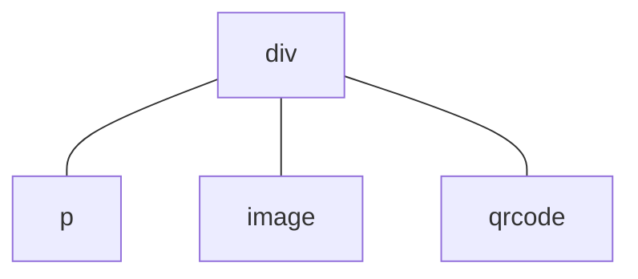

# Component Reuse

Application-level component reuse is mainly achieved through custom components.

## Child Components

Assume that the structure within the `<template>` tag of a certain [UX file](/framework/component/README.md#ux-file) describes the organization of the user interface, for example:
``` html
<template>
  <div>
    <p>text</p>
    <image src="path/to/image.png" />
    <qrcode value="hello world!" />
  </div>
</template>
```
At runtime, this corresponds to the following component tree structure:

This component tree has one parent node `div` and $3$ child nodes: `p`, `image`, and `qrcode`. The `div` component is the outermost component within the `<template>` tag. We refer to this type of component as the **root component**. Sometimes root components are not unique, for example:
``` html
<template>
  <p>text</p>
  <image src="path/to/image.png" />
  <qrcode value="hello world!" />
</template>
```
has 3 root components. In addition, using the [`for` directive](/framework/commands/for.md) may also result in multiple root component instances, for example:
``` html
<template>
  <p for="x in ['one', 'two', 'three']">
    label: {{x}}
  </p>
</template>
```
will be rendered as $3$ `p` component instances.