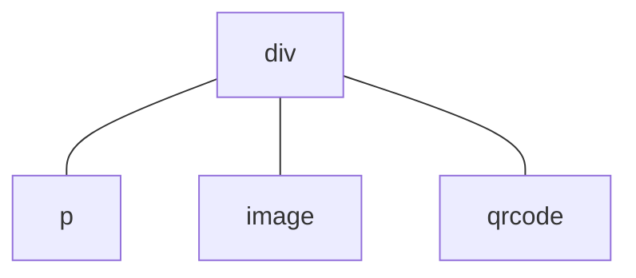

# Повторное использование компонентов

Повторное использование компонентов на уровне приложения реализуется главным образом с помощью пользовательских компонентов.

## Дочерние компоненты

Предположим, что структура внутри тега `<template>` в некотором [UX-файле](/framework/component/README.md#ux-文件) описывает организацию интерфейса, например:
``` html
<template>
  <div>
    <p>text</p>
    <image src="path/to/image.png" />
    <qrcode value="hello world!" />
  </div>
</template>
```
Во время выполнения этому соответствует следующая структура дерева компонентов:

Это дерево компонентов имеет один родительский узел `div` и $3$ дочерних узла: `p`, `image` и `qrcode`. Компонент `div` является самым внешним компонентом внутри тега `<template>`, и такие компоненты мы называем **корневыми компонентами**. Корневые компоненты иногда не являются единственными, например:
``` html
<template>
  <p>text</p>
  <image src="path/to/image.png" />
  <qrcode value="hello world!" />
</template>
```
Здесь содержится 3 корневых компонента. Кроме того, использование [директивы `for`](/framework/commands/for.md) также может привести к созданию нескольких экземпляров корневых компонентов, например:
``` html
<template>
  <p for="x in ['one', 'two', 'three']">
    label: {{x}}
  </p>
</template>
```
будет отрендерено как $3$ экземпляра компонента `p`.